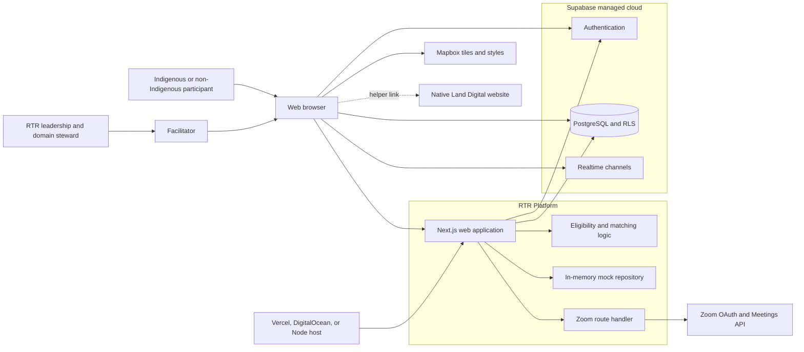
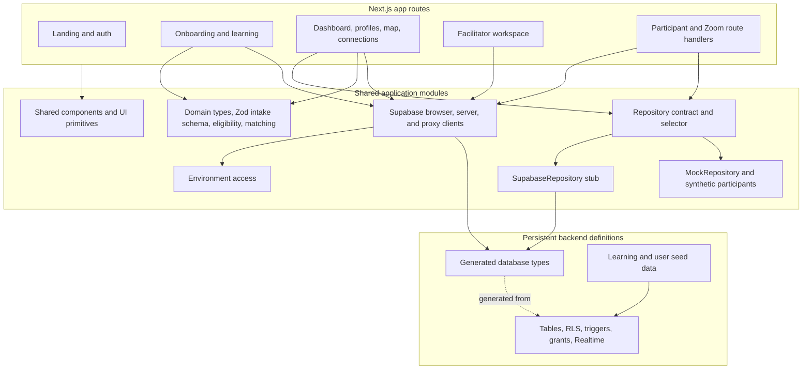
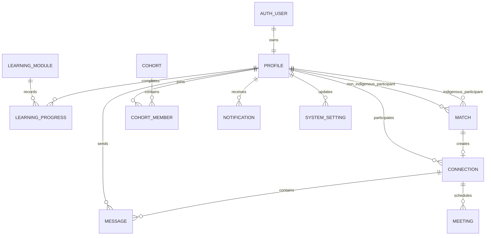
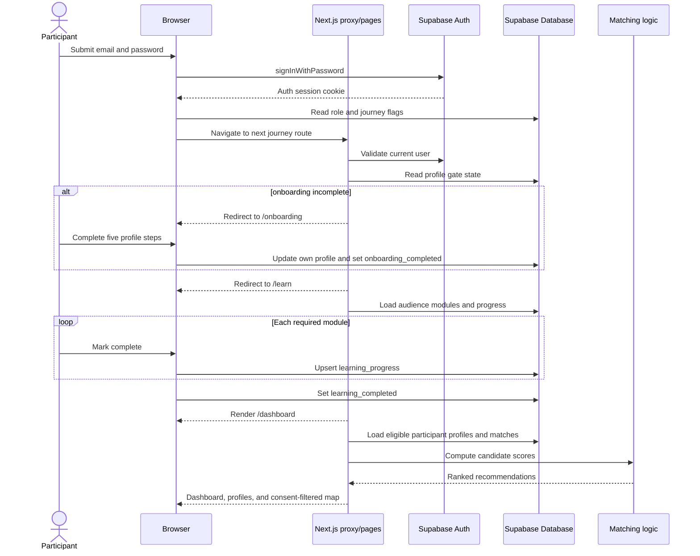
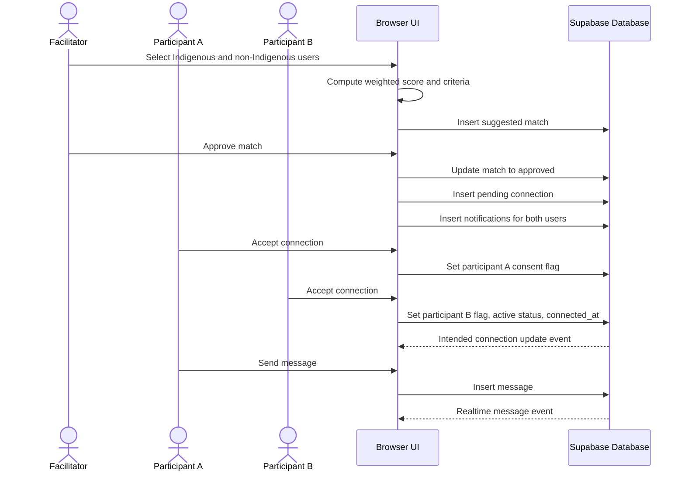
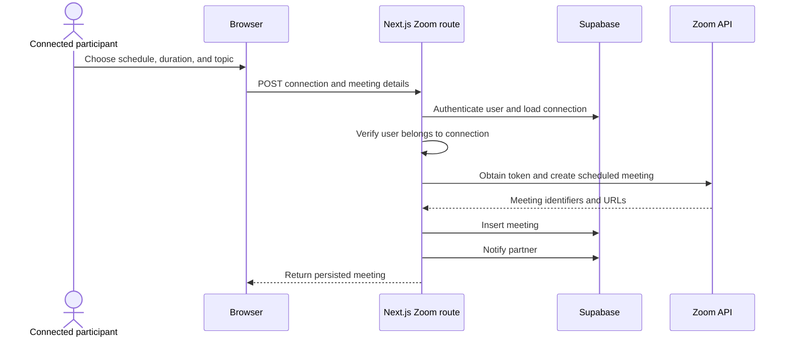
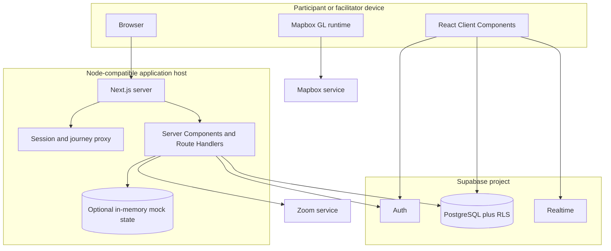

# ISO/IEC/IEEE 42010 Software Architecture Description

## 1. Identification

**System of interest:** Reconciliation Through Relationships (RTR) Platform  
**Repository:** `https://github.com/QuinntyneBrown/reconciliation-through-relationships-hackathon`  
**Architecture description type:** Source-based software architecture description aligned to ISO/IEC/IEEE 42010 concepts  
**Description pattern:** Based on the source-backed descriptions in [`QuinntyneBrown/software-architecture-description`](https://github.com/QuinntyneBrown/software-architecture-description)  
**Inspected branch:** `feat/rtr-platform-implementation`  
**Inspected commit:** `44463264087a674eb3d2597b00f72b08fab9ab02`  
**Latest commit at snapshot:** `2026-07-11T14:38:37-04:00` — `Merge remote-tracking branch 'origin/feat/rtr-platform-implementation' into feat/rtr-platform-implementation`  
**Snapshot date:** `2026-07-11` (America/Toronto)  
**Primary evidence:** application source, package manifests, Supabase migrations and generated types, seed tooling, environment configuration, and repository documentation at the snapshot above

This document describes the implemented and intended architecture visible in the inspected repository snapshot. When prose and executable artifacts differ, package configuration, runtime entry points, application source, and database migrations are treated as authoritative. Intended behavior is identified separately from implemented behavior where the distinction matters.

## 2. Purpose and Scope

The purpose of this description is to make the RTR Platform understandable to participants, facilitators, RTR leadership, contributors, operators, privacy reviewers, and future delivery teams by documenting:

- the product mission, system boundary, actors, and external dependencies
- the participant and facilitator journeys implemented in the application
- the Next.js module structure and its two data-access paths
- the core information model, privacy controls, and persistence boundaries
- matching, learning, connection, messaging, mapping, and meeting runtime flows
- local and hosted deployment modes
- quality attributes, architectural decisions, inconsistencies, risks, and evidence

The scope includes:

- the Next.js application under `src/app`
- shared components, design primitives, and global styling under `src/components` and `src/app/globals.css`
- domain types, validation, eligibility, cohort, and matching logic under `src/domain`
- the mock repository seam and typed Supabase clients under `src/data`
- Supabase schema migrations, row-level security policies, Realtime publication configuration, and synthetic seed tooling under `supabase`
- browser-side Mapbox rendering and the server-side Zoom meeting adapter
- repository-level build, lint, type-check, and formatting configuration

The scope excludes:

- the internals and service guarantees of Supabase, Mapbox, Zoom, Native Land Digital, Vercel, or DigitalOcean
- RTR's existing public website, for which no integration is implemented in this snapshot
- production operational infrastructure, because no infrastructure-as-code or deployment workflow is checked in
- legal conclusions about privacy, consent, safeguarding, or data retention
- capabilities shown only in HTML mocks or planning documents when no runtime implementation exists

## 3. System Mission

The RTR Platform is a responsive relationship-building portal created in response to the Truth and Reconciliation Commission's call for meaningful interaction between Indigenous and non-Indigenous people. Its implemented mission is to:

1. authenticate and onboard participants into a structured profile
2. guide participants through audience-specific preparation material
3. make learning-complete participants discoverable for matching and regional cohort formation
4. calculate transparent Indigenous-to-non-Indigenous match scores
5. keep a facilitator in the formal match-approval workflow
6. require mutual participant acceptance before chat becomes active
7. support ongoing conversation and Zoom call scheduling
8. give facilitators a view of participant progress, matches, connections, cohorts, and settings

The repository is a hackathon implementation, not a production safeguarding platform. It demonstrates the primary journey with synthetic data and managed-service integrations while leaving several policy and hardening decisions open for RTR.

## 4. Architectural Style and Constraints

The dominant architectural characteristics are:

- a single Next.js App Router application combining Server Components, Client Components, Route Handlers, and a request proxy
- a managed-backend architecture using Supabase for PostgreSQL, authentication, row-level security, and selected Realtime events
- a server/client split in which initial protected-page reads occur in Server Components and most user mutations occur directly from Client Components through the Supabase browser client
- pure TypeScript matching functions that score candidates in memory after profiles are loaded
- a repository abstraction used by the mock-backed regional view and participant API, but not by most authenticated features
- privacy-oriented domain concepts such as learning eligibility, explicit map consent, city-level coordinates, RLS, and facilitator review
- a single web deployable rather than microservices

Important constraints visible in the snapshot are:

| Category | Constraint |
|---|---|
| Delivery maturity | Hackathon build using synthetic data and lightweight authentication |
| Web runtime | Next.js `16.2.10`, React `19.2.4`, TypeScript 5 in strict mode |
| UI | Tailwind CSS 4, Base UI-backed shadcn components, and a repository-specific RTR theme |
| Full journey | Requires Supabase URL and anonymous key; seed creation also requires the service-role key |
| Mock mode | Landing page, `/api/participants`, and `/map` can run without external services because the proxy bypasses auth when Supabase configuration is absent |
| Repository mode | `DATA_SOURCE` defaults to `mock`; selecting `supabase` invokes an unimplemented `SupabaseRepository` |
| Map | Mapbox is optional and requires a public token; only profiles with consent and coordinates render as markers |
| Meetings | Zoom requires either a supplied access token or OAuth credentials |
| Geography | Coordinates are city-level; precise-address capture is not modeled |
| Matching | Candidates must have completed onboarding and learning; scores are calculated in application memory |
| Roles | The database implements `participant` and `facilitator`; an `admin` role exists only in an older domain type and documentation |
| Operations | No container definition, infrastructure-as-code, deployment workflow, or application telemetry stack is present |
| Verification | Build, lint, type-check, and format scripts exist, but no automated test files or CI workflows are present |

## 5. Stakeholders and Concerns

| Stakeholder | Primary concerns |
|---|---|
| Indigenous participant | Respectful experience, agency, boundaries, informed consent, limited disclosure, freedom from an expectation to educate or represent a community |
| Non-Indigenous participant | Clear preparation, transparent expectations, equitable waitlist handling, and safe relationship formation |
| Facilitator | Participant readiness, understandable match rationale, human approval, mutual consent, cohort visibility, and intervention capability |
| RTR leadership and Indigenous domain stewards | Cultural appropriateness, fidelity to RTR's mission, terminology, content, governance, and sustainable operation |
| Administrator / program operator | Role management, configuration, learning content, auditability, participant support, and low operational complexity |
| Product and design contributors | Accessible, welcoming, responsive journeys and a consistent transition from RTR's public presence |
| Software maintainer | Clear boundaries, schema and type consistency, testability, dependency updates, and safe refactoring |
| Deployment operator | Repeatable build, environment and secret management, backups, monitoring, incident response, and service limits |
| Privacy and safeguarding reviewer | Lawful purpose, data minimization, consent, profile visibility, message access, retention, deletion, breach response, and youth/vulnerable-person protections |
| External service owner | Correct authentication, bounded API usage, failure handling, and compliance with Supabase, Mapbox, and Zoom contracts |

## 6. Viewpoint Catalog

| Viewpoint | Stakeholders | Main concerns | Model kinds |
|---|---|---|---|
| Context | All | System boundary, users, external systems, trust boundaries | Context diagram, dependency table |
| Module and responsibility | Maintainers, contributors | Source decomposition, dependencies, ownership, duplicated seams | Static structure diagram, module and route tables |
| Information | Privacy reviewers, facilitators, maintainers | Identity, profiles, consent, learning, matches, conversations, persistence | Information model, object and policy tables |
| Runtime | Participants, facilitators, maintainers | Journey gates, approval, mutual connection, messaging, meetings | Sequence diagrams, scenario table |
| Deployment and operations | Operators, maintainers | Runtime topology, configuration, secrets, builds, managed services | Deployment diagram, mode and configuration tables |
| Quality attribute | All major stakeholders | Privacy, safety, accessibility, modifiability, reliability, performance, operability | Mechanism and trade-off table |
| Decision and risk | RTR leadership, maintainers, reviewers | Rationale, implementation drift, unresolved policy, hardening priorities | Decision log, correspondence rules, risk register |

## 7. Context View

### 7.1 Context Viewpoint

**Stakeholders:** participants, facilitators, RTR leadership, operators, privacy reviewers, external service owners  
**Concerns addressed:** system boundary, actors, data movement, managed services, optional integrations, and trust boundaries  
**Model kinds:** system context diagram and external dependency catalog

### 7.2 Context Diagram

### 7.3 Context Interpretation

- The system boundary is the checked-in Next.js application, domain logic, repository adapters, route handlers, and Supabase definitions.
- Supabase is both an external managed system and a central runtime dependency for the authenticated journey. RLS is therefore part of the effective authorization architecture.
- Browser code communicates directly with Supabase for profile updates, learning progress, match administration, mutual acceptance, settings, messages, and notifications.
- Next.js Server Components communicate with Supabase for authenticated reads and route gating; the Zoom Route Handler also performs authorization before calling Zoom.
- Mapbox receives map requests from the browser. Marker content is assembled locally from profiles already returned by Supabase.
- Native Land Digital is linked as a manual lookup aid; there is no API integration.
- RTR's existing public website and organizational identity systems are outside the implemented boundary.

### 7.4 External Dependencies

| Dependency | Purpose | Required? | Trust / failure consideration |
|---|---|---|---|
| Supabase Auth | User sessions and identity | Required for authenticated journey | Session availability and project configuration gate nearly all participant/facilitator routes |
| Supabase PostgreSQL/PostgREST | Persistent application data and RLS enforcement | Required for authenticated journey | Browser mutations rely on database policies as the final authorization boundary |
| Supabase Realtime | New-message delivery and intended connection-status updates | Optional for initial render, required for live updates | Migration publishes messages and notifications, but not connections |
| Mapbox GL JS | City-level participant map | Optional | Public token and third-party tile requests; map degrades to no rendered map without the token |
| Zoom API | Scheduled video meetings | Optional | Requires server-held credentials/token and correct OAuth configuration |
| Native Land Digital | Human-assisted treaty-area lookup | Optional | External link only; returned information is not validated by the application |
| Deployment host | Runs the Next.js Node application | Required outside local development | No provider-specific deployment definition is checked in |

## 8. Module and Responsibility View

### 8.1 Module and Responsibility Viewpoint

**Stakeholders:** maintainers, feature contributors, reviewers  
**Concerns addressed:** source organization, dependencies, server/client boundaries, business-rule placement, and extension seams  
**Model kinds:** static module diagram, responsibility catalog, route catalog

### 8.2 Static Structure View

### 8.3 Primary Modules

| Module / area | Main responsibilities | Key evidence |
|---|---|---|
| `src/app` | Route composition, Server Component reads, Client Component interactions, HTTP handlers, redirects | route `page.tsx` and `route.ts` files |
| `src/app/onboarding` | Five-step profile intake and direct profile update | `page.tsx`, step components |
| `src/app/learn` | Audience-specific module selection, progress tracking, learning-complete transition | `page.tsx`, `LearningLayout.tsx`, `ModuleContent.tsx` |
| `src/app/dashboard` | Eligible participant discovery, computed recommendations, filters, cohort banner, Mapbox map | `page.tsx`, dashboard components |
| `src/app/facilitator` | Program metrics, participant progress, manual match creation, approval/rejection, settings | facilitator pages and `MatchingClient.tsx` |
| `src/app/connections` | Connection list, mutual acceptance, Realtime chat, meeting presentation | connection pages and components |
| `src/app/api/participants` | Zod-validated repository-backed participant list/create API | `route.ts` |
| `src/app/api/zoom/create-meeting` | Authenticated connection check, Zoom call creation, meeting persistence, notification | `route.ts` |
| `src/domain` | Legacy/domain-level profile model, intake validation, eligibility, cohort constant, two matching implementations | `types.ts`, `schema.ts`, `matching.ts`, `profile-matching.ts` |
| `src/data/repository.ts` | Backend-neutral participant, region, and match contract | `repository.ts` |
| `src/data/mock` | In-memory implementation with synthetic profiles and privacy-filtered regional aggregation | `mock-repository.ts`, `participants.ts` |
| `src/data/supabase` | Typed clients, session refresh/gating, generated schema types, unimplemented repository adapter | client files, `database.types.ts`, `supabase-repository.ts` |
| `src/components` | Shared RTR shell, navigation, status components, and UI primitives | component source |
| `supabase/migrations` | Authoritative persistent schema, constraints, RLS, triggers, grants, seed learning content, Realtime configuration | `001_initial_schema.sql` through `003_api_grants.sql` |
| `supabase/seeds` | Creation of two facilitator accounts and 30 synthetic participant accounts via service role | `participants.ts` |

### 8.4 Implemented Route Surface

| Route | Runtime role | Primary data path | Access behavior |
|---|---|---|---|
| `/` | Public landing page | Static application content | Public |
| `/auth/login` | Email/password sign-in | Supabase browser client | Public |
| `/auth/callback` | Auth-code exchange and journey redirect | Supabase server client | Public |
| `/onboarding` | Five-step participant intake | Direct browser update to `profiles` | Authenticated participant gate |
| `/learn` | Learning modules and progress | Supabase server reads plus browser writes | Onboarded participant; redirects completed users |
| `/dashboard` | Recommendations, discovery, list/map views | Supabase server reads plus in-memory scoring | Learning-complete participant |
| `/profile/[userId]` | Participant profile and connection initiation | Supabase server reads plus browser writes | Authenticated; RLS determines visible profiles |
| `/connections` | User's connections | Supabase server reads | Authenticated participant |
| `/connections/[connectionId]` | Mutual acceptance, chat, meeting list | Supabase reads/writes and Realtime | Connection participant, checked in page code and RLS |
| `/map` | Regional cohort-readiness list | Repository selector; mock by default | Auth bypassed when Supabase env is absent; otherwise journey proxy applies |
| `/facilitator` | Aggregate program dashboard | Direct Supabase server reads | Facilitator only |
| `/facilitator/participants` | Participant and journey status table | Direct Supabase server reads | Facilitator only |
| `/facilitator/matching` | Create, approve, and reject matches | Direct Supabase reads/writes and matching logic | Facilitator only |
| `/facilitator/settings` | Matching toggle and cohort threshold | Direct Supabase reads/writes | Facilitator only |
| `/api/participants` | Participant GET/POST reference API | Repository selector | Proxy-controlled; mock without Supabase configuration |
| `/api/zoom/create-meeting` | Meeting creation adapter | Supabase server client and Zoom | Authenticated connection participant |

### 8.5 Data-Access Relationship

Two data architectures coexist:

1. `/map` and `/api/participants` use `getRepository()`. The default `MockRepository` is functional and process-local. The `SupabaseRepository` branch is a deliberate stub that throws for every method.
2. The authenticated product journey bypasses `Repository` and uses generated Supabase types and clients directly.

The repository contract is therefore not the system-wide persistence boundary described by some older comments. It is an active seam for a small mock-backed subset of the application.

## 9. Information View

### 9.1 Information Viewpoint

**Stakeholders:** participants, facilitators, privacy reviewers, maintainers, operators  
**Concerns addressed:** identity, profile disclosure, consent, learning state, matching, connection state, messages, meetings, cohorts, settings, and retention  
**Model kinds:** conceptual information model, entity catalog, management rules

### 9.2 Core Information Model

### 9.3 Persistent Information Objects

| Object | Purpose and notable fields | Lifecycle / access |
|---|---|---|
| Supabase `auth.users` | Account identity and credential state | Managed by Supabase Auth; insert trigger creates a profile |
| `profiles` | Names, biography, Indigenous identity flag, participation categories, city/province/treaty area, faith, interests, availability, formats, languages, boundaries, matching preferences, role, journey flags, map consent, city coordinates | User updates own profile; the checked-in select policy admits any row that is a facilitator or has completed onboarding and learning, regardless of caller role |
| `learning_modules` | Ordered video/text preparation content, audience, duration, required flag | Authenticated users read; facilitators can manage under RLS |
| `learning_progress` | Per-user/per-module completion, completion time, time spent | Unique on user and module; participant owns writes; facilitator can read |
| `matches` | Indigenous/non-Indigenous pair, score, criteria, status, provenance, approver | Facilitator manages; paired participants can read their rows |
| `connections` | Match-derived pair, two consent flags, connected time, pending/active state | Facilitator inserts; participants in the pair can read and update |
| `messages` | Connection-scoped sender, body, read timestamp | Connection participants and facilitators can access under RLS |
| `meetings` | Connection, Zoom identifiers/URLs, schedule, duration, creator | Connection participants and facilitators can access under RLS |
| `cohorts` | Named city/province group, facilitator, forming/active state | Authenticated users read; facilitators manage |
| `cohort_members` | Profile membership in a cohort | Authenticated users read; facilitators manage |
| `system_settings` | JSON values for auto-matching and cohort threshold | Authenticated users read; facilitators manage |
| `notifications` | User-scoped connection, match, message, and meeting notices | Recipient manages own rows |

### 9.4 Mock Information Objects

The repository-backed mock path uses a separate `ParticipantProfile` and `Match` model. Its data is initialized from `src/data/mock/participants.ts`, stored in module memory, and reset when the server process restarts. `MockRepository.listMappableParticipants()` enforces both learning completion and map consent before regional aggregation.

This mock model is similar to, but not identical with, the Supabase model. Examples include `name` versus first/last name, kebab-case versus underscore-coded values, a single preferred format versus a format array, and `learningStatus` versus separate completion flags.

### 9.5 Information Management Rules

| Rule | Implemented mechanism |
|---|---|
| Profile row follows auth identity | `profiles.id` references `auth.users.id`; an auth insert trigger creates the profile |
| Participant journey gates | `onboarding_completed` and `learning_completed`, enforced in proxy and selected pages |
| Learning track selection | `profiles.is_indigenous` selects `indigenous` or `non_indigenous` modules plus `all` modules |
| Required-module uniqueness | Unique constraint on `(learning_progress.user_id, module_id)` |
| Formal match polarity | Separate Indigenous and non-Indigenous foreign-key columns plus application candidate filtering |
| Match review | Facilitator-only match mutation policy and UI approval flow |
| Mutual connection | Two participant acceptance flags; UI changes status to active when the second participant accepts |
| Map consent | `map_consent` defaults false; Mapbox component and mock repository filter on consent |
| Geographic minimization | Seeded coordinates are city centers and UI describes location as city-level |
| Database authorization | RLS enabled on every application table; migrations grant PostgREST object privileges to API roles |
| Realtime | Migration adds `messages` and `notifications` to `supabase_realtime` publication |
| Synthetic demo data | Seed script creates 30 participant users and two users assigned the facilitator role |
| Retention and deletion | Foreign keys cascade from auth/profile and parent relationship records; no time-based retention, export, or user-facing deletion workflow exists |

## 10. Runtime View

### 10.1 Runtime Viewpoint

**Stakeholders:** participants, facilitators, maintainers, operators  
**Concerns addressed:** authentication, journey gates, matching, approval, connection activation, messaging, and external API interaction  
**Model kinds:** sequence diagrams and runtime scenario catalog

### 10.2 Participant Journey

### 10.3 Facilitator Approval and Mutual Connection

The match update, connection insert, and notifications are separate browser-originated operations rather than one database transaction. The connection update subscription is implemented in the client, but `connections` is not added to the Realtime publication by the checked-in migration.

### 10.4 Zoom Meeting Creation

### 10.5 Key Runtime Scenarios

| Scenario | Main path |
|---|---|
| Request gating | `src/proxy.ts` delegates to `updateSession`; missing Supabase config bypasses auth, otherwise session/profile state determines redirects |
| Authentication | Login uses `signInWithPassword`; callback supports an auth code exchange but no magic-link request UI is present |
| Onboarding | Client accumulates five-step state, then directly updates the user's profile and completion flag |
| Learning completion | Server loads track-specific modules; client upserts progress and sets `learning_completed` after local completion counting |
| Recommendations | Server loads all eligible participants, `computeMatches` scores the opposite background, and dashboard selects up to five candidates |
| Manual facilitator match | Client computes a score, inserts a suggested match, and later approves or rejects it |
| Mutual acceptance | Each participant updates one consent flag; the second acceptance sets connection status active |
| Messaging | Initial messages are server-rendered; new messages are inserted by the browser and appended through a Supabase Realtime subscription |
| Regional mock view | Server calls the mock repository to filter eligible/consented profiles and aggregate them by city/province |
| Participant map | Client filters eligible profiles again by map consent and coordinates, then creates Mapbox markers and HTML popups |
| Meeting scheduling | Authenticated Route Handler verifies connection membership, creates a Zoom meeting, persists it, and notifies the partner |

### 10.6 Runtime Characteristics

- The authenticated system is stateful through Supabase sessions and database rows; the mock repository is process-local and ephemeral.
- Server rendering protects initial data fetches and enables redirects, while most writes are browser-to-Supabase operations secured by RLS.
- Matching is deterministic for a given profile set and requires no external AI service.
- Messaging is event-driven after initial load; most other views require navigation or refresh to observe remote changes.
- Journey completion and relationship state changes are orchestrated in UI code rather than by transactional database procedures.

## 11. Deployment and Operations View

### 11.1 Deployment and Operations Viewpoint

**Stakeholders:** deployment operators, maintainers, RTR program operators  
**Concerns addressed:** topology, configuration, managed services, build validation, secrets, and operational gaps  
**Model kinds:** deployment diagram, execution-mode table, configuration catalog

### 11.2 Deployment View

### 11.3 Execution Modes

| Mode | Configuration | Characteristics |
|---|---|---|
| Local mock demonstration | `npm run dev`, no Supabase values, `DATA_SOURCE=mock` default | Landing, participant API, and regional list work; mock state resets on server restart; authenticated journey is unavailable |
| Local integrated development | Supabase URL/anon key, optional Mapbox/Zoom values, applied migrations | Full participant/facilitator journey uses Supabase; `/map` still uses mock unless repository behavior changes |
| Hosted Next.js application | `npm run build` then a Node-compatible deployment, with managed Supabase and optional integrations | Repository suggests Vercel or DigitalOcean, but contains no provider-specific deployment artifact |
| Seed operation | `npm run seed` with Supabase URL and service-role key in `.env.local` | Creates or updates synthetic auth users and profiles; must run only in a controlled demo project |

Setting `DATA_SOURCE=supabase` is not a complete integrated mode in this snapshot: it causes repository-backed routes to call the throwing `SupabaseRepository` stub, while the rest of the application continues to use direct Supabase clients independently of `DATA_SOURCE`.

### 11.4 Build and Automation Surface

| Command / asset | Function |
|---|---|
| `npm run dev` | Next.js development server |
| `npm run build` | Production Next.js build |
| `npm run start` | Start the production server |
| `npm run lint` | ESLint validation |
| `npm run typecheck` | TypeScript no-emit validation |
| `npm run format` / `format:check` | Prettier write/check |
| `npm run seed` | Supabase synthetic-user seed script |
| `supabase/migrations/*.sql` | Database creation and upgrade inputs |

No CI workflow, release workflow, container image, deployment manifest, backup automation, or rollback procedure is present in the inspected snapshot.

### 11.5 Configuration and Secrets

| Variable | Consumer | Sensitivity / exposure |
|---|---|---|
| `DATA_SOURCE` | Repository selector | Non-secret; defaults to `mock` |
| `NEXT_PUBLIC_SUPABASE_URL` | Browser and server Supabase clients | Public project endpoint |
| `NEXT_PUBLIC_SUPABASE_ANON_KEY` | Browser and server Supabase clients | Public client credential; safety depends on RLS |
| `SUPABASE_SERVICE_ROLE_KEY` | Seed script | High privilege; server/operations only and never safe for browser exposure |
| `NEXT_PUBLIC_MAPBOX_TOKEN` | Browser map | Public browser token; should be origin- and scope-restricted |
| `ZOOM_ACCESS_TOKEN` | Zoom Route Handler | Secret server credential, suitable only as a short-lived/demo override |
| `ZOOM_CLIENT_ID`, `ZOOM_CLIENT_SECRET`, `ZOOM_ACCOUNT_ID` | Zoom token flow | Secret except client identifier; current implementation does not use `ZOOM_ACCOUNT_ID` in its token request |

Application logging is limited to console errors in the Zoom adapter and seed output. No structured logs, metrics, traces, health endpoint, alerting configuration, or audit log is implemented.

## 12. Quality Attribute View

| Quality attribute | Architectural support | Trade-offs / limits |
|---|---|---|
| Cultural appropriateness | Product copy emphasizes relationship, consent, agency, and no obligation to educate; docs identify an Indigenous domain steward | No review workflow, content governance mechanism, or automated safeguard can establish cultural appropriateness |
| Privacy and data minimization | Map consent defaults false, city-level coordinates, learning eligibility, RLS on all tables, connection-scoped policies | Completed profiles are broadly readable to authenticated users; exact visibility, retention, deletion, and safeguarding rules remain unconfirmed |
| Human oversight | Facilitator match queue, approval/rejection UI, match rationale display | Dashboard also shows high-scoring unapproved candidates, weakening the stated approval boundary |
| Explainability | Matching is a visible weighted sum with per-criterion points | Two matching implementations use different models and weights; preferences do not currently alter weights |
| Usability | Guided onboarding, journey redirects, responsive component library, progress display, clear empty/waitlist states | Error recovery is mostly toast-based; account creation, password recovery, and notification center are absent |
| Accessibility | Semantic controls and shared UI primitives provide a reasonable base | No accessibility test suite or audit evidence is present; Mapbox popup/marker interaction requires review |
| Modifiability | Feature-oriented routes, shared components, generated database types, pure matching functions | Direct Supabase use is widespread; mock and persistent domain models drift; repository abstraction is only partially adopted |
| Security | Server user checks, RLS, route proxy, connection membership check before Zoom call | Critical workflows rely on client orchestration; authorization and profile disclosure require a dedicated security review |
| Reliability | Managed persistence, database constraints, foreign keys, RLS, server-rendered initial state | Multi-write workflows are non-transactional; errors after partial completion can leave inconsistent matches/connections/notifications |
| Performance | Server-side filtered reads, in-memory matching, small hackathon dataset, managed database | Candidate scoring is all-pairs/in-memory and profile queries often select every column; no pagination or load evidence exists |
| Testability | Pure domain functions, strict TypeScript, lint/build scripts, mock repository | No automated unit, integration, RLS, browser, accessibility, or end-to-end tests are checked in |
| Operability | Central environment example, migrations, seed command, standard Next scripts | No observability, CI/CD, backup, restore, migration-runbook, or incident-response assets |

## 13. Architecture Decisions and Rationale

| Decision | Status | Rationale | Consequence |
|---|---|---|---|
| Use a responsive Next.js application | Implemented | One codebase can deliver public, participant, facilitator, and API surfaces quickly | Server/client boundaries and browser-direct data access require discipline |
| Use Supabase for auth, database, RLS, and Realtime | Implemented | Reduces backend setup and supports the hackathon timeline | The managed backend and RLS become critical security and availability dependencies |
| Use email/password in the login UI | Implemented, docs inconsistent | Straightforward seeded-demo access | README and older architecture prose still describe magic links |
| Gate participant access by onboarding and learning completion | Implemented | Ensures preparation precedes discovery and matching | Completion is represented by mutable profile flags written from the browser |
| Keep matching deterministic and facilitator-visible | Implemented | Transparency and human review are important for sensitive relationship formation | Application code carries policy; two divergent algorithms now exist |
| Match Indigenous with non-Indigenous participants only | Implemented in application filtering | Directly supports the program's primary relationship goal | Database does not validate the identity polarity of inserted IDs |
| Require facilitator approval and mutual participant consent | Partially implemented | Preserves human oversight and participant agency | Unapproved dashboard suggestions and client-orchestrated transitions weaken the invariant |
| Use city-level location and explicit map consent | Implemented in UI/mock filtering | Reduces location exposure | Profile RLS still exposes city and other profile data independently of map consent |
| Use a repository seam for replaceable mock/persistent data | Partially implemented | Enables no-service demos and parallel work | Authenticated features bypass it and the Supabase adapter remains a stub |
| Use Mapbox for participant visualization | Implemented as optional client integration | Rich interactive map with modest integration effort | Requires a third-party public token and careful popup/data sanitization |
| Use Zoom for scheduled calls | Implemented as optional server integration | Gives connected participants a familiar meeting tool | Credential lifecycle, OAuth correctness, consent, and failure recovery need hardening |
| Keep facilitator accounts seeded and controlled | Implemented for demo | Avoids public privilege escalation during the hackathon | No production role-administration workflow exists |

## 14. Correspondence and Consistency Rules

The following rules keep the views in this description tied to the source snapshot:

1. A route is considered implemented only when a concrete `page.tsx` or `route.ts` exists under `src/app`; HTML mocks describe design intent only.
2. A persistent entity or authorization rule is considered implemented only when represented in `supabase/migrations`, not merely in `docs/plan.md` or TypeScript types.
3. Database schema and RLS claims are anchored to migrations; `database.types.ts` is treated as a generated consumer contract.
4. A journey gate is considered enforced only where the proxy, page, or RLS policy performs a corresponding check.
5. A map-privacy claim applies only to code paths that explicitly filter `map_consent`; profile visibility is assessed separately.
6. A match is facilitator-approved only when its persistent status is `approved` or `connected`; an application-computed recommendation is not approval.
7. A connection is active only when its stored status is `active`; the existence of a match or pending connection is insufficient.
8. External integrations are treated as optional unless required by the runtime path being described.
9. `DATA_SOURCE` affects only consumers of `getRepository()`; it does not select the backend for direct Supabase clients.
10. When domain and database types disagree, the database-backed authenticated journey is described from migrations and actual route code, while the separate mock path is described from `src/domain` and `src/data/mock`.
11. Quality claims require a concrete mechanism or checked-in verification artifact; intended qualities without evidence are recorded as goals or gaps.

## 15. Risks, Gaps, and Architectural Debt

| ID | Risk / gap | Impact | Evidence / notes |
|---|---|---|---|
| R1 | The persistent and mock paths use different models, matching logic, eligibility fields, and value encodings | Behavior differs by route and future convergence is costly | `src/domain/*`, `src/data/mock/*`, `database.types.ts`; `matching.ts` vs `profile-matching.ts` |
| R2 | `SupabaseRepository` is entirely unimplemented | `DATA_SOURCE=supabase` breaks `/map` and `/api/participants`; the advertised replaceable seam is incomplete | `src/data/supabase/supabase-repository.ts` |
| R3 | The dashboard presents score-40+ candidates even without an approved match, while the UI describes them as facilitator-reviewed | Participants can discover profiles before formal approval, contradicting a core product safeguard | explicit fallback in `src/app/dashboard/page.tsx`; copy in `RecommendedTab.tsx` |
| R4 | Profile RLS checks the role/completion state of the row, not the caller, and does not require `auth.uid()` for those branches; the later grant also gives `anon` table access | Anonymous clients can select facilitator and completed-participant rows, authenticated participants can browse them, and facilitators cannot see incomplete participants other than themselves; map consent and match approval do not constrain disclosure | `Users can view approved participants` policy in `001_initial_schema.sql`; anon grants in `003_api_grants.sql` |
| R5 | Role models drift: domain docs name three roles, but the database and runtime implement only participant/facilitator | Authorization expectations and future admin work are ambiguous; the seed account named `admin` is a facilitator | `src/domain/types.ts`, `docs/DECISIONS.md`, profiles role check, seed script |
| R6 | Authentication documentation says magic link while the UI implements password sign-in and no signup/recovery flow; seeded users are created without passwords | Operators receive incorrect setup expectations and the seeded accounts cannot use the implemented login unless credentials are provisioned separately | README, `docs/ARCHITECTURE.md`, login page, `supabase/seeds/participants.ts` |
| R7 | Match approval, connection creation, and notifications are independent browser writes; notification inserts target another user while notification RLS permits only the recipient to write | Partial failure can leave an approved match without a connection; partner/facilitator-originated notifications fail under the checked-in policy and errors are commonly ignored; retries can create duplicate connections | `MatchingClient`, `ConnectButton`, Zoom route, notification policy, and no uniqueness on `connections.match_id` |
| R8 | Relationship state invariants are enforced mostly in UI code | Direct API clients can message on pending connections, set status fields, or bypass intended sequencing within broad RLS permissions | connection/message policies and client mutation code |
| R9 | The chat subscribes to connection updates, but the migration publishes only messages and notifications | The second participant's acceptance may not activate the first participant's chat without refresh | `ConnectionChat.tsx` and Realtime statements in `001_initial_schema.sql` |
| R10 | Auto-matching and cohort-threshold settings are stored but not consistently operational | Toggling auto-match schedules no job; dashboard and mock map use hard-coded threshold 5 rather than the stored setting | settings UI, `COHORT_MIN_PARTICIPANTS`, matching pages |
| R11 | Zoom's account-credentials request uses `account_id=me` and ignores `ZOOM_ACCOUNT_ID` | Server-to-server OAuth is likely misconfigured outside the access-token override; meeting creation can fail | `.env.example`, `getZoomAccessToken()` |
| R12 | Participant data is interpolated into Mapbox `setHTML` popups | Unsanitized stored text can create browser-side injection risk | `ParticipantMap.tsx` builds popup markup from profile fields |
| R13 | No automated tests or CI workflows exist | Matching, RLS, journey, privacy, Realtime, and integration regressions can reach deployment undetected | repository file inventory and package scripts |
| R14 | Seed learning content contains a placeholder video URL and synthetic cultural/product content | Demo content could be mistaken for approved RTR material | `002_seed_data.sql` and open content-governance decisions |
| R15 | No retention, deletion, export, audit, safeguarding, or incident-response workflow is implemented | The system is not ready for sensitive production participant data without governance and technical controls | schema, routes, and open decisions |
| R16 | Performance assumes a small dataset: profiles are broadly loaded, matching occurs in memory, and lists lack pagination | Response size and all-pairs scoring cost grow with participation | dashboard/facilitator queries and `computeMatches` |

## 16. Recommended Follow-Up Work

1. Confirm with RTR and an Indigenous-led privacy/safeguarding review exactly which profile fields each role and relationship state may access; encode the result in field-minimized queries and tested RLS policies.
2. Restore the facilitator boundary by showing participants only approved recommendations, or explicitly change and document the product policy if broader discovery is intended.
3. Choose one data architecture: implement and adopt the Supabase repository consistently, or retire the repository claim and isolate the mock demo as an explicit adapter with mappings to the persistent model.
4. Consolidate matching into one canonical domain service with one encoding scheme, configurable weights, deterministic tests, and persisted algorithm/version metadata.
5. Move match approval and mutual-connection transitions into transactional server/database operations with uniqueness constraints and invariant checks.
6. Publish connection updates if live activation is required, and add integration tests for Realtime authorization and event delivery.
7. Resolve the role model and authentication method; add the required account creation, invitation, recovery, facilitator provisioning, and admin workflows.
8. Apply the stored cohort threshold everywhere, and either implement an auto-matching job or relabel the toggle as non-operational until it exists.
9. Sanitize or DOM-build Mapbox popup content, restrict public tokens, correct the Zoom account-credential flow, and validate all integration configuration at startup/request boundaries.
10. Add unit tests for matching and eligibility, database tests for every RLS policy, and browser tests for onboarding, learning, approval, mutual consent, chat, and meeting authorization.
11. Establish CI gates for type-check, lint, test, and build; add repeatable migration/deployment, backup/restore, monitoring, audit, and rollback procedures.
12. Replace all placeholder learning content only after RTR approval and define ownership/versioning for culturally sensitive copy and media.
13. Define retention, deletion, participant data export, consent withdrawal, safeguarding escalation, and breach-response procedures before using real participant data.

## 17. Traceability to Evidence

| Concern area | Primary evidence |
|---|---|
| Product mission and scope | `README.md`, `docs/challenge.txt`, `docs/brain-dump.txt` |
| Existing architecture and open decisions | `docs/ARCHITECTURE.md`, `docs/DECISIONS.md`, `docs/plan.md` |
| Runtime and dependency versions | `package.json`, `package-lock.json`, `tsconfig.json`, `next.config.ts` |
| Route surface and participant journey | `src/app/**/page.tsx`, `src/app/auth/callback/route.ts` |
| Request gating and sessions | `src/proxy.ts`, `src/data/supabase/session-proxy.ts`, Supabase client files |
| Domain vocabulary and mock rules | `src/domain/*`, `src/data/repository.ts`, `src/data/mock/*` |
| Persistent data model and authorization | `supabase/migrations/001_initial_schema.sql`, `003_api_grants.sql` |
| Learning content | `supabase/migrations/002_seed_data.sql`, `src/app/learn/*` |
| Generated database contract | `src/data/supabase/database.types.ts` |
| Matching and facilitator approval | `src/domain/profile-matching.ts`, `src/app/facilitator/matching/*`, `src/app/dashboard/page.tsx` |
| Mutual connection and messaging | `src/app/profile/[userId]/*`, `src/app/connections/*`, connection/message RLS policies |
| Map consent and regional aggregation | `src/app/map/page.tsx`, `ParticipantMap.tsx`, `MockRepository` |
| Zoom meeting integration | `src/app/api/zoom/create-meeting/route.ts`, `ScheduleMeetingModal.tsx`, `.env.example` |
| Synthetic users and city-level coordinates | `supabase/seeds/participants.ts` |
| UI system and design intent | `src/components/*`, `src/app/globals.css`, `components.json`, `docs/mocks/*` |
| Operational surface | `.env.example`, package scripts, absence of checked-in workflow/deployment/test assets |

## 18. Assessment Summary

The RTR Platform has a coherent product journey and a pragmatic hackathon architecture: one Next.js application, a managed Supabase backend, transparent deterministic matching, facilitator tools, mutual connection consent, Realtime messaging, and optional map/meeting integrations. The strongest architectural ideas are the explicit preparation gate, human-readable match criteria, consent-aware mapping, city-level geography, and the effort to encode authorization in RLS rather than UI alone.

The system should nevertheless be treated as a prototype. Its central pressure points sit exactly where the product is most sensitive: profile disclosure, facilitator approval, participant consent, cultural content governance, and relationship-state integrity. Those concerns are compounded by two divergent data architectures, client-orchestrated multi-step writes, documentation drift, missing automated verification, and absent production operations. The next architecture phase should prioritize privacy and safeguarding invariants over feature breadth, then consolidate the data and matching models so every route follows the same rules.

## 19. Evidence Base

This architecture description was derived from the following artifacts inspected at commit `44463264087a674eb3d2597b00f72b08fab9ab02`:

- `README.md`, `CONTRIBUTING.md`, `AGENTS.md`, `.env.example`
- `package.json`, `package-lock.json`, `tsconfig.json`, `next.config.ts`, `eslint.config.mjs`, `components.json`
- `docs/ARCHITECTURE.md`, `docs/DECISIONS.md`, `docs/DB_SCHEMA.md`, `docs/challenge.txt`, `docs/brain-dump.txt`, `docs/plan.md`
- `src/proxy.ts`, `src/lib/*`
- `src/domain/*`
- `src/data/repository.ts`, `src/data/index.ts`, `src/data/mock/*`, `src/data/supabase/*`
- `src/app/**/*` route, page, and feature-component source
- `src/components/*` and `src/components/ui/*`
- `supabase/config.toml`, `supabase/migrations/*`, `supabase/seeds/participants.ts`
- repository inventory for tests, workflows, infrastructure, and deployment assets

The reference format was inspected from [`QuinntyneBrown/software-architecture-description`](https://github.com/QuinntyneBrown/software-architecture-description) at commit `8898d7f973250e5305798a4a850b32359a3bacd5`.
