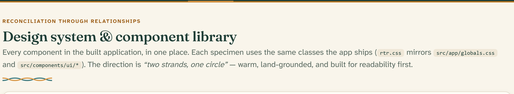

# Reconciliation Through Relationships — Design System

This is the product documentation for the design system and UI component
library of **Reconciliation Through Relationships (RTR)**. It treats the
component library as a product in its own right: every foundation (color,
type, spacing) and every component (buttons, form controls, cards, dialogs…)
is specified here with screenshots, an API reference, and usage guidance.



The direction is **“two strands, one circle”** — warm, land-grounded, and
built for readability first. Two strands (ochre and river) represent the two
people in every relationship; the circle represents the community that forms
around them.

---

## Where the design system lives

| Layer                    | Location                                                     | Role                                                                                   |
| ------------------------ | ------------------------------------------------------------ | -------------------------------------------------------------------------------------- |
| Design tokens            | `src/styles/design-tokens.css`                               | Single source of truth for palette, semantic roles, shape, elevation, and motion       |
| Tailwind theme           | `src/app/globals.css` (`@theme inline`)                      | Exposes tokens as utilities (`bg-primary`, `text-spruce-800`, `rounded-control`, …)    |
| React components         | `src/components/ui/*` and `src/components/*`                 | The shipped implementation (Base UI primitives styled with Tailwind)                   |
| Static specimen catalog  | [`docs/mocks/design-system.html`](../mocks/design-system.html) | Every component rendered with `rtr.css`, the no-JS mirror of the app’s styles          |
| This documentation       | `docs/design-system/`                                        | Foundations, per-component pages, screenshots                                          |

Components consume **semantic roles** (`--primary`, `--destructive`,
`--border`), never raw palette values. That keeps the light and dark themes —
and any future re-theming — a token-only change.

## Using a component

Every UI primitive is imported from `@/components/ui/<name>`; app-level
components (headers, empty states, the cohort circle) come from
`@/components/<name>`:

```tsx
import { Button } from "@/components/ui/button";

<Button variant="outline" size="sm">View profile</Button>;
```

Each component page below documents the full API: variants, sizes, states,
props, writing guidelines, and accessibility behavior.

---

## Foundations

Read these first — they are the rules every component follows.

1. [Principles](foundations/01-principles.md) — welcome before wow, consent as
   a design element, abstract not appropriated.
2. [Design tokens](foundations/02-design-tokens.md) — the token architecture:
   palette → semantic roles → Tailwind utilities.
3. [Color](foundations/03-color.md) — the land-drawn palette and how each hue
   carries meaning.
4. [Typography](foundations/04-typography.md) — Fraunces for the voice,
   Atkinson Hyperlegible for the reading.
5. [Layout & spacing](foundations/05-layout-and-spacing.md) — the 4px-based
   scale, containers, breakpoints, radius and elevation.
6. [Brand & motifs](foundations/06-brand-and-motifs.md) — the mark, the woven
   strand, and the panel-on-dark figure.
7. [Iconography](foundations/07-iconography.md) — Lucide icons: sizes, stroke,
   and the semantic icon assignments.
8. [Accessibility](foundations/08-accessibility.md) — the commitments every
   screen is built on.

## Components

### Actions

| Component | Description |
| --- | --- |
| [Button](components/button.md) | Ten variants and eight sizes for every action in the product |

### Form controls

| Component | Description |
| --- | --- |
| [Form field](components/form-field.md) | Label, hint, error message, and required marker — the wrapper every control sits in |
| [Input](components/input.md) | Single-line text entry |
| [Textarea](components/textarea.md) | Multi-line text entry |
| [Select](components/select.md) | Choosing one option from a list |
| [Checkbox](components/checkbox.md) | Multi-select choices and choice cards |
| [Radio group](components/radio-group.md) | Single-select choices |
| [Switch](components/switch.md) | Instant on/off settings |
| [Slider](components/slider.md) | Picking a value from a range |

### Buttons & indicators

| Component | Description |
| --- | --- |
| [Badge](components/badge.md) | Caption badges, status pills, filter chips, and interest tags |
| [Avatar](components/avatar.md) | Initials-only identity, by design |
| [Progress](components/progress.md) | Learning-journey and match-score bars |
| [Skeleton](components/skeleton.md) | Loading placeholders |

### Navigation

| Component | Description |
| --- | --- |
| [App header](components/app-header.md) | The sticky spruce bar with the ochre strand — site, participant, and facilitator variants |
| [Tabs](components/tabs.md) | Underline tabs with count chips |
| [Sheet](components/sheet.md) | The mobile navigation panel |
| [Dropdown menu](components/dropdown-menu.md) | Account and action menus |
| [Breadcrumb & pagination](components/breadcrumb-and-pagination.md) | Wayfinding patterns for facilitator views |
| [Navigation menu](components/navigation-menu.md) | Available primitive, not yet used in the product |

### Layout & content

| Component | Description |
| --- | --- |
| [Card](components/card.md) | Parchment surfaces: participant cards, module cards, stat tiles |
| [Separator](components/separator.md) | Horizontal and vertical dividers |
| [Table](components/table.md) | Facilitator data tables |
| [List row](components/list-row.md) | Whole-row-link rows for connections and quick actions |
| [Empty state](components/empty-state.md) | The dashed panel with the muted mark |
| [Page intro](components/page-intro.md) | Eyebrow, heading, lead, and the weave |
| [App footer](components/app-footer.md) | The dark footer with the territorial acknowledgment |

### Popups & feedback

| Component | Description |
| --- | --- |
| [Dialog](components/dialog.md) | Modal dialogs with the ochre top strand |
| [Tooltip](components/tooltip.md) | Short contextual hints |
| [Toast](components/toast.md) | Transient confirmations on the dark surface |
| [Alert](components/alert.md) | Inline banners, one tint per meaning |
| [Notification center](components/notification-center.md) | The bell, the unread count, and the notification list |

### Signature components

| Component | Description |
| --- | --- |
| [Cohort circle](components/cohort-circle.md) | The signature seat-by-seat gathering indicator |
| [Journey stepper](components/journey-stepper.md) | The numbered rail and the wizard step chips |
| [RTR brand](components/rtr-brand.md) | The mark, the muted mark, and the wordmark |
| [Message bubbles](components/message-bubbles.md) | The connection-chat conversation pattern |

---

## About the screenshots

Every screenshot in `images/` is captured from the static specimen pages
([`docs/mocks/design-system.html`](../mocks/design-system.html) and
[`specimens/extras.html`](specimens/extras.html)), which mirror the
implemented app pixel-for-pixel via `rtr.css`. To regenerate them after a
design change:

```
node docs/design-system/tools/capture-screenshots.mjs
```

All names, faces, and messages in the screenshots are made-up demonstration
data, following the same convention as the [user guide](../guide/README.md).
