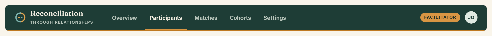

# App header

The sticky bar that crowns every signed-in page: the wordmark, the primary
navigation, and the account actions. Rendered from
`src/components/app-header.tsx`.


## Overview

`AppHeader` is one component that every top-level surface wraps with its own
links and actions. It is a spruce-800 bar, sticky to the top of the viewport,
finished with a **3px ochre bottom strand** (`border-ochre-600`) that ties the
header to the brand’s two-strand motif. The [wordmark](rtr-brand.md) sits at the
left, the primary nav fills the middle, and role and account controls collect on
the right.

There are exactly **two role variants** — participant and facilitator — plus the
signed-out marketing header. No administrator role exists; do not invent one.

Below **861px** the inline nav is hidden and replaced by a Menu button that opens
the navigation in a right-side [Sheet](sheet.md).

## Import

```tsx
import { AppHeader } from "@/components/app-header";

<AppHeader
  homeHref="/dashboard"
  navItems={[
    { href: "/dashboard", label: "Home" },
    { href: "/learn", label: "Learning" },
    { href: "/connections", label: "Connections" },
    { href: "/map", label: "Regional map" },
  ]}
  actions={/* bell, avatar menu, or sign-in buttons */}
/>;
```

Product surfaces do not call `AppHeader` directly with hand-written JSX in the
page body — they compose a thin wrapper that supplies the links and actions for
that role (see [Role wrappers](#role-wrappers) below).

## Anatomy

| Region | What it holds |
| --- | --- |
| Brand | The [`RtrBrand`](rtr-brand.md) two-line wordmark, linked to `homeHref` |
| Nav | `navItems` rendered as underline links; the active item is marked with `aria-current="page"` and an ochre-500 underline |
| Role pill | Optional `roleLabel` — an uppercase ochre-500 pill (`Facilitator`) |
| Actions | The `actions` slot: a [notification bell](notification-center.md), the account [avatar](avatar.md) menu, or marketing buttons |
| Menu | Below 861px, a Menu button that opens the [Sheet](sheet.md) nav |

The bar is `min-h-16` (64px), centered in a `max-w-7xl` container with `px-4`
(`sm:px-6`).

## Navigation links

Each link is a Next.js `Link`. The active link is chosen by longest-matching
prefix, so a nested route highlights only its own item:
`/facilitator/participants` marks **Participants**, never the shorter
`/facilitator` **Overview**. The match is exact for the home path (`/`) and a
prefix match (`href` or `href/…`) for everything else.

| Link state | Rendering |
| --- | --- |
| Default | `--on-dark-soft` text, semibold, transparent 3px bottom border |
| Hover | Text brightens to `--on-dark` |
| Active | `--on-dark` text, ochre-500 (`border-ochre-500`) bottom strand, `aria-current="page"` |

## Role wrappers

Four wrappers exist today; each passes its own `navItems`, `roleLabel`, and
`actions`:

| Wrapper | `homeHref` | Nav items | Role pill | Actions |
| --- | --- | --- | --- | --- |
| `SiteNav` (marketing) | `/` | Home · Join · Learning · Regional map · Facilitator | — | — |
| Landing page | `/` | — | — | “Sign in” + “Join RTR” buttons |
| `DashboardNav` (participant) | `/dashboard` | Home · Learning · Connections · Regional map | — | Bell + avatar menu |
| `FacilitatorNav` | `/facilitator` | Overview · Participants · Matches · Cohorts · Settings | `Facilitator` | Bell + avatar menu |

`SiteNav` lives at `src/components/site-nav.tsx`; the two signed-in wrappers live
beside the routes they serve (`src/app/dashboard/components/DashboardNav.tsx`,
`src/app/facilitator/components/FacilitatorNav.tsx`). The landing page
(`src/app/page.tsx`) calls `AppHeader` inline with `className="border-b-0"` so
the bar blends into the hero panel below it.

### Facilitator variant



The facilitator header carries the extended five-item nav and an uppercase
**Facilitator** role pill. The pill is hidden below the `sm` breakpoint (640px)
to protect the actions row on small screens.

## API

```tsx
<AppHeader
  homeHref="/dashboard"          // brand link target; default "/dashboard"
  navItems={AppNavItem[]}        // { href, label }[]; default []
  roleLabel="Facilitator"        // optional uppercase pill
  actions={<>…</>}               // right-aligned slot (ReactNode)
  className="border-b-0"         // merged onto the <header>
/>
```

```tsx
export type AppNavItem = { href: string; label: string };
```

When `navItems` is empty the nav and the mobile Menu button are both omitted, so
the landing page shows only the wordmark and its action buttons.

## Writing guidelines

- Keep nav labels to one or two words, sentence case, naming a destination
  (“Regional map,” “Connections”) — not an action.
- One role pill maximum, and only for facilitators. Participants carry no pill.
- Put the primary call to action for signed-out visitors in `actions` using the
  [`on-dark` button](button.md#on-dark-surfaces) variant (“Join RTR”).

## Accessibility

- The nav landmark is labelled `aria-label="Main"`; the mobile Sheet nav is
  labelled `aria-label="Mobile navigation"`.
- The active link sets `aria-current="page"`, so the current location is
  announced, not only shown by colour.
- The Menu button carries `aria-label="Open navigation"`; the account button in
  each wrapper carries `aria-label="Open account menu"`.
- The header stays `sticky top-0` at `z-40`, keeping navigation reachable without
  trapping focus.

## Related

- [RTR brand](rtr-brand.md) — the wordmark and brand mark inside the bar
- [Sheet](sheet.md) — the mobile nav panel the header opens below 861px
- [Dropdown menu](dropdown-menu.md) — the account menu in the actions slot
- [Notification center](notification-center.md) — the bell in the actions slot
- [App footer](app-footer.md) — the matching spruce bar at the bottom of the page
