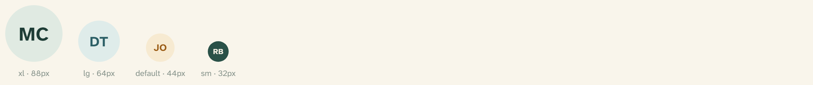
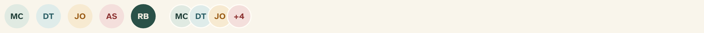

# Avatar

Avatars stand in for a person with their initials — **never a photo**. Four
sizes and five tints, rendered from `src/components/ui/avatar.tsx`.



## Overview

Avatars are **initials only, by design**. On this platform a photo is something
you share inside a conversation once both people have agreed to connect — it is
never displayed by the system beforehand. Initials keep every list, card, and
table warm and personal without pre-empting that consent.

The Base UI `Avatar` primitive we build on supports an image slot
(`AvatarImage`), and it is exported for completeness, but product surfaces use
`AvatarFallback` with initials. Choosing initials here is a values decision, not
a technical limitation — see [Privacy & consent](../foundations/08-accessibility.md).

## Import

```tsx
import { Avatar, AvatarFallback } from "@/components/ui/avatar";

<Avatar>
  <AvatarFallback>MC</AvatarFallback>
</Avatar>

<Avatar size="sm" variant="info">
  <AvatarFallback>DT</AvatarFallback>
</Avatar>
```

`Avatar` is the ring; `AvatarFallback` holds the initials and inherits the
tint. Compute initials from the two name parts and upper-case them, exactly as
the facilitator table and connections list do:

```tsx
const initials = `${first?.[0] ?? ""}${last?.[0] ?? ""}`.toUpperCase();
```

## Sizes

| Size | Dimensions | Initials text | Use for |
| --- | --- | --- | --- |
| `xl` | 88 × 88px | 30px | A profile hero |
| `lg` | 64 × 64px | 22px | Participant and match cards |
| `default` | 44 × 44px | 15px | List rows, connection lists |
| `sm` | 32 × 32px | 12px | Dense facilitator table rows, header account chip |

## Tints

Five tints map to the semantic subtle-fill roles. The tint is decorative — it
distinguishes people at a glance and never encodes status.

| Variant | Fill / text | Reads as |
| --- | --- | --- |
| `default` | `primary-subtle` / heading | Spruce — the default |
| `info` | `info-subtle` / `info` | River blue |
| `warning` | `warning-subtle` / `warning` | Ochre |
| `danger` | `destructive-subtle` / `destructive` | Berry |
| `inverse` | `inverse` / `inverse-foreground` | Dark spruce, for light-on-dark placement |



## Avatar groups

`AvatarGroup` overlaps avatars with a card-colored ring between them;
`AvatarGroupCount` closes the group with an overflow count in a berry tint. Set
the size once on the group and every child follows.

```tsx
import {
  Avatar,
  AvatarFallback,
  AvatarGroup,
  AvatarGroupCount,
} from "@/components/ui/avatar";

<AvatarGroup>
  <Avatar><AvatarFallback>MC</AvatarFallback></Avatar>
  <Avatar variant="info"><AvatarFallback>DT</AvatarFallback></Avatar>
  <Avatar variant="warning"><AvatarFallback>JO</AvatarFallback></Avatar>
  <AvatarGroupCount>+4</AvatarGroupCount>
</AvatarGroup>
```

`AvatarBadge` is also available for a small status dot in the lower-right corner
(ochre `inverse-accent` on a card-colored ring), scaled to the avatar size.

## API

```tsx
<Avatar
  size="sm | default | lg | xl"          // default: "default"
  variant="default | info | warning | danger | inverse"  // default: "default"
  // ...Base UI Avatar.Root props
/>
```

Exports: `Avatar`, `AvatarImage`, `AvatarFallback`, `AvatarBadge`,
`AvatarGroup`, `AvatarGroupCount`, and `avatarVariants` (a `cva` factory).

## Writing guidelines

- Use two initials — first and last — upper-cased. Fall back to a single
  character or `?` only when a name part is missing.
- Never substitute a photo, even where one exists in the data. That is the
  point of the component.
- Keep tints stable per person within a view so the same face reads the same
  way down a list.

## Accessibility

- An avatar beside a visible name is decorative; the name carries the meaning.
- When an avatar stands alone (for example, the header account chip), give it an
  accessible name via `aria-label` or adjacent visually-hidden text.
- Tint never encodes status — status is always stated in words on an adjacent
  [Badge](badge.md).
- Overflow counts (`AvatarGroupCount`) should be reachable in text too (“and 4
  others”) where the group links somewhere.

## Related

- [Badge](badge.md) — the status pill that sits beside an avatar
- [List row](list-row.md) — avatar + name + status row
- [Table](table.md) — small avatars leading facilitator rows
- [Card](card.md) — large avatars on participant and match cards
