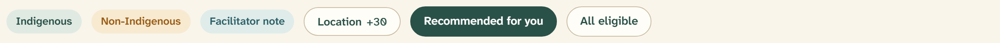
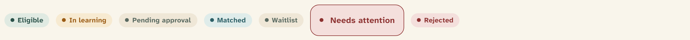
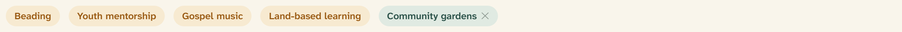

# Badge

Badges label and classify. The system ships two families from one component —
soft **caption** badges for descriptive labels and filters, and **status
pills** for the participant journey: `src/components/ui/badge.tsx`.



## Overview

A badge summarizes one fact about the thing it sits on. The two families
answer two different questions. **Caption badges** (13.5px, no dot) describe or
filter — a person’s background, an interest, an active filter. **Status pills**
(12.5px, with a 7px leading dot) report where someone is on their journey.

The governing rule is that **status is never carried by color alone**. Every
pill states its meaning in words — “Eligible,” “In learning,” “Needs
attention” — so the dot and hue only reinforce a label that already reads on
its own. See [Color](../foundations/03-color.md).

## Import

```tsx
import { Badge } from "@/components/ui/badge";

<Badge>Indigenous</Badge>
<Badge variant="secondary">Non-Indigenous</Badge>
<Badge variant="eligible">Eligible</Badge>
```

Built on the Base UI `useRender` hook: `Badge` renders a `<span>` by default.
To render another element with badge styling — most often a filter chip that is
really a link — pass `render`:

```tsx
import Link from "next/link";

<Badge variant="filter-active" render={<Link href="/recommended" />}>
  Recommended for you
</Badge>
```

## Caption badges

Descriptive labels and filter chips. Text is 13.5px (`text-caption`),
semibold, with no leading dot.

| Variant | Rendering | Use for |
| --- | --- | --- |
| `default` | Spruce-green fill (`success-subtle` / `success`) | Neutral descriptive labels (“Indigenous”) |
| `secondary` | Ochre fill (`warning-subtle` / `warning`) | A paired or contrasting label (“Non-Indigenous”), interest tags |
| `ghost` | River fill (`info-subtle` / `info`) | Quiet informational labels (“Facilitator note”) |
| `outline` | Parchment fill, spruce text, 1.5px input border; border warms to spruce on hover | A resting filter chip (“All eligible”) |
| `filter-active` | Solid spruce, white text | The selected filter chip (“Recommended for you”) |
| `link` | River link text, no padding, underline on hover | A badge that reads as an inline link |

`outline` is the resting state of a filter chip and `filter-active` is its
selected state; toggling a filter swaps between the two.

## Status pills

The participant journey. Text is 12.5px (`text-status`), bold, letter-spaced
`0.02em`, with a 7px leading dot in the current color.



| Variant | Rendering | Example label |
| --- | --- | --- |
| `eligible` | Spruce-green (`success-subtle` / `success`) | “Eligible” |
| `learning` | Ochre (`warning-subtle` / `warning`) | “In learning” |
| `pending` | Sand (`muted` / `muted-foreground`) | “Pending approval” |
| `matched` | River (`info-subtle` / `info`) | “Matched” |
| `waitlist` | Sand (`muted` / `muted-foreground`) | “Waitlist” |
| `alert` | Berry (`destructive-subtle` / `destructive`) | “Needs attention” |
| `destructive` | Berry (`destructive-subtle` / `destructive`) | “Rejected” |

`pending` and `waitlist` share styling today, as do `alert` and `destructive`.
They are kept as **separate named variants on purpose** — quoting the source,
“their visual meanings can evolve independently without changing call sites.”

## Interest tags

Interest tags are a caption badge (usually `secondary`, ochre) that can carry a
remove control. They are composed rather than a dedicated variant.



```tsx
<Badge variant="secondary">Beading</Badge>

<Badge variant="secondary" className="gap-1.5">
  Community gardens
  <button type="button" aria-label="Remove Community gardens">✕</button>
</Badge>
```

The remove control **must** carry an `aria-label` naming the tag it removes —
“Remove Community gardens,” never a bare “✕.”

## States

| State | Rendering |
| --- | --- |
| Hover (`outline`) | Border warms from input grey to spruce, text darkens to heading color |
| Hover (`filter-active`) | Solid spruce fill holds; used as the pressed/selected state |
| Focus | 2px ochre (`--ring`) outline, offset 2px, via `:focus-visible` — for interactive badges (filter chips, links) |

Non-interactive labels (descriptive captions, status pills) are static text and
carry no hover or focus treatment.

## API

```tsx
<Badge
  variant="default | secondary | ghost | outline | filter-active | link |
           eligible | learning | pending | matched | waitlist | alert |
           destructive"
  render={/* element to render instead of a <span>, e.g. <Link /> */}
  // ...all span props (className, children, …)
/>
```

Default: `variant="default"`. The component also exports `badgeVariants` (a
`cva` factory) for applying badge styling to non-Badge elements in exceptional
cases. An `[&>svg]` rule sizes any icon child to 12px automatically.

## Writing guidelines

- Say the status in **words**. The dot and color are reinforcement, never the
  message.
- Caption badges describe (“Indigenous,” “Faith leader”); status pills report a
  journey state (“Eligible,” “In learning”).
- Keep labels to one or two words; they sit inline in dense rows and cards.
- Reserve the berry `alert` / `destructive` pills for states that genuinely
  need attention — a rejected match, a stalled registration — not routine
  “pending” states, which use the calmer sand `pending` pill.

## Accessibility

- Status is conveyed by text first, then by dot shape and color — never color
  alone (WCAG 1.4.1).
- Interactive badges (filter chips, links) keep a visible `:focus-visible` ring
  and are reachable by keyboard.
- A removable interest tag’s remove control needs an `aria-label` that names
  the tag.
- All badge color pairs meet AA contrast on their subtle fills.

## Related

- [Color](../foundations/03-color.md) — the subtle-fill status palette
- [Table](table.md) — status pills and caption badges inside facilitator rows
- [List row](list-row.md) — a status pill trailing each row
- [Card](card.md) — badges heading module and participant cards
