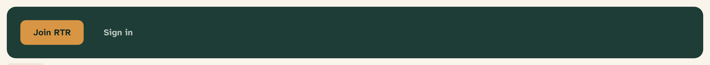
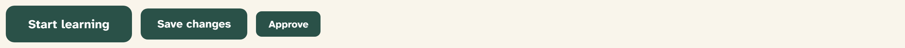

# Button

Buttons trigger actions. The system ships ten variants and eight sizes, all
rendered from one component: `src/components/ui/button.tsx`.


## Overview

A button is a promise about what happens next, so its label names the
action’s **result** — “Schedule call,” “Begin your journey,” never “Submit”
or “OK.” Visual weight communicates importance: exactly one solid primary
button per view, with every other action stepping down to outline, soft,
quiet, or link.

## Import

```tsx
import { Button } from "@/components/ui/button";

<Button>Begin your journey</Button>
<Button variant="outline" size="sm">View profile</Button>
<Button variant="destructive">Remove participant</Button>
```

Built on the Base UI `Button` primitive. To render another element with
button styling (most often a Next.js `Link`), pass `asChild`:

```tsx
<Button asChild>
  <Link href="/learn">Start learning</Link>
</Button>
```

## Variants

| Variant | Rendering | Use for |
| --- | --- | --- |
| `default` | Solid spruce-700, white text | The one primary action on a view |
| `outline` | 1.5px spruce outline, transparent fill | Secondary actions beside a primary |
| `secondary` | Same as `outline` today | Alias kept so meanings can diverge without touching call sites |
| `soft` | Ochre-100 fill, ochre-700 text | Gentle affirmative actions (“Save for later”) |
| `ghost` | Transparent, river-700 text | Tertiary actions; hover shows a river-100 fill |
| `quiet` | Same as `ghost` today | Alias, same reasoning as `secondary` |
| `destructive` | Solid berry-700, white text | Hard-to-undo actions only |
| `danger-quiet` | Berry outline, transparent fill | Reversible refusals (“Decline”) |
| `on-dark` | Ochre-500 fill, spruce-900 text | The call to action on spruce headers and hero panels |
| `link` | River text, underline on hover, no padding | Actions that read as prose |

`outline`/`secondary` and `ghost`/`quiet` render identically **on purpose**:
they are separate names so their meanings can later diverge without a
find-and-replace across call sites.

### On dark surfaces



Use `on-dark` for the primary call to action on spruce surfaces; pair it with
a `quiet` button recolored to `--on-dark-soft` for the secondary action.

## Sizes



| Size | Min height | Padding | Text |
| --- | --- | --- | --- |
| `lg` | 52px | 30px | 17px (`text-card-title`) |
| `default` | 44px | 22px | 15.5px (`text-action`) |
| `sm` | 36px | 16px | 14px |
| `xs` | 32px | 12px | 12px |

The 44px default matches the platform’s minimum touch target; `sm` and `xs`
are reserved for dense facilitator rows and inline card actions.

### Icon buttons


| Size | Dimensions | Icon |
| --- | --- | --- |
| `icon-lg` | 52 × 52px | 16px |
| `icon` | 44 × 44px | 16px |
| `icon-sm` | 36 × 36px | 14px |
| `icon-xs` | 32 × 32px | 12px |

Icon-only buttons **must** carry an `aria-label`:

```tsx
<Button variant="outline" size="icon" aria-label="Add interest">
  <PlusIcon />
</Button>
```

Icons inside labeled buttons are sized automatically (16px at default size)
and sit before the label with an 8px gap — see
[Iconography](../foundations/07-iconography.md).

## States

| State | Rendering |
| --- | --- |
| Hover | Fill darkens one step (spruce-700 → 800) or tint appears on outline/quiet variants |
| Focus | 2px ochre (`--ring`) outline, offset 2px, via `:focus-visible` |
| Disabled | Sand (`--muted`) fill with faint text and `cursor: not-allowed`; the `default` variant instead keeps its spruce fill at 50% opacity |
| Loading | Keep the label, prefix a spinning `Loader2` icon; the button stays disabled while pending |

## API

```tsx
<Button
  variant="default | outline | secondary | soft | ghost | quiet |
           destructive | danger-quiet | on-dark | link"
  size="default | xs | sm | lg | icon | icon-xs | icon-sm | icon-lg"
  asChild={boolean}   // style a child element (e.g. <Link>) instead
  disabled={boolean}
  // ...all Base UI Button props (onClick, type, form, …)
/>
```

Defaults: `variant="default"`, `size="default"`. The component also exports
`buttonVariants` (a `cva` factory) for styling non-Button elements in
exceptional cases.

## Writing guidelines

- Name the result: “Schedule call,” not “Submit”; “Remove participant,” not
  “Delete.”
- One primary (`default` / `on-dark`) button per view.
- Reversible refusals use `danger-quiet`; solid `destructive` berry is
  reserved for hard-to-undo actions.
- Sentence case, no trailing punctuation, verbs first.

## Accessibility

- Focus ring is always visible (`:focus-visible`, 2px ochre, 2px offset).
- Minimum touch target 44px at default size; don’t use `sm`/`xs` for primary
  participant-facing actions.
- `aria-label` on every icon-only button.
- Disabled buttons keep their label readable (AA contrast on the sand fill).

## Related

- [Iconography](../foundations/07-iconography.md) — icon sizing rules
- [Dialog](dialog.md) — footer button arrangement
- [Dropdown menu](dropdown-menu.md) — when actions collapse into a menu
