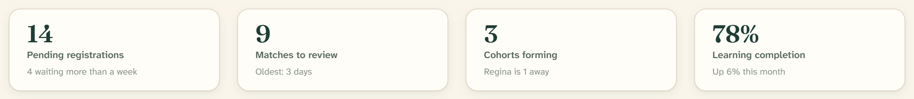

# Card

A card gathers one thing — a person, a module, a statistic — onto a parchment
surface with a soft border and a low shadow: `src/components/ui/card.tsx`.

![Three cards in a row: a participant card led by a spruce "MC" avatar with the name "Marie Cardinal", "Regina, Saskatchewan · Treaty 4", a green "Eligible" pill, ochre "Beading" and "Youth mentorship" tags and a river "Cree" tag, footed by a "View profile" button and "92% match"; a module card titled "Module 2 · Treaties and the land" with an ochre "In progress" pill, a 60% spruce progress bar, a short description and a solid "Continue" button; and a spruce-tinted promo card with the eyebrow "REGINA, SASKATCHEWAN", heading "A circle is forming near you", and a "See the region" button.](../images/cards.png)

## Overview

Cards are the workhorses of the interface, and their guiding rule is that they
**lead with the person**. A participant or match card opens with the avatar and
name — the record details (status, region, match score) follow. The surface is
parchment with a 1px border, a 16px radius, and `shadow-rtr-1`; on an
interactive card the border warms to spruce as you hover.

## Import

```tsx
import {
  Card,
  CardHeader,
  CardTitle,
  CardDescription,
  CardAction,
  CardContent,
  CardFooter,
} from "@/components/ui/card";

<Card>
  <CardHeader>
    <CardTitle>Module 2 · Treaties and the land</CardTitle>
    <CardAction>
      <Badge variant="learning">In progress</Badge>
    </CardAction>
  </CardHeader>
  <CardContent>…</CardContent>
  <CardFooter>
    <Button size="sm">Continue</Button>
  </CardFooter>
</Card>
```

## Anatomy

| Part | Role |
| --- | --- |
| `Card` | The surface. Sets variant, size, and the `--card-padding` / `--card-section-padding` custom properties every part reads |
| `CardHeader` | Top region with a bottom border; a grid that gives `CardAction` its own right-hand column and `CardDescription` a second row |
| `CardTitle` | Atkinson (sans) bold; `text-card-title` (17px), stepping down to `text-action` (15.5px) in a small card |
| `CardDescription` | Muted `text-caption` (13.5px) subtitle |
| `CardAction` | A control pinned to the top-right of the header (a badge, menu, or button) |
| `CardContent` | The padded body (24px, or 16px in a small card) |
| `CardFooter` | Actions row with a top border |

Header, content, and footer all read their padding from the same custom
properties, so switching a card to `size="sm"` retightens every region at once.

## Variants

| Variant | Rendering | Use for |
| --- | --- | --- |
| `default` | Parchment (`bg-card`), border, `shadow-rtr-1` | The standard card |
| `tinted` | Sand fill (`bg-muted`), no shadow | A quiet, recessed card |
| `success` | Spruce-green subtle fill, green border | A positive or confirming card |
| `caution` | Ochre subtle fill, ochre border | A card that needs gentle attention |

> The spruce-tinted promo card in the specimen (“A circle is forming near you”)
> is not one of these four variants — there is no `spruce-tint` variant in the
> component. Reach it by tinting a card directly:
> `<Card className="bg-spruce-100 border-spruce-200 shadow-none">`.

## Sizes

| Size | Content padding | Section padding | Title size |
| --- | --- | --- | --- |
| `default` | 24px | 16px | 17px |
| `sm` | 16px | 12px | 15.5px |

```tsx
<Card size="sm">…</Card>
```

## Compositions

**Participant / match card** — leads with the person. A large
([lg](avatar.md)) avatar and name, a status pill, interest tags, and a footer
carrying a `View profile` action beside a match score.

**Module card with progress** — a `CardHeader` title with an `In progress`
[status pill](badge.md) as the `CardAction`, a [Progress](progress.md) bar and
short description in `CardContent`, and a `Continue` button in the footer.

**Stat tile** — a facilitator overview number. The value is set in **Fraunces**
(`font-heading`) for a warmer, less clinical read than a system sans:



```tsx
<Card>
  <CardContent className="p-4">
    <Users className="text-primary mb-2 h-5 w-5" />
    <p className="font-heading text-spruce-800 text-[34px] leading-[1.1] font-semibold">
      14
    </p>
    <p className="text-ink-soft mt-1 text-[13.5px] font-semibold">
      Pending registrations
    </p>
  </CardContent>
</Card>
```

## Interactive cards

A card that is itself a link or button warms its border on hover. The
facilitator overview wraps each stat tile in a `Link` and adds the hover class
directly:

```tsx
<Link href="/facilitator/participants">
  <Card className="hover:border-primary/40 cursor-pointer transition-colors">
    …
  </Card>
</Link>
```

The border warming is opt-in through `hover:border-primary`; a static card gets
no hover treatment.

## API

```tsx
<Card
  variant="default | tinted | success | caution"   // default: "default"
  size="default | sm"                               // default: "default"
  // ...all div props
/>
```

Exports: `Card`, `CardHeader`, `CardTitle`, `CardDescription`, `CardAction`,
`CardContent`, `CardFooter`, and `cardVariants` (a `cva` factory).

## Writing guidelines

- Lead with the person on any card about a participant or match — avatar and
  name first, record details after.
- One primary action per card footer; secondary actions step down to outline or
  quiet [buttons](button.md).
- Keep titles to a line or two; move detail into `CardDescription` or
  `CardContent`.
- Use `success` / `caution` fills sparingly, for cards whose whole meaning is a
  state — not as decoration.

## Accessibility

- A card is a container, not a control. When the whole card is clickable, make a
  single real link or button the interactive element (as the facilitator tiles
  do) rather than scattering handlers.
- Don’t bury multiple independent links inside one clickable card — nest at most
  one primary target.
- The `CardTitle` should form a sensible heading in the page outline; use the
  right heading level for its context.

## Related

- [Avatar](avatar.md) — the face that leads a participant card
- [Badge](badge.md) — status pills and tags on cards
- [Progress](progress.md) — the bar inside a module card
- [Button](button.md) — footer actions
- [List row](list-row.md) — the lighter-weight alternative for long lists
