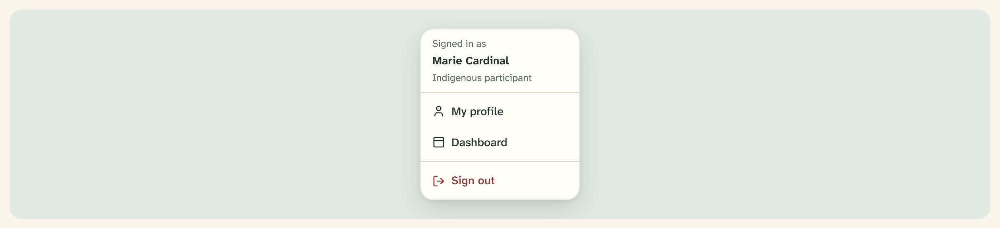

# Dropdown menu

A small overlay of actions anchored to a trigger — most often the account menu
under the header avatar. Built on the Base UI `Menu` primitive in
`src/components/ui/dropdown-menu.tsx`.



## Overview

A dropdown menu is a **parchment popup** (`--popover`) with 4px of padding, a
`rounded-lg` corner, a hairline `ring-foreground/10` ring, and a soft shadow. It
collects the actions that would otherwise crowd the header — viewing a profile,
signing out — behind a single avatar button. Items highlight on focus; the one
destructive action, **Sign out**, is drawn in berry.

Use it for a short list of actions on a trigger. For switching between panels use
[Tabs](tabs.md); for full-screen navigation use the [Sheet](sheet.md).

## Import

```tsx
import {
  DropdownMenu,
  DropdownMenuTrigger,
  DropdownMenuContent,
  DropdownMenuItem,
  DropdownMenuSeparator,
} from "@/components/ui/dropdown-menu";

<DropdownMenu>
  <DropdownMenuTrigger asChild>
    <Button variant="quiet" size="icon" aria-label="Open account menu">
      <Avatar size="sm">
        <AvatarFallback>MC</AvatarFallback>
      </Avatar>
    </Button>
  </DropdownMenuTrigger>
  <DropdownMenuContent align="end" className="w-56">
    <div className="px-2 py-2">
      <p className="font-semibold">Marie Cardinal</p>
      <p className="text-ink-soft text-xs">Indigenous participant</p>
    </div>
    <DropdownMenuSeparator />
    <DropdownMenuItem className="text-berry-700 gap-2">
      <LogOut />
      Sign out
    </DropdownMenuItem>
  </DropdownMenuContent>
</DropdownMenu>;
```

## Parts

| Part | Role |
| --- | --- |
| `DropdownMenu` | Root; owns open state |
| `DropdownMenuTrigger` | The anchor; pass `asChild` to use your own `Button` |
| `DropdownMenuContent` | The popup. Positioned via `align` / `side` / `sideOffset` |
| `DropdownMenuLabel` | A muted group label (e.g. “Signed in as…”) |
| `DropdownMenuItem` | An action row; `variant="destructive"` for berry |
| `DropdownMenuSeparator` | A hairline `--border` rule, full-bleed to the padding |
| `DropdownMenuGroup` | Groups related items under a label |
| `DropdownMenuCheckboxItem` / `DropdownMenuRadioItem` | Stateful items with a check indicator |
| `DropdownMenuSub` / `SubTrigger` / `SubContent` | Nested submenus |
| `DropdownMenuShortcut` | A right-aligned keyboard hint |

## Items and states

| State | Rendering |
| --- | --- |
| Default | `--foreground` text, 14.5px, `rounded-md` row |
| Focus / hover | `--accent` fill, `--accent-foreground` text |
| Destructive | `--destructive` (berry) text; focus adds a berry-tinted fill |
| Disabled | 50% opacity, pointer events off |

`DropdownMenuContent` defaults to `align="start"`, `side="bottom"`,
`sideOffset={4}`. Header menus pass `align="end"` and a fixed `w-56` width so the
panel hangs from the avatar’s right edge.

## Account menus

The account menu is the primary use, and its contents vary by role — see
`docs/mocks/overlay-account-menus.html` for all three:

| Role | Items |
| --- | --- |
| Participant | Name + “{Indigenous / Non-Indigenous} participant” → **My profile** → **Sign out** |
| Facilitator | Name + “Facilitator” → **Sign out** (no profile item) |
| Learning journey | Name + “Learning journey” → **Dashboard** (only once learning is complete) → **Sign out** |

**Header block, note:** the shipped account menus render the signed-in identity
as a plain `div` of name + role rather than with `DropdownMenuLabel`. The
`DropdownMenuLabel` part is still exported for the muted “Signed in as…” style of
group label when you want the Base UI grouping semantics.

## API

```tsx
<DropdownMenuContent
  align="start | center | end"       // default "start"
  side="top | right | bottom | left" // default "bottom"
  alignOffset={number}               // default 0
  sideOffset={number}                // default 4
/>

<DropdownMenuItem
  variant="default | destructive"    // default "default"
  inset={boolean}                    // pad left to align past an icon column
  onClick={() => void}
/>
```

## Accessibility

- Base UI supplies the `role="menu"` / `role="menuitem"` structure, typeahead,
  and full arrow-key navigation; focus returns to the trigger on close.
- The trigger must name itself — every account button carries
  `aria-label="Open account menu"`.
- Destructive intent is carried by the berry colour **and** the explicit label
  (“Sign out”), never colour alone.
- Items meet the 44px-equivalent hit area with their padding; keep labels to a
  short verb phrase.

## Related

- [App header](app-header.md) — hosts the account menu in its actions slot
- [Avatar](avatar.md) — the trigger for account menus
- [Button](button.md) — the `asChild` trigger and its `quiet` variant
- [Separator](separator.md) — the standalone rule this menu’s divider mirrors
- [Sheet](sheet.md) — the full-height overlay for navigation
