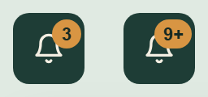
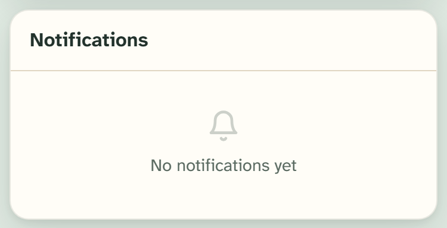

# Notification center

The notification center is the bell in the app header: a button with an unread
count that opens a panel of recent notifications.
`src/components/notification-center.tsx`.



## Overview

The bell lives in the spruce app header. It shows an ochre count of unread
notifications, and opening it reveals a scrollable parchment panel of the
twenty most recent. New notifications arrive live over a realtime
subscription — each one both prepends to the panel and raises a
[Toast](toast.md) with a "View" action. Clicking a row marks it read and
routes to the connection or dashboard it concerns.

## Import

```tsx
import { NotificationCenter } from "@/components/notification-center";

<NotificationCenter userId={user.id} />;
```

`NotificationCenter` takes a single `userId` prop. It's a client component:
it loads the user's latest notifications, subscribes to inserts, and manages
its own open state. It's built on the [Dropdown menu](dropdown-menu.md), with
the panel anchored to the end of the trigger.

## The bell

The trigger is a `quiet`, round, icon-sized [Button](button.md) tinted for the
dark header, carrying the `Bell` icon and an `aria-label` of "Notifications".
When there are unread notifications, an ochre badge (ochre-500 fill,
spruce-900 text) sits at the top-right corner:

- The badge shows the unread count.
- Any count above nine collapses to **9+**.
- With zero unread, the badge is hidden entirely.

## The panel


The panel is a fixed-width dropdown (`w-80`, about 320px) with a header row and
a scrollable list (up to `max-h-96`, capped at the 20 most recent).

- **Header** — the label "Notifications" and, when there are unread items, a
  "Mark all read" action. The action is hidden once nothing is unread.
- **Rows** — each row shows a round type icon, the notification title, an
  optional body preview (clamped to two lines), and a relative timestamp
  ("5 minutes ago").
- **Unread rows** stand out three ways: a bold title, a faint spruce tint
  across the row, and a small spruce dot on the right edge. The icon circle
  fills spruce for unread and mutes to grey once read.

### Type icons

Each notification type carries its own icon (`TYPE_ICONS`); unknown types fall
back to the bell:

| Type | Icon |
| --- | --- |
| `connect_request` | `Heart` |
| `match_approved` | `CheckCircle2` |
| `new_message` | `MessageCircle` |
| `meeting_scheduled` | `Video` |

## Empty state



With no notifications the panel shows a faded `Bell` icon above the muted line
"No notifications yet". The "Mark all read" action is absent because nothing is
unread.

## Realtime behaviour

`NotificationCenter` subscribes to inserts on the `notifications` table for the
current user. When a row arrives it:

1. Prepends the notification to the panel (keeping the list at 20).
2. Raises an untyped [Toast](toast.md) with the notification's title, its body
   as the description, and a "View" action that routes to the related
   connection or dashboard.

Clicking a row in the panel marks that one read and navigates to its target;
"Mark all read" clears every unread row at once. Notification titles and
bodies come from the source rows themselves — the full set of templates
(including the two variants each for `connect_request` and `match_approved`)
is catalogued in [states-toasts.html](../../mocks/states-toasts.html).

## Live example

[overlay-notifications.html](../../mocks/overlay-notifications.html) shows the
panel populated with three unread rows, the empty state, and the 9+ badge side
by side.

## API

```tsx
<NotificationCenter userId={string} />
```

## Accessibility

- The bell button carries an `aria-label` of "Notifications" so its purpose is
  clear without a visible label.
- The panel is a dropdown menu: it opens on click, traps focus, and closes on
  Escape or an outside click.
- Unread status is signalled by weight, tint, and a dot together — not colour
  alone.

## Related

- [App header](app-header.md) — where the bell sits
- [Dropdown menu](dropdown-menu.md) — the panel's underlying component
- [Toast](toast.md) — the realtime "View" toast each notification raises
- [Badge](badge.md) — the unread count badge
- [Empty state](empty-state.md) — the "No notifications yet" pattern
