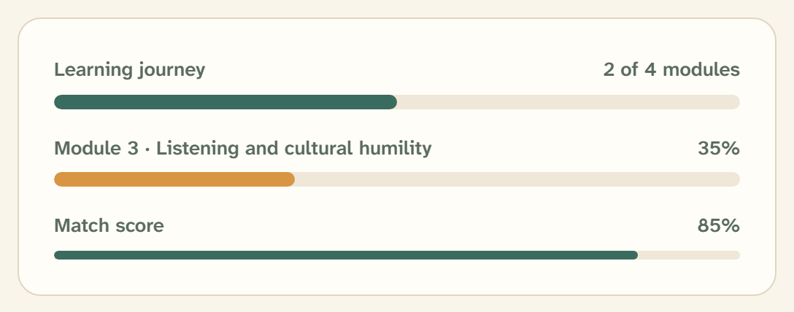

# Progress

A quiet horizontal bar that shows how far along a journey someone is —
learning modules completed, a match score, an onboarding step:
`src/components/ui/progress.tsx`.



## Overview

Progress on this platform is about a person’s path, not a loading state. The bar
is a 10px sand track with a spruce-600 fill — calm, warm, and paired with a
label row that says the same thing in words (“2 of 4 modules”) so the number is
never left to the eye alone.

## Import

```tsx
import { Progress, ProgressLabel, ProgressValue } from "@/components/ui/progress";

<Progress value={50}>
  <ProgressLabel>Learning journey</ProgressLabel>
  <ProgressValue>2 of 4 modules</ProgressValue>
</Progress>
```

`Progress` (Base UI `Progress.Root`) renders any children first, then its own
track and indicator. `ProgressLabel` and `ProgressValue` sit on the label row
above the bar — `ProgressValue` is pushed to the right (`ml-auto`) and set in
tabular figures.

Passing `value` alone renders just the bar:

```tsx
<Progress value={85} />
```

## Anatomy

| Part | Rendering |
| --- | --- |
| `Progress` | The root; lays out the label row and the track (`flex flex-wrap gap-3`) |
| `ProgressTrack` | 10px sand rail (`bg-sand`, `h-2.5`, pill radius) |
| `ProgressIndicator` | Spruce-600 fill, animates width over 180ms |
| `ProgressLabel` | 15px medium label text |
| `ProgressValue` | 15px muted value, right-aligned, tabular figures |

## Variants and sizes

There is no `variant` prop; the two looks below are reached by styling the
parts or the root.

- **In-progress learning (ochre).** The default fill is spruce; an ochre bar
  marks a module still underway. Compose the parts and tint the indicator:

  ```tsx
  import { Progress, ProgressTrack, ProgressIndicator } from "@/components/ui/progress";

  <Progress value={35}>
    <ProgressTrack>
      <ProgressIndicator className="bg-ochre-500" />
    </ProgressTrack>
  </Progress>
  ```

- **Slim inline bar.** Inside match cards and facilitator table rows the bar
  shrinks and sits beside a status pill. The participants table renders it
  exactly like this:

  ```tsx
  <div className="flex min-w-24 items-center gap-2">
    <Progress value={progressPct} className="h-1.5 flex-1" />
    <Badge variant="matched">Ready</Badge>
  </div>
  ```

## API

```tsx
<Progress
  value={number}   // 0–100; the completed proportion
  // ...Base UI Progress.Root props (max, getAriaValueText, …)
>
  {/* optional ProgressLabel / ProgressValue */}
</Progress>
```

Exports: `Progress`, `ProgressTrack`, `ProgressIndicator`, `ProgressLabel`,
`ProgressValue`. Use `Progress` for the common case; drop to the individual
parts only when you need to restyle the track or indicator.

## Writing guidelines

- Always pair the bar with a label that names the value — “2 of 4 modules,”
  “35%,” “85% match.” Never ship a bare bar where the number matters.
- Reserve the ochre fill for “in progress,” keeping spruce for neutral or
  complete progress.
- Frame progress as a journey (“Learning journey”), not a task queue.

## Accessibility

- Base UI sets `role="progressbar"` with `aria-valuenow` / `aria-valuemin` /
  `aria-valuemax` from `value`; pass `getAriaValueText` for a spoken value where
  the visible label differs.
- The fill respects `prefers-reduced-motion` — the 180ms width transition is
  reduced to near-instant globally.
- Progress is conveyed by the label text as well as the bar, so it never relies
  on color or width alone.

## Related

- [Journey stepper](journey-stepper.md) — discrete, numbered steps rather than a continuous bar
- [Badge](badge.md) — the status pill paired with the slim bar
- [Card](card.md) — module cards that pair a bar with a title and action
- [Color](../foundations/03-color.md) — the spruce and ochre fill roles
