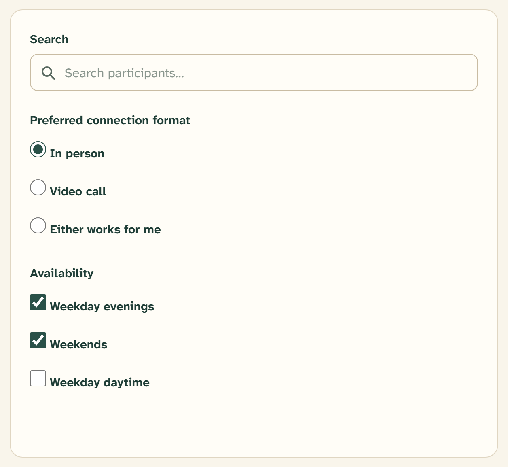

# Radio group

A radio group picks exactly one option from a small, visible set.
`src/components/ui/radio-group.tsx` wraps the Base UI `RadioGroup` and `Radio`
primitives — a `RadioGroup` container and its `RadioGroupItem` circles.



## Overview

Use a radio group when the options are **mutually exclusive** and few enough to
show all at once — "Are you Indigenous? Yes / No", "Sex", "Preferred connection
format". For independent options where any number can be on, use
[Checkbox](checkbox.md); for a long list, use [Select](select.md).

## Import

```tsx
import { RadioGroup, RadioGroupItem } from "@/components/ui/radio-group";
import { Label } from "@/components/ui/label";

<RadioGroup value={value} onValueChange={setValue} className="flex gap-6">
  <div className="flex items-center gap-2">
    <RadioGroupItem value="yes" id="indigenous_yes" />
    <Label htmlFor="indigenous_yes">Yes</Label>
  </div>
  <div className="flex items-center gap-2">
    <RadioGroupItem value="no" id="indigenous_no" />
    <Label htmlFor="indigenous_no">No</Label>
  </div>
</RadioGroup>
```

`RadioGroup` lays its children out as a full-width grid with an 8px gap by
default; override with `className` (the onboarding steps use `flex gap-6` to sit
Yes / No side by side).

## Anatomy

| Property | Value | Class |
| --- | --- | --- |
| Size | 20px circle | `size-5 rounded-full` |
| Border | 1.5px border-strong | `border-[1.5px] border-border-strong` |
| Fill (unselected) | Parchment | `bg-parchment` |
| Fill (selected) | Spruce-700 with an 8px white dot | `data-checked:bg-spruce-700` + white `size-2` dot |

An invisible `after:-inset-x-3 after:-inset-y-2` extends the tap target well
past the 20px circle.

## States

| State | Rendering | Class |
| --- | --- | --- |
| Selected | Spruce fill, spruce border, white centre dot | `data-checked:border-spruce-700 data-checked:bg-spruce-700` |
| Focus | 2px ochre outline, 2px offset | `focus-visible:outline-ochre-600` |
| Invalid | Berry border | `aria-invalid:border-berry-700` |
| Disabled | 50% opacity, `not-allowed` cursor | `disabled:opacity-50` |

The circle uses fixed palette values (spruce-700, ochre-600, berry-700), so the
selected dot reads spruce in both light and dark themes.

## Validation

Put the `aria-invalid` and error message on the group, not each circle, and
wrap the group in a `<fieldset>` with a `<legend>` so it announces as one
labelled question:

```tsx
<fieldset id="sex_group" tabIndex={-1} aria-describedby={sexError?.errorId}>
  <legend className="text-base font-medium">Sex *</legend>
  <RadioGroup value={sex} onValueChange={setSex} aria-invalid={!!sexError} className="flex flex-wrap gap-6">
    {options.map(({ value, label }) => (
      <div key={value} className="flex items-center gap-2">
        <RadioGroupItem value={value} id={`sex_${value}`} aria-invalid={!!sexError} />
        <Label htmlFor={`sex_${value}`}>{label}</Label>
      </div>
    ))}
  </RadioGroup>
  <FieldErrorMessage error={sexError} />
</fieldset>
```

## API

```tsx
<RadioGroup
  value={string}
  onValueChange={(value) => void}
  aria-invalid={boolean}
  className={string}     // default layout is a full-width grid, gap 8px
>
  <RadioGroupItem value={string} id={string} aria-invalid={boolean} />
</RadioGroup>
```

## Writing guidelines

- Label the group with the question (the `<legend>`) and each option with its
  answer, in sentence case: "In person", "Video call", "Either works for me".
- Keep option labels parallel and short.
- Provide a real default only when one exists; leaving all options unselected is
  fine for a required question that must be answered deliberately.

## Accessibility

- Each `RadioGroupItem` has an `id`; its [Label](form-field.md) uses the
  matching `htmlFor`.
- Wrap the set in a `<fieldset>` / `<legend>` and attach validation to the
  group, so the error is announced for the whole question.
- Arrow keys move between options within the group, matching native radio
  behavior.

## Related

- [Checkbox](checkbox.md) — for independent, any-number-on options
- [Select](select.md) — for one-of-many when the list is long
- [Form field](form-field.md) — legend, hint, and error assembly
