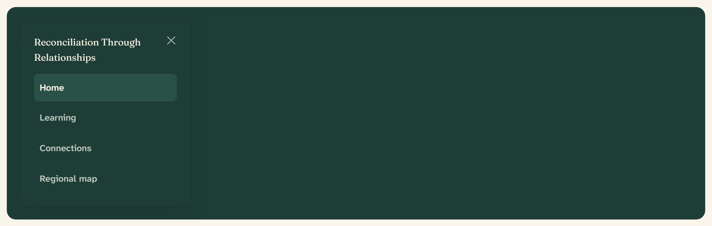

# Sheet

A panel that slides in from the edge of the viewport over a dimmed backdrop.
Built on the Base UI `Dialog` primitive in `src/components/ui/sheet.tsx`.



## Overview

A Sheet is a Dialog that enters from a screen edge rather than the center. Its
one shipped job is **mobile navigation**: below 861px the [app header](app-header.md)
hides its inline nav and a Menu button opens a right-side Sheet holding the same
links. The panel is a `--popover` surface by default; the header recolours it to
spruce-800 so the mobile nav matches the bar it came from.

## Import

```tsx
import {
  Sheet,
  SheetTrigger,
  SheetContent,
  SheetHeader,
  SheetTitle,
  SheetClose,
} from "@/components/ui/sheet";

<Sheet>
  <SheetTrigger render={<Button aria-label="Open navigation">Menu</Button>} />
  <SheetContent side="right">
    <SheetHeader>
      <SheetTitle>Reconciliation Through Relationships</SheetTitle>
    </SheetHeader>
    {/* panel body */}
  </SheetContent>
</Sheet>;
```

## Parts

| Part | Role |
| --- | --- |
| `Sheet` | Root; owns open state |
| `SheetTrigger` | Opens the sheet (pass a `Button` via `render`) |
| `SheetContent` | The sliding panel; portals over a backdrop |
| `SheetHeader` / `SheetTitle` / `SheetDescription` | Titled top region |
| `SheetFooter` | Bottom-pinned action region (`mt-auto`) |
| `SheetClose` | Dismisses the sheet; wraps a link or button |

## Sides

`SheetContent` takes `side="top" | "right" | "bottom" | "left"` (default
`right`). Left and right panels are full height at 75% width, capped at
`sm:max-w-sm`; top and bottom panels span the full width and size to content.
The backdrop is the shared scrim, `rgba(20,40,35,0.55)`, and both panel and
backdrop fade and slide on enter and exit.

A close button (a ghost X, `aria-label` “Close”) is rendered in the top-right
corner unless you pass `showCloseButton={false}`.

## Mobile navigation

The app header wraps its nav in a Sheet whose title is the full brand name,
**Reconciliation Through Relationships**, and recolours the panel to
`bg-spruce-800 text-on-dark`. Each link is a `SheetClose` wrapping a `Link`, so
tapping a destination both navigates and closes the panel. The active link takes
a spruce-700 fill and an ochre-500 left strand, mirroring the desktop underline.

The link set is whatever the header was given, so it differs by role — see
`docs/mocks/overlay-mobile-nav.html` for both:

| Role | Links |
| --- | --- |
| Participant (`DashboardNav`) | Home · Learning · Connections · Regional map |
| Facilitator (`FacilitatorNav`) | Overview · Participants · Matches · Cohorts · Settings |

## API

```tsx
<SheetContent
  side="top | right | bottom | left"   // default "right"
  showCloseButton={boolean}            // default true
  className="…"                        // recolour / resize the panel
  // ...all Base UI Dialog.Popup props
/>
```

`Sheet`, `SheetTrigger`, and `SheetClose` forward the Base UI `Dialog.Root`,
`Dialog.Trigger`, and `Dialog.Close` props respectively.

## Accessibility

- As a Dialog, the Sheet traps focus while open, restores focus to the trigger
  on close, and closes on `Escape` and backdrop click.
- Always give `SheetContent` an accessible name via `SheetTitle` (the mobile nav
  uses the brand name); add `SheetDescription` when the purpose needs a sentence.
- The mobile nav landmark is labelled `aria-label="Mobile navigation"` and the
  active link keeps its `aria-current="page"`.
- The trigger must name its action — the header’s Menu button carries
  `aria-label="Open navigation"`.

## Related

- [App header](app-header.md) — opens this Sheet for mobile navigation
- [Dialog](dialog.md) — the centered modal built on the same primitive
- [Button](button.md) — the trigger and close controls
- [Dropdown menu](dropdown-menu.md) — the lighter overlay for account actions
