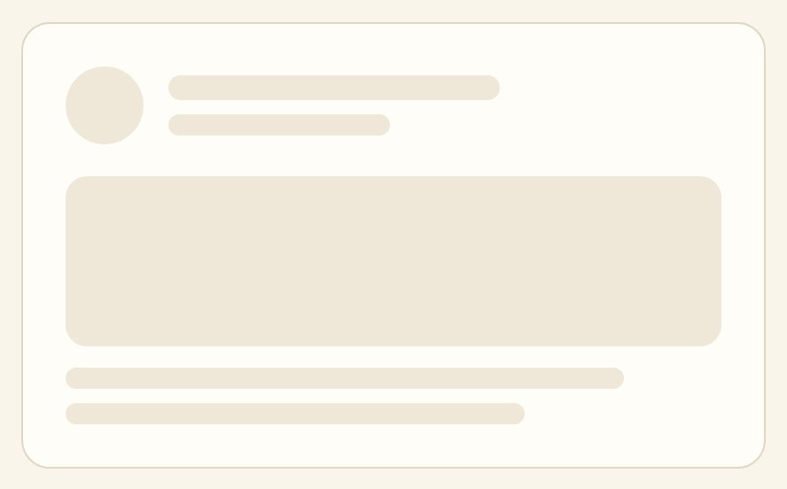

# Skeleton

A soft placeholder that holds the shape of content while it loads:
`src/components/ui/skeleton.tsx`.



## Status

Skeleton ships in the component library but is **not yet used anywhere in the
product**. It is documented here so the loading pattern is consistent whenever
the first skeleton lands. Today the app loads server-rendered pages and shows no
intermediate placeholder, so reach for Skeleton only when you introduce a
genuinely asynchronous, client-loaded region.

## Overview

A skeleton mirrors the layout it replaces — same box sizes, same rhythm — in the
muted sand color, pulsing gently until the real content arrives. It reassures
without demanding attention, and it keeps the page from reflowing when content
lands.

## Import

```tsx
import { Skeleton } from "@/components/ui/skeleton";

<Skeleton className="h-4 w-40" />
```

`Skeleton` is a single `<div>`. It carries `bg-muted` (sand), `animate-pulse`,
and `rounded-md`; you supply the size, and any other shape, through `className`.

```tsx
// A loading list row: avatar circle + two text lines
<div className="flex items-center gap-4">
  <Skeleton className="size-11 rounded-full" />
  <div className="flex-1 space-y-2">
    <Skeleton className="h-4 w-40" />
    <Skeleton className="h-3 w-24" />
  </div>
</div>
```

## API

```tsx
<Skeleton
  className={string}   // required in practice — sets width, height, and shape
  // ...all div props
/>
```

There are no variants. Override `rounded-md` with `rounded-full` for avatars or
`rounded-2xl` for cards so the placeholder matches the real element’s radius.

## Writing guidelines

- Match the skeleton to the content it replaces: same number of lines, roughly
  the same widths, the same avatar and card shapes.
- Vary line widths slightly (a full line, then a shorter one) so the placeholder
  reads as text, not a solid block.
- Show skeletons only for content that truly loads asynchronously on the client;
  do not fake latency.

## Accessibility

- Wrap a loading region in a container marked `aria-busy="true"` and swap to the
  real content when it arrives.
- Skeletons are decorative — mark them `aria-hidden` (or keep them inside an
  `aria-busy` region) so screen readers announce the loading state once, not
  every placeholder bar.
- The pulse animation is disabled under `prefers-reduced-motion`.

## Related

- [Card](card.md) — the surface a card skeleton mimics
- [List row](list-row.md) — the row layout a list skeleton mirrors
- [Progress](progress.md) — for known, measurable progress rather than an indeterminate wait
