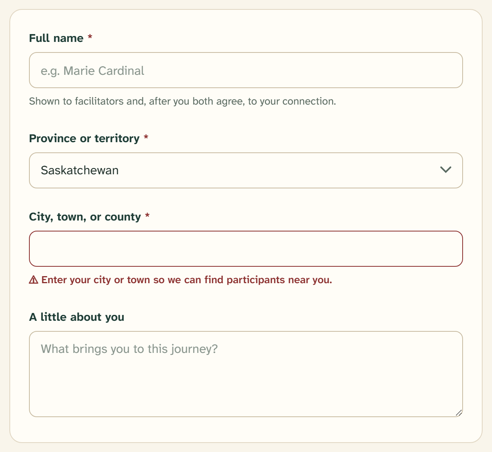

# Textarea

A multi-line text control for longer, open-ended answers. `src/components/ui/textarea.tsx`
is a native `<textarea>` wearing the same control contract as
[Input](input.md), plus room to grow.



## Overview

Textarea shares every visual token with Input — parchment fill, 1.5px
border-strong border, 10px radius, spruce hover/focus border, ochre focus
outline, berry `aria-invalid` state — through the shared `controlStyles`. It
adds three things: a taller minimum height, a relaxed line height for reading
prose, and a vertical resize handle.

## Import

```tsx
import { Textarea } from "@/components/ui/textarea";

<Textarea
  id="bio"
  rows={4}
  placeholder="Share a little about who you are — your story, what you care about, and what brings you to RTR."
/>
```

## What it adds over the shared contract

| Property | Value | Class |
| --- | --- | --- |
| Min height | ~110px (per the specimen) — about three lines | `min-h-textarea` |
| Line height | 1.55, looser than Input for reading | `leading-copy` |
| Resize | Vertical only — users can grow it, not stretch it sideways | `resize-y` |

Resize is locked to the vertical axis on purpose: horizontal resizing would
break the form's column and the field's alignment with its label. Everything
else — colors, border, focus ring, disabled and invalid states — is identical
to [Input](input.md), so a textarea and an input in the same form match exactly.

## Usage in the product

Textareas are the open-ended fields of onboarding, always optional and always
carrying a placeholder that models the kind of answer wanted:

- **Bio** — "Share a little about who you are…" (`rows={4}`)
- **Additional matching information** — "Anything else you'd like a potential
  match to know…" (`rows={3}`)
- **Personal boundaries & other preferences** — "e.g. I prefer not to discuss
  specific denominations. I have limited mobility." (`rows={4}`)

Set `rows` to hint at how much answer you expect; the field still grows if the
person writes more.

## API

```tsx
<Textarea
  id={string}            // match the Label's htmlFor
  rows={number}          // starting height in lines
  aria-invalid={boolean} // paints the field berry
  aria-describedby={string}
  disabled={boolean}
  // …all native <textarea> props (value, onChange, placeholder, maxLength, …)
/>
```

There is no `variant` or `size` prop. Constrain or grow it with `rows` and
utility classes rather than props.

## Writing guidelines

- Placeholders model a real answer ("e.g. I prefer not to discuss specific
  denominations"), which does more than an instruction to invite an honest one.
- Keep the label short; put any "why we ask" reassurance in a hint above the
  field, not the placeholder.
- Prefer a textarea over a tall input only when the answer is genuinely
  multi-line prose; use [Input](input.md) for names, cities, and numbers.

## Accessibility

- Pair with a [Label](form-field.md) whose `htmlFor` matches the textarea's
  `id`.
- Use `aria-invalid` and `aria-describedby` for validation, exactly as on Input.
- The vertical resize handle lets people who need more room make it — don't
  disable resizing.

## Related

- [Input](input.md) — the shared control contract in full
- [Form field](form-field.md) — label, hint, and error assembly
- [Typography](../foundations/04-typography.md) — the `leading-copy` reading
  measure
