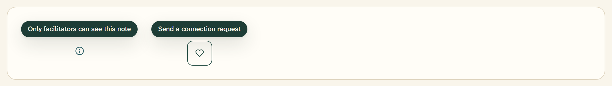

# Tooltip

A tooltip is a small dark label that appears on hover or focus to explain a
control. The system ships one styled variant:
`src/components/ui/tooltip.tsx`.



## Overview

Tooltips carry supplementary hints — most often the reason an action is
unavailable — on a compact spruce-800 surface with on-dark text. They are
deliberately rare in the app: use one only when a control needs a short
explanation that would clutter the layout if shown inline, and never for
information a participant must not miss (that belongs in an
[Alert](alert.md)) or as a control's only accessible name.

## Import

```tsx
import {
  Tooltip,
  TooltipTrigger,
  TooltipContent,
} from "@/components/ui/tooltip";

<Tooltip>
  <TooltipTrigger render={<div className="flex-1" />}>
    <Button disabled>Pending</Button>
  </TooltipTrigger>
  <TooltipContent>Waiting for a facilitator to approve this match</TooltipContent>
</Tooltip>;
```

Built on the Base UI `Tooltip` primitive. `Tooltip` wraps its children in a
`TooltipProvider` for you, so a single tooltip works on its own.

## Anatomy

| Part | Renders | Notes |
| --- | --- | --- |
| `TooltipProvider` | `Tooltip.Provider` | Shares open/close timing; opens after 200ms, closes after 100ms |
| `Tooltip` | `Tooltip.Root` | One tooltip; auto-wraps itself in a provider |
| `TooltipTrigger` | `Tooltip.Trigger` | The element the tooltip describes |
| `TooltipContent` | Portal + positioner + `Tooltip.Popup` | The dark label; sits 6px off the trigger (`sideOffset`) |

Wrap a group of tooltips in one `TooltipProvider` when you want them to share
the hover delay — the second tooltip in a group opens immediately rather than
waiting the full 200ms.

## Appearance

`TooltipContent` renders a spruce-800 popup with on-dark text at 12px medium
weight, a `shadow-rtr-2` shadow, rounded corners, and `max-w-xs` so long hints
wrap rather than run off-screen. It fades and zooms in over 150ms and is
positioned 6px from its trigger by default; pass `sideOffset` to change the
gap.

## Wrapping a disabled control

A disabled button does not emit hover events, so every tooltip in the app
attaches to a wrapper element via the trigger's `render` prop rather than to
the button itself:

```tsx
<TooltipTrigger render={<div className="flex-1" />}>{btn}</TooltipTrigger>
```

## Usage in the app

Tooltips appear in exactly three places, all explaining why a "Pending"
connection button cannot be used yet:

| Location | Message |
| --- | --- |
| `RecommendedTab` | "Waiting for a facilitator to approve this match" · `Waiting for {first name} to accept` · `{first name} is waiting for you to accept` |
| `ConnectionsTab` | Same pending-state reasons on the connections list |
| `AllParticipantsTab` | Same pending-state reasons on the participants table |

When the connection is active the button links straight to the chat and drops
the tooltip — the label "Open chat" is enough on its own.

## API

```tsx
<TooltipProvider delay={200} closeDelay={100}>
  {/* ...all Base UI Tooltip.Provider props */}
</TooltipProvider>

<Tooltip>{/* ...Tooltip.Root props: open, onOpenChange, ... */}</Tooltip>
<TooltipContent sideOffset={6}>{/* ...Tooltip.Popup props */}</TooltipContent>
```

## Writing guidelines

- Keep it to a phrase — a reason or a hint, no punctuation-heavy sentences.
- Explain state, don't repeat the label: "Waiting for a facilitator to
  approve this match," not "Pending."
- Never hide essential information or a required action inside a tooltip; it
  is invisible until hover or focus.

## Accessibility

- The tooltip supplements a control's own accessible name — it is never the
  only label. Give icon-only buttons an `aria-label` regardless.
- Base UI opens the tooltip on both hover and keyboard focus and dismisses it
  on Escape, so keyboard users get the same hint.
- Because a disabled button can't receive focus, the wrapper-element pattern
  above also lets keyboard users reach the hint.

## Related

- [Button](button.md) — the pending/disabled buttons tooltips explain
- [Dialog](dialog.md) — for content that needs a click, not a hover
- [Alert](alert.md) — for information the participant must actually see
- [Accessibility](../foundations/08-accessibility.md) — labelling rules
