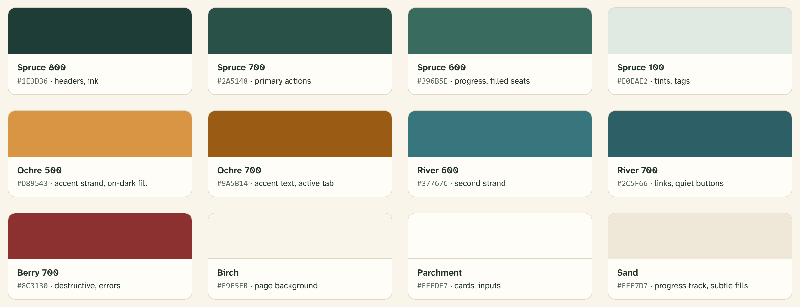

# Color

The palette is drawn from the land: spruce forest, birchbark, prairie ochre,
river water, wild berry. Each hue carries a fixed meaning — color is never
decorative-only, and status is never carried by color alone.

## The five hues and what they mean

| Hue | Tokens | Carries |
| --- | --- | --- |
| **Spruce** (deep green) | `spruce-900` … `spruce-100` | Structure and action: headers, headings, primary buttons, progress, filled seats. Spruce is the product’s “ink.” |
| **Ochre** (prairie gold) | `ochre-700` … `ochre-100` | The first relationship strand. Accents, eyebrows, focus rings, the active tab, the on-dark call to action, “ready” states. |
| **River** (teal) | `river-700` … `river-100` | The second relationship strand. Links, quiet buttons, informational status. |
| **Berry** (muted red) | `berry-800`, `berry-700`, `berry-100` | Reserved exclusively for warnings, errors, and destructive actions. Berry never decorates. |
| **Neutrals** | `birch`, `parchment`, `sand`, `ink`, `ink-soft`, `ink-faint` | Page background, card surfaces, subtle fills, and the three text strengths. |

Two special neutrals serve dark surfaces: `--on-dark` (`#f4efe3`, warm white
text) and `--on-dark-soft` (`#b9c6bc`, muted text on spruce).

## Core palette reference

| Swatch | Hex | Typical use |
| --- | --- | --- |
| Spruce 800 | `#1e3d36` | App header, footer, headings, dark panels |
| Spruce 700 | `#2a5148` | Primary buttons (`--primary`) |
| Spruce 600 | `#396b5e` | Progress bars, filled cohort seats |
| Spruce 100 | `#e0eae2` | Tints, tags, hover fills |
| Ochre 500 | `#d89543` | Accent strand, on-dark button fill |
| Ochre 700 | `#9a5b14` | Accent text, eyebrows, active tab |
| River 600 | `#37767c` | Second strand (brand mark, weave) |
| River 700 | `#2c5f66` | Links, quiet buttons |
| Berry 700 | `#8c3130` | Destructive buttons, errors |
| Birch | `#f9f5eb` | Page background |
| Parchment | `#fffdf7` | Cards, inputs, popovers |
| Sand | `#efe7d7` | Progress tracks, subtle fills, disabled |

## Status colors

Status meanings map onto the three non-destructive hues plus berry:

| Meaning | Role tokens | Rendered as |
| --- | --- | --- |
| Success / eligible / complete | `--success`, `--success-subtle` | Spruce on spruce-100 |
| Warning / in progress / waiting | `--warning`, `--warning-subtle` | Ochre-700 on ochre-100 |
| Info / neutral | `--info`, `--info-subtle` | River-700 on river-100 |
| Danger / error / rejected | `--destructive`, `--destructive-subtle` | Berry-700 on berry-100 |

**Status is never carried by color alone.** Every
[status pill](../components/badge.md) states its meaning in words, every
[cohort circle](../components/cohort-circle.md) carries a count, and every
[alert](../components/alert.md) leads with a bolded sentence.

## Dark theme

The `.dark` class remaps semantic roles onto the dark palette: the page
becomes spruce-900, cards spruce-800, and primary flips from spruce to
**ochre-500 with spruce-900 text**. Borders become translucent warm white
(`rgb(244 239 227 / 18%)`), and the status colors lighten to their 200-tints
so they hold contrast on spruce. Components that consume roles get all of
this for free — see [Design tokens](02-design-tokens.md).

## Contrast rules

- Text and interactive colors meet **WCAG AA** on their actual backgrounds
  (birch and parchment are near-white; the palette’s 700-weights are chosen
  against them).
- `ink-faint` (`#8a968e`) is for tertiary, non-essential text only —
  placeholders, timestamps, specimen labels. Never body copy.
- On spruce surfaces, use `--on-dark` for primary text and `--on-dark-soft`
  for secondary; ochre-500 is the only accent used on dark.

## Related

- [Design tokens](02-design-tokens.md) — role-by-role mapping
- [Badge](../components/badge.md) — the status pill families
- [Accessibility](08-accessibility.md) — the color-not-alone commitment
