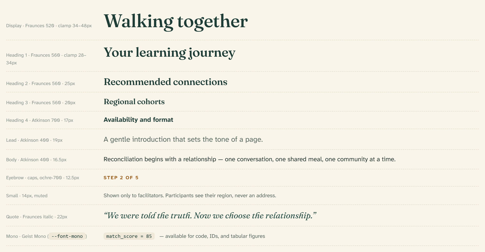

# Typography

Two typefaces divide the work: **Fraunces** carries the voice — warm, human,
a little old-growth — and **Atkinson Hyperlegible** carries the reading.
Atkinson was designed by the Braille Institute for maximum legibility and was
chosen because accessibility is a stated goal of this platform, not an
afterthought.

## Typefaces

| Face | Loaded as | Used for |
| --- | --- | --- |
| Fraunces (variable) | `--font-fraunces` / `font-heading` | Display, H1–H3, quotes, stat numbers |
| Atkinson Hyperlegible Next | `--font-atkinson` / `font-sans` | Body, H4, labels, buttons — everything read at length |
| Geist Mono | `--font-geist-mono` / `font-mono` | Code, IDs, tabular figures |

All three load through `next/font/google` in `src/app/layout.tsx`, which
exposes them as the CSS variables above. Fraunces headings render at weight
**560**; the display face steps down to **520** for a softer large-size look.

## Type scale

| Style | Face · weight | Size | Class / element |
| --- | --- | --- | --- |
| Display | Fraunces 520 | clamp 34–48px, lh 1.08 | `.rtr-display` |
| Heading 1 | Fraunces 560 | clamp 28–34px, lh 1.16 | `h1` |
| Heading 2 | Fraunces 560 | 25px | `h2` |
| Heading 3 | Fraunces 560 | 20px | `h3` |
| Heading 4 | Atkinson 700 | 17px | `h4` |
| Lead | Atkinson 400 | 19px, lh 1.55 | `.rtr-lead` |
| Body | Atkinson 400 | 16.5px, lh 1.6 | `body` |
| Eyebrow | Atkinson 700 caps | 12.5px, tracking 0.14em, ochre-700 | `.rtr-eyebrow` |
| Small | Atkinson 400 | 14px, muted | utility |
| Quote | Fraunces italic | 22px | pattern |
| Mono | Geist Mono | 13.5px | `font-mono` |

Headings carry `--heading-foreground` (spruce-800 in light theme) and a
-0.01em letter-spacing.

## Role sizes (Tailwind utilities)

The theme defines five component-role text sizes so controls stay consistent
without repeating raw values:

| Utility | Size | Used by |
| --- | --- | --- |
| `text-action` | 15.5px / lh 1.25 / tracking 0.01em | [Buttons](../components/button.md) |
| `text-card-title` | 17px / lh 1.25 | Card titles, large buttons |
| `text-label` | 15px / lh 1.375 | [Form labels](../components/form-field.md) |
| `text-caption` | 13.5px / lh 1.5 | [Caption badges](../components/badge.md), hints |
| `text-status` | 12.5px / lh 1.25 / tracking 0.02em | [Status pills](../components/badge.md), table headers |

## Rules

- **Fraunces speaks, Atkinson reads.** Anything read at paragraph length is
  Atkinson; Fraunces is reserved for headings, quotes, and the stat numbers
  on facilitator tiles (set in Fraunces for a warmer, less clinical read).
- **Base body is 16.5px** — never smaller for primary content. 14px “small”
  is for secondary notes; 12.5px only for eyebrows, pills, and table headers,
  always bold and tracked.
- **One display line per page.** The display size appears once, on landing
  and section heroes, paired with the [weave](06-brand-and-motifs.md).
- Eyebrows are always uppercase, ochre-700, and sit above the heading they
  introduce — see [Page intro](../components/page-intro.md).
- Line length targets ~60–70 characters; lead paragraphs cap near 44ch on
  dark panels.

## Related

- [Page intro](../components/page-intro.md) — the eyebrow/heading/lead unit
- [Design tokens](02-design-tokens.md) — where the font variables live
- [Accessibility](08-accessibility.md) — why Atkinson Hyperlegible
