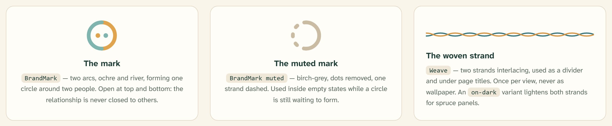
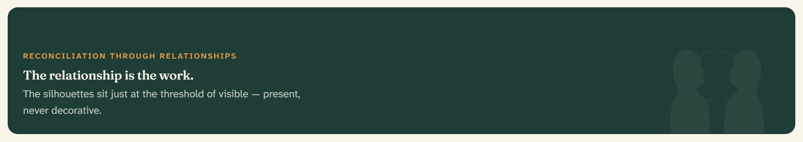

# Brand & motifs

Three motifs make up the brand vocabulary: **the mark** (two arcs forming an
open circle), **the woven strand** (two strands interlacing), and **the
panel-on-dark figure** (two facing silhouettes joined by an open circle). All
three are geometric abstractions of relationship and gathering — see
[Principles](01-principles.md#abstract-not-appropriated) for the rule that
keeps them abstract, and note that final iconography is pending review with
RTR’s Indigenous leadership.

## The mark

Two arcs — ochre and river — form one circle around two dots (two people).
The circle is deliberately **open at top and bottom**: the relationship is
never closed to others.

- Rendered by the [`BrandMark`](../components/rtr-brand.md) component
  (`src/components/rtr-brand.tsx`).
- On-dark surfaces use the lightened strand colors (`#E0A34E` / `#7FB5AE`) so
  the arcs hold against spruce.
- Never recolor, rotate, or close the mark.

## The muted mark

A birch-grey variant with the dots removed and one strand dashed — a circle
still waiting to form. It leads every
[empty state](../components/empty-state.md).

## The woven strand (weave)

Two strands interlacing, used as a divider and under page titles.

- Classes: `.rtr-weave`, with `.rtr-weave-on-dark` lightening both strands
  for spruce panels.
- **Once per view, never as wallpaper.** The weave marks the single most
  important threshold on a page — usually under the
  [page intro](../components/page-intro.md).

## The panel-on-dark figure

A faint figure — two facing profile silhouettes joined by an open circle —
laid behind spruce-800/900 surfaces at **5% opacity**. Present, never
decorative.

- Class: `.rtr-panel-on-dark` (defined in `src/app/globals.css`).
- Appears on the landing hero, the signup aside, and the
  [footer](../components/app-footer.md).
- Tune per panel with `--rtr-figure-position` and `--rtr-figure-size`; keep
  the figure rising from the bottom edge with open space around it.
- Never raise the opacity — at the threshold of visible is the design.

## Usage rules

| Motif | Do | Don’t |
| --- | --- | --- |
| Mark | Header, footer, favicons, empty states (muted) | Watermark content, use as a bullet |
| Weave | Once, under the page’s main title or one divider | Repeat, tile, or animate |
| Figure | Large spruce panels with open space | Light backgrounds, small cards, >5% opacity |

## Related

- [RTR brand](../components/rtr-brand.md) — the component API
- [Empty state](../components/empty-state.md) — the muted mark in use
- [App footer](../components/app-footer.md) — figure and weave together
