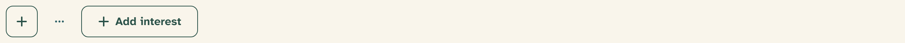

# Iconography

Icons come from **[Lucide](https://lucide.dev)** (`lucide-react`) — a single
consistent family of 2px-stroke outline icons. Icons support text; they never
replace it except in labeled icon buttons.

## Sizes

Components size icons automatically; don’t set explicit sizes unless you are
outside a component context.

| Context | Size | Mechanism |
| --- | --- | --- |
| Buttons (default, lg) | 16px | `[&_svg]:size-4` in [Button](../components/button.md) |
| Buttons (sm, icon-sm) | 14px | `size-3.5` override |
| Buttons (xs, icon-xs) | 12px | `size-3` override |
| Menu items, tabs, alerts | 16px | component styles |
| Notification bell | 20px | [App header](../components/app-header.md) |
| Empty-state mark | 56px | the [muted brand mark](06-brand-and-motifs.md), not a Lucide icon |

Stroke stays at Lucide’s default 2px (2.2px in toast icons for legibility at
small sizes). Icons inherit `currentColor`.

## Semantic assignments

Certain meanings always use the same icon, so the product speaks one visual
language:

| Meaning | Lucide icon | Where |
| --- | --- | --- |
| Success | `CircleCheck` | [Toasts](../components/toast.md) |
| Information | `Info` | Toasts, [tooltip](../components/tooltip.md) triggers |
| Warning | `TriangleAlert` | Toasts |
| Error | `OctagonX` | Toasts |
| Loading | `Loader2` (spinning) | Toasts, buttons |
| Connection request | `Heart` | [Notifications](../components/notification-center.md), connect actions |
| Match approved | `CheckCircle2` | Notifications |
| New message | `MessageCircle` | Notifications, [tabs](../components/tabs.md) |
| Call scheduled | `Video` | Notifications |
| Notifications | `Bell` | App header |
| People / participants | `Users` | Tabs, facilitator views |
| Forward / drill in | `ChevronRight` | [List rows](../components/list-row.md) |
| Sign out | `LogOut` | [Dropdown menu](../components/dropdown-menu.md), rendered in berry |

Toast icons are tinted **ochre** on the dark toast surface regardless of
type; the words carry the meaning.

## Rules

- Icons are decorative by default: mark them `aria-hidden="true"` and put the
  meaning in text.
- Icon-only buttons require an `aria-label` — see
  [Button](../components/button.md#icon-buttons).
- Don’t introduce a second icon family or filled variants; if Lucide lacks a
  glyph, prefer text.
- Cultural imagery is out of scope for icons entirely — see
  [Principles](01-principles.md#abstract-not-appropriated).

## Related

- [Button](../components/button.md) — icon sizing inside controls
- [Notification center](../components/notification-center.md) — the type icons in use
