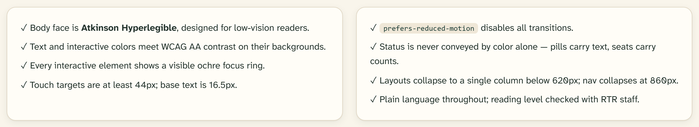

# Accessibility

Accessibility is a stated goal of the platform. These commitments are design
constraints — components are built so screens can’t easily violate them.

## The commitments

1. **The body face is Atkinson Hyperlegible**, designed by the Braille
   Institute for low-vision readers — see [Typography](04-typography.md).
2. **Text and interactive colors meet WCAG AA contrast** on their actual
   backgrounds (birch, parchment, spruce).
3. **Every interactive element shows a visible focus ring** — 2px ochre
   (`--ring`, ochre-600) with 2px offset, via `:focus-visible`. No component
   removes it.
4. **Touch targets are at least 44px**; base text is 16.5px. The 36px small
   size is reserved for dense facilitator rows.
5. **`prefers-reduced-motion` disables all transitions** globally
   (`src/app/globals.css`), collapsing every animation to 0.01ms.
6. **Status is never conveyed by color alone** — [pills](../components/badge.md)
   carry text, [cohort seats](../components/cohort-circle.md) carry counts,
   [alerts](../components/alert.md) lead with a bolded sentence.
7. **Layouts collapse to a single column below 620px**; navigation collapses
   into the [sheet](../components/sheet.md) at 860px. Nothing requires
   horizontal scrolling except tables, which scroll inside their own frame.
8. **Plain language throughout**; reading level is checked with RTR staff.

## Keyboard and screen-reader behavior

Interactive components are built on **Base UI** primitives
(`@base-ui/react`), which provide focus management, typeahead, arrow-key
navigation, and correct ARIA semantics:

| Component | Behavior it inherits |
| --- | --- |
| [Dialog](../components/dialog.md) | Focus trap, `Esc` to close, `aria-labelledby`/`aria-describedby` wiring |
| [Dropdown menu](../components/dropdown-menu.md) | `role="menu"`, arrow keys, typeahead, `Esc` |
| [Select](../components/select.md) | Listbox semantics, keyboard selection |
| [Tabs](../components/tabs.md) | `role="tablist"`, arrow-key switching |
| [Switch](../components/switch.md) / [Checkbox](../components/checkbox.md) / [Radio group](../components/radio-group.md) | Native-equivalent semantics and key handling |
| [Tooltip](../components/tooltip.md) | Opens on focus as well as hover |

Component-level rules that keep it working:

- Icon-only buttons always carry `aria-label`.
- Decorative icons and motifs are `aria-hidden="true"`; screenshots in docs
  and specimen figures carry descriptive alt text.
- The current nav item is marked `aria-current="page"`.
- Form controls are always wrapped in a
  [form field](../components/form-field.md) with a real `<label
  for>`; errors are announced next to their field, not only in a summary.
- Live confirmations use [toasts](../components/toast.md), which Sonner
  announces politely; anything the user must not miss is an inline
  [alert](../components/alert.md) instead.

## Testing expectations

- New UI is keyboard-walked (tab order, `Esc`, arrows) before merge.
- Contrast is checked whenever a new color pairing is introduced — pairings
  outside this system’s [documented roles](03-color.md) need a manual check.
- The boundary test suite exercises component contracts; visual states are
  covered by the specimen catalog (`docs/mocks/design-system.html`).

## Related

- [Typography](04-typography.md) · [Color](03-color.md) ·
  [Principles](01-principles.md)
