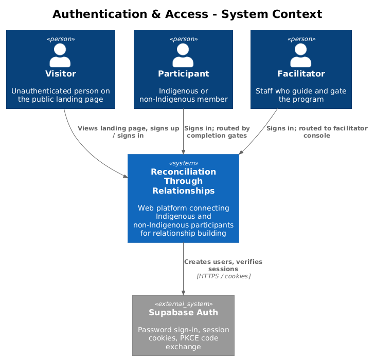
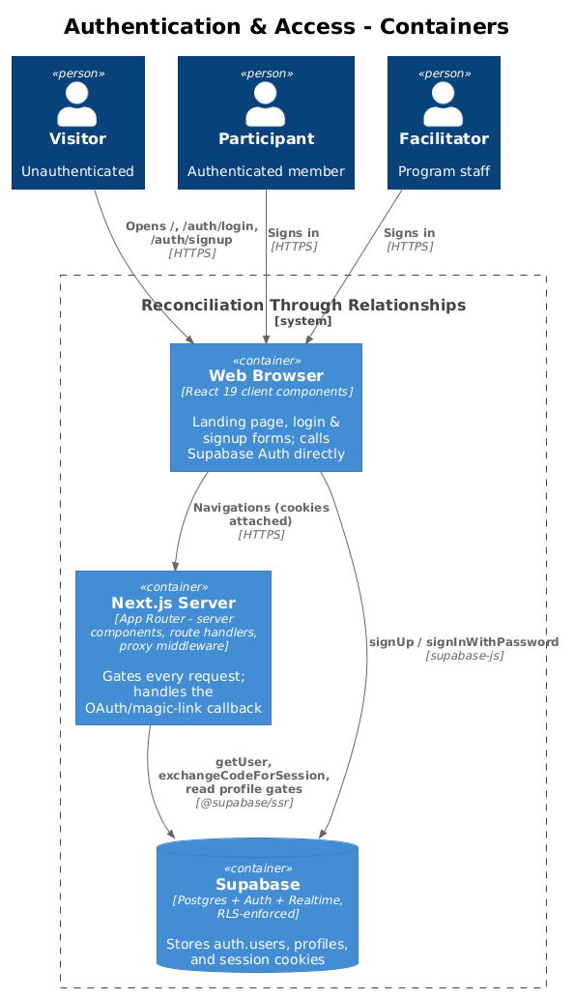
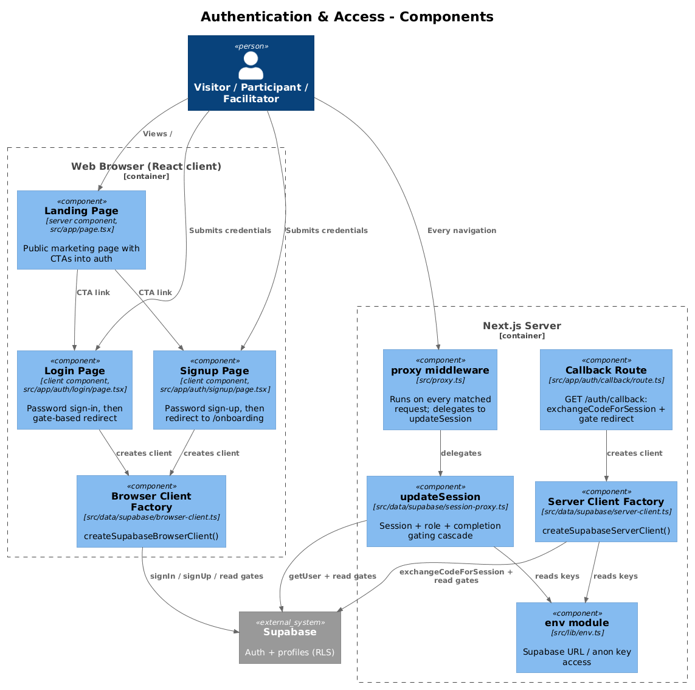
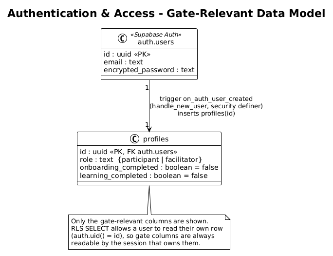
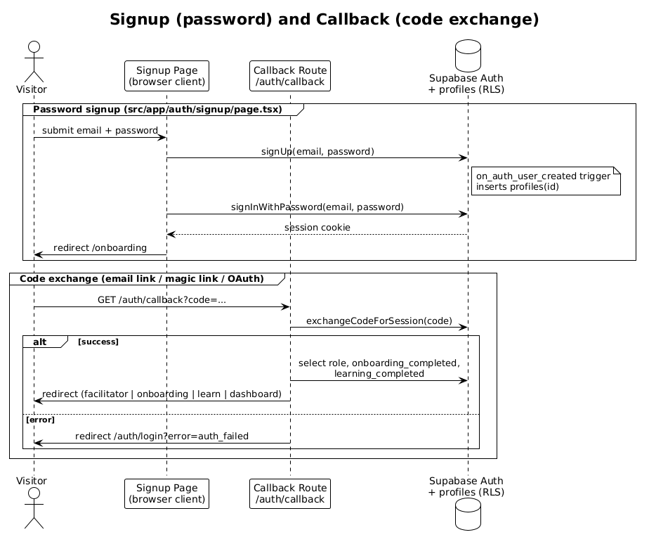
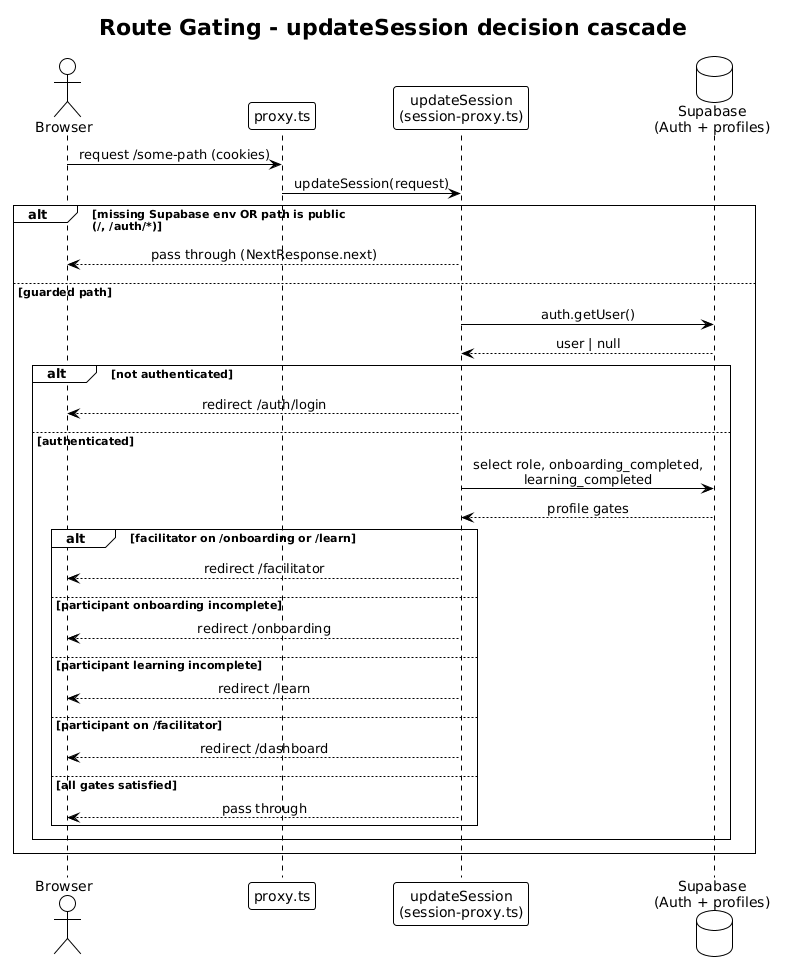

# Authentication & Access — Detailed Design

## 1. Overview

This feature covers everything a person touches before they are inside the authenticated app: the public landing page, sign-up, sign-in, the OAuth/magic-link code exchange, and the middleware that gates every subsequent request by session, role, and program-completion state.

The public landing page (`src/app/page.tsx`) is a static server component — RTR's marketing page. It renders the value proposition, the four-step journey, and success stories, with call-to-action links into `/auth/signup` ("Join RTR", "Begin your journey") and `/auth/login` ("Sign in"). It reads no data and performs no auth; it exists only to funnel Visitors into the two auth forms.

Sign-up and sign-in are **client components** that talk to Supabase Auth directly from the browser via `createSupabaseBrowserClient`. Sign-up calls `signUp` then immediately `signInWithPassword` (so a session cookie exists right away), and redirects to `/onboarding`. Sign-in calls `signInWithPassword`, reads the caller's own profile gate columns, and redirects accordingly. Both forms use **email + password** — the app's own UI does not initiate OAuth or magic-link flows.

The **code-exchange callback** (`src/app/auth/callback/route.ts`) is a route handler that exchanges a `?code` query parameter for a session using `exchangeCodeForSession`. This is the PKCE landing point for email-confirmation links, magic links, or OAuth providers. The current password forms never redirect through it, but it is wired and functional should Supabase be configured to email such a link.

The **gating middleware** is the load-bearing piece. `src/proxy.ts` (this Next.js version names middleware `proxy`, not `middleware`) runs on every matched request and delegates to `updateSession` in `src/data/supabase/session-proxy.ts`. `updateSession` refreshes the Supabase session cookie and runs a decision cascade: public routes pass, missing env passes (mock-data dev mode), unauthenticated requests redirect to `/auth/login`, facilitators bypass participant gates (and are pushed out of `/onboarding` and `/learn`), participants are held at `/onboarding` until onboarding is complete and then at `/learn` until learning is complete, and `/facilitator` is blocked for participants.

The same gate cascade (facilitator → onboarding → learning → dashboard) is intentionally **duplicated in three places**: `updateSession` (per-request routing), the callback route (post-code-exchange landing), and the login page's `handleSubmit` (post-password-login landing). They must be kept in sync by hand.

## 2. Architecture

### 2.1 C4 Context Diagram

### 2.2 C4 Container Diagram

### 2.3 C4 Component Diagram

## 3. Component Details

### 3.1 Landing Page (`src/app/page.tsx`)
- **Responsibility:** Public marketing entry point. Presents the program and routes Visitors into auth.
- **Interfaces:** Default-exported server component `LandingPage`. No props, no data fetching. Renders `<Link>` CTAs to `/auth/signup` and `/auth/login`.
- **Dependencies:** `AppHeader`, `AppFooter`, `Weave`/brand components, shadcn/Base UI primitives (`Button`, `Badge`, `Avatar`). No Supabase.
- **Data touched:** None.

### 3.2 Login Page (`src/app/auth/login/page.tsx`)
- **Responsibility:** Password sign-in and gate-based redirect for returning users.
- **Interfaces:** `"use client"` component `LoginPage`. Form fields `email`, `password` (with show/hide toggle). `handleSubmit` runs the auth call and redirect.
- **Dependencies:** `createSupabaseBrowserClient`, `useRouter`, `sonner` toasts for error surfacing.
- **Data touched:** `supabase.auth.signInWithPassword`; then reads own `profiles` row (`role, onboarding_completed, learning_completed`) to choose `/facilitator`, `/onboarding`, `/learn`, or `/dashboard`.

### 3.3 Signup Page (`src/app/auth/signup/page.tsx`)
- **Responsibility:** Account creation, then immediate sign-in and redirect to onboarding.
- **Interfaces:** `"use client"` component `SignupPage`. Fields `email`, `password`, `confirm`. Client-side validation: password ≥ 8 chars and `password === confirm` (enforced with toasts before any network call).
- **Dependencies:** `createSupabaseBrowserClient`, `useRouter`, `sonner`, RTR brand components.
- **Data touched:** `supabase.auth.signUp({ email, password })` (the `on_auth_user_created` trigger auto-inserts the `profiles` row), then `signInWithPassword` to establish a session, then `router.push("/onboarding")`. If the immediate sign-in fails (e.g. email confirmation is required), it toasts "Account created — please sign in." and redirects to `/auth/login`.

### 3.4 Callback Route (`src/app/auth/callback/route.ts`)
- **Responsibility:** Exchange an auth `code` for a session and land the user at the right gate.
- **Interfaces:** `GET(request)` route handler at `/auth/callback`. Reads `code` and `origin` from the request URL.
- **Dependencies:** `createSupabaseServerClient`, `next/server` `NextResponse`.
- **Data touched:** `supabase.auth.exchangeCodeForSession(code)`; on success reads own `profiles` gates and redirects to `/facilitator`, `/onboarding`, `/learn`, or `/dashboard`. On missing/invalid code or exchange error, redirects to `/auth/login?error=auth_failed`.

### 3.5 proxy middleware (`src/proxy.ts`)
- **Responsibility:** Entry point Next.js invokes for every matched request; delegates to `updateSession`.
- **Interfaces:** `export async function proxy(request)` and a `config.matcher` that excludes `_next/static`, `_next/image`, `favicon.ico`, and common image extensions.
- **Dependencies:** `updateSession`.
- **Data touched:** None directly.

### 3.6 updateSession (`src/data/supabase/session-proxy.ts`)
- **Responsibility:** Session-cookie refresh plus the session/role/completion gating cascade.
- **Interfaces:** `export async function updateSession(request): Promise<NextResponse>`. Returns either a pass-through `NextResponse.next({ request })` (with refreshed cookies) or a `NextResponse.redirect`.
- **Dependencies:** `@supabase/ssr` `createServerClient`, `env`, `next/server`.
- **Data touched:** `supabase.auth.getUser()`; reads own `profiles` gate columns. Cookie read/write is wired through `request.cookies` and the response cookies so the refreshed session propagates.

### 3.7 Supabase client factories (`browser-client.ts`, `server-client.ts`)
- **Responsibility:** Construct correctly-configured Supabase clients for each runtime.
- **Interfaces:** `createSupabaseBrowserClient()` (browser, `createBrowserClient`); `createSupabaseServerClient()` (server, `createServerClient`, async because it awaits `cookies()` from `next/headers` and wires `getAll`/`setAll`). The server factory swallows cookie-set errors when called from a server component, relying on the proxy to refresh.
- **Dependencies:** `@supabase/ssr`, `env`, `database.types`.
- **Data touched:** None; they only produce typed clients.

### 3.8 env module (`src/lib/env.ts`)
- **Responsibility:** Single point of access to Supabase config and data-source mode.
- **Interfaces:** `env` object (`dataSource`, `supabaseUrl`, `supabaseAnonKey`) and `assertSupabaseEnv()`. `supabaseUrl`/`supabaseAnonKey` default to `""` when unset — that empty state is what `updateSession` checks to short-circuit into mock mode.
- **Dependencies:** `process.env`.
- **Data touched:** None.

## 4. Data Model

### 4.1 Class Diagram

### 4.2 Entity Descriptions

**`auth.users`** (Supabase-managed, external to the app schema): the identity record created by `signUp`. Holds `id`, `email`, and the encrypted password. This feature never writes it directly — Supabase Auth owns it.

**`profiles`** (`public.profiles`, defined in `supabase/migrations/001_initial_schema.sql`): the application row keyed by `id` (FK to `auth.users(id)`, `on delete cascade`). Only four columns matter to auth/access:
- `role` — `'participant'` (default) or `'facilitator'`; decides which branch of the gating cascade a user follows.
- `onboarding_completed` — boolean, default `false`; participants are held at `/onboarding` until this is `true`.
- `learning_completed` — boolean, default `false`; participants are held at `/learn` until this is `true`.
- `id` — the join key and the subject of the "read your own row" RLS check.

The row is created automatically: the `handle_new_user()` trigger (`security definer`) fires `after insert on auth.users` and inserts `profiles (id)` with all defaults. So every account starts as a participant with both gates `false` — which is exactly why a brand-new user is routed straight to `/onboarding`.

## 5. Key Workflows

### 5.1 Signup (password) and Callback (code exchange)

Password signup:
1. Visitor submits email + password on `/auth/signup`; client validates length and match.
2. `signUp(email, password)` creates the `auth.users` record; the DB trigger inserts the `profiles` row.
3. `signInWithPassword(email, password)` establishes a session cookie.
4. Redirect to `/onboarding` (a fresh participant always has `onboarding_completed = false`).

Code exchange (email-confirmation / magic-link / OAuth landing):
1. Provider redirects the browser to `GET /auth/callback?code=...`.
2. `exchangeCodeForSession(code)` establishes the session.
3. On success, read own `profiles` gates and redirect to `/facilitator`, `/onboarding`, `/learn`, or `/dashboard`.
4. On error or missing code, redirect to `/auth/login?error=auth_failed`.

### 5.2 Route Gating

Every matched request flows through `proxy` → `updateSession`, which decides pass-through vs. redirect:
1. If Supabase env is missing, or the path is public (`/`, anything under `/auth/`), pass through.
2. Otherwise call `auth.getUser()`. If there is no user, redirect to `/auth/login`.
3. Read the caller's own `profiles` gates. If the row is missing, pass through.
4. Facilitators bypass participant gates, but are redirected to `/facilitator` if they land on `/onboarding` or `/learn`.
5. Participants with `onboarding_completed = false` are redirected to `/onboarding`; once onboarding is done but `learning_completed = false`, to `/learn`.
6. Participants hitting any `/facilitator` route are redirected to `/dashboard`.
7. All gates satisfied → pass through with refreshed session cookies.

## 6. API Contracts

This feature exposes one HTTP endpoint of its own and otherwise consumes Supabase Auth and the `profiles` table.

**HTTP:** `GET /auth/callback?code=<string>` → `302` redirect. Success lands on a gate-appropriate app route; failure lands on `/auth/login?error=auth_failed`. No request body; no JSON response.

**Supabase Auth calls** (browser and server clients):
| Operation | Where | Notes |
|---|---|---|
| `auth.signUp({ email, password })` | signup page | Creates `auth.users`; trigger creates `profiles`. |
| `auth.signInWithPassword({ email, password })` | login page, signup page | Sets session cookie. |
| `auth.getUser()` | `updateSession` | Verifies the session on every guarded request. |
| `auth.exchangeCodeForSession(code)` | callback route | PKCE code → session. |

**`profiles` read contract** (identical in all three gate sites):
- Operation: `select('role, onboarding_completed, learning_completed').eq('id', user.id).single()`
- Table: `public.profiles`
- Payload: reads three columns for the authenticated user's own row.
- RLS gate: the "Users can view approved participants" SELECT policy — satisfied here by the `auth.uid() = id` clause (a user may always read their own row).

## 7. Security Considerations

**Cookie-based sessions.** Sessions are HTTP cookies managed by `@supabase/ssr`. `updateSession` re-issues them on every request via the `getAll`/`setAll` cookie wiring, keeping the access token fresh. `auth.getUser()` (not just reading the cookie) is used to validate the session server-side before any gating decision.

**RLS is the real enforcement; middleware is UX routing.** The `updateSession` cascade only decides which URL a browser lands on — it does not protect data. Every table read/write is enforced by Postgres RLS regardless of how the user navigated. Relevant `profiles` policies from migration `001_initial_schema.sql`:
- **SELECT** ("Users can view approved participants"): `auth.uid() = id OR role = 'facilitator' OR (learning_completed = true AND onboarding_completed = true)`. For this feature the operative clause is `auth.uid() = id` — every session can read its own gate columns, which is what all three gate sites depend on. A participant cannot read another not-yet-approved participant's row.
- **UPDATE** ("Users can update own profile"): `auth.uid() = id` — a user can only modify their own profile (so a participant cannot self-promote another user or flip someone else's gates).
- **INSERT** ("Profile created on signup"): `with check (auth.uid() = id)`. Note the actual row creation is done by the `handle_new_user()` `security definer` trigger, which runs with elevated rights and is not subject to this policy.

**Open redirect.** The callback route builds every redirect from the request's own `origin` plus a fixed internal path (`/facilitator`, `/onboarding`, `/learn`, `/dashboard`, or `/auth/login`). It does **not** read a user-supplied `next`/`redirectTo` parameter, so there is no open-redirect surface here.

**Fail-open in mock mode.** When Supabase env vars are absent, `updateSession` passes every request through with no auth. This is deliberate for the documented mock-data dev mode, but it means the middleware provides zero protection without env configured — acceptable only because RLS (and the absence of a real backend) is the actual boundary.

**Client-trusted role read.** The login/signup redirects trust a client-side read of `role`. Because this only chooses a landing URL and the destination pages are themselves gated by `updateSession` and protected by RLS, a tampered client cannot gain facilitator data — at worst it lands on a page that then redirects or returns nothing.

## 8. Open Questions

- **`/auth/verify` has no route.** `updateSession`'s `publicRoutes` array lists `/auth/verify`, but there is no `src/app/auth/verify/` page or handler (only `login`, `signup`, and `callback` exist). It is a harmless dead entry today — flagging in case a verify page was intended.
- **Triplicated gate cascade.** The facilitator → onboarding → learning → dashboard order lives in `updateSession`, the callback route, and the login page's `handleSubmit`. There is no shared helper, so the three can drift.
- **Email-confirmation assumption.** Signup calls `signInWithPassword` immediately after `signUp`. This succeeds only if Supabase email confirmation is disabled (auto-confirm). With confirmation on, the immediate sign-in fails and the user is sent to `/auth/login` — the callback route is the path that would then complete confirmation, but no UI currently sends the user there.

---
Related: [`../02-onboarding/README.md`](../02-onboarding/README.md) (the `/onboarding` gate target), [`../03-learning-journey/README.md`](../03-learning-journey/README.md) (the `/learn` gate target), [`../07-facilitator-console/README.md`](../07-facilitator-console/README.md) (the `/facilitator` role branch).
