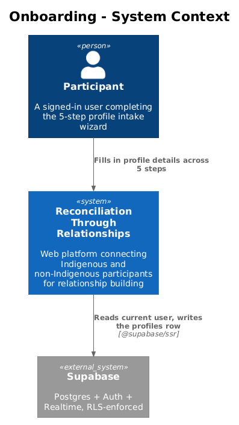
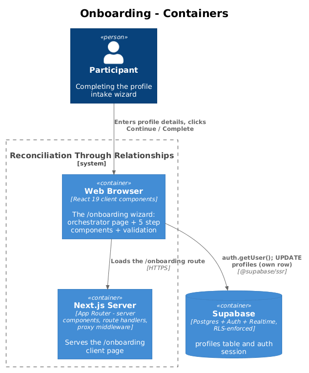
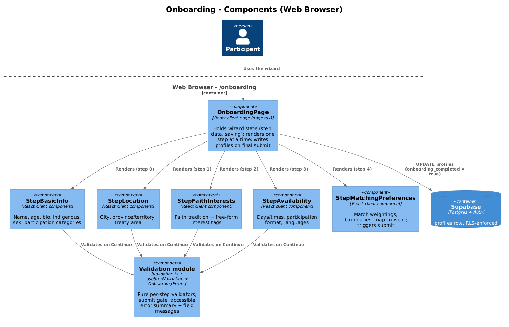
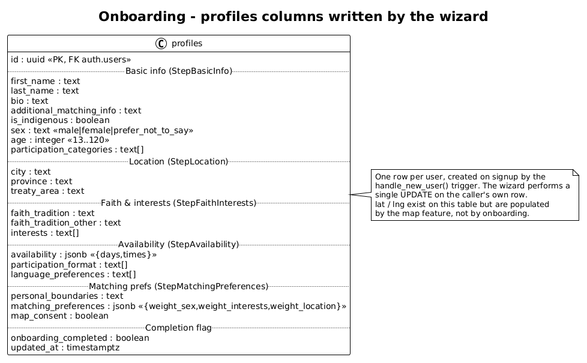
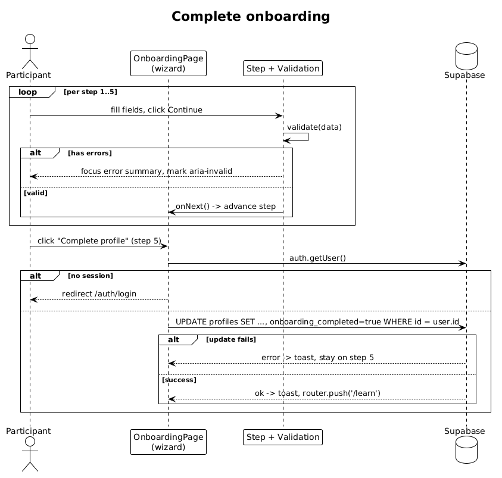

# Onboarding — Detailed Design

## 1. Overview

Onboarding is the five-step profile intake wizard at `/onboarding`. A user who has
signed up but not yet completed their profile lands here, fills in the details the
matching and discovery features depend on, and — on the final step — writes them to
their own `profiles` row and is redirected to the learning journey at `/learn`.

The whole flow is a single React client page (`src/app/onboarding/page.tsx`). It holds
all wizard state in memory, renders one step component at a time, and performs exactly
one Supabase write at the end. There is no server action and no dedicated API route —
the page talks to Supabase directly from the browser using `@supabase/ssr`, and Row
Level Security is the security boundary (see [Section 7](#7-security-considerations)).

The five steps are:

1. **Basic Info** (`StepBasicInfo`) — name, age, bio, Indigenous identity, sex, participation categories
2. **Location & Treaty** (`StepLocation`) — city/town/county, province/territory, nearest treaty area
3. **Faith & Interests** (`StepFaithInterests`) — faith tradition and free-form interest tags
4. **Availability & Format** (`StepAvailability`) — days/times, participation format, language preferences
5. **Matching Preferences** (`StepMatchingPreferences`) — match weightings, personal boundaries, map consent

Each of the first four steps validates its own required fields before advancing; the
fifth submits. Validation is client-side only and exists purely for UX — the database
still enforces its own constraints.

Reaching `/onboarding` (authenticated but incomplete profile) and leaving it for
`/learn` are gated by the proxy middleware documented in
[01 — Auth and Access](../01-auth-and-access/README.md); the destination `/learn` is
covered by [03 — Learning Journey](../03-learning-journey/README.md).

## 2. Architecture

### 2.1 C4 Context Diagram


### 2.2 C4 Container Diagram


### 2.3 C4 Component Diagram


## 3. Component Details

### 3.1 OnboardingPage (`src/app/onboarding/page.tsx`)

- **Responsibility:** Orchestrates the wizard. Owns the `step` index, the aggregated
  `OnboardingData` object, and the `saving` flag. Renders the progress header (a
  `Progress` bar plus step chips) and the current step component, and performs the final
  write to `profiles`. Also renders a "Sign out" control that signs the user out and
  returns to `/auth/login`.
- **Interfaces:** Default-exported client component (`"use client"`). Passes each step a
  slice of props: `data`, `onChange(fields)`, and the navigation callbacks it needs
  (`onNext`, `onBack`, and for step 5 `onSubmit` + `saving`). `updateData` shallow-merges
  partial field updates into state; `next`/`back` clamp the step index.
- **Dependencies:** `createSupabaseBrowserClient` (`src/data/supabase/browser-client.ts`),
  `useRouter` (`next/navigation`), `sonner` `toast`, `Progress` (`src/components/ui/progress`),
  and the five step components under `src/app/onboarding/components/`.
- **Data touched:** Reads the current user via `supabase.auth.getUser()`; writes the
  `profiles` row via `.update(...).eq("id", user.id)`. The `OnboardingData` shape (exported
  from this file) is the source of truth for what each step edits.

### 3.2 Step components (`src/app/onboarding/components/Step*.tsx`)

- **Responsibility:** Each renders the inputs for one step and, on Continue, gates
  advancement on its own validator. `StepMatchingPreferences` is the exception: it has no
  required fields, so instead of a validated form it renders a plain submit button that
  calls `onSubmit`.
- **Interfaces:** Each is a default-exported client component taking `{ data, onChange, ... }`.
  The first four wrap their inputs in a `<form noValidate>` whose submit handler comes from
  `useStepValidation`. Field controls set `aria-invalid` and `aria-describedby` from the
  current error list.
- **Dependencies:** shadcn/Base UI controls from `src/components/ui/*` (`Input`, `Label`,
  `Textarea`, `Checkbox`, `RadioGroup`, `Select`, `Switch`, `Badge`, `Button`), the
  validation module, and `OnboardingErrors`.
- **Data touched:** None directly — steps only read and mutate the in-memory
  `OnboardingData` via `onChange`. Their option lists (participation categories, faith
  traditions, sex, provinces, days, times, formats, languages) are defined **locally in
  each component**, not imported from `src/domain/constants.ts`.

### 3.3 Validation module (`src/app/onboarding/validation.ts`)

- **Responsibility:** Pure, synchronous per-step validators —
  `validateBasicInfo`, `validateLocation`, `validateFaithInterests`, `validateAvailability`
  — each returning an `OnboardingFieldError[]`. A `findError(errors, fieldId)` helper looks
  up a field's error. Step 5 has no validator.
- **Interfaces:** `OnboardingFieldError` is `{ fieldId, errorId, message }` where
  `errorId` is `` `${fieldId}-error` `` — the id the field's `aria-describedby` points at.
- **Dependencies:** Only the `OnboardingData` type; no React, no I/O. This keeps the rules
  fast to unit- and boundary-test.
- **Data touched:** None. Rules of note: age must be an integer 13–120; at least one of
  `indigenous_leader`/`indigenous_individual`/`non_indigenous_individual` must be selected;
  faith tradition, city, province, at least one participation format, and at least one
  language are required.

### 3.4 useStepValidation (`src/app/onboarding/components/useStepValidation.ts`)

- **Responsibility:** The submit gate shared by the four validated steps. Tracks an
  `attempted` flag, computes the live `errors` list once the user has attempted submit, and
  on submit either calls `onValidSubmit` (advance) or reveals errors and moves focus to the
  error summary.
- **Interfaces:** `useStepValidation({ data, validate, onValidSubmit })` returns
  `{ errors, onSubmit, summaryRef }`. `errors` is empty until the first failed submit, so
  fields don't flag as invalid before the user tries to continue; after that it recomputes
  on every keystroke, letting messages clear as fields are corrected.
- **Dependencies:** React (`useState`, `useRef`), the `OnboardingFieldError` type.
- **Data touched:** None.

### 3.5 OnboardingErrors (`src/app/onboarding/components/OnboardingErrors.tsx`)

- **Responsibility:** Accessibility surface for validation. `ErrorSummary` renders a
  focusable `role="alert"` box listing each error as an in-page anchor (`#<fieldId>`);
  `FieldErrorMessage` renders the per-field message with the matching `errorId`.
- **Interfaces:** `ErrorSummary({ errors, summaryRef })` and `FieldErrorMessage({ error })`.
  The heading pluralises ("Please fix N error(s) to continue"). Anchors let a keyboard user
  jump from the summary straight to the offending field, which then receives focus.
- **Dependencies:** `Alert`/`AlertTitle`/`AlertDescription` (`src/components/ui/alert`).
- **Data touched:** None.

## 4. Data Model

### 4.1 Class Diagram


### 4.2 Entity Descriptions

**profiles** — one row per user, primary key `id` referencing `auth.users(id)`. The row is
created empty at signup by the `handle_new_user()` trigger (see migration `001`); onboarding
is the first place most columns get populated. The wizard issues a single `UPDATE` against
the caller's own row, setting every column below plus `updated_at` (the `profiles_updated_at`
trigger also refreshes `updated_at` on any update):

- **Basic info:** `first_name`, `last_name`, `bio`, `additional_matching_info` (text);
  `is_indigenous` (boolean); `sex` (text, constrained to `male` / `female` /
  `prefer_not_to_say`); `age` (integer, DB check `13..120`, added in migration
  `006_add_age_to_profiles.sql`); `participation_categories` (`text[]`).
- **Location:** `city`, `province`, `treaty_area` (text). `province` holds the full name
  (e.g. "Saskatchewan"), matching the wizard's select options.
- **Faith & interests:** `faith_tradition` (text, DB-constrained to a fixed set including
  `prefer_not_to_say`), `faith_tradition_other` (text, shown only when `other` is chosen),
  `interests` (`text[]`, lower-cased free-form tags).
- **Availability:** `availability` (`jsonb`, shape `{ days: string[], times: string[] }`),
  `participation_format` (`text[]`), `language_preferences` (`text[]`).
- **Matching preferences:** `personal_boundaries` (text), `matching_preferences` (`jsonb`,
  shape `{ weight_sex, weight_interests, weight_location }` booleans), `map_consent`
  (boolean — opt-in to appear on the regional map).
- **Completion flag:** `onboarding_completed` (boolean) — flipped to `true` by this write,
  which is what lets the proxy middleware and downstream RLS treat the profile as ready.

`lat` and `lng` exist on `profiles` but are **not** written by onboarding; they are
populated by the regional-map feature ([08 — Regional Map and Cohorts](../08-regional-map-and-cohorts/README.md)).

## 5. Key Workflows

### 5.1 Complete onboarding

1. The wizard renders step 0 (`StepBasicInfo`) with an empty `OnboardingData`.
2. **Per step (1–5):** the user edits fields (each edit calls `onChange`, merging into the
   page's `data` state). On Continue, `useStepValidation` runs that step's validator. If it
   returns errors, the `ErrorSummary` is revealed and focused and the offending fields get
   `aria-invalid`; otherwise `onNext` advances the step. `Back` returns to the prior step
   with all previously entered values intact (state lives in the page, not the steps).
3. On step 5 the user clicks **Complete profile**, which calls the page's `submit()`.
4. `submit()` sets `saving`, then calls `supabase.auth.getUser()`. If there is no user it
   toasts "Session expired. Please sign in again." and redirects to `/auth/login`.
5. Otherwise it issues `UPDATE profiles SET ...all fields..., onboarding_completed = true,
   updated_at = now() WHERE id = user.id`.
6. On error it toasts "Something went wrong. Please try again.", clears `saving`, and stays
   on step 5 so the user can retry. On success it toasts "Profile saved! Let's start your
   learning journey." and `router.push("/learn")`.



## 6. API Contracts

Onboarding exposes no HTTP API of its own. Its contract is two client-side Supabase
operations from `page.tsx`, both against the caller's own session/row:

| Operation | Target | Payload / filter | RLS gate |
|---|---|---|---|
| `auth.getUser()` | Supabase Auth | — (reads current session cookie) | Session must exist; else redirect to login |
| `.from("profiles").update({...}).eq("id", user.id)` | `public.profiles` | All columns in [Section 4.2](#42-entity-descriptions) + `onboarding_completed: true`, `updated_at` | `"Users can update own profile"` — `auth.uid() = id` |

The update payload mirrors the exported `OnboardingData` type field-for-field. Column
values are DB-constrained (`sex`, `faith_tradition`, `age` range); the client casts
`sex` and `faith_tradition` to their union types before sending. Steps' local option
values must stay within those constraints.

## 7. Security Considerations

- **RLS is the real gate.** The only mutation is a client-side `UPDATE` on `profiles`.
  Migration `001` defines the governing policy:

  ```sql
  create policy "Users can update own profile"
    on public.profiles for update
    using (auth.uid() = id);
  ```

  A user can therefore only update their own row; the `.eq("id", user.id)` filter matches
  the policy, and even a tampered client could not update someone else's profile because
  the policy's `USING (auth.uid() = id)` clause rejects it server-side. The row itself was
  created by the `"Profile created on signup"` insert policy (`with check (auth.uid() = id)`)
  via the signup trigger, so onboarding never inserts — it only updates.

- **Client-side validation is UX only.** `validation.ts` and `useStepValidation` improve
  the form experience but are not a security control. The database's own `CHECK`
  constraints (`sex`, `faith_tradition`, `age` 13–120) are the authoritative guard on the
  values that land in the column.

- **Consent is explicit and opt-in.** `map_consent` defaults to `false` and only the user
  can set it (same RLS row-ownership rule). Nothing in onboarding writes location
  coordinates, so completing the wizard does not by itself place a user on the map.

- **Session freshness.** `submit()` re-fetches the user immediately before writing, so an
  expired session fails closed (redirect to login) rather than attempting an unauthenticated
  write.

## 8. Open Questions

- `src/components/journey-stepper.tsx` (`JourneyStepper`) reads as onboarding-related
  (a step indicator with `rtr-stepper` styling) but is not referenced at runtime — the
  wizard's progress header renders its own inline step chips in `page.tsx`.
