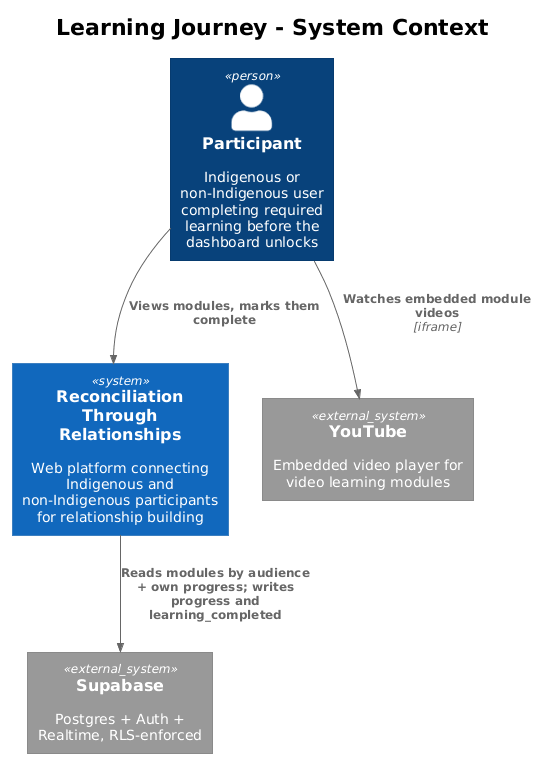
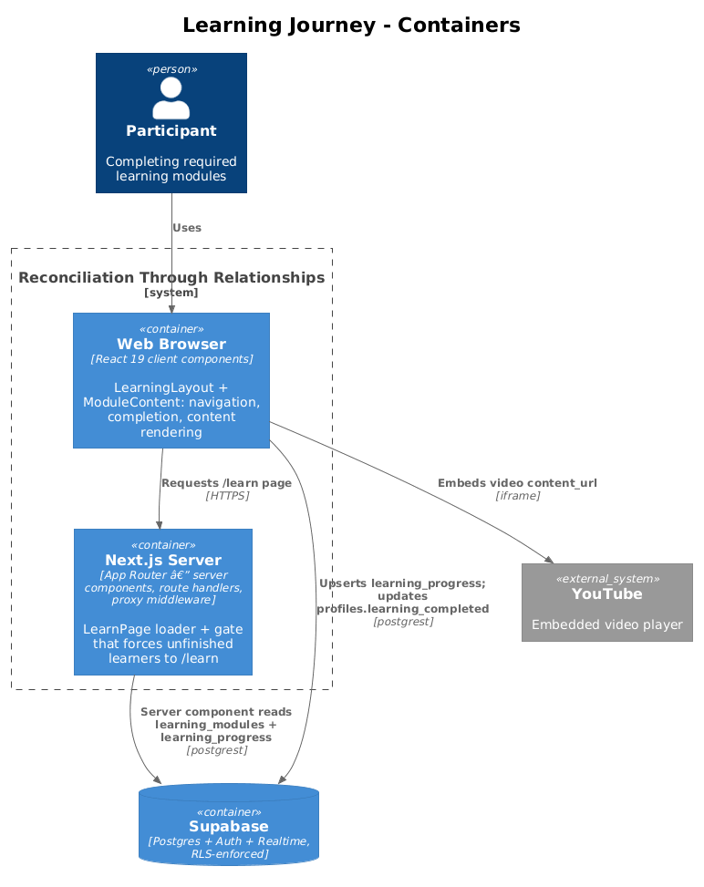
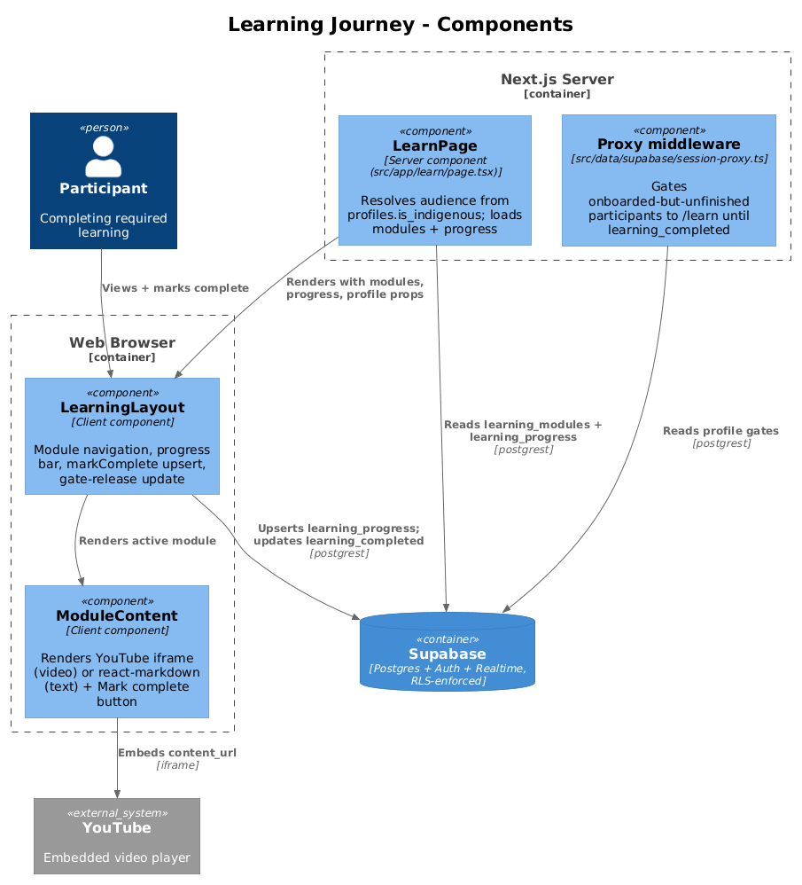
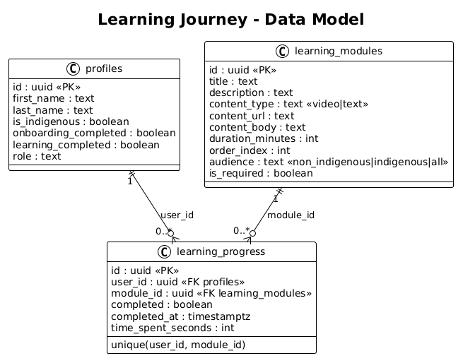
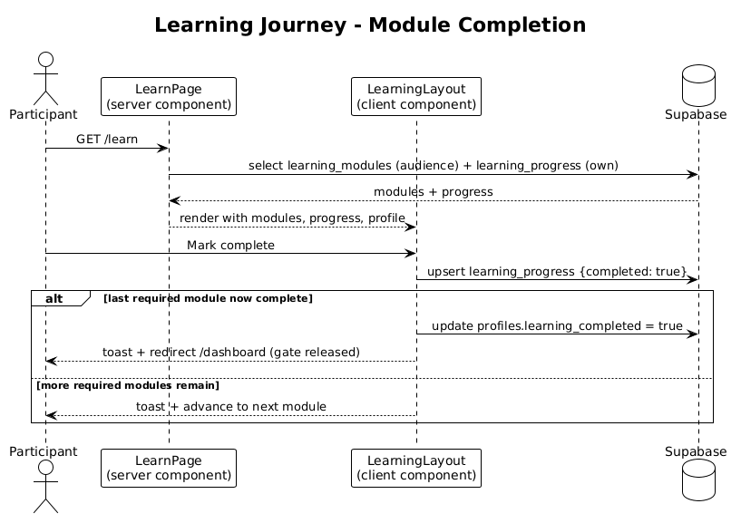

# Learning Journey — Detailed Design

## 1. Overview

The Learning Journey is the required education step every participant completes after onboarding and before the participant dashboard unlocks. It lives at `/learn` and is the second of the two participant completion gates enforced by the proxy middleware (onboarding is the first; see [../02-onboarding/README.md](../02-onboarding/README.md)).

A participant sees a track of learning modules chosen for their audience — Indigenous, non-Indigenous, or shared. Each module is either an embedded video (a YouTube iframe) or Markdown text. As the participant marks modules complete, their progress is recorded per module. When the last **required** module is completed, the participant's `profiles.learning_completed` flag is set to `true`, which releases the middleware gate and forwards them to `/dashboard`.

The feature is built from three files plus the middleware gate:

- `src/app/learn/page.tsx` — server component that resolves the participant's audience and loads modules + progress.
- `src/app/learn/components/LearningLayout.tsx` — client component that drives navigation, progress display, completion writes, and the gate-release update.
- `src/app/learn/components/ModuleContent.tsx` — client component that renders a module's video or text and the "Mark complete" control.
- `src/data/supabase/session-proxy.ts` — proxy middleware that forces onboarded-but-unfinished participants back to `/learn`.

Consistent with the platform's security model, the completion writes are **client-side Supabase calls** from `LearningLayout` (there are no server actions); Postgres Row-Level Security governs what each write may touch.

## 2. Architecture

### 2.1 C4 Context Diagram


The participant interacts with the Reconciliation Through Relationships platform, which reads modules and progress from Supabase and writes back completion state. Video modules embed a YouTube player directly in the participant's browser.

### 2.2 C4 Container Diagram


The `/learn` page is loaded by the Next.js server (a server component reads modules and progress with the participant's cookie session). The React client components then perform completion writes directly against Supabase, and video modules embed content from YouTube via an iframe.

### 2.3 C4 Component Diagram


## 3. Component Details

### 3.1 LearnPage — `src/app/learn/page.tsx`

- **Responsibility:** Server-side data loader and access guard for the learning journey. Resolves the audience, loads the module track and the participant's progress, and hands them to the client layout.
- **Interfaces:** Default-exported async React server component for the `/learn` route. No props; reads the authenticated user from the Supabase cookie session.
- **Behavior:**
  - Calls `supabase.auth.getUser()`; redirects to `/auth/login` if there is no user.
  - Selects `is_indigenous, learning_completed, first_name, last_name` from `profiles` for the user; redirects to `/onboarding` if no profile row exists.
  - Derives `audience = profile.is_indigenous ? "indigenous" : "non_indigenous"`.
  - Loads `learning_modules` filtered `.or("audience.eq.{audience},audience.eq.all")` and ordered by `order_index`.
  - Loads `learning_progress` filtered `.eq("user_id", user.id)`.
  - Renders `LearningLayout` with `modules`, `progress`, `userId`, `isIndigenous`, and a `profile` slice. It intentionally does **not** redirect away when `learning_completed` is already `true` — participants may revisit modules.
- **Dependencies:** `createSupabaseServerClient` (`src/data/supabase/server-client.ts`), `next/navigation` `redirect`, `LearningLayout`.
- **Data touched:** reads `profiles`, `learning_modules`, `learning_progress`.

### 3.2 LearningLayout — `src/app/learn/components/LearningLayout.tsx`

- **Responsibility:** Client-side controller for the journey — module navigation, progress bar, per-module completion, and the release of the dashboard gate.
- **Interfaces:** `"use client"` component with props `{ modules, progress, userId, isIndigenous, profile }`. Renders a header (progress bar + account menu), a module sidebar, and `ModuleContent` for the active module.
- **Behavior:**
  - Seeds `activeModuleId` to the first module without a completed progress row, falling back to the first module.
  - Holds `localProgress` in state so the UI updates optimistically after a write.
  - `markComplete(moduleId)`: no-op if already completed; otherwise upserts a `learning_progress` row `{ user_id, module_id, completed: true, completed_at, time_spent_seconds: 0 }`. On error it shows the toast `"Failed to save progress. Please try again."` and leaves the module retryable. On success it updates `localProgress`, then checks whether the number of completed required modules now meets `totalRequired`.
    - If all required modules are complete, it updates `profiles.learning_completed = true` for the user, shows `"Learning journey complete! Taking you to your dashboard."`, and routes to `/dashboard` after ~1.5s.
    - Otherwise it shows `"Module complete!"` and advances `activeModuleId` to the next incomplete module.
  - Account menu offers a `Dashboard` link only when `profile.learning_completed`, and a `Sign out` action that calls `supabase.auth.signOut()` and routes to `/auth/login`.
- **Progress math:** `totalRequired` = count of modules with `is_required`; `requiredCompleted` = completed progress rows whose module `is_required`; `overallPercent` and `allComplete` derive from those. Optional modules count toward display but not toward the gate.
- **Dependencies:** `createSupabaseBrowserClient` (`src/data/supabase/browser-client.ts`), `next/navigation` `useRouter`, `sonner` `toast`, shadcn/Base UI components (`Progress`, `Button`, `Badge`, `Avatar`, `DropdownMenu`), `ModuleContent`.
- **Data touched:** writes `learning_progress` (upsert) and `profiles.learning_completed` (update).

### 3.3 ModuleContent — `src/app/learn/components/ModuleContent.tsx`

- **Responsibility:** Renders a single module's content and the completion control.
- **Interfaces:** `"use client"` component with props `{ module, isCompleted, onMarkComplete, completing, allComplete }`.
- **Behavior:**
  - Header shows the content-type badge, duration, and a "Completed" badge when `isCompleted`.
  - For `content_type === "video"` with a `content_url`, renders a 16:9 `<iframe>` pointed at the URL (the seeded video URLs are YouTube `embed` links).
  - For `content_type === "text"` with a `content_body`, renders the Markdown through `react-markdown` with a fixed set of styled element overrides.
  - Shows either a "You've completed this module" confirmation or a "Mark complete" button (disabled while `completing`, wired to `onMarkComplete`), plus a completion banner when `allComplete`.
- **Dependencies:** `react-markdown`, shadcn/Base UI `Button`/`Badge`, `lucide-react` icons.
- **Data touched:** none directly; it invokes the `onMarkComplete` callback owned by `LearningLayout`.

### 3.4 Proxy middleware (gate) — `src/data/supabase/session-proxy.ts`

- **Responsibility:** Enforces the learning gate for participants. Invoked for every matched request by `src/proxy.ts` (which exports `proxy` and delegates to `updateSession`).
- **Behavior relevant to this feature:** For a non-facilitator whose `onboarding_completed` is `true` but `learning_completed` is `false`, any request whose path does not start with `/learn` is redirected to `/learn`. Once `learning_completed` becomes `true`, that redirect no longer fires and `/dashboard` (and other participant routes) become reachable. Facilitators are redirected away from `/learn` to `/facilitator`.
- **Data touched:** reads `profiles.role, onboarding_completed, learning_completed`.

## 4. Data Model

### 4.1 Class Diagram


### 4.2 Entity Descriptions

- **learning_modules** — the catalogue of learning content (defined in `supabase/migrations/001_initial_schema.sql`, seeded in `002_seed_data.sql`). Columns this feature uses: `title`, `description`, `content_type` (`'video' | 'text'`), `content_url` (used for video iframes), `content_body` (Markdown for text modules), `duration_minutes` (sidebar display), `order_index` (track ordering), `audience` (`'non_indigenous' | 'indigenous' | 'all'` — the filter key), and `is_required` (whether completion counts toward the gate). Seeded modules include a shared `all` intro ("Welcome to RTR", a video), a non-Indigenous track ("Understanding Truth and Reconciliation", "The Residential School System", "How Matching and Connection Works"), and an Indigenous track ("About the RTR Platform", "How Matching and Connection Works").
- **learning_progress** — one row per participant per module they have completed. `user_id` → `profiles.id`, `module_id` → `learning_modules.id`, `completed`, `completed_at`, `time_spent_seconds` (written as `0` by the UI). A `unique(user_id, module_id)` constraint makes the client `upsert` idempotent — re-completing a module updates the existing row instead of inserting a duplicate.
- **profiles** — only three columns matter here: `is_indigenous` (drives audience selection), `onboarding_completed` and `learning_completed` (the gate flags read by the proxy middleware; `learning_completed` is the one this feature writes). `first_name` / `last_name` feed the header avatar and account menu. Full profile shape is documented in [../02-onboarding/README.md](../02-onboarding/README.md).

## 5. Key Workflows

### 5.1 Module Completion and Gate Release

1. The participant navigates to `/learn`. `LearnPage` reads the authenticated user, resolves `audience` from `profiles.is_indigenous`, and loads the audience-matched `learning_modules` (ordered by `order_index`) plus the participant's `learning_progress`.
2. `LearningLayout` renders, opening on the first incomplete module.
3. The participant reads/watches the active module (video iframe or Markdown text in `ModuleContent`) and clicks **Mark complete**.
4. `LearningLayout.markComplete` upserts a `learning_progress` row with `completed: true` and `completed_at`.
5. If the write fails, a retryable error toast is shown and nothing else happens.
6. On success, local progress updates and the count of completed required modules is re-evaluated:
   - **Last required module:** `profiles.learning_completed` is set to `true`, a success toast is shown, and after ~1.5s the participant is routed to `/dashboard`. Because the flag is now `true`, the proxy middleware no longer redirects them back to `/learn`.
   - **More required modules remain:** a "Module complete!" toast is shown and the active module advances to the next incomplete one.



## 6. API Contracts

This feature exposes no HTTP API of its own. Its contract is the set of Supabase table operations, each gated by RLS:

| Operation | Table | Payload / filter | RLS gate |
|---|---|---|---|
| `select` | `learning_modules` | `.or("audience.eq.{audience},audience.eq.all").order("order_index")` | `Anyone authenticated can view modules` |
| `select` | `learning_progress` | `.eq("user_id", user.id)` | `Users can manage own progress` (self rows only) |
| `upsert` | `learning_progress` | `{ user_id, module_id, completed: true, completed_at, time_spent_seconds: 0 }`; conflict on `unique(user_id, module_id)` | `Users can manage own progress` |
| `update` | `profiles` | `{ learning_completed: true }` where `id = user.id` | `Users can update own profile` |

The module read runs on the server (server component with the cookie session); the progress and profile writes run in the browser from `LearningLayout`. PostgREST also requires table-level privileges beyond the RLS policies — `supabase/migrations/003_api_grants.sql` grants `select, insert, update, delete on all tables in schema public to ... authenticated`, so the RLS policies are the effective access boundary.

## 7. Security Considerations

The learning tables rely entirely on the RLS policies defined in `supabase/migrations/001_initial_schema.sql`; there is no separate learning-content migration.

- **learning_modules — read-only for participants.** The catalogue is world-readable to any signed-in user:

  ```sql
  create policy "Anyone authenticated can view modules"
    on public.learning_modules for select
    using (auth.uid() is not null);
  ```

  Participants can read every module regardless of audience — the audience narrowing in `page.tsx` is a UX filter, not a security boundary, which is acceptable because module content is not sensitive. Only facilitators may mutate modules:

  ```sql
  create policy "Facilitators can manage modules"
    on public.learning_modules for all
    using (
      exists (
        select 1 from public.profiles
        where id = auth.uid() and role = 'facilitator'
      )
    );
  ```

- **learning_progress — own rows only.** A participant may read and write only their own progress, which secures the client-side `upsert`:

  ```sql
  create policy "Users can manage own progress"
    on public.learning_progress for all
    using (auth.uid() = user_id);
  ```

  A participant therefore cannot forge or read another user's completion state. Facilitators additionally get read-only visibility for reporting:

  ```sql
  create policy "Facilitators can view all progress"
    on public.learning_progress for select
    using (
      exists (
        select 1 from public.profiles
        where id = auth.uid() and role = 'facilitator'
      )
    );
  ```

- **profiles.learning_completed — self-service gate release.** The client sets the flag that unlocks the dashboard, which is safe only because the update is scoped to the caller's own row:

  ```sql
  create policy "Users can update own profile"
    on public.profiles for update
    using (auth.uid() = id);
  ```

  A participant can only release their own gate, never another user's. Note the gate is a workflow/UX control, not a data-access barrier: the sensitive downstream reads (other participants' profiles) are separately protected by the `Users can view approved participants` select policy, which requires `learning_completed = true and onboarding_completed = true`. So even though the client sets its own `learning_completed`, that is exactly the honest signal those downstream policies depend on.

- **Embedded video.** Video modules render an `<iframe src={module.content_url}>`. Since `content_url` originates from the facilitator-managed `learning_modules` table (not participant input), the iframe source is trusted content. The `iframe` uses `allowFullScreen` and a scoped `allow` list; it is the only external embed in this feature.

## 8. Open Questions

- **Optional modules and the gate.** Only `is_required` modules count toward `learning_completed`; optional modules can be left incomplete. This is intentional but the UI progress label (`{requiredCompleted}/{totalRequired}`) counts required modules only, while the sidebar lists optional modules inline — worth confirming this reads clearly to participants.
- **`time_spent_seconds` is always `0`.** The column exists and the UI writes `0` on every completion. No time-on-module tracking is implemented; the field is currently vestigial.
- **No progress reset path.** There is no participant-facing way to un-complete a module or reset the journey; `markComplete` is one-directional and short-circuits when a module is already complete.
