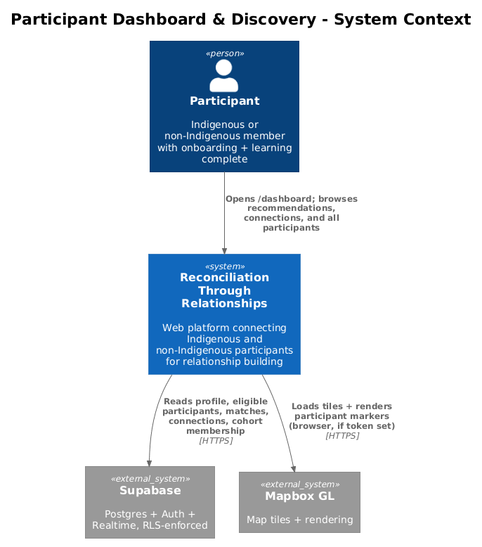
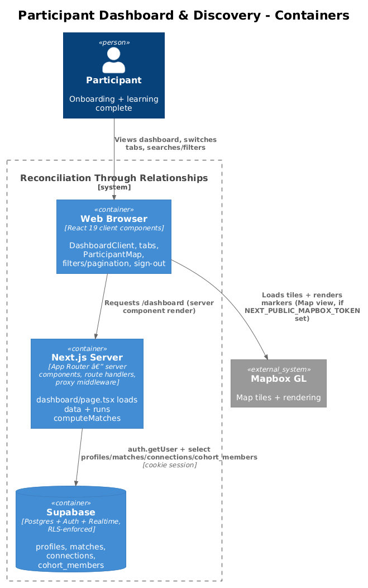
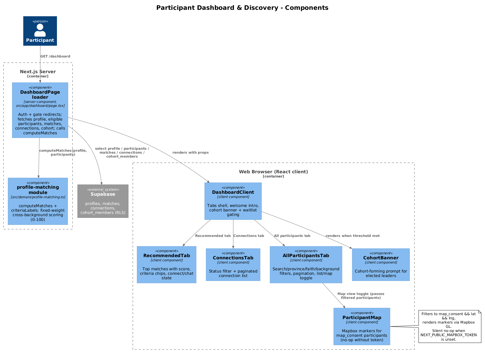
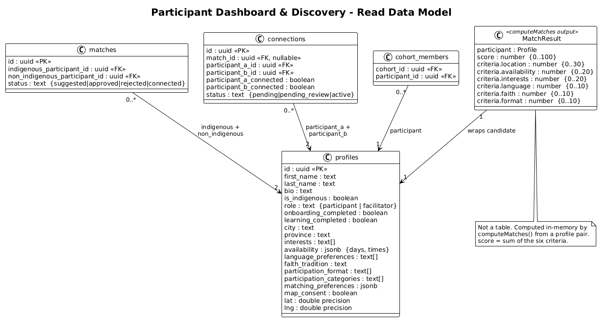
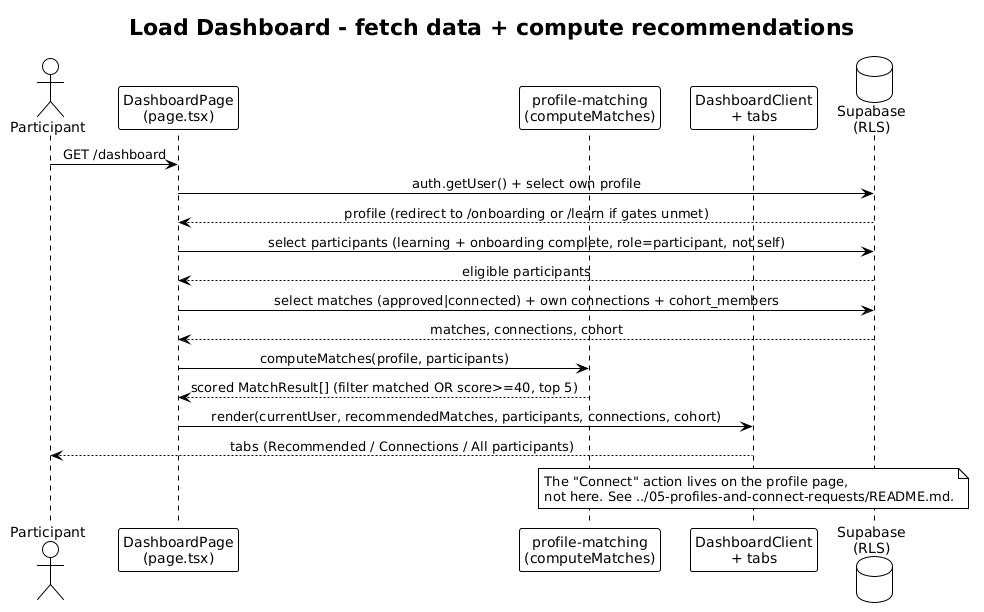

# Participant Dashboard & Discovery — Detailed Design

## 1. Overview

The participant dashboard is the home surface a participant lands on after they have
finished onboarding and the learning journey. It answers three questions: *who should I
connect with?*, *who am I already connected to?*, and *who else is in the community?*

The route is `/dashboard`, served by the server component
`src/app/dashboard/page.tsx`. That loader authenticates the user, enforces the same
completion gates the proxy middleware applies (`../01-auth-and-access/README.md`), then
issues a handful of Supabase reads: the user's own profile, every *eligible* participant,
the user's approved matches, the user's connections (plus their partner profiles), and the
user's cohort membership. It computes recommended matches in-process with
`computeMatches` from `src/domain/profile-matching.ts`, then hands everything to the
`DashboardClient` client component for rendering.

`DashboardClient` is a tab shell (`Recommended` / `Connections` / `All participants`) with
two contextual banners: a **cohort-forming** prompt for elected leaders whose city has
reached the cohort threshold, and a **waitlist** notice for non-Indigenous participants who
have no recommendations yet. The "All participants" tab adds search, province / background /
faith filters, pagination, and a list ⇄ map toggle. The map (`ParticipantMap`) is the only
feature in the whole app that uses Mapbox GL; it degrades to a silent no-op when no Mapbox
token is configured.

Everything on this page is **read-only**. The dashboard never mutates data — the "Connect"
action it links to lives on the profile page and is documented in
`../05-profiles-and-connect-requests/README.md`.

## 2. Architecture

### 2.1 C4 Context Diagram

### 2.2 C4 Container Diagram

### 2.3 C4 Component Diagram

## 3. Component Details

### 3.1 DashboardPage loader (`src/app/dashboard/page.tsx`)

- **Responsibility.** Server-side data loader and gatekeeper for `/dashboard`. Authenticates
  the request, redirects if a completion gate is unmet, fetches all data the tabs need, and
  computes the recommended-match list.
- **Interfaces.** Default async server component (no props). Redirects to `/auth/login` when
  there is no session, to `/onboarding` when the profile is missing or
  `onboarding_completed` is false, and to `/learn` when `learning_completed` is false.
- **Dependencies.** `createSupabaseServerClient` (`src/data/supabase/server-client.ts`) for
  cookie-scoped reads; `computeMatches` (`src/domain/profile-matching.ts`); renders
  `DashboardClient`.
- **Data touched.** Reads `profiles` (own row and eligible participants and connection
  partners), `matches` (approved/connected), `connections`, `cohort_members`. Writes nothing.
  Eligible participants are filtered server-side to `learning_completed = true`,
  `onboarding_completed = true`, `role = 'participant'`, and `id != user.id`.
  `sameCityCount` is computed as the number of eligible participants sharing the user's city,
  plus one to include the user.

### 3.2 DashboardClient (`src/app/dashboard/components/DashboardClient.tsx`)

- **Responsibility.** Client-side shell. Holds the active-tab state, renders the welcome
  intro, and decides whether the cohort banner and waitlist alert appear.
- **Interfaces.** Props: `currentUser`, `participants`, `recommendedMatches`, `connections`,
  `connectionPartners`, `cohort`, `sameCityCount`. Uses shadcn/Base UI `Tabs`; the
  Recommended and Connections triggers show a count badge.
- **Gating logic.** Cohort banner renders when
  `currentUser.participation_categories.includes("elected_leader")` **and**
  `sameCityCount >= 5` **and** `cohort` is null. Waitlist alert renders when
  `!currentUser.is_indigenous` **and** `recommendedMatches.length === 0`.
- **Dependencies.** `DashboardNav`, `RecommendedTab`, `ConnectionsTab`,
  `AllParticipantsTab`, `CohortBanner`.

### 3.3 DashboardNav (`src/app/dashboard/components/DashboardNav.tsx`)

- **Responsibility.** Top navigation bar for the authenticated shell (Home, Learning,
  Connections, Regional map), notification bell, and the account dropdown.
- **Interfaces.** Prop: `user: Profile`. Renders `AppHeader` with `NAV_ITEMS` and a
  `NotificationCenter` (`../09-notifications/README.md`). The account menu links to
  `/profile/{user.id}` and signs out.
- **Dependencies.** `createSupabaseBrowserClient` for `auth.signOut()` (the one client-side
  Supabase call on this page), then `router.push("/")`.

### 3.4 RecommendedTab (`src/app/dashboard/components/RecommendedTab.tsx`)

- **Responsibility.** Renders the recommended-match cards. Shows an empty state ("No
  recommendations yet") when the list is empty.
- **Interfaces.** Props: `matches: MatchResult[]`, `connections`, `currentUser`. Each card
  shows the rounded `score` as a percentage, the criteria chips (via `criteriaLabels`,
  filtered to `points > 0`), a progress bar, bio, up to four interests, a "View profile"
  link, and a connect/pending/chat action derived from any existing connection with that
  participant.
- **Data touched.** Reads only from props. Builds a `Map` from `connections` keyed by the
  other participant's id to resolve each card's action state.

### 3.5 ConnectionsTab (`src/app/dashboard/components/ConnectionsTab.tsx`)

- **Responsibility.** Lists the user's connections with a status filter and pagination.
- **Interfaces.** Props: `connections`, `partners: Profile[]`, `currentUserId`. Status filter
  is `all | active | pending | pending_review`; page size is 10; each row links to
  `/connections/{id}`. Status renders as an `Active` badge, an "Under review" badge
  (`pending_review`), or a "Pending" badge whose tooltip depends on whether the current user
  or the partner still needs to accept. Empty state when there are no connections.
- **Data touched.** Reads only from props; resolves each partner from the `partners` array.

### 3.6 AllParticipantsTab (`src/app/dashboard/components/AllParticipantsTab.tsx`)

- **Responsibility.** Directory of every eligible participant with search, filters,
  pagination, and a list ⇄ map toggle.
- **Interfaces.** Props: `participants`, `currentUser`, `connections`. Client-side filters:
  free-text search over name / city / interests; province; background
  (`all | indigenous | non_indigenous`); faith tradition (label mapped to the stored
  snake_case value). List view paginates at `PAGE_SIZE = 9`; map view renders all filtered
  participants (no pagination). Any filter change resets to page 1.
- **Dependencies.** `ParticipantMap` for the map view. Each card carries the same
  connect/pending/chat action as the recommended cards.

### 3.7 ParticipantMap (`src/app/dashboard/components/ParticipantMap.tsx`)

- **Responsibility.** Renders a Mapbox GL map with one marker per consenting participant.
  This is the only Mapbox integration in the app; the regional map feature
  (`../08-regional-map-and-cohorts/README.md`) is separate.
- **Interfaces.** Prop: `participants: Profile[]`. Filters to participants with
  `map_consent && lat && lng` (`mappable`). Markers are colored by `is_indigenous`
  (`--spruce-700` vs `--river-700`) and carry a popup with name, city/province, and
  background. Centers on Canada (`[-96, 60]`, zoom `3.5`) with a navigation control.
- **Graceful degradation.** Reads `process.env.NEXT_PUBLIC_MAPBOX_TOKEN`; if it is unset the
  `useEffect` returns before creating a map (no tiles, no error). If no participant is
  mappable, it renders an inline "No participants have consented to map display" panel
  instead of a blank map.
- **Data touched.** Reads only from props (`map_consent`, `lat`, `lng`, name, `city`,
  `province`, `is_indigenous`).

### 3.8 CohortBanner (`src/app/dashboard/components/CohortBanner.tsx`)

- **Responsibility.** Presentational prompt shown to elected leaders when a cohort could form
  in their city. Displays a `CohortCircle`, the city, the participant count, and a
  "Create cohort" call to action. Cohort creation itself is out of scope here — see
  `../08-regional-map-and-cohorts/README.md`.
- **Interfaces.** Props: `city: string`, `count: number`.

### 3.9 profile-matching module (`src/domain/profile-matching.ts`)

- **Responsibility.** Pure scoring logic. `computeMatches(currentUser, candidates)` returns a
  sorted `MatchResult[]`; `criteriaLabels(criteria)` maps the raw criteria object to display
  labels with point values and maxima.
- **Interfaces.** `computeMatches` first filters candidates to the opposite `is_indigenous`
  value (only Indigenous ↔ non-Indigenous pairs), scores each, and sorts by `score`
  descending. `criteriaLabels` returns `{ label, points, max }[]`.
- **Weights.** Fixed and hardcoded (see [§5.2](#52-match-scoring-computematches)); the
  algorithm does **not** read the `matching_preferences` column.
- **Consumers.** The dashboard loader and the facilitator console both call this module.

## 4. Data Model

### 4.1 Class Diagram

### 4.2 Entity Descriptions

- **profiles** — the central entity. The loader reads a wide slice: identity/display fields
  (`first_name`, `last_name`, `bio`, `avatar_url`), eligibility flags (`role`,
  `onboarding_completed`, `learning_completed`), background (`is_indigenous`),
  location (`city`, `province`), the cohort trigger (`participation_categories`), the six
  matching inputs (`city`/`province`, `availability`, `interests`, `language_preferences`,
  `faith_tradition`, `participation_format`), and the map fields (`map_consent`, `lat`,
  `lng`). `matching_preferences` (jsonb) is selected because the loader reads `*`, but no
  dashboard code consumes it. `availability` is jsonb of shape `{ days: string[], times: string[] }`.
- **matches** — read to know which recommendations a facilitator has already approved. The
  loader filters to `status in ('approved','connected')` where the user is either
  `indigenous_participant_id` or `non_indigenous_participant_id`. Only the ids and `status`
  matter to the dashboard; scoring/approval columns belong to the facilitator console
  (`../07-facilitator-console/README.md`).
- **connections** — the user's relationships (as `participant_a_id` or `participant_b_id`).
  `status` is one of `pending | pending_review | active`; the two `*_connected` booleans drive
  the "waiting for X to accept" tooltips. `match_id` is nullable because peer-initiated
  requests have no underlying match. Rendering and mutation of connections belong to
  `../06-connections-chat-and-meetings/README.md`.
- **cohort_members** — read with a single `cohort_id` lookup for the current user; a non-null
  result suppresses the cohort banner (the user is already in a cohort).
- **MatchResult** — *not a table.* It is the in-memory shape returned by `computeMatches`:
  `{ participant: Profile, score: number, criteria: { location, availability, interests,
  language, faith, format } }`. `score` is the sum of the six criteria (0–100).

## 5. Key Workflows

### 5.1 Load dashboard & compute recommendations

1. Participant requests `GET /dashboard`; the server component calls `auth.getUser()` and
   selects the user's own profile. If unauthenticated → `/auth/login`; if the profile is
   missing or `onboarding_completed`/`learning_completed` is false → `/onboarding` or `/learn`.
2. It selects **eligible participants**: `learning_completed = true`,
   `onboarding_completed = true`, `role = 'participant'`, `id != user.id`.
3. It selects the user's **approved matches** (`status in ('approved','connected')`), the
   user's **connections**, the **partner profiles** for those connections, and the user's
   **cohort_members** row.
4. It calls `computeMatches(profile, participants)`, then keeps a match only if the partner is
   in an approved match **or** its `score >= 40`, and takes the top 5.
5. It computes `sameCityCount` and renders `DashboardClient`, which shows the tabs plus the
   cohort banner / waitlist alert per §3.2.

### 5.2 Match scoring (`computeMatches`)

Scoring runs only for candidates of the opposite `is_indigenous` value. Each pair earns
points across six criteria with **fixed weights**; the total is the `score` (max 100):

| Criterion | Max | How points are earned |
|-----------|-----|-----------------------|
| Location | 30 | 30 for same `city` (case-insensitive); else 15 for same `province`; else 0. |
| Availability | 20 | Day-overlap ratio ×10 + time-overlap ratio ×10, each ratio capped at 1 and rounded (from `availability.days` / `availability.times`). |
| Shared interests | 20 | `shared / min(len(a), len(b)) × 20`, rounded, over the `interests` arrays. |
| Language | 10 | 10 if the `language_preferences` arrays intersect, else 0. |
| Faith tradition | 10 | 10 if `faith_tradition` matches exactly, else 0. |
| Format | 10 | 10 if the `participation_format` arrays intersect, else 0. |

`criteriaLabels` turns the criteria object into `{ label, points, max }[]`; `RecommendedTab`
renders one chip per criterion where `points > 0` and draws the progress bar as
`score / 100`. Because the weights are constants in `profile-matching.ts`, a participant's
`matching_preferences` has no effect on their recommendations.

### 5.3 Browse all participants (filter, paginate, map)

`AllParticipantsTab` filters the in-memory participant array by search text, province,
background, and faith, resetting to page 1 on any change. In list view it paginates at 9 per
page; toggling to map view passes the full filtered set to `ParticipantMap`, which plots the
subset with `map_consent && lat && lng`. The Connect action on each card routes to the profile
page (`../05-profiles-and-connect-requests/README.md`).

## 6. API Contracts

The dashboard exposes no HTTP API of its own. Its contract is a set of Supabase reads issued
server-side through `createSupabaseServerClient` (cookie session), each gated by RLS:

| Operation | Table | Filter | RLS gate (SELECT) |
|-----------|-------|--------|-------------------|
| `select *` | `profiles` | `id = user.id` | own row (`auth.uid() = id`) |
| `select *` | `profiles` | `learning_completed`, `onboarding_completed`, `role='participant'`, `neq id` | visible when both completion flags are true |
| `select *` | `profiles` | `id in (connectionPartnerIds)` | same visibility policy |
| `select *` | `matches` | `status in (approved,connected)` and user on either side | user is a participant in the match, or facilitator |
| `select *` | `connections` | `participant_a_id` or `participant_b_id = user` | user is a participant, or facilitator |
| `select cohort_id` | `cohort_members` | `participant_id = user.id` | any authenticated user |

The only client-side Supabase call on the page is `auth.signOut()` from the account menu
(`DashboardNav`). `ParticipantMap` performs no queries — it reads participant props and, if a
token is present, fetches tiles from Mapbox GL.

## 7. Security Considerations

- **Participant visibility.** The `profiles` SELECT policy "Users can view approved
  participants" (`supabase/migrations/001_initial_schema.sql`) allows a row to be read when
  `auth.uid() = id` **or** `role = 'facilitator'` **or**
  `(learning_completed = true and onboarding_completed = true)`. This is why the dashboard can
  list other participants at all, and why the eligible-participants query mirrors those same
  flags: a participant becomes discoverable to peers only after finishing onboarding *and*
  learning.
- **Matches and connections are owner-scoped.** `matches` SELECT is limited to the two named
  participants (or a facilitator), and `connections` SELECT to the two connection
  participants (or a facilitator). Even though the loader's `.or(...)` filters name the current
  user, RLS independently prevents reading other people's matches/connections.
- **Map consent is a display filter, not an access control.** There is no RLS on `map_consent`,
  `lat`, or `lng`; those columns are readable by anyone permitted to read the profile row.
  `ParticipantMap` enforces consent purely client-side by plotting only participants with
  `map_consent && lat && lng`, and the app stores city-level coordinates only. Treat map
  consent as a presentation choice layered on top of the profile visibility policy above.
- **No mutations, minimal surface.** The page only reads; the sole write path is
  `auth.signOut()`. Recommendation scoring is pure and in-process, so no additional
  participant data leaves the server beyond what the visibility policy already permits.

## 8. Open Questions

- Two match engines exist — `src/domain/profile-matching.ts` (used by the dashboard and the
  facilitator console) and `src/domain/matching.ts` (used only by the mock repository seam,
  see `../08-regional-map-and-cohorts/README.md`); this document covers only
  `profile-matching.ts`.
