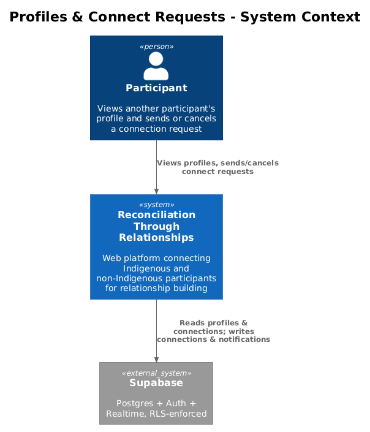
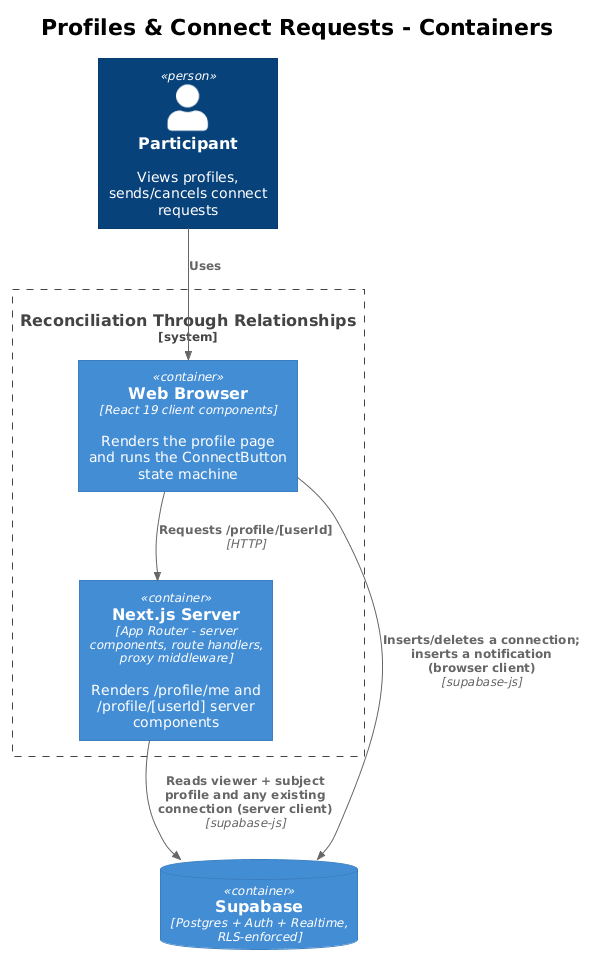
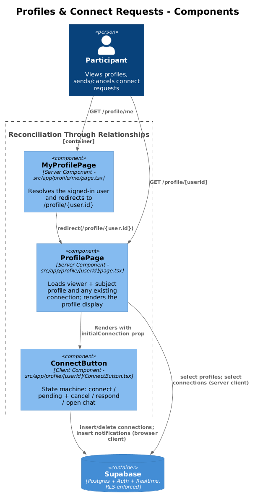
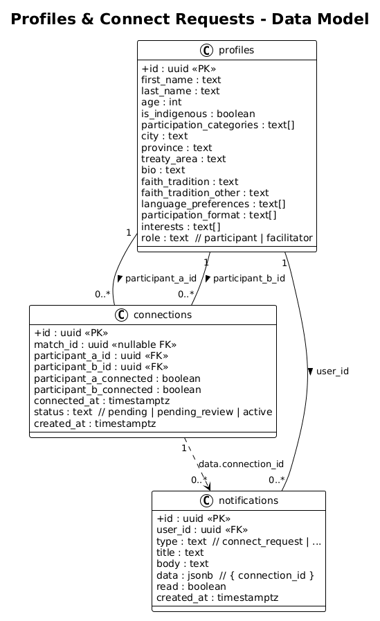
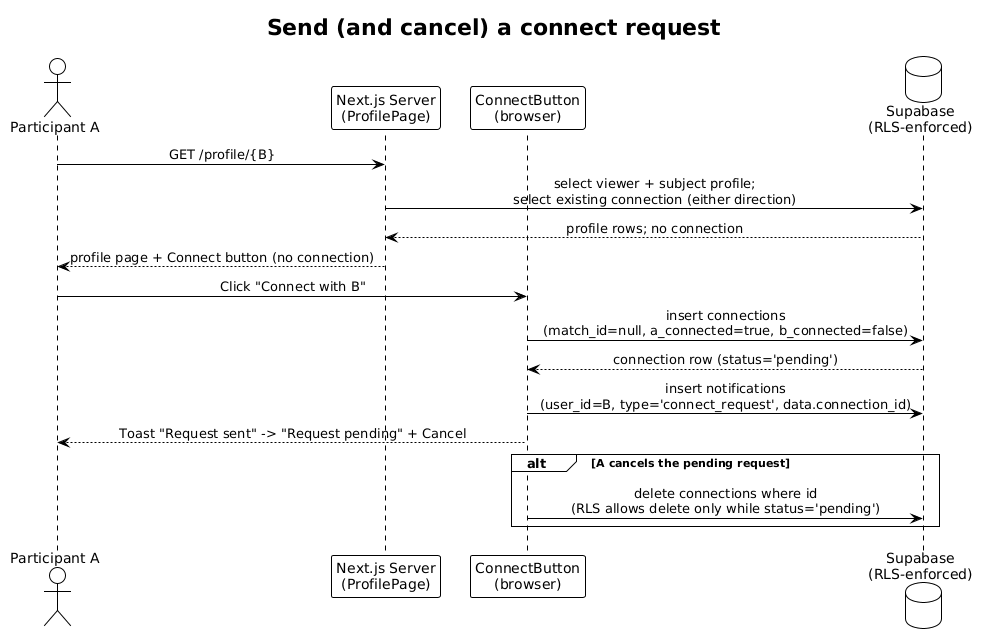

# Profiles & Connect Requests — Detailed Design

## 1. Overview

This feature lets a signed-in Participant view another Participant's public profile and
initiate a peer-to-peer connection. It covers three surfaces:

- **`/profile/me`** (`src/app/profile/me/page.tsx`) — a thin server component that resolves the
  signed-in user and redirects to their own `/profile/{id}` page.
- **`/profile/[userId]`** (`src/app/profile/[userId]/page.tsx`) — a server component that loads the
  viewer's own profile, the subject profile, and any existing connection between the two, then
  renders the profile display.
- **`ConnectButton`** (`src/app/profile/[userId]/ConnectButton.tsx`) — a client component that runs a
  small state machine over the connection between viewer and subject, and performs the two mutations
  this document owns: **creating** a connect request (insert into `connections` + `notifications`) and
  **cancelling** a still-pending one (delete from `connections`).

Scope boundary: this document owns request **creation and cancellation** only. Once the recipient
accepts — the mutual-acceptance handshake, the `/connections/[id]` chat surface, meetings, and the
`active` / `pending_review` transitions — behaviour moves to
[../06-connections-chat-and-meetings/README.md](../06-connections-chat-and-meetings/README.md). The
notification the request produces is consumed by [../09-notifications/README.md](../09-notifications/README.md).

Consistent with the rest of the app, there are **no server actions**: the server component only reads,
and every write is a client-side Supabase call from `ConnectButton`, gated by Postgres Row Level
Security (RLS).

## 2. Architecture

### 2.1 C4 Context Diagram


### 2.2 C4 Container Diagram


### 2.3 C4 Component Diagram


## 3. Component Details

### 3.1 MyProfilePage (`src/app/profile/me/page.tsx`)

- **Responsibility:** Resolve the currently signed-in user and forward them to their own profile page.
- **Interfaces:** Default-exported async server component for route `/profile/me`. Takes no params.
- **Behaviour:** Calls `supabase.auth.getUser()`. If there is no user it `redirect("/auth/login")`;
  otherwise it `redirect(\`/profile/${user.id}\`)`.
- **Dependencies:** `createSupabaseServerClient` (`src/data/supabase/server-client.ts`),
  `redirect` from `next/navigation`.
- **Data touched:** None directly — only the auth session (cookie) to obtain `user.id`.

### 3.2 ProfilePage (`src/app/profile/[userId]/page.tsx`)

- **Responsibility:** Load and render a subject participant's profile, and hand `ConnectButton` the
  data it needs (the viewer/subject ids and any existing connection).
- **Interfaces:** Default-exported async server component for route `/profile/[userId]`. Receives
  `params: Promise<{ userId: string }>` (Next.js 16 async params) and awaits it.
- **Behaviour / control flow:**
  1. `supabase.auth.getUser()`; if no user, `redirect("/auth/login")`.
  2. In parallel (`Promise.all`), selects the viewer's own profile (`profiles.id = user.id`) and the
     subject profile (`profiles.id = userId`), each via `.single()`.
  3. If the viewer has no profile row, `redirect("/onboarding")`.
  4. If the subject profile is missing **or** `profile.role === "facilitator"`, `notFound()`
     (facilitator accounts are not browsable as participant profiles).
  5. Computes `isSelf = user.id === userId`.
  6. Selects any existing connection in **either** direction with `.maybeSingle()` (see §6).
  7. Renders the profile card (avatar initials, name, age, Indigenous/Non-Indigenous badge,
     participation categories, city/province, treaty area, bio, faith tradition, languages,
     preferred format, interests). When `!isSelf`, renders `ConnectButton` with
     `currentUserId={user.id}`, `partnerId={userId}`, `partnerName`, and `initialConnection={connection ?? null}`.
- **Dependencies:** `createSupabaseServerClient`; `redirect` / `notFound` from `next/navigation`;
  `DashboardNav` (`src/app/dashboard/components/DashboardNav.tsx`, owned by doc 04); shadcn/Base UI
  primitives (`Avatar`, `Badge`, `Button`, `Card`, `Separator`); `AppFooter`.
- **Data touched:** reads `profiles` (twice) and `connections` (once). No writes.

### 3.3 ConnectButton (`src/app/profile/[userId]/ConnectButton.tsx`)

- **Responsibility:** Present the correct call-to-action for the viewer↔subject relationship, and
  perform request creation and cancellation.
- **Interfaces:** `"use client"` component. Props: `currentUserId: string`, `partnerId: string`,
  `partnerName: string`, `initialConnection: Connection | null`. Holds `connection` and `busy` in
  `useState`; calls `router.refresh()` after each mutation to re-sync the server component.
- **State machine** (derived from the current `connection`):
  - **No connection** → primary button "Connect with {partnerName}" → `sendRequest()`.
  - **`isActive`** (`status === "active"` **or** both `*_connected` flags true) → "Open chat" link to
    `/connections/{id}` (that surface is doc 06).
  - **I sent it, not yet accepted** (`iConnected && !theyConnected`) → disabled "Request pending"
    badge **+** "Cancel" button → `cancelRequest()`.
  - **They sent it to me** (the remaining branch) → "Respond to request" link to `/connections/{id}`
    (the accept handshake is doc 06).
  - Orientation is resolved with `iAmParticipantA = connection.participant_a_id === currentUserId`,
    which selects whether `iConnected`/`theyConnected` read the `a_` or `b_` flags.
- **`sendRequest()`:** inserts a `connections` row (payload in §6) and, on success, inserts a
  `connect_request` `notifications` row addressed to the partner, then `setConnection(data)` and a
  success toast. Any insert error surfaces a sonner error toast; the notification insert is
  best-effort (its result is awaited but not error-checked).
- **`cancelRequest()`:** deletes the connection by `id`; on success clears local state and toasts.
- **Dependencies:** `createSupabaseBrowserClient` (`src/data/supabase/browser-client.ts`),
  `useRouter`, `Link`, `Button`, `sonner` `toast`, `Connection` type.
- **Data touched:** inserts/deletes `connections`; inserts `notifications`.

## 4. Data Model

### 4.1 Class Diagram


### 4.2 Entity Descriptions

- **`profiles`** — the participant record rendered by the profile page. This feature reads display
  columns only: `first_name`, `last_name`, `age`, `is_indigenous` (drives the Indigenous /
  Non-Indigenous badge), `participation_categories`, `city`, `province`, `treaty_area`, `bio`,
  `faith_tradition` (+ `faith_tradition_other` when `other`), `language_preferences`,
  `participation_format`, and `interests`. `role` is read to decide visibility: a `facilitator`
  subject yields `notFound()`. Defined in `supabase/migrations/001_initial_schema.sql`.
- **`connections`** — one row per relationship between two participants. This feature writes
  `match_id` (**nullable** since `005_peer_connection_requests.sql` — a peer request has no underlying
  match), `participant_a_id`/`participant_b_id`, and the `participant_a_connected` /
  `participant_b_connected` flags. A new request sets the requester's flag `true` and the partner's
  `false`; `status` is left to its default `'pending'`. `status` is read by `ConnectButton` to detect
  the `active` state. The `Connection` TypeScript type also lists `pending_review`, a value produced
  by the doc-06 handshake (see Open Questions). `connected_at` and the accepted states are set by
  doc 06, not here.
- **`notifications`** — the per-user alert inbox. This feature inserts one row of `type =
  'connect_request'` addressed to the partner (`user_id = partnerId`), with `title` "Someone wants to
  connect with you", `body` "Visit your connections to accept.", and `data = { connection_id }`.
  Reading/marking notifications is doc 09.

## 5. Key Workflows

### 5.1 Send (and cancel) a connect request

1. Participant A opens `GET /profile/{B}`. The server component loads A's own profile and B's profile,
   and queries `connections` for any existing row between A and B (either direction).
2. With no existing connection, the page renders B's profile and a "Connect with {B}" button.
3. A clicks Connect. `ConnectButton.sendRequest()` inserts a `connections` row with `match_id = null`,
   `participant_a_id = A`, `participant_b_id = B`, `participant_a_connected = true`,
   `participant_b_connected = false` (status defaults to `'pending'`) and selects the new row back.
4. On success it inserts a `connect_request` `notifications` row addressed to B carrying
   `data.connection_id`, updates local state to the pending view, toasts success, and calls
   `router.refresh()`.
5. The button now shows a disabled "Request pending" badge and a "Cancel" action.
6. **Cancel (alt):** A clicks Cancel; `cancelRequest()` deletes the connection by `id`. RLS permits
   the delete only while `status = 'pending'` (migration 005), so a request already being accepted
   cannot be withdrawn this way. Local state resets to the "Connect" button.

The recipient's side of this exchange — seeing the request, accepting it, and everything after — is
[../06-connections-chat-and-meetings/README.md](../06-connections-chat-and-meetings/README.md).



## 6. API Contracts

This feature has no HTTP API of its own; its "contract" is the set of Supabase table operations,
each gated by RLS. All calls use the anon key with the caller's cookie session, so `auth.uid()` is
the acting user.

| # | Op | Table | Payload / filter | RLS gate |
|---|----|-------|------------------|----------|
| 1 | select `*` `.single()` | `profiles` | `id = user.id` (viewer) and `id = userId` (subject) | "Users can view approved participants" (001): self, facilitators, or `learning_completed && onboarding_completed` |
| 2 | select `*` `.maybeSingle()` | `connections` | `.or(and(a=user,b=userId), and(a=userId,b=user))` | "Participants can view own connections" (001): caller is participant_a/b or a facilitator |
| 3 | insert `.select().single()` | `connections` | `{ match_id: null, participant_a_id: currentUserId, participant_b_id: partnerId, participant_a_connected: true, participant_b_connected: false }` | "Participants and facilitators can create connections" (004): `auth.uid()` is participant_a or b (or facilitator) |
| 4 | insert | `notifications` | `{ user_id: partnerId, type: "connect_request", title: "Someone wants to connect with you", body: "Visit your connections to accept.", data: { connection_id } }` | "Authenticated users can send notifications" (004): `auth.uid() is not null` |
| 5 | delete | `connections` | `.eq("id", connection.id)` | "Participants can delete own pending connections" (005): caller is participant_a/b **and** `status = 'pending'` |

Notes: the `connections` insert deliberately omits `status`, relying on the column default `'pending'`.
`participant_a_id` is always the requester, and RLS is satisfied because the requester is
`participant_a`. Operations 3 and 4 are two separate round-trips; if the notification insert fails the
connection still exists (it is awaited but not error-checked in `sendRequest`).

## 7. Security Considerations

The migration story in `004` and `005` is what makes participant-initiated requests possible at all,
and it is the security core of this feature.

- **Who may INSERT a connection.** Base migration 001 shipped `"System can insert connections"` whose
  `with check` required the caller to be a facilitator. A participant clicking Connect was therefore
  silently rejected by RLS — the row never persisted. Migration 004 drops that policy and replaces it
  with `"Participants and facilitators can create connections"`:
  ```sql
  with check (
    auth.uid() = participant_a_id
    or auth.uid() = participant_b_id
    or exists (select 1 from public.profiles where id = auth.uid() and role = 'facilitator')
  )
  ```
  A participant can now create a connection **only if they are one of its two parties**; they cannot
  fabricate a connection between two other people. `ConnectButton` always sends `participant_a_id =
  currentUserId`, so the check passes on the first disjunct.
- **Who may DELETE a pending connection.** Migration 005 adds `"Participants can delete own pending
  connections"`:
  ```sql
  using (
    (auth.uid() = participant_a_id or auth.uid() = participant_b_id)
    and status = 'pending'
  )
  ```
  Either party may withdraw a request, but **only while it is still `pending`**. Once the relationship
  advances (doc 06 moves it past `pending`), this policy no longer matches and the row cannot be
  deleted through the Cancel path — a one-way guard against a party tearing down an active connection.
- **Who may INSERT a notification for another user.** Base 001 had a single `for all` notifications
  policy keyed on `auth.uid() = user_id`, which PostgREST also enforces as the INSERT check — so no
  user could ever create a notification *addressed to someone else*, breaking connect-request alerts.
  Migration 004 splits it: owners keep full control of their own rows (`select`/`update`/`delete` all
  `using (auth.uid() = user_id)`), while `"Authenticated users can send notifications"` allows INSERT
  with `with check (auth.uid() is not null)`. Any signed-in user can thus deliver a notification to
  anyone. This is deliberately permissive — the trade-off is that notification *content* is not
  constrained by RLS (see Open Questions).
- **Profile visibility.** The subject profile is fetched under 001's `"Users can view approved
  participants"` policy, so an un-onboarded / pre-learning viewer cannot read arbitrary profiles. The
  application layer additionally hides facilitator accounts via `notFound()`.
- **Read authorization for the existing-connection probe** relies on `"Participants can view own
  connections"`; the `.or(...)` filter only ever references the viewer and subject, so it cannot leak
  connections the viewer is not part of.

## 8. Open Questions

- **`status = 'pending_review'` is not a valid DB value.** The `Connection` TypeScript type and
  several UI surfaces reference `pending_review`, but migration 001's `check (status in ('pending',
  'active'))` was never altered to add it, and no later migration does. This feature only ever writes
  the default `'pending'`, so it is unaffected, but the mismatch belongs to the doc-06 handshake and
  should be reconciled there (either widen the CHECK constraint or drop the unused status).
- **Unconstrained notification content.** Because `"Authenticated users can send notifications"` only
  checks `auth.uid() is not null`, a crafted client could insert notifications with arbitrary `type`,
  `title`, `body`, or `data` for any `user_id`. Acceptable for the current trust model (authenticated
  participants), but a hardening candidate (e.g. a trigger validating `type`/`data` shape).
- **No duplicate-request guard.** There is no unique constraint on `(participant_a_id,
  participant_b_id)`; the UI avoids duplicates by loading the existing connection first, but two rapid
  requests (or requests in opposite directions) could create parallel rows. Worth confirming against
  doc 06's acceptance logic.
