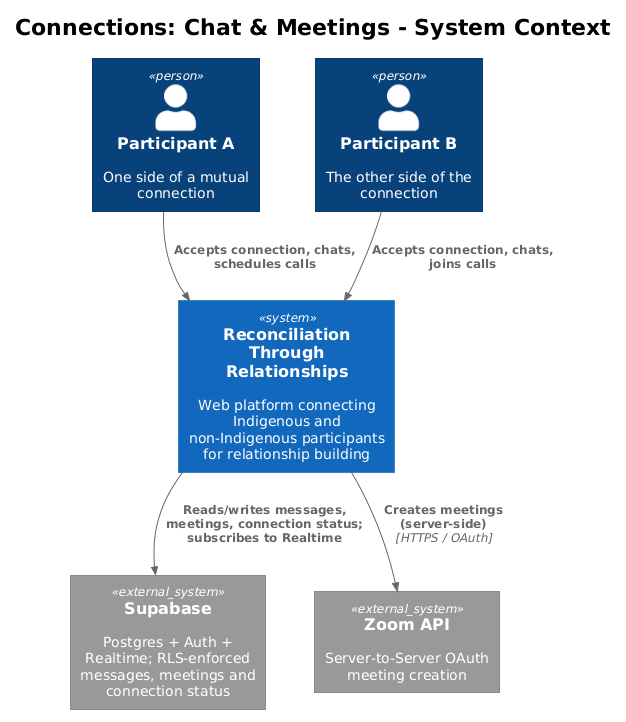
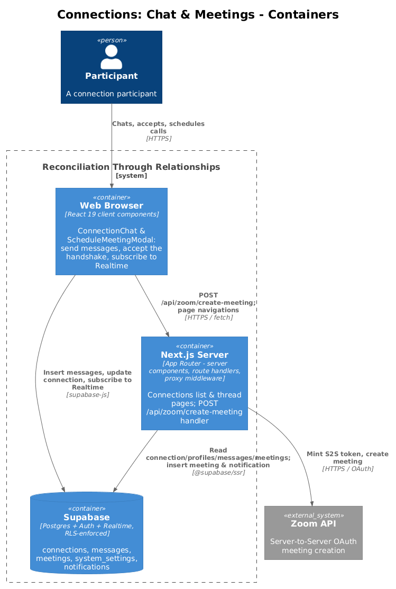
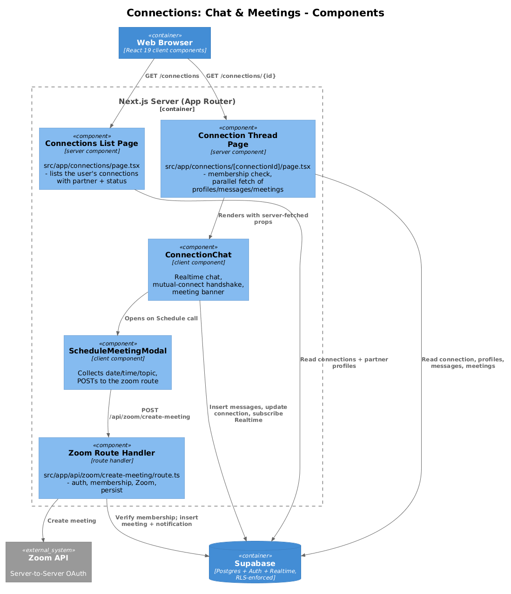
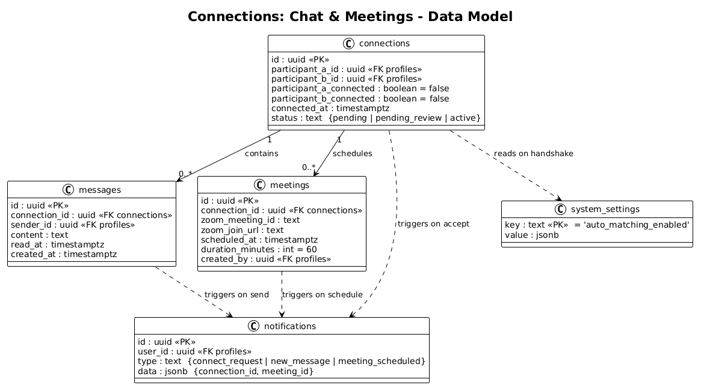
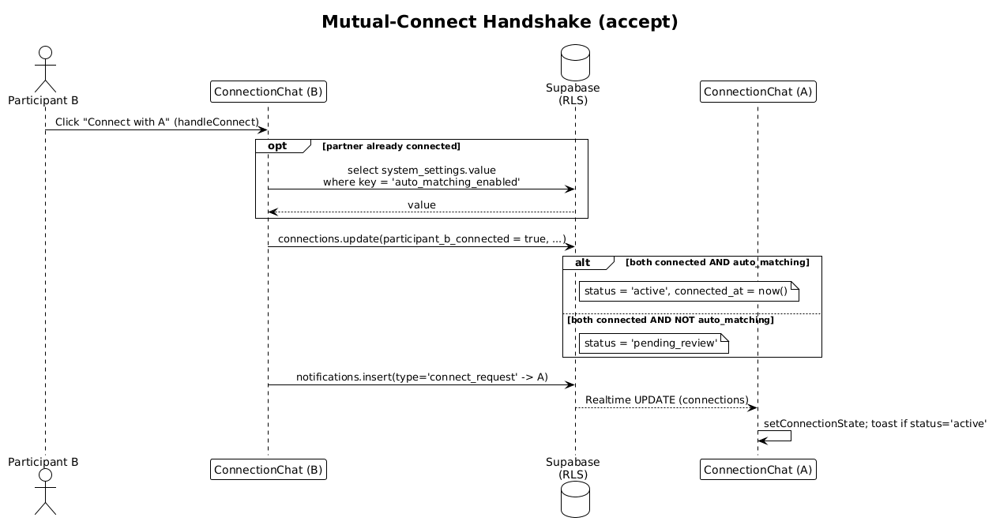
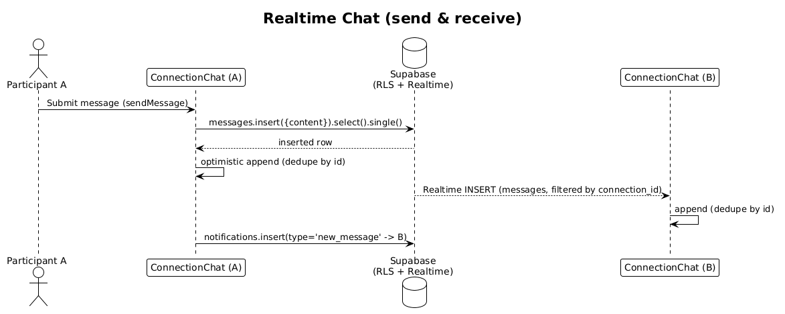
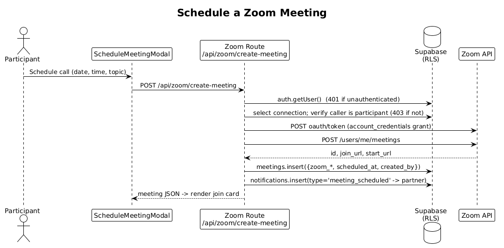

# Connections: Chat & Meetings — Detailed Design

## 1. Overview

Once two participants have been paired (by a facilitator-approved match or a peer connect request — see [`../05-profiles-and-connect-requests/README.md`](../05-profiles-and-connect-requests/README.md)), the **Connections** feature is where the relationship actually happens. It covers three things:

1. **Browsing connections** — a list of every connection the signed-in user belongs to, each showing the partner and whether the connection is `Active` or `Pending` (`src/app/connections/page.tsx`).
2. **The connection thread** — a single conversation view combining the mutual-connect handshake, realtime one-to-one chat, and an upcoming-meeting banner (`src/app/connections/[connectionId]/page.tsx` + `ConnectionChat`).
3. **Scheduling video calls** — a modal that creates a Zoom meeting through the one server-side route in this feature, `POST /api/zoom/create-meeting`.

The design reflects the app's overall model: **server components read data with the user's cookie session, client components mutate directly against Supabase, and Postgres RLS is the authorization boundary.** The single exception is Zoom meeting creation, which must run server-side because it holds Zoom OAuth secrets — that is why chat is client-side while meeting creation is a route handler.

Two adjacent concerns are owned by sibling docs and only cross-referenced here: creating and withdrawing connection *requests* belongs to [`../05-profiles-and-connect-requests/README.md`](../05-profiles-and-connect-requests/README.md); how notifications are surfaced to the recipient belongs to [`../09-notifications/README.md`](../09-notifications/README.md). This doc writes notification rows but does not deliver them.

## 2. Architecture

### 2.1 C4 Context Diagram

### 2.2 C4 Container Diagram

### 2.3 C4 Component Diagram

## 3. Component Details

### 3.1 Connections List Page (`src/app/connections/page.tsx`)

- **Responsibility:** Server component that renders the signed-in user's connections, newest first, each as a link to its thread with the partner's name, city/province, and an `Active`/`Pending` badge.
- **Interfaces:** Default async server component (no props). Renders `DashboardNav`, `PageIntro`, `EmptyState`, and shadcn `Avatar`/`Badge`/`Button`.
- **Dependencies:** `createSupabaseServerClient` (`src/data/supabase/server-client.ts`); redirects to `/auth/login` when unauthenticated and `/onboarding` when the profile is missing.
- **Data touched:** Reads `connections` filtered with `.or(participant_a_id.eq.{uid},participant_b_id.eq.{uid})`; then reads the partner `profiles` in one `.in("id", partnerIds)` query and joins them in memory via a `Map`. A connection whose partner profile is not readable (RLS) is skipped (`if (!partner) return null`).

### 3.2 Connection Thread Page (`src/app/connections/[connectionId]/page.tsx`)

- **Responsibility:** Server component that authorizes access to one connection and gathers everything the chat view needs before handing off to the client.
- **Interfaces:** `params: Promise<{ connectionId: string }>` (Next.js 16 async params). Renders `ConnectionChat` with fully-resolved props.
- **Dependencies:** `createSupabaseServerClient`; `redirect`/`notFound` from `next/navigation`.
- **Data touched:** Reads the `connections` row by id (`notFound()` if absent). Enforces membership in application code — if the user is neither participant it redirects to `/connections` (RLS would already hide the row, so this is defense in depth). Then a single `Promise.all` fetches the current profile, partner profile, this connection's `messages` (ordered by `created_at`), and its `meetings` (ordered by `scheduled_at`). Computes `myConnectedField` (`participant_a_connected` vs `participant_b_connected`) so the client knows which boolean it owns.

### 3.3 ConnectionChat (`src/app/connections/components/ConnectionChat.tsx`)

- **Responsibility:** The client component that drives the live conversation. It (a) shows the connect prompt / waiting / under-review states, (b) runs the mutual-connect handshake, (c) sends and receives messages in realtime, (d) shows the next upcoming meeting with a Join Zoom link, and (e) opens `ScheduleMeetingModal`.
- **Interfaces:** Props `{ connection, currentUser, partner, initialMessages, meetings, myConnectedField }`. Local state seeds from those props (`messages`, `connectionState`, `meetingList`).
- **Dependencies:** `createSupabaseBrowserClient` (`src/data/supabase/browser-client.ts`), `sonner` toasts, `date-fns` for timestamps, `next/navigation` `useRouter` (`router.refresh()` after the handshake), `ScheduleMeetingModal`.
- **Behavior details:**
  - **Realtime subscription:** on mount, opens a channel `connection:{id}` and subscribes to two `postgres_changes` streams — `INSERT` on `messages` filtered by `connection_id`, and `UPDATE` on `connections` filtered by `id`. Message inserts are appended with de-duplication by `id`; connection updates replace `connectionState` and toast when `status` becomes `active`.
  - **Handshake (`handleConnect`):** see §5.1.
  - **Send (`sendMessage`):** see §5.2. Sending is blocked unless `status === 'active'`.
  - **Meeting banner:** derives `upcomingMeeting` as the earliest meeting whose end (`scheduled_at + duration_minutes`) is still in the future; `canScheduleCall = isActive && !upcomingMeeting`, which is what shows/hides the "Schedule call" button.
  - **Read receipts:** each of the user's own messages renders a single check (`Check`) when `read_at` is null and a double check (`CheckCheck`) when set. (No code path currently sets `read_at` — see §8.)
- **Data touched:** Inserts `messages`; updates `connections` (`participant_x_connected`, `status`, `connected_at`); reads `system_settings`; inserts `notifications`.

### 3.4 ScheduleMeetingModal (`src/app/connections/components/ScheduleMeetingModal.tsx`)

- **Responsibility:** Collects topic, date, time, and duration, then calls the Zoom route. On success it hands the created `Meeting` back to `ConnectionChat` via `onScheduled`.
- **Interfaces:** Props `{ connectionId, currentUser, partner, onClose, onScheduled }`. Topic defaults to `RTR Connection Call — {A} & {B}`; duration options are 30/60/90/120 minutes.
- **Dependencies:** shadcn `Dialog`/`Input`/`Label`/`Select`, `sonner`. Uses `fetch("/api/zoom/create-meeting", …)` — the only `fetch` to an app route in this feature.
- **Data touched:** None directly; all persistence happens in the route handler.

### 3.5 Zoom Route Handler (`src/app/api/zoom/create-meeting/route.ts`)

- **Responsibility:** The only server-side, secret-holding component. Authenticates the caller, verifies they belong to the connection, mints a Zoom Server-to-Server OAuth token, creates the meeting, persists it, and notifies the partner.
- **Interfaces:** `POST` handler. Request body `{ connectionId, scheduledAt, durationMinutes, topic }`; responds with the inserted `meetings` row as JSON, or an error object. See §6 for the full contract.
- **Dependencies:** `createSupabaseServerClient` (reads the caller's cookie session), Zoom OAuth + Meetings REST API, env vars `ZOOM_ACCOUNT_ID` / `ZOOM_CLIENT_ID` / `ZOOM_CLIENT_SECRET`.
- **Data touched:** Reads `connections` for the membership check; inserts `meetings`; inserts a `meeting_scheduled` `notifications` row addressed to the partner.

## 4. Data Model

### 4.1 Class Diagram

### 4.2 Entity Descriptions

- **connections** — the pairing between two participants (`participant_a_id`, `participant_b_id`). `participant_a_connected` / `participant_b_connected` record each side's acceptance; the connection is chat-enabled only when `status = 'active'`. `status` moves `pending → active` (auto-matching on) or `pending → pending_review → active` (facilitator review, approval happens outside this feature). `connected_at` is stamped when the handshake activates. This feature reads connections and updates the handshake fields; the initial insert of the row is owned by doc 05.
- **messages** — one chat line: `connection_id`, `sender_id`, `content`, optional `read_at`, `created_at`. Ordered by `created_at` in the thread. In the `supabase_realtime` publication, so inserts stream to subscribers.
- **meetings** — a scheduled Zoom call for a connection: `zoom_meeting_id`, `zoom_join_url`, `zoom_start_url`, `scheduled_at`, `duration_minutes` (default 60), `topic`, `created_by`. Rows are only ever created by the Zoom route handler.
- **notifications** — cross-cutting alert rows. This feature writes three `type`s: `connect_request` (handshake), `new_message` (chat send), `meeting_scheduled` (call created). `data` carries `{ connection_id }` and, for meetings, `{ meeting_id }`. Delivery/read semantics live in doc 09.
- **system_settings** — key/value config. This feature reads exactly one key, `auto_matching_enabled`, during the handshake to decide whether a fully-accepted connection goes straight to `active` or waits in `pending_review`.

## 5. Key Workflows

### 5.1 Mutual-Connect Handshake (accept)

Both participants must click "Connect" before chat opens. Each side owns one boolean (`myConnectedField`).

1. Participant B opens the thread and clicks "Connect with A"; `handleConnect` runs.
2. If A has **not** yet connected, B simply sets its own boolean to `true` (status stays `pending`) and a `connect_request` notification is sent to A. B's UI shows "Waiting for A to accept…".
3. If A **has** already connected, this click completes the handshake. `handleConnect` reads `system_settings.auto_matching_enabled`: when true the update sets `status = 'active'` and `connected_at = now()`; when false it sets `status = 'pending_review'` (a facilitator approves later, outside this feature).
4. The `connections.update` and the partner `notifications.insert` are issued; a toast reflects the branch, then `router.refresh()` re-renders the server component.
5. On the other side, the `UPDATE` on `connections` is delivered over the Realtime channel, replacing `connectionState`; if the new status is `active`, A sees the "You're now connected!" toast without a reload.

### 5.2 Realtime Chat (send & receive)

1. Participant A submits the composer; `sendMessage` guards on `status === 'active'` and non-empty input, clears the box, and sets `sending`.
2. A `messages.insert({ connection_id, sender_id, content }).select().single()` returns the persisted row.
3. A optimistically appends the returned row, de-duplicating by `id` (so the Realtime echo of the same insert is ignored).
4. Supabase Realtime delivers the `INSERT` to Participant B's subscription (filtered by `connection_id`); B appends it, also de-duped by `id`.
5. A `new_message` notification addressed to B is inserted (body truncated to 80 chars).

### 5.3 Schedule a Zoom Meeting

1. From the modal, the participant submits date/time/topic; `handleSchedule` builds an ISO `scheduledAt` and `POST`s to `/api/zoom/create-meeting`.
2. The route calls `auth.getUser()` — `401` if there is no session.
3. It reads the `connections` row and confirms the caller is `participant_a_id` or `participant_b_id` — `403` otherwise. (Missing required fields → `400`.)
4. It mints a Zoom S2S OAuth token (`account_credentials` grant, HTTP Basic with client id/secret).
5. It creates a scheduled meeting (`type: 2`) via `POST https://api.zoom.us/v2/users/me/meetings` (timezone `America/Toronto`, `join_before_host: true`). Zoom returns `id`, `join_url`, `start_url`.
6. It inserts the `meetings` row (`created_by = user.id`) and returns it as the response body.
7. It inserts a `meeting_scheduled` notification for the partner. The modal calls `onScheduled`, which appends the meeting, closes the modal, and toasts; the thread's "Next call" banner now renders with the Join Zoom link.

## 6. API Contracts

### 6.1 `POST /api/zoom/create-meeting`

The only HTTP API owned by this feature. Auth is the Supabase cookie session (no bearer token).

**Request body (`application/json`)**

| Field | Type | Notes |
| --- | --- | --- |
| `connectionId` | uuid string | Connection the meeting belongs to |
| `scheduledAt` | ISO 8601 string | Meeting start; sent to Zoom as `start_time` |
| `durationMinutes` | number | 30 / 60 / 90 / 120 from the modal |
| `topic` | string | Meeting title |

**Responses**

| Status | Body | When |
| --- | --- | --- |
| `200` | the inserted `meetings` row (JSON) | Success |
| `400` | `{ error: "Missing required fields" }` | Any of the four fields absent |
| `401` | `{ error: "Unauthorized" }` | No authenticated session |
| `403` | `{ error: "Forbidden" }` | Caller is not a participant of the connection |
| `500` | `{ error: "Failed to save meeting" }` | `meetings` insert failed |
| `500` | `{ error: "Zoom integration error", detail }` | Missing Zoom env vars or unexpected throw |
| `502` | `{ error: "Failed to create Zoom meeting", detail, status }` | Zoom API returned a non-OK status |

### 6.2 Supabase table operations (client-side, RLS-gated)

These are the direct Supabase calls that make up the rest of the feature's "contract".

| Operation | Table | Payload / filter | RLS gate |
| --- | --- | --- | --- |
| `select *` | `connections` | `.or(participant_a_id.eq,participant_b_id.eq)` (list) or `.eq("id", …)` (thread) | *Participants can view own connections* |
| `update` | `connections` | `{ [myConnectedField]: true, status?, connected_at? }` on `.eq("id", …)` | *Participants can update own connection status* |
| `select value` | `system_settings` | `.eq("key", "auto_matching_enabled")` | *Authenticated users can view settings* |
| `select *` | `messages` | `.eq("connection_id", …).order("created_at")` | *Connection participants can send and read messages* |
| `insert … select().single()` | `messages` | `{ connection_id, sender_id, content }` | same policy (membership on `connection_id`) |
| `select *` | `meetings` | `.eq("connection_id", …).order("scheduled_at")` | *Connection participants can view and create meetings* |
| `insert` | `meetings` | `{ connection_id, zoom_*, scheduled_at, duration_minutes, topic, created_by }` (server-side) | same policy |
| `insert` | `notifications` | `{ user_id: partner, type, title, body, data }` | *Authenticated users can send notifications* |

## 7. Security Considerations

- **Why chat is client-side but meetings are server-side.** Chat and the handshake carry no secrets: the browser talks to Supabase directly and every read/write is constrained by RLS. Zoom meeting creation needs `ZOOM_ACCOUNT_ID` / `ZOOM_CLIENT_ID` / `ZOOM_CLIENT_SECRET`, which must never reach the browser — so it lives behind a route handler that runs on the server and returns only the resulting meeting (never the token or `start_url` secrets beyond what it persists).
- **messages RLS** — policy *"Connection participants can send and read messages"* (`for all`) permits a row only when the caller is `participant_a_id` or `participant_b_id` of that `connection_id` (or a facilitator). This gates both reading the thread and inserting new messages, so a user cannot read or post into a connection they are not part of. Note the policy checks connection membership only; it does not additionally constrain `sender_id = auth.uid()` (see §8).
- **meetings RLS** — policy *"Connection participants can view and create meetings"* (`for all`) gates on the same membership test. The Zoom route also performs its own explicit membership check before creating anything, so meeting creation is authorized twice (route check + RLS on insert).
- **connections update RLS** — policy *"Participants can update own connection status"* lets either participant update the row, which is what allows the handshake. Because both booleans live on one row and either party may update it, the client is careful to only set *its own* `myConnectedField`.
- **notifications insert RLS** — after migration `004_connection_request_policies.sql`, *"Authenticated users can send notifications"* allows any signed-in user to insert a notification addressed to another user (`with check (auth.uid() is not null)`). This is what lets the handshake/message/meeting flows alert the partner; it is intentionally permissive (any authenticated user can create a notification for anyone).
- **Zoom secrets & failure surface** — the route mints a fresh short-lived token per request and never caches it. On Zoom failure it logs server-side and returns a sanitized `502`/`500` with a `detail` string; no OAuth credentials are echoed to the client.

## 8. Open Questions

- **`pending_review` is not in the DB CHECK constraint.** `migrations/001_initial_schema.sql` defines `connections.status` as `check (status in ('pending', 'active'))`; no later migration adds `pending_review`, yet `ConnectionChat.handleConnect` writes that value (and `database.types.ts` lists it). When auto-matching is disabled, the handshake update would be rejected by the constraint. Either a migration to extend the CHECK is missing, or the `pending_review` path is currently unreachable in a real database.
- **`connections` is not in the Realtime publication.** Only `messages` and `notifications` are added to `supabase_realtime` (migration 001). `ConnectionChat` subscribes to `UPDATE` on `connections`, so the "A sees you're-now-connected without reloading" behavior in §5.1 will not fire until `connections` is added to the publication; today A only sees the change on the next `router.refresh()`/navigation.
- **Read receipts never populate.** The double-check state depends on `messages.read_at`, but no code writes it (grep finds only reads). Messages therefore always render as single-check "sent". A "mark read" write (e.g. when the thread is viewed) is missing.
- **`sender_id` is not enforced by RLS.** The messages policy authorizes on connection membership only, so a participant could in principle insert a message with a `sender_id` other than their own. The client always sends `currentUser.id`, but a `with check (sender_id = auth.uid())` would harden this at the boundary.
