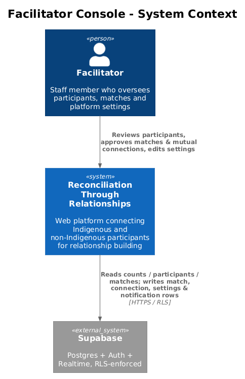
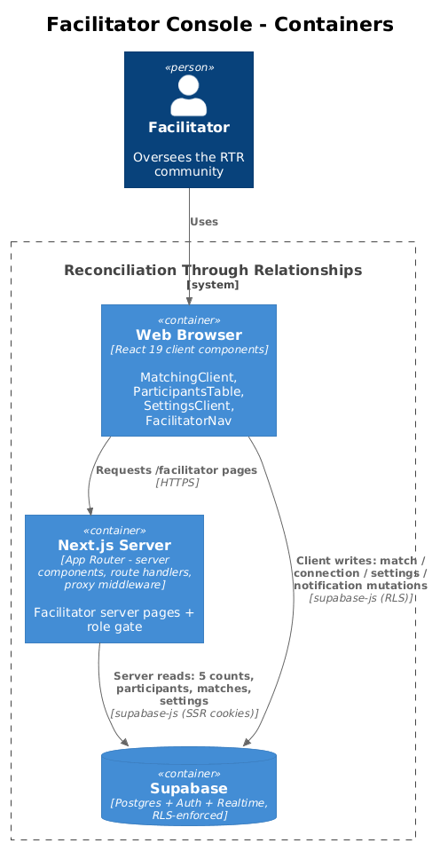
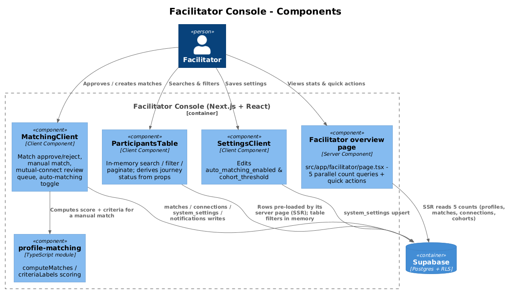
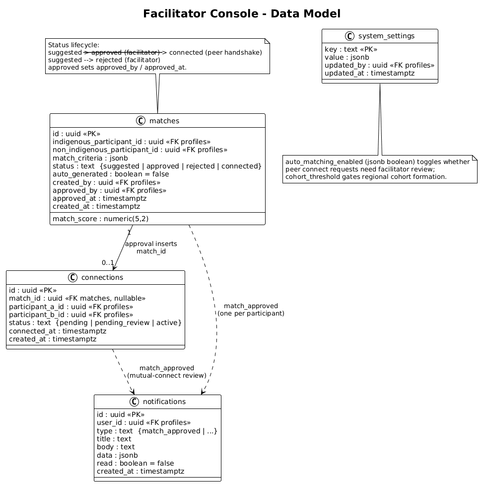
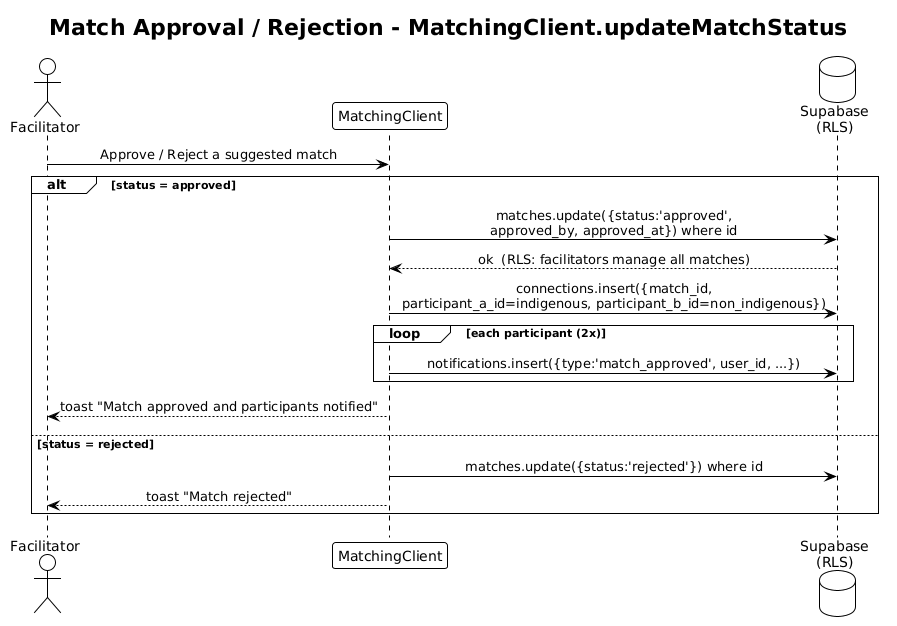
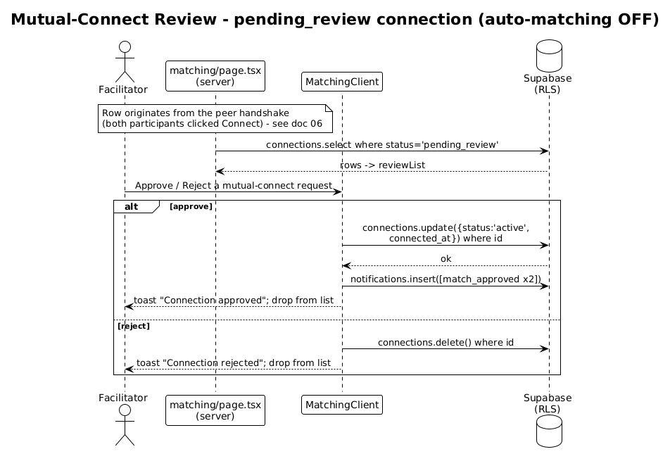
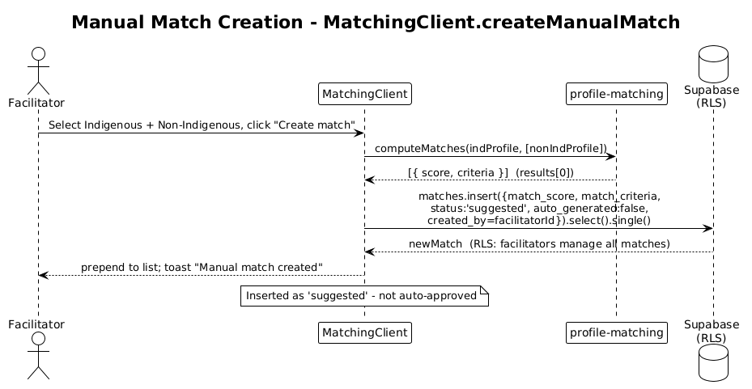

# Facilitator Console — Detailed Design

## 1. Overview

The Facilitator Console is the staff-facing workspace of the Reconciliation Through Relationships (RTR) app. It lives under `/facilitator/*` and is reachable only by a signed-in user whose `profiles.role = 'facilitator'`. It gives facilitators four capabilities:

- **Overview** (`/facilitator`) — a dashboard of five community counts and a set of quick-action links.
- **Participants** (`/facilitator/participants`) — a searchable, filterable, paginated table of every participant with a derived journey status.
- **Match management** (`/facilitator/matching`) — approve/reject flows, manual match creation (reusing the `profile-matching` scoring module), a mutual-connect review queue used when auto-matching is off, and an auto-matching toggle.
- **Settings** (`/facilitator/settings`) — edits the `system_settings` rows `auto_matching_enabled` and `cohort_threshold`.

Every route follows the app-wide pattern (see the [tech-stack notes in AGENTS.md](../../../AGENTS.md)): a **server component** reads via `createSupabaseServerClient` and enforces the role check, then hands data to a **client component** that performs mutations directly against Supabase with `createSupabaseBrowserClient`. There are **no server actions and no route handlers** in this feature — all writes are client-side Supabase calls gated by Row-Level Security (RLS). The `/facilitator` route prefix is additionally protected by the proxy middleware (see [`../01-auth-and-access/README.md`](../01-auth-and-access/README.md)), but that gate is routing-only; RLS is the security boundary.

## 2. Architecture

### 2.1 C4 Context Diagram

### 2.2 C4 Container Diagram

### 2.3 C4 Component Diagram

## 3. Component Details

### 3.1 Facilitator overview page
- **File:** `src/app/facilitator/page.tsx` (server component).
- **Responsibility:** Render the community dashboard — five stat cards and four quick-action links.
- **Interfaces:** Default async page export. No props.
- **Dependencies:** `createSupabaseServerClient`, `FacilitatorNav`, `PageIntro`, `AppFooter`, shadcn `Card`/`Button`, `lucide-react` icons, `next/navigation` `redirect`.
- **Data touched:** Reads `auth.getUser()`; `profiles` (own row for the role check). Then five parallel `count`/`head` queries via `Promise.all`: `profiles` where `role='participant'` (total participants); `profiles` where `learning_completed=true` and `role='participant'` (completed learning); `matches` where `status='suggested'` (pending matches); `connections` where `status='active'` (active connections); `cohorts` (regional cohorts). All are `head:true` count queries — no rows are fetched. The cards link to `/facilitator/participants`, `/facilitator/matching`, and `/map`.

### 3.2 ParticipantsTable (+ participants server page)
- **Files:** `src/app/facilitator/participants/page.tsx` (server) and `src/app/facilitator/participants/ParticipantsTable.tsx` (client).
- **Responsibility:** The server page role-gates and fetches all participant rows; the client table does in-memory search, filtering, pagination, and journey-status derivation.
- **Interfaces:** `ParticipantsTable({ participants: Profile[] })`.
- **Dependencies:** shadcn `Input`/`Select`/`Button`/`Avatar`/`Badge`/`Progress`, `lucide-react`, `next/link`.
- **Data touched:** Server page reads `profiles` where `role='participant'` ordered by `created_at desc`. The client component performs **no** Supabase queries — it filters the prop array with `useMemo`.
- **Journey-status derivation** (the core logic): from two profile booleans, `learning_completed` and `onboarding_completed`:
  - `learning_completed` → **Ready** (progress step 3/3).
  - `onboarding_completed && !learning_completed` → **Learning** (2/3).
  - `!onboarding_completed` → **Onboarding** (1/3).
  The journey filter mirrors this: `ready` requires `learning_completed`; `learning` requires `onboarding_completed && !learning_completed`; `onboarding` requires `!onboarding_completed`. Search matches name, city, or province (case-insensitive); the background filter compares `is_indigenous`. Page size is 10; any filter change resets to page 1.

### 3.3 MatchingClient (+ matching server page)
- **Files:** `src/app/facilitator/matching/page.tsx` (server) and `src/app/facilitator/matching/MatchingClient.tsx` (client).
- **Responsibility:** The server page role-gates and loads all matches, the `pending_review` connection queue, eligible participants, and settings; the client component renders three tabs and performs all mutations.
- **Interfaces:** `MatchingClient({ matches, pendingReviewConnections, profileMap, indigenous, nonIndigenous, facilitatorId, autoMatchingEnabled })`.
- **Dependencies:** `createSupabaseBrowserClient`, `computeMatches`/`criteriaLabels` from `src/domain/profile-matching.ts`, shadcn `Tabs`/`Card`/`Select`/`Switch`/`Dialog`/`Badge`/`Progress`, `sonner` `toast`.
- **Data touched (server read):** `matches` (all, ordered `created_at desc`); `connections` where `status='pending_review'`; `profiles` where `learning_completed=true && onboarding_completed=true && role='participant'` (split into `indigenous`/`nonIndigenous`); `system_settings` (to read `auto_matching_enabled`, default `true`).
- **Data touched (client writes):**
  - `toggleAutoMatching` → `system_settings.update({ value })` where `key='auto_matching_enabled'`.
  - `createManualMatch` → `matches.insert(...)` (see §5.3).
  - `updateMatchStatus` → `matches.update(...)` + `connections.insert` + `notifications.insert` (see §5.1).
  - Mutual-connect approve → `connections.update({ status:'active', connected_at })` + two `notifications.insert` (see §5.2).
  - Mutual-connect reject → `connections.delete()` (see §5.2 and §8).
- **UI shape:** A "Create manual match" card, an auto-matching `Switch` in the page header, and a `Tabs` group with three panels — **Mutual connect requests** (the `pending_review` queue), **Approved** (`status` in `approved`/`connected`), and **Rejected** (`status='rejected'`). A profile `Dialog` shows a participant's full profile when their chip is clicked.

### 3.4 SettingsClient (+ settings server page)
- **Files:** `src/app/facilitator/settings/page.tsx` (server) and `src/app/facilitator/settings/SettingsClient.tsx` (client).
- **Responsibility:** Edit the two platform settings.
- **Interfaces:** `SettingsClient({ settings: Record<string, unknown>, facilitatorId: string })`.
- **Dependencies:** `createSupabaseBrowserClient`, shadcn `Card`/`Switch`/`Input`/`Button`/`Label`, `sonner`.
- **Data touched:** Server page reads `system_settings` (all rows, flattened to a `key → value` map). Client `saveSettings` issues two `system_settings.upsert` calls in parallel — `auto_matching_enabled` (boolean) and `cohort_threshold` (`parseInt` of the input) — each stamping `updated_by=facilitatorId` and `updated_at`. The cohort threshold input is bounded 3–20 in the UI.

### 3.5 FacilitatorNav
- **File:** `src/app/facilitator/components/FacilitatorNav.tsx` (client component).
- **Responsibility:** Shared top navigation for all facilitator pages — links (Overview, Participants, Matches, Cohorts→`/map`, Settings), the `NotificationCenter`, and a sign-out menu.
- **Interfaces:** `FacilitatorNav({ facilitator: Profile })`.
- **Dependencies:** `AppHeader`, `NotificationCenter`, shadcn `DropdownMenu`/`Avatar`/`Button`, `createSupabaseBrowserClient` (for `auth.signOut()`), `next/navigation`.
- **Data touched:** No table reads/writes beyond `auth.signOut()`. Notification delivery/reads are documented in [`../09-notifications/README.md`](../09-notifications/README.md).

### 3.6 profile-matching module
- **File:** `src/domain/profile-matching.ts` (pure TypeScript, shared with participant discovery — see [`../05-profiles-and-connect-requests/README.md`](../05-profiles-and-connect-requests/README.md)).
- **Responsibility:** Deterministic compatibility scoring between an Indigenous and a non-Indigenous profile.
- **Interfaces:** `computeMatches(currentUser, candidates) → MatchResult[]` (filters to opposite `is_indigenous`, scores, sorts descending); `criteriaLabels(criteria) → { label, points, max }[]` for display.
- **Scoring:** location (same city 30 / same province 15), availability (day+time overlap up to 20), interests (Jaccard-like up to 20), language (any overlap 10), faith (exact match 10), format (any overlap 10). Maximum 100. The console calls `computeMatches` with a single candidate when a facilitator builds a manual match, storing `score` and `criteria` on the row.

## 4. Data Model

### 4.1 Class Diagram

### 4.2 Entity Descriptions

- **`matches`** — a proposed pairing of one Indigenous and one non-Indigenous participant. `match_score` (`numeric(5,2)`, 0–100) and `match_criteria` (`jsonb`) hold the `profile-matching` output. `status` moves `suggested → approved → connected` or `suggested → rejected`; approval stamps `approved_by`/`approved_at`. `auto_generated` distinguishes system suggestions from facilitator-built matches (`created_by`). The console reads all matches and writes via insert (manual) and update (approve/reject).
- **`connections`** — the relationship record between two participants. The console touches it two ways: match approval **inserts** one (`match_id`, `participant_a_id`=Indigenous, `participant_b_id`=non-Indigenous), and the mutual-connect review queue **updates** a `pending_review` row to `active` (or attempts to delete it on reject). `match_id` is nullable (peer-initiated connections have no match — see [`../06-connections-chat-and-meetings/README.md`](../06-connections-chat-and-meetings/README.md)).
- **`system_settings`** — a `key`-keyed table of `jsonb` values. This feature reads/writes `auto_matching_enabled` and `cohort_threshold`, stamping `updated_by`/`updated_at`.
- **`notifications`** — per-user alerts. The console inserts `type='match_approved'` rows (one per participant) when a match is approved or a mutual-connect request is accepted.

The class diagram shows only the columns this feature reads or writes; participant FK columns reference `profiles`, documented in [`../05-profiles-and-connect-requests/README.md`](../05-profiles-and-connect-requests/README.md).

## 5. Key Workflows

### 5.1 Match approval / rejection

`MatchingClient.updateMatchStatus(matchId, status)`:

1. Facilitator triggers approve or reject on a suggested match.
2. `matches.update({ status, approved_by, approved_at })` where `id=matchId` — `approved_by`/`approved_at` are set only when approving.
3. On **approve**: `connections.insert({ match_id, participant_a_id: indigenous_participant_id, participant_b_id: non_indigenous_participant_id })` (no explicit `status`, so it defaults to `pending`), then a `notifications.insert` (`type='match_approved'`) for **each** participant. A success toast fires.
4. On **reject**: only the status update runs; a "Match rejected" toast fires.

Note: this handler and the `suggested`-match list still exist in `MatchingClient.tsx`, but **no UI control currently invokes them** — the suggested queue was removed (see §8). The diagram documents the flow as coded.

### 5.2 Mutual-connect review (auto-matching off)

When `auto_matching_enabled` is off, a peer handshake (both participants clicking Connect) produces a connection with `status='pending_review'` rather than activating it immediately (produced in [`../06-connections-chat-and-meetings/README.md`](../06-connections-chat-and-meetings/README.md)). The matching server page loads those rows into the "Mutual connect requests" tab.

1. Facilitator approves or rejects a request.
2. On **approve**: `connections.update({ status:'active', connected_at })` where `id`, then a single `notifications.insert([...])` delivering `type='match_approved'` to **both** participants; the card is removed from the list and a success toast fires.
3. On **reject**: `connections.delete()` where `id`; the card is removed and a toast fires. No notification is sent. (See §8 — no RLS policy authorizes this delete.)

### 5.3 Manual match creation

`MatchingClient.createManualMatch()`:

1. Facilitator selects one Indigenous and one non-Indigenous participant and clicks "Create match".
2. `computeMatches(indProfile, [nonIndProfile])` returns `results[0]`, giving `score` and `criteria` (defaults `0`/`{}` if empty).
3. `matches.insert({ indigenous_participant_id, non_indigenous_participant_id, match_score, match_criteria, status:'suggested', auto_generated:false, created_by: facilitatorId }).select().single()`.
4. The new row is prepended to the client match list and a toast fires. The match is created as **`suggested`** — it is **not** auto-approved.

## 6. API Contracts

This feature has no HTTP API of its own; the contract is the set of Supabase table operations. Server reads run under the signed-in facilitator's cookie session; client writes run under the browser session. Every operation is gated by RLS (§7).

| Operation | Table | Payload / filter | RLS gate |
|-----------|-------|------------------|----------|
| `select count` ×5 | `profiles`, `matches`, `connections`, `cohorts` | overview counts (`head:true`) | facilitator SELECT policies |
| `select *` | `matches` | ordered `created_at desc` | Facilitators can manage all matches |
| `select` | `connections` | `status='pending_review'` | Participants/facilitator SELECT |
| `select *` | `profiles` | eligible participants / full participant list | Users can view approved participants (role='facilitator') |
| `select *` | `system_settings` | all rows | Authenticated users can view settings |
| `update` | `matches` | `{ status, approved_by?, approved_at? }` where `id` *(unwired)* | Facilitators can manage all matches |
| `insert` | `matches` | manual match, `status:'suggested'`, `auto_generated:false`, `created_by` | Facilitators can manage all matches |
| `insert` | `connections` | `{ match_id, participant_a_id, participant_b_id }` | Participants and facilitators can create connections |
| `update` | `connections` | `{ status:'active', connected_at }` where `id` | Participants can update own connection status (facilitator branch) |
| `delete` | `connections` | where `id` (reject) | **no facilitator policy — denied (§8)** |
| `insert` | `notifications` | `type='match_approved'`, per participant | Authenticated users can send notifications |
| `update` / `upsert` | `system_settings` | `auto_matching_enabled`, `cohort_threshold` (`+ updated_by/at`) | Facilitators can update settings |

## 7. Security Considerations

Authorization for this feature rests on **RLS policies plus a redundant role check in each server component**; the proxy middleware `/facilitator` block is convenience routing only. The relevant policies (from `supabase/migrations/001_initial_schema.sql` and 003–005):

- **`profiles`** — `"Users can view approved participants"` (SELECT) permits any row when the caller's own `role = 'facilitator'`, so facilitators can read the whole participant list and the overview counts. Facilitators have **no** elevated UPDATE policy (only `"Users can update own profile"`), so the console never edits participant profiles.
- **`matches`** — `"Facilitators can manage all matches"` (FOR ALL) grants facilitators full select/insert/update/delete, backing manual match creation and the (currently unwired) approve/reject update.
- **`connections`** — `"Participants can view own connections"` and `"Participants can update own connection status"` both include a facilitator `exists(...)` branch, so a facilitator may read the `pending_review` queue and update a row to `active`. `"Participants and facilitators can create connections"` (migration 004) lets the facilitator insert a connection on match approval. **Delete is the gap:** the only DELETE policy is `"Participants can delete own pending connections"` (migration 005), which requires the caller to be a participant of the row **and** `status='pending'`. A facilitator rejecting a `pending_review` request satisfies neither predicate, so the delete is silently rejected by RLS (see §8).
- **`system_settings`** — `"Facilitators can update settings"` (FOR ALL) authorizes both the toggle and the settings-page upsert; `"Authenticated users can view settings"` authorizes the reads.
- **`notifications`** — `"Authenticated users can send notifications"` (migration 003) authorizes inserting `match_approved` rows addressed to other users; owners still control read/update/delete of their own.

Because the same role check exists in RLS and in every server page (`if (!profile || profile.role !== 'facilitator') redirect('/dashboard')`), a participant who bypasses the middleware still cannot read or write facilitator data.

## 8. Open Questions

- **Suggested-match queue is unreachable from the UI.** `updateMatchStatus` and the `suggested` list remain in `MatchingClient.tsx`, but the render tree exposes only the Mutual/Approved/Rejected tabs — the code comment at `MatchingClient.tsx:455` reads *"Actions removed — no more suggested queue"*. The overview page still counts and links to "Pending matches" (`status='suggested'`), and the quick action still says "Approve or reject facilitator-suggested and mutual connect matches", so a facilitator can see a pending count with no way to act on it. §5.1 documents the flow as coded.
- **Manual matches land in a state with no UI.** `createManualMatch` inserts with `status:'suggested'`, which appears in none of the three visible tabs (Approved shows `approved`/`connected`, Rejected shows `rejected`). A freshly created manual match is therefore invisible after the toast until some other path advances its status.
- **Reject on the review queue is not authorized to delete.** As detailed in §7, `connections.delete()` for a `pending_review` row matches no RLS DELETE policy, so it is rejected server-side. The handler only checks for an error object (a blocked delete returns no error, just zero affected rows) and optimistically removes the card, so the row persists in the database while disappearing from the facilitator's view until refresh.
- **`pending_review` is absent from the migrated schema.** The generated types (`database.types.ts`) list `connections.status` as `pending | pending_review | active`, but the check constraint in `001_initial_schema.sql` only allows `pending | active`, and no later migration widens it. Whether the deployed database accepts `pending_review` depends on out-of-band schema changes; if it does not, the review queue can never be populated. This originates in the peer-connection feature ([`../06-connections-chat-and-meetings/README.md`](../06-connections-chat-and-meetings/README.md)).
- **`cohort_threshold` is written but not consumed here.** The console persists it; regional cohort formation logic lives in [`../08-regional-map-and-cohorts/README.md`](../08-regional-map-and-cohorts/README.md).
