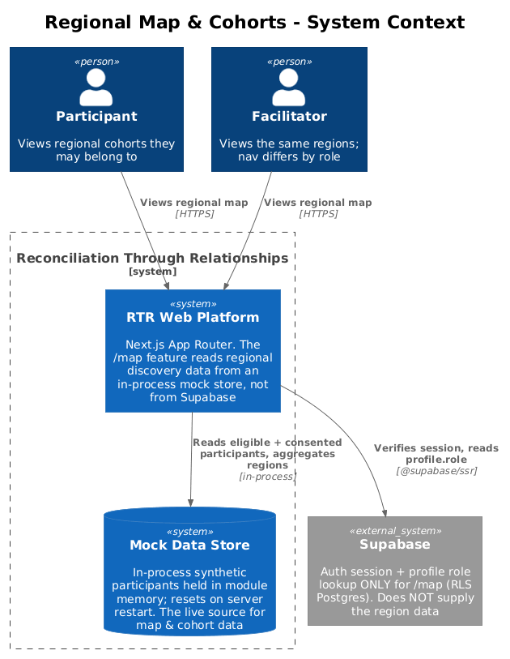
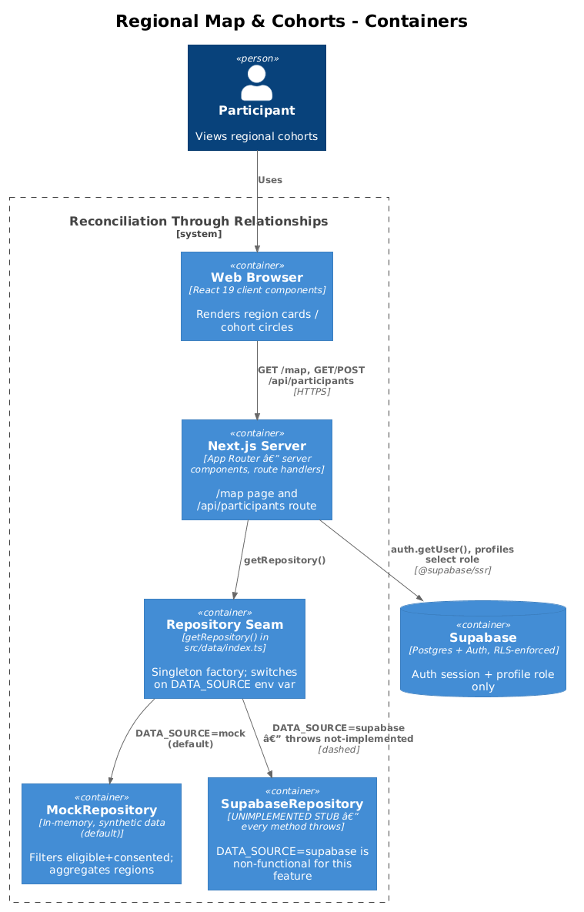
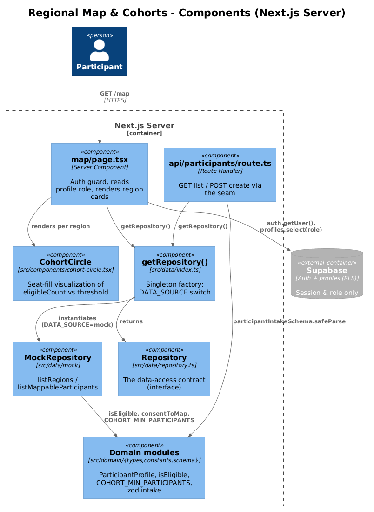
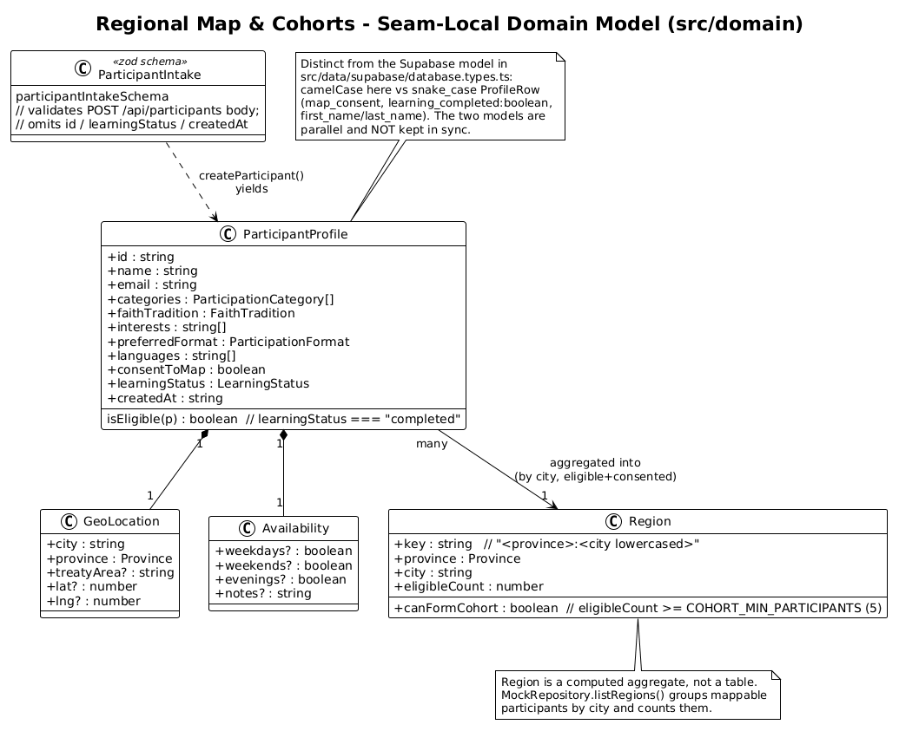
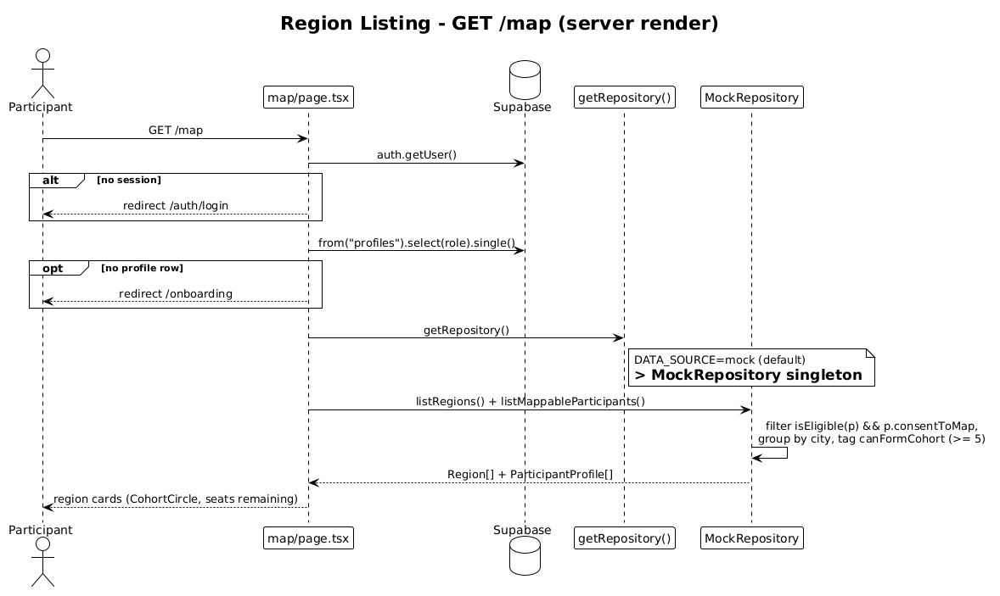

# Regional Map & Cohorts — Detailed Design

## 1. Overview

The Regional Map & Cohorts feature (`/map`) lets an authenticated user discover
where fellow participants are gathering across Canada. It groups eligible,
consenting participants into **regions** (city + province) and shows, per region,
how many people are ready and whether a local **cohort** can form (a cohort needs
`COHORT_MIN_PARTICIPANTS = 5` eligible participants). Regions render as cards with
a `CohortCircle` seat-fill visual — not as a geographic map. (A pixel map is a
documented TODO in the page; Mapbox is used elsewhere — see
[04 Participant Dashboard & Discovery](../04-participant-dashboard-and-discovery/README.md).)

This feature is architecturally unusual for the RTR app. Every other feature talks
to Supabase directly from React components under Row-Level Security. This feature
alone reads through a **repository seam**: `getRepository()` in `src/data/index.ts`
returns a `Repository` implementation chosen by the `DATA_SOURCE` environment
variable. In the shipped configuration `DATA_SOURCE=mock`, so the live data source
is `MockRepository` — an **in-process store of synthetic participants held in
module memory** (`src/data/mock/participants.ts`). The alternative,
`SupabaseRepository`, is an unfilled stub whose every method throws.

Supabase is still involved, but only at the edges: the `/map` server component
uses it to verify the session and read `profile.role` (to pick the correct nav).
The region and cohort data itself never comes from Supabase in this build.

The same seam backs the demo route `src/app/api/participants/route.ts`
(`GET` list / `POST` create with zod validation). Those are the only two callers
of `getRepository()` in the entire application.

## 2. Architecture

### 2.1 C4 Context Diagram

### 2.2 C4 Container Diagram

### 2.3 C4 Component Diagram

## 3. Component Details

### 3.1 `src/app/map/page.tsx` — Map page (Server Component)
- **Responsibility:** Render the regional discovery view. Guard access (redirect to
  `/auth/login` if unauthenticated, `/onboarding` if no profile row), read the
  user's `role` to choose between `FacilitatorNav` and `DashboardNav`, then read
  regions + mappable participants through the repository and render a card grid.
- **Interfaces:** Default async server component (route `GET /map`). No props.
- **Dependencies:** `createSupabaseServerClient` (auth + profile read),
  `getRepository()`, `COHORT_MIN_PARTICIPANTS`, `CohortCircle`, plus layout
  components (`PageIntro`, `EmptyState`, `AppFooter`, `Card`, `Badge`).
- **Data touched:** Supabase `profiles` (read `*` for the current user, uses
  `role`); repository `listRegions()` and `listMappableParticipants()`. It does
  **not** read participant data from Supabase.

### 3.2 `src/data/index.ts` — `getRepository()` factory
- **Responsibility:** Return the single `Repository` instance for the process,
  choosing the implementation from `process.env.DATA_SOURCE` (default `"mock"`).
  Caches the instance in a module-level singleton.
- **Interfaces:** `getRepository(): Repository`; re-exports the `Repository` type.
- **Dependencies:** `MockRepository`, `SupabaseRepository`.
- **Data touched:** None directly — it only wires up the chosen implementation.

### 3.3 `src/data/repository.ts` — `Repository` interface
- **Responsibility:** The one data-access contract the app codes against. Declares
  participant CRUD (`listParticipants`, `getParticipant`, `createParticipant`,
  `updateLearningStatus`), regional discovery (`listMappableParticipants`,
  `listRegions`), and facilitator matching (`listMatches`, `createMatch`,
  `updateMatchStatus`). This feature uses only the discovery + create methods.
- **Interfaces:** TypeScript `interface Repository`.
- **Dependencies:** Domain types (`ParticipantProfile`, `Region`, `Match`,
  `ParticipantIntake`).
- **Data touched:** None (contract only).

### 3.4 `src/data/mock/mock-repository.ts` — `MockRepository` (live implementation)
- **Responsibility:** Serve all repository calls from an in-memory array seeded
  from `MOCK_PARTICIPANTS`. For this feature: `listMappableParticipants()` returns
  participants where `isEligible(p) && p.consentToMap`; `listRegions()` groups
  those by `province:cityLowercased`, counts them into `eligibleCount`, sets
  `canFormCohort = eligibleCount >= COHORT_MIN_PARTICIPANTS`, and sorts regions by
  descending count.
- **Interfaces:** Implements `Repository`.
- **Dependencies:** `MOCK_PARTICIPANTS`, `isEligible`, `COHORT_MIN_PARTICIPANTS`.
- **Data touched:** Module-memory `participants` array (state resets on restart).

### 3.5 `src/data/supabase/supabase-repository.ts` — `SupabaseRepository` (stub)
- **Responsibility:** Intended Supabase-backed implementation. **Not implemented** —
  every method calls `notImplemented()` and throws. Selecting `DATA_SOURCE=supabase`
  would make `/map` and `/api/participants` throw at runtime.
- **Interfaces:** Implements `Repository` (in signature only).
- **Dependencies:** None active.
- **Data touched:** None.

### 3.6 `src/app/api/participants/route.ts` — Participants demo API (Route Handler)
- **Responsibility:** Reference JSON API over the seam. `GET` returns
  `{ participants }` from `repo.listParticipants()`. `POST` validates the body with
  `participantIntakeSchema`, returns `400` with flattened issues on failure, else
  calls `repo.createParticipant()` and returns `201 { participant }`.
- **Interfaces:** `GET`, `POST` at `/api/participants`.
- **Dependencies:** `getRepository()`, `participantIntakeSchema`.
- **Data touched:** Repository participant collection (mock memory in this build).
  No authentication or authorization is applied at the route.

### 3.7 `src/domain/*` — Seam-local domain model
- **Responsibility:** The types and rules this seam is built on:
  `types.ts` (`ParticipantProfile`, `GeoLocation`, `Region`, `isEligible`),
  `constants.ts` (option lists + `COHORT_MIN_PARTICIPANTS`), `schema.ts`
  (`participantIntakeSchema`, `ParticipantIntake`), and `matching.ts`
  (`scorePair`/`suggestMatches`, used by the facilitator flow, not by `/map`).
- **Interfaces:** Plain TypeScript types, one zod schema, pure functions.
- **Dependencies:** Zod (schema only).
- **Data touched:** None — pure definitions/logic.

### 3.8 `src/components/cohort-circle.tsx` — `CohortCircle`
- **Responsibility:** Visualize progress toward a cohort: draws `threshold` seats
  around a circle, fills `min(count, threshold)` of them, shows the numeric `count`
  in the center, and adds a dashed "ready" ring once `count >= threshold`. Purely
  presentational; accessible via a `role="img"` label.
- **Interfaces:** `CohortCircle({ count, threshold?, size?, className? })`.
- **Dependencies:** `cn` utility only.
- **Data touched:** None.

## 4. Data Model

### 4.1 Class Diagram

### 4.2 Entity Descriptions

- **`ParticipantProfile`** (`src/domain/types.ts`) — the seam's participant record.
  This feature reads `learningStatus` (eligibility via `isEligible` =
  `learningStatus === "completed"`), `consentToMap` (map opt-in), and
  `location.{city, province}` (region grouping). `lat`/`lng` exist on
  `GeoLocation` but are **not** consumed by the current region-card UI. Note the
  divergence from Supabase: the same concept there is `ProfileRow`
  (`src/data/supabase/database.types.ts`) with snake_case columns and a different
  shape — `map_consent: boolean`, `learning_completed: boolean` (a boolean, not the
  three-state `learningStatus` enum), and `first_name`/`last_name` instead of
  `name`. The two models are parallel and not kept in sync.

- **`GeoLocation`** — nested on `ParticipantProfile`: `city`, `province`, optional
  `treatyArea`, optional `lat`/`lng`. Only `city` + `province` drive region keys.

- **`Region`** (`src/domain/types.ts`) — a **computed aggregate, not a table**.
  `key = "<province>:<cityLowercased>"`, plus `province`, `city`, `eligibleCount`,
  and `canFormCohort`. Produced on the fly by `MockRepository.listRegions()`.

- **`ParticipantIntake`** (`src/domain/schema.ts`) — the zod-inferred shape accepted
  by `POST /api/participants`. It omits server-assigned fields (`id`,
  `learningStatus`, `createdAt`), which `createParticipant()` fills in.

- **`cohorts` / `cohort_members`** (Supabase, `supabase/migrations/001_initial_schema.sql`)
  — real Postgres tables exist for persisted cohorts, but **this feature does not
  read or write them**, and no code path anywhere inserts into them. The `/map`
  notion of a "cohort" is the runtime `canFormCohort` flag on the computed `Region`,
  entirely separate from these tables. (The dashboard and facilitator pages only
  read counts from them — see [07 Facilitator Console](../07-facilitator-console/README.md).)

## 5. Key Workflows

### 5.1 Region Listing on `GET /map`

1. An authenticated user requests `/map`; the server component runs.
2. `createSupabaseServerClient().auth.getUser()` verifies the session. No user →
   `redirect("/auth/login")`.
3. `from("profiles").select("*").single()` loads the profile. No row →
   `redirect("/onboarding")`. `profile.role` selects `FacilitatorNav` vs
   `DashboardNav`.
4. `getRepository()` returns the `MockRepository` singleton (because
   `DATA_SOURCE=mock`).
5. In parallel, `repo.listRegions()` and `repo.listMappableParticipants()` run.
   Both filter to `isEligible(p) && p.consentToMap`; `listRegions()` additionally
   groups by city and flags `canFormCohort` at the `COHORT_MIN_PARTICIPANTS`
   threshold.
6. The page renders one `Card` per region with a `CohortCircle` and either a
   "Ready to gather" badge or an "N seats remaining" badge, plus a summary line
   ("X consenting participants across Y regions"). Zero regions → `EmptyState`.

## 6. API Contracts

This feature's page (`/map`) has no HTTP API of its own — it is a server-rendered
route that calls repository methods in-process. The associated demo API is
`src/app/api/participants/route.ts`:

- **`GET /api/participants`** → `200 { participants: ParticipantProfile[] }`.
  No auth check; returns the full participant list from `repo.listParticipants()`
  (mock data in this build). No pagination or filtering.

- **`POST /api/participants`** — body validated by `participantIntakeSchema`
  (zod). On failure: `400 { error: "Validation failed", issues }` (flattened zod
  errors). On success: `repo.createParticipant(intake)` runs and returns
  `201 { participant: ParticipantProfile }`. The server assigns `id`,
  `learningStatus: "not-started"`, and `createdAt`. No auth check; new participants
  are **not** map-visible until they are eligible (`completed`) and
  `consentToMap === true`.

Repository methods used by this feature (the in-process contract):

| Method | Returns | Filter / rule |
| --- | --- | --- |
| `listMappableParticipants()` | `ParticipantProfile[]` | `isEligible(p) && p.consentToMap` |
| `listRegions()` | `Region[]` | mappable participants grouped by `province:city`, `canFormCohort` at threshold, sorted by count desc |
| `listParticipants()` | `ParticipantProfile[]` | all participants (unfiltered) |
| `createParticipant(intake)` | `ParticipantProfile` | server-assigns `id`, `learningStatus`, `createdAt` |

## 7. Security Considerations

The security model for this feature is **application-code enforcement inside the
repository**, not Postgres RLS — because the live data is the in-process mock, not
Supabase. The protections that actually apply:

- **Consent + eligibility gate (privacy):** `listMappableParticipants()` returns
  only participants who are both eligible (`learningStatus === "completed"`) **and**
  have `consentToMap === true`. `consentToMap` defaults to `false` (privacy-first).
  In the seed data this correctly withholds a completed participant who opted out
  (`p-009`) and in-progress participants (`p-008`, `p-010`).

- **Coarse-grained location (privacy):** region cards expose only `city` +
  `province` and an aggregate count — never names, emails, or the `lat`/`lng`
  stored on the profile. This city-level aggregation is the real privacy boundary.

- **Input validation:** `POST /api/participants` validates every field with
  `participantIntakeSchema` before persisting, rejecting malformed input with `400`.

- **Auth for the page:** `/map` requires a Supabase session and a profile row;
  otherwise it redirects. This gate is Supabase-backed even though the region data
  is not.

Important nuance: `COHORT_MIN_PARTICIPANTS` is **not** a privacy-suppression
threshold. Regions below 5 are **still shown** with their exact count and a "seats
remaining" badge; the threshold only toggles `canFormCohort`. So a region with a
single consenting participant is displayed (revealing that one person is in that
city). If k-anonymity-style suppression of tiny regions is desired, it is not
implemented today. Note also that `/api/participants` (both `GET` and `POST`) has
**no authentication or authorization** at the route; in the mock build it exposes
only synthetic data, but the pattern would leak/allow-write real data if
`SupabaseRepository` were implemented and wired without adding auth.

## 8. Open Questions

1. **`SupabaseRepository` is an unfilled stub.** Every method throws
   `notImplemented()`. Running with `DATA_SOURCE=supabase` — which the deployment
   docs list as the production setting — would make `/map` and `/api/participants`
   throw at runtime. This feature is functional only under `DATA_SOURCE=mock`, whose
   data is synthetic and resets on restart. What is the plan to implement the
   Supabase repository (and its equivalents of the eligibility/consent filters and
   region aggregation) before production?

2. **The repository seam serves only `/map` and `/api/participants`.** These are the
   only two callers of `getRepository()` in the codebase; every other feature calls
   Supabase directly from client components under RLS. Is this seam an intended
   convergence path (everything migrating behind `Repository` eventually), or an
   abandoned abstraction that should be removed and folded into the direct-Supabase
   pattern used everywhere else?

3. **Two parallel domain models.** The seam carries its own camelCase model
   (`src/domain/types.ts`: `ParticipantProfile`, `consentToMap`, three-state
   `learningStatus`) alongside the snake_case Supabase model
   (`src/data/supabase/database.types.ts`: `ProfileRow`, `map_consent`, boolean
   `learning_completed`, `first_name`/`last_name`). They are not kept in sync and
   even differ in shape. Which is authoritative going forward, and who owns the
   mapping when/if `SupabaseRepository` is implemented?

Related: the `cohorts` and `cohort_members` Postgres tables (with RLS: any
authenticated user can read; only facilitators may write) exist but are never
written by any code path, and this mock-backed feature does not touch them at all —
its "cohort" concept lives only in the computed `Region.canFormCohort` flag. Should
persisted cohorts and the map's cohort concept be reconciled?
