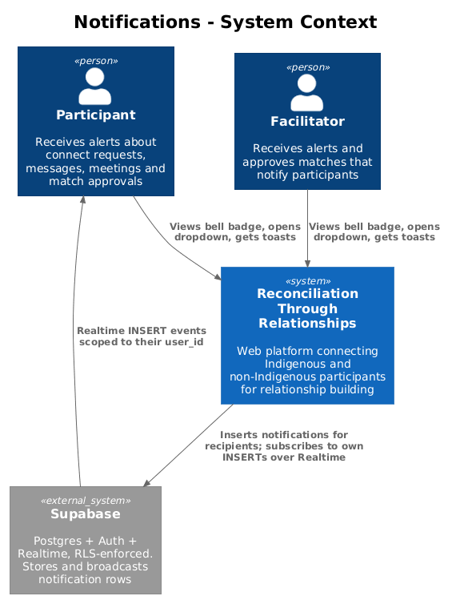
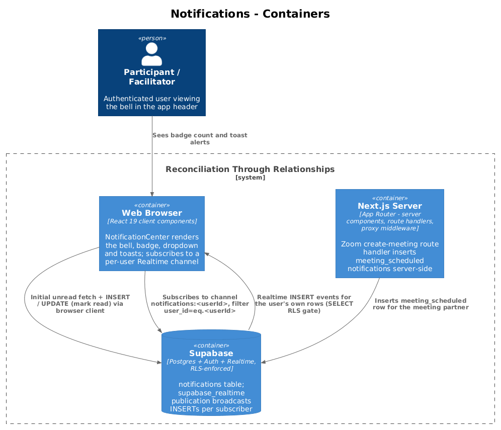
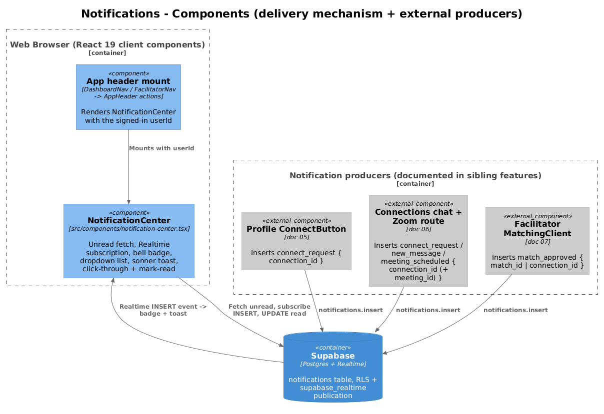
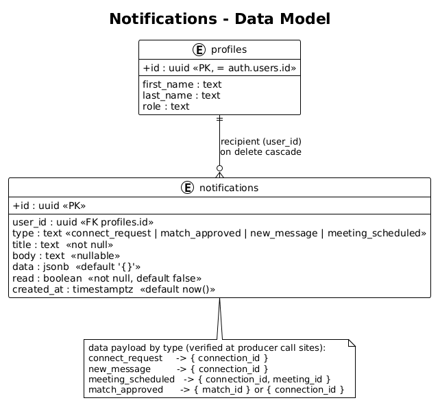
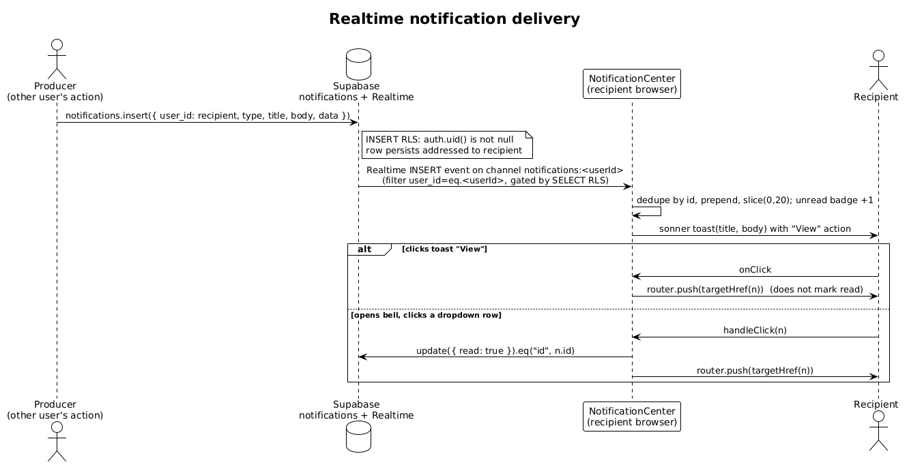

# Notifications — Detailed Design

## 1. Overview

Notifications is a small, cross-cutting feature that owns the **delivery mechanism** for in-app alerts on the Reconciliation Through Relationships platform (the RTR app). It does not own the events that trigger alerts — those are produced by other features. Its job is to store notification rows, push them to the right recipient in real time, and surface them in the app header as a bell badge, a dropdown list, and a transient toast that links through to the relevant page.

The entire feature is two things:

- The **`notifications` table** (`supabase/migrations/001_initial_schema.sql`), Realtime-enabled via the `supabase_realtime` publication.
- The **`NotificationCenter`** client component (`src/components/notification-center.tsx`), mounted into the app header for authenticated participants and facilitators.

There is no HTTP API, no server action, and no service layer. Producers insert rows directly into the `notifications` table with the Supabase client; the recipient's browser is subscribed to a per-user Realtime channel and reacts to the `INSERT`. RLS is the security model throughout.

Producers live in sibling features and are cross-referenced here rather than re-documented:

- **Profile ConnectButton** — `../05-profiles-and-connect-requests/README.md` — produces `connect_request`.
- **Connections chat + Zoom meeting route** — `../06-connections-chat-and-meetings/README.md` — produces `connect_request`, `new_message`, and `meeting_scheduled`.
- **Facilitator MatchingClient** — `../07-facilitator-console/README.md` — produces `match_approved`.

## 2. Architecture

### 2.1 C4 Context Diagram

Participants and facilitators are both recipients (and, through their own actions, indirectly producers). Supabase stores the rows and broadcasts each `INSERT` back to the addressed recipient's browser over Realtime.

### 2.2 C4 Container Diagram

Most of the feature lives in the **Web Browser** container: `NotificationCenter` fetches the initial unread set, subscribes to a per-user Realtime channel, and performs mark-as-read updates, all through the browser Supabase client. The **Next.js Server** container appears only because one producer — the Zoom `create-meeting` route handler — inserts a `meeting_scheduled` notification server-side using the server Supabase client. Supabase holds the `notifications` table and the `supabase_realtime` publication that fans `INSERT`s out per subscriber.

### 2.3 C4 Component Diagram

`NotificationCenter` is mounted by the app-header wrappers (`DashboardNav` / `FacilitatorNav`), which pass it as an `actions` element into the shared `AppHeader`. The three producer groups are drawn as external components owned by docs 05, 06, and 07; each simply calls `notifications.insert(...)`.

## 3. Component Details

### 3.1 NotificationCenter (`src/components/notification-center.tsx`)

**Responsibility.** Render the header bell with an unread-count badge, a dropdown list of the 20 most recent notifications, and a live toast for each new notification as it arrives. Own the read-state transitions and the click-through navigation.

**Interfaces.**
- Props: `{ userId: string }` — the signed-in user whose notifications to load and subscribe to.
- Renders a `DropdownMenu` (shadcn/Base UI) triggered by a bell `Button`; badge shows `unread`, capped as `"9+"` when greater than 9.
- `targetHref(n)` — pure helper that maps a notification to a route:
  - `new_message` | `connect_request` | `meeting_scheduled` → `/connections/${connection_id}` when `data.connection_id` is present, else `/connections`.
  - `match_approved` → `/connections/${connection_id}` when present, else `/dashboard`. (Note: it reads only `connection_id`, so a `match_approved` carrying only `{ match_id }` falls back to `/dashboard`.)
  - otherwise `null`.
- `markAllRead()` — optimistically flips every loaded notification to `read: true`, then `update({ read: true }).eq("user_id", userId).eq("read", false)`.
- `handleClick(n)` — if unread, optimistically marks that one read and `update({ read: true }).eq("id", n.id)`, then navigates via `targetHref(n)` (closing the dropdown).

**Dependencies.**
- `createSupabaseBrowserClient` (`src/data/supabase/browser-client.ts`) — cookie-session browser client.
- `useRouter` (`next/navigation`) for click-through navigation.
- `sonner` `toast` for the transient alert; `date-fns` `formatDistanceToNow` for relative timestamps; `lucide-react` icons keyed by type (`Heart`, `CheckCircle2`, `MessageCircle`, `Video`, fallback `Bell`).
- `Notification` type from `src/data/supabase/database.types.ts`.

**Data touched.** Reads `notifications` (initial fetch: `select("*").eq("user_id", userId).order("created_at", desc).limit(20)`); writes `notifications.read` via `update`. Subscribes to Realtime `INSERT`s on `notifications` filtered to `user_id=eq.${userId}`.

**Lifecycle.** A single `useEffect` keyed on `[userId, router]` runs the initial fetch, opens channel `notifications:${userId}`, and returns a cleanup that sets a `mounted` guard false and calls `supabase.removeChannel(channel)`. On each `INSERT` payload it dedupes by `id`, prepends, and slices to 20, then fires the toast with a **View** action wired to `targetHref`.

### 3.2 App-header mount (`DashboardNav` / `FacilitatorNav`)

**Responsibility.** Place `NotificationCenter` in the header for authenticated areas. `NotificationCenter` is **not** referenced by `src/components/app-header.tsx` directly — `AppHeader` is a generic presentational header exposing an `actions` slot.

**Interfaces / wiring.**
- `src/app/dashboard/components/DashboardNav.tsx` renders `<NotificationCenter userId={user.id} />` inside the `actions` prop of `AppHeader` (participant surfaces: dashboard, learn, connections, map).
- `src/app/facilitator/components/FacilitatorNav.tsx` renders `<NotificationCenter userId={facilitator.id} />` the same way (facilitator surfaces).

**Dependencies.** `AppHeader` (`src/components/app-header.tsx`), which renders whatever `actions` node it is given. The wrappers supply the signed-in `Profile` and derive the `userId`.

**Data touched.** None directly — they only pass `userId` down.

## 4. Data Model

### 4.1 Class Diagram

### 4.2 Entity Descriptions

**`notifications`** (`supabase/migrations/001_initial_schema.sql`) — one row per delivered alert.

| Column | Type | Notes |
| --- | --- | --- |
| `id` | `uuid` PK | `default uuid_generate_v4()` |
| `user_id` | `uuid` | Recipient. FK → `profiles.id`, `on delete cascade`. All queries and the Realtime filter key on this. |
| `type` | `text` | Check-constrained enum: `connect_request`, `match_approved`, `new_message`, `meeting_scheduled`. Drives the icon and routing. |
| `title` | `text` not null | Shown as the primary line and the toast title. |
| `body` | `text` nullable | Secondary line / toast description. |
| `data` | `jsonb` | `default '{}'`. Type-specific payload used for routing (see below). |
| `read` | `boolean` not null | `default false`. Drives the unread badge and the "unread" styling. |
| `created_at` | `timestamptz` not null | `default now()`. Sort key (`order by created_at desc`) and the relative-time label. |

The `data` payload shape by type — verified at each producer call site:

- `connect_request` → `{ connection_id }`
- `new_message` → `{ connection_id }`
- `meeting_scheduled` → `{ connection_id, meeting_id }`
- `match_approved` → `{ match_id }` (from match approval) **or** `{ connection_id }` (from connection review)

**`profiles`** — referenced only as the recipient (`user_id → profiles.id`). See `../01-auth-and-access/README.md` for the full entity. Deleting a profile cascades its notifications.

Realtime: `001_initial_schema.sql` ends with `alter publication supabase_realtime add table public.notifications;`, which is what makes per-user `INSERT` streaming possible.

## 5. Key Workflows

### 5.1 Realtime notification delivery

1. A producer in another feature calls `supabase.from("notifications").insert({ user_id: <recipient>, type, title, body, data })`. The recipient is always the *other* party, never the actor.
2. The row's `INSERT` is allowed by RLS because the caller is authenticated (`auth.uid() is not null`); it persists addressed to the recipient.
3. Supabase Realtime broadcasts the `INSERT` on the recipient's channel `notifications:<userId>` (subscription filter `user_id=eq.<userId>`; the broadcast is gated by the table's SELECT RLS for that subscriber).
4. `NotificationCenter` receives the payload, dedupes by `id`, prepends it, trims the list to 20, and the unread badge increments.
5. A `sonner` toast fires with the `title`/`body` and a **View** action.
6. If the user clicks the toast's **View**, it navigates via `targetHref(n)` but does **not** mark the notification read. If the user instead opens the bell and clicks a dropdown row, `handleClick` marks that row read (`update read=true` by `id`) and then navigates. "Mark all read" bulk-updates all unread rows for the user.

## 6. API Contracts

There is no HTTP API for notifications. The contract is the set of Supabase table operations against `public.notifications`.

**Reads / subscription (consumer — `NotificationCenter`, browser client):**

| Operation | Shape | RLS gate |
| --- | --- | --- |
| `select("*")` | `.eq("user_id", userId).order("created_at", desc).limit(20)` | `Users can read own notifications` — `auth.uid() = user_id` |
| Realtime subscribe | channel `notifications:${userId}`, `postgres_changes` `INSERT`, `filter: user_id=eq.${userId}` | SELECT policy above authorizes the per-subscriber broadcast |
| `update({ read: true })` | by `id`, or `.eq("user_id", userId).eq("read", false)` for mark-all | `Users can update own notifications` — `auth.uid() = user_id` |

**Writes (producers — `INSERT` a row addressed to another user):** every producer sends `{ user_id, type, title, body, data }`; `read` defaults to `false`, `id`/`created_at` are server-defaulted. All are gated by `Authenticated users can send notifications` — `with check (auth.uid() is not null)`.

| Producer (file) | `type` | `data` payload |
| --- | --- | --- |
| `ConnectButton` (`src/app/profile/[userId]/ConnectButton.tsx`) | `connect_request` | `{ connection_id }` |
| `ConnectionChat` connect (`src/app/connections/components/ConnectionChat.tsx`) | `connect_request` | `{ connection_id }` |
| `ConnectionChat` message (same file) | `new_message` | `{ connection_id }` |
| Zoom route (`src/app/api/zoom/create-meeting/route.ts`, **server client**) | `meeting_scheduled` | `{ connection_id, meeting_id }` |
| `MatchingClient` match approve (`src/app/facilitator/matching/MatchingClient.tsx`) | `match_approved` | `{ match_id }` |
| `MatchingClient` connection review (same file, batch insert of 2) | `match_approved` | `{ connection_id }` |

## 7. Security Considerations

The `notifications` policies changed between migrations, and the change is central to how the feature works.

- **Original (`001_initial_schema.sql`).** A single `for all` policy — `Users can manage own notifications` `using (auth.uid() = user_id)`. PostgREST applies a `for all` `using` expression as the INSERT check too, so a user could only ever insert a notification whose `user_id` was **their own**. Because every producer notifies the *other* party, every cross-user notification was silently rejected by RLS.

- **Fix (`004_connection_request_policies.sql`).** That policy was dropped and split by operation:
  - `Users can read own notifications` — `select using (auth.uid() = user_id)`.
  - `Users can update own notifications` — `update using (auth.uid() = user_id)` (backs mark-as-read).
  - `Users can delete own notifications` — `delete using (auth.uid() = user_id)`.
  - `Authenticated users can send notifications` — `insert with check (auth.uid() is not null)`.

- **Read isolation.** SELECT is strictly own-rows, so a user only ever fetches or streams notifications addressed to them.

- **Realtime authorization.** Realtime `postgres_changes` honours the table's SELECT RLS per subscriber. The subscription filter `user_id=eq.${userId}` aligns with `auth.uid() = user_id`, so a browser session receives `INSERT` events only for its own rows — a client cannot subscribe to another user's notifications even by changing the filter.

- **Permissive INSERT (by design, worth noting).** The INSERT check is only `auth.uid() is not null`; there is no constraint tying the sender to the recipient (e.g. a shared connection). Any authenticated user can therefore write a notification row addressed to any `user_id`, with arbitrary `type`/`title`/`body`/`data`. This is the intentional trade-off that lets client-side producers notify their counterpart without a privileged server path; the blast radius is limited to unsolicited in-app alerts (no elevation, no read access to others' data).

## 8. Open Questions

- The permissive INSERT policy (`auth.uid() is not null`) allows any authenticated user to create a notification for any other user with arbitrary content. If unsolicited/spoofed alerts become a concern, the INSERT check could be tightened to require a shared `connection` or facilitator role — at the cost of moving some producers behind a privileged path.
- `match_approved` notifications produced by the facilitator match-approval path carry only `{ match_id }`, which `targetHref` does not resolve, so those route to `/dashboard` rather than a specific connection. The connection-review path carries `{ connection_id }` and deep-links correctly. Whether the `match_id`-only variant should also deep-link is unresolved.
- The dropdown loads at most 20 notifications and there is no "load more" or server-side unread count, so the badge reflects only unread rows within the most recent 20.
