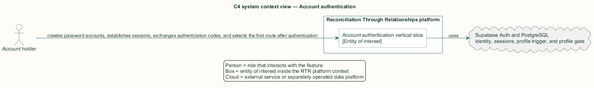
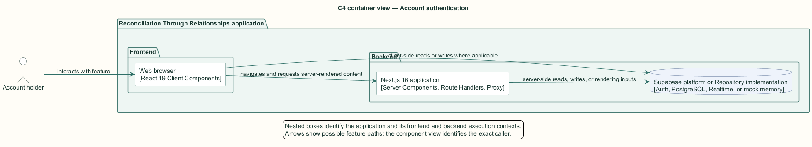
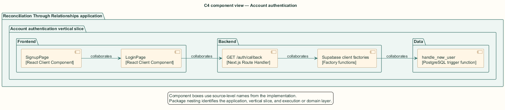
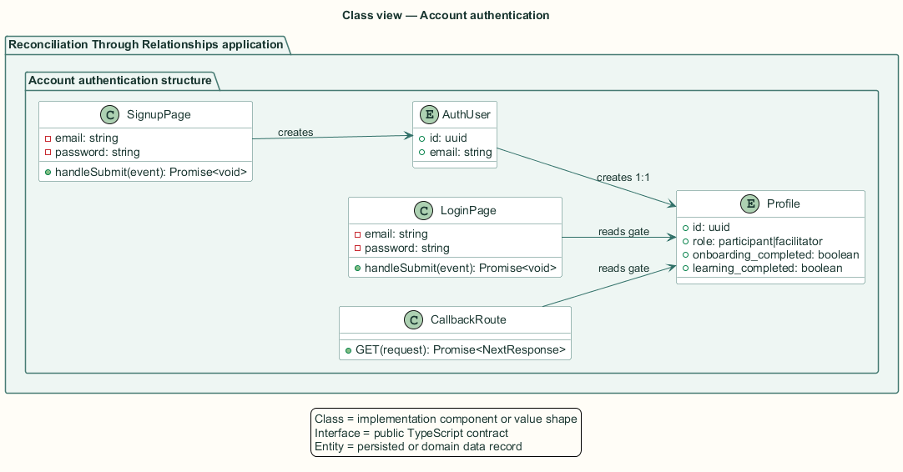
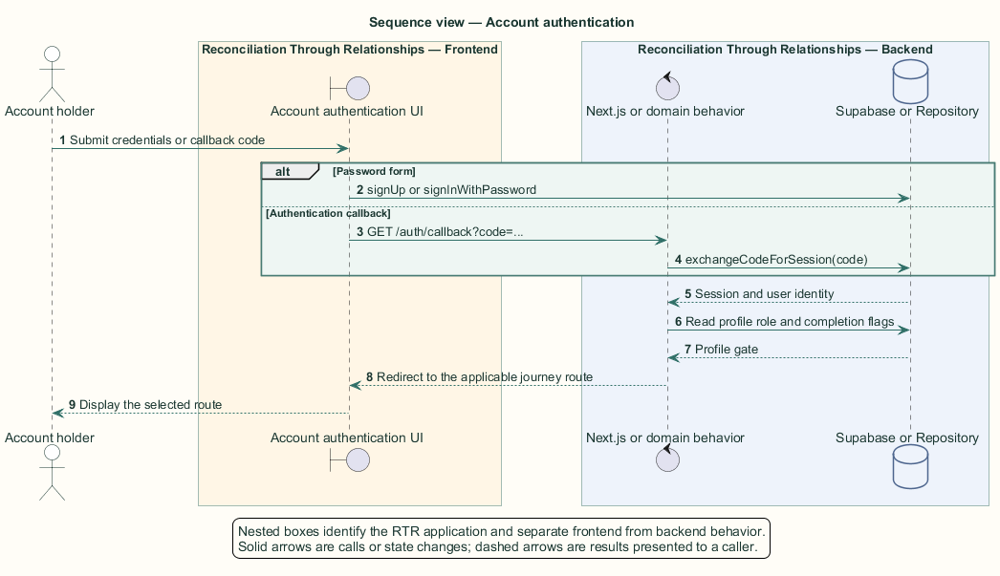

# Account authentication — Detailed design

## Overview

Account authentication — vertical slice that creates password accounts, establishes sessions, exchanges authentication codes, and selects the first route after authentication

A visitor becomes an account holder through Supabase Auth. A database trigger creates the associated application profile with the participant role and incomplete journey flags.

Password sign-up and sign-in execute in browser client components. The callback route handles a provider-issued code on the backend. All three entry paths use profile role and completion flags to choose the next application route.

The entity of interest (EoI) is the Account authentication vertical slice of the Reconciliation Through Relationships platform. This focused architecture description (AD) describes that slice and does not claim full conformance with 42010:2022.

## Description

### Components, types, functions, and classes

| Element | Kind | Source | Responsibility and public interface |
| --- | --- | --- | --- |
| `SignupPage` | React Client Component | `src/app/auth/signup/page.tsx` | `handleSubmit` validates credentials, calls Auth, and routes to onboarding. |
| `LoginPage` | React Client Component | `src/app/auth/login/page.tsx` | `handleSubmit` signs in, reads the profile gate, and routes by journey stage. |
| `GET /auth/callback` | Next.js Route Handler | `src/app/auth/callback/route.ts` | `GET(request): Promise<NextResponse>` exchanges `code` for a session. |
| `Supabase client factories` | Factory functions | `src/data/supabase` | `createSupabaseBrowserClient` and `createSupabaseServerClient` create typed clients. |
| `handle_new_user` | PostgreSQL trigger function | `supabase/migrations/001_initial_schema.sql` | Creates `profiles(id)` after an `auth.users` insert. |

### Structure and relationships

- `SignupPage` calls `auth.signUp` and then `auth.signInWithPassword`; `handle_new_user` creates the default profile between those operations.

- `LoginPage` and the callback route read `profiles.role`, `onboarding_completed`, and `learning_completed` after the session exists.

- The browser client carries interactive form state. The route handler and server client keep callback cookie exchange on the backend.

### Behaviour

1. The account holder submits credentials through the sign-up or sign-in form, or returns with an authentication code.

2. Supabase Auth validates the request and establishes a cookie-backed session on success.

3. The sign-up trigger creates a participant profile with both journey gates incomplete.

4. The active entry component reads the profile gate and selects `/facilitator`, `/onboarding`, `/learn`, or `/dashboard`.

5. An authentication failure remains on or returns to `/auth/login` with a retryable error indication.

## Requirements

This section contains L2 requirements only. It intentionally includes no L1 requirement text. The L1 specification identifier records the traceability correspondence for each L2 requirement.

| L2 specification ID | L1 specification ID | Requirement text |
| --- | --- | --- |
| `L2-AUTH-006` | `L1-AUTH-002` | Visitors shall create an account at `/auth/signup` with email, password, and password confirmation, with client-side password rules. |
| `L2-AUTH-007` | `L1-AUTH-002` | Users shall sign in at `/auth/login` with email and password and be routed to the stage of the journey they have reached. |
| `L2-AUTH-008` | `L1-AUTH-002` | A failed sign-in shall show the backend error and leave the form usable for another attempt. |
| `L2-AUTH-009` | `L1-AUTH-002` | `GET /auth/callback` shall exchange the provided code for a session and route the user by role and journey stage; failures shall return to sign-in with an error indicator. |

## Diagrams

The five architecture views use one caption pattern and stable EoI-local names. Each view component is available as PlantUML source and as an inline Portable Network Graphics (PNG) rendering.

### C4 system context view

[PlantUML source](diagrams/c4-context.puml)

Figure 1 — C4 system context view: the Account authentication EoI, its actor, and its external dependencies. The view component uses the C4 system context model kind.

### C4 container view

[PlantUML source](diagrams/c4-container.puml)

Figure 2 — C4 container view: the frontend, backend, data, and integration boundaries. The view component uses the C4 container model kind.

### C4 component view

[PlantUML source](diagrams/c4-component.puml)

Figure 3 — C4 component view: the source-level components and their structural relationships. The view component uses the C4 component model kind.

### Class view

[PlantUML source](diagrams/class-diagram.puml)

Figure 4 — Class view: the feature types, functions, classes, entities, and their relationships. The view component uses the Unified Modeling Language (UML) class model kind.

### Sequence view

[PlantUML source](diagrams/sequence-diagram.puml)

Figure 5 — Sequence view: the principal end-to-end feature behavior. Nested application boxes separate frontend behavior from backend behavior. The view component uses the UML sequence model kind.
