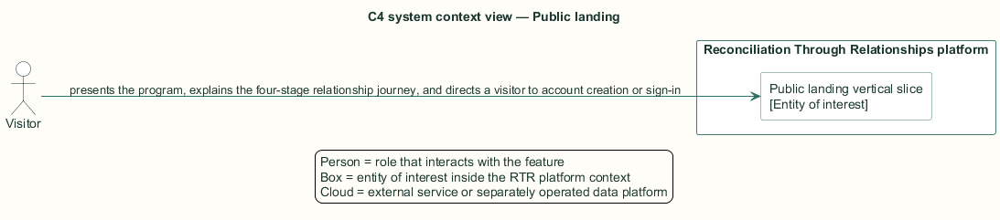
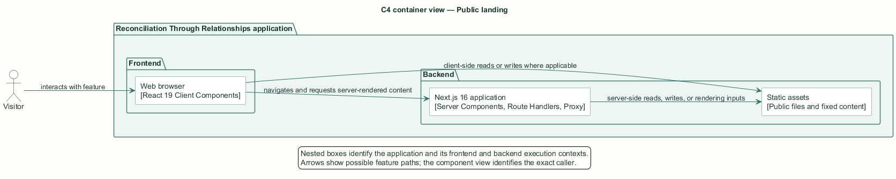
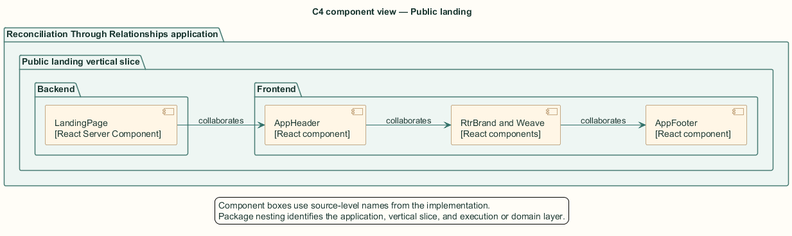
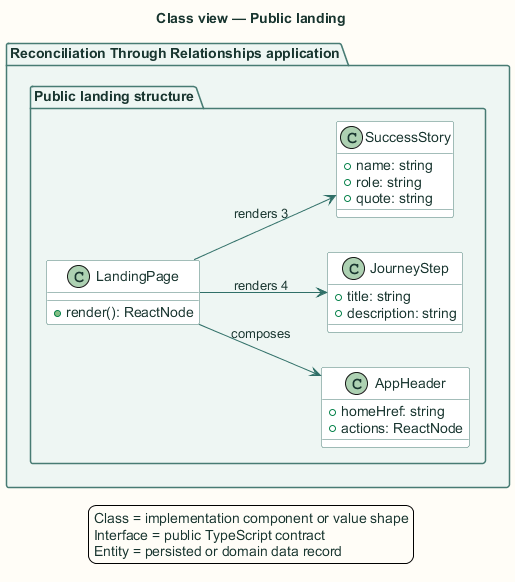
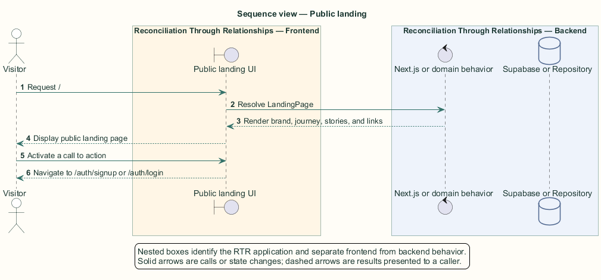

# Public landing — Detailed design

## Overview

Public landing — vertical slice that presents the program, explains the four-stage relationship journey, and directs a visitor to account creation or sign-in

Reconciliation Through Relationships is a web platform that brings Indigenous and non-Indigenous participants together for learning and one-to-one relationship building. The public landing route is the unauthenticated entry point. It establishes the platform identity before any account or profile data exists.

The slice is presentation-only. The Next.js server renders fixed content, brand assets, journey steps, testimonials, and internal links. It performs no Supabase query and creates no session.

The entity of interest (EoI) is the Public landing vertical slice of the Reconciliation Through Relationships platform. This focused architecture description (AD) describes that slice and does not claim full conformance with 42010:2022.

## Description

### Components, types, functions, and classes

| Element | Kind | Source | Responsibility and public interface |
| --- | --- | --- | --- |
| `LandingPage` | React Server Component | `src/app/page.tsx` | `LandingPage(): ReactNode` renders `/`. |
| `AppHeader` | React component | `src/components/app-header.tsx` | `AppHeader` receives public actions and navigation props. |
| `RtrBrand and Weave` | React components | `src/components/rtr-brand.tsx` | Brand mark and decorative motif components. |
| `AppFooter` | React component | `src/components/app-footer.tsx` | Shared footer rendered after landing content. |

### Structure and relationships

- `LandingPage` composes `AppHeader`, brand components, design-system primitives, and `AppFooter` into one server-rendered response.

- Next.js `Link` elements relate the public route to `/auth/signup`, `/auth/login`, and the in-page `#how` anchor.

- The `/public/rtr-logo.png` asset supplies the visible organization logo; no application data store participates in the slice.

### Behaviour

1. The visitor requests `/`.

2. The Next.js App Router invokes `LandingPage` as a server component.

3. The component renders the brand, invitation, journey, testimonials, and calls to action.

4. The browser follows a selected internal link to sign-up, sign-in, or the journey section.

## Requirements

This section contains L2 requirements only. It intentionally includes no L1 requirement text. The L1 specification identifier records the traceability correspondence for each L2 requirement.

| L2 specification ID | L1 specification ID | Requirement text |
| --- | --- | --- |
| `L2-LAND-001` | `L1-LAND-001` | The landing page shall present the platform under the brand "Reconciliation Through Relationships" with the organization logo. |
| `L2-LAND-002` | `L1-LAND-001` | The landing page hero shall present the invitation headline and the tagline "An invitation, in response to the TRC's calls to action", visible at both narrow and wide viewports. |
| `L2-LAND-003` | `L1-LAND-001` | The landing page shall explain the participant journey as four steps and shall state that participants choose whether a facilitator matches them. |
| `L2-LAND-004` | `L1-LAND-001` | The landing page shall present at least three success stories attributed to participants and facilitators. |
| `L2-LAND-005` | `L1-LAND-001` | Landing page calls to action shall route visitors to sign-up and sign-in. |

## Diagrams

The five architecture views use one caption pattern and stable EoI-local names. Each view component is available as PlantUML source and as an inline Portable Network Graphics (PNG) rendering.

### C4 system context view

[PlantUML source](diagrams/c4-context.puml)

Figure 1 — C4 system context view: the Public landing EoI, its actor, and its external dependencies. The view component uses the C4 system context model kind.

### C4 container view

[PlantUML source](diagrams/c4-container.puml)

Figure 2 — C4 container view: the frontend, backend, data, and integration boundaries. The view component uses the C4 container model kind.

### C4 component view

[PlantUML source](diagrams/c4-component.puml)

Figure 3 — C4 component view: the source-level components and their structural relationships. The view component uses the C4 component model kind.

### Class view

[PlantUML source](diagrams/class-diagram.puml)

Figure 4 — Class view: the feature types, functions, classes, entities, and their relationships. The view component uses the Unified Modeling Language (UML) class model kind.

### Sequence view

[PlantUML source](diagrams/sequence-diagram.puml)

Figure 5 — Sequence view: the principal end-to-end feature behavior. Nested application boxes separate frontend behavior from backend behavior. The view component uses the UML sequence model kind.
