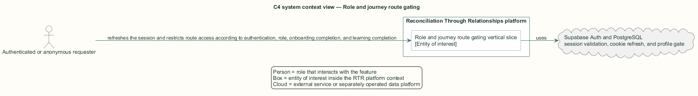
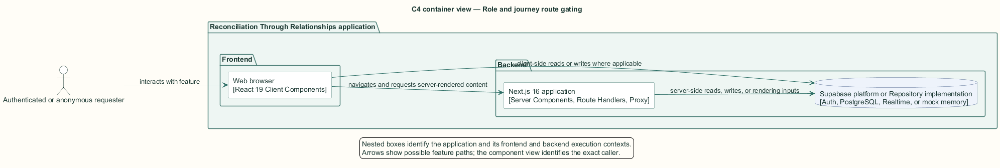
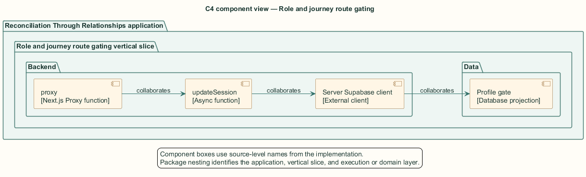
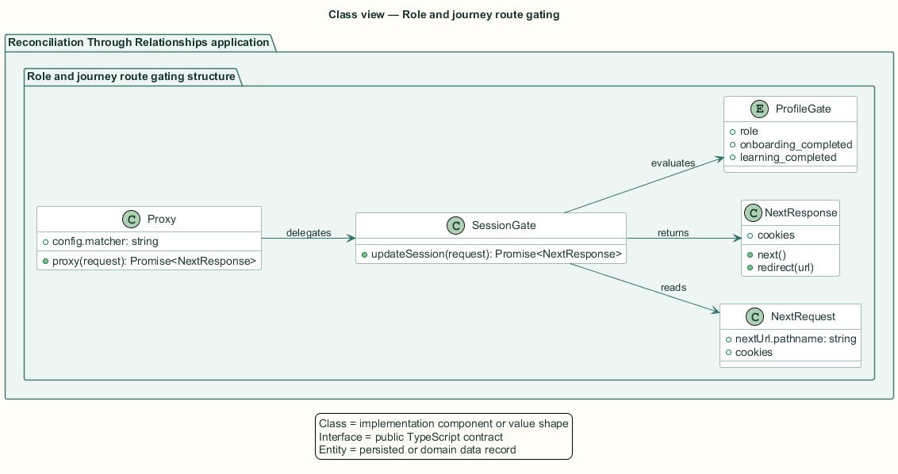
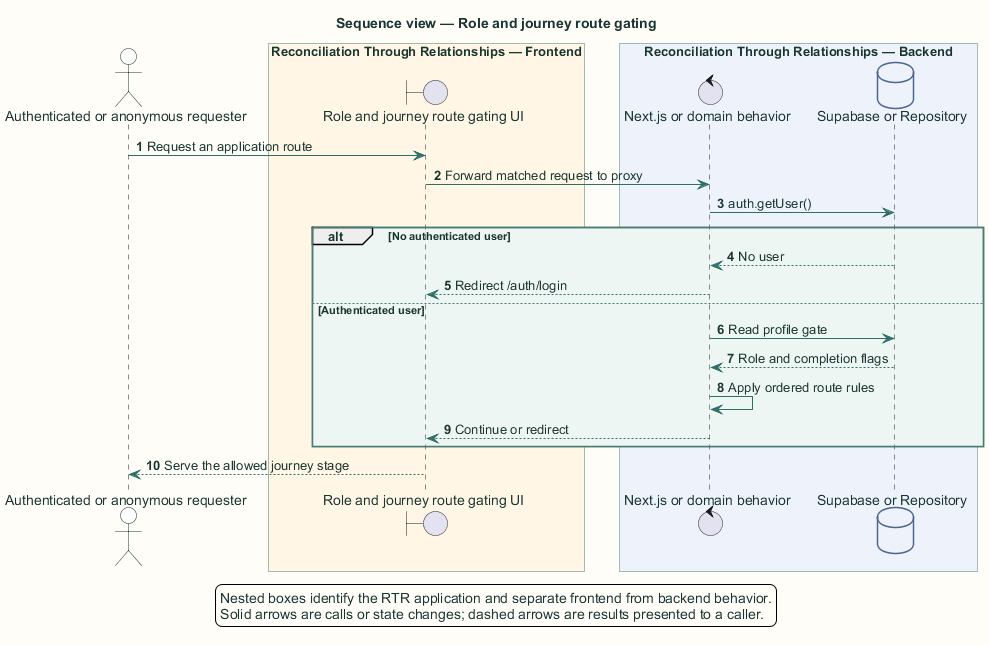

# Role and journey route gating — Detailed design

## Overview

Role and journey route gating — vertical slice that refreshes the session and restricts route access according to authentication, role, onboarding completion, and learning completion

Protected application routes depend on a cookie-backed Supabase session. Participant routes also form an ordered journey: onboarding precedes learning, and learning precedes the dashboard.

Next.js 16 uses the `proxy.ts` file convention for request interception. The named `proxy` export delegates to `updateSession`, which returns either a pass-through response with refreshed cookies or a redirect response.

The entity of interest (EoI) is the Role and journey route gating vertical slice of the Reconciliation Through Relationships platform. This focused architecture description (AD) describes that slice and does not claim full conformance with 42010:2022.

## Description

### Components, types, functions, and classes

| Element | Kind | Source | Responsibility and public interface |
| --- | --- | --- | --- |
| `proxy` | Next.js Proxy function | `src/proxy.ts` | `proxy(request)` delegates matched requests; `config.matcher` excludes static assets. |
| `updateSession` | Async function | `src/data/supabase/session-proxy.ts` | `updateSession(request): Promise<NextResponse>` refreshes cookies and applies the gate cascade. |
| `Server Supabase client` | External client | `@supabase/ssr` | `createServerClient` exposes cookie hooks and `auth.getUser`. |
| `Profile gate` | Database projection | `public.profiles` | `role`, `onboarding_completed`, and `learning_completed` determine routing. |

### Structure and relationships

- The Next.js matcher invokes `proxy` before matched routes complete.

- `updateSession` validates the user through `auth.getUser`, reads the caller's profile gate, and writes refreshed cookies to the response.

- Public routes pass without a session. Participant and facilitator routes follow separate redirect branches.

### Behaviour

1. A request enters `proxy` unless the matcher excludes its static asset path.

2. `updateSession` passes public routes and the configured mock-data mode.

3. An anonymous protected request redirects to `/auth/login`.

4. A participant redirects to the earliest incomplete stage or away from `/facilitator`.

5. A facilitator bypasses participant gates and redirects away from `/onboarding` and `/learn`.

6. An allowed request continues with refreshed session cookies.

## Requirements

This section contains L2 requirements only. It intentionally includes no L1 requirement text. The L1 specification identifier records the traceability correspondence for each L2 requirement.

| L2 specification ID | L1 specification ID | Requirement text |
| --- | --- | --- |
| `L2-AUTH-010` | `L1-AUTH-003` | Unauthenticated visitors shall be redirected to `/auth/login` from any protected route. |
| `L2-AUTH-011` | `L1-AUTH-003` | A signed-in participant shall be held at the earliest incomplete journey stage, enforced consistently at the session proxy, sign-in, and auth callback. |
| `L2-AUTH-012` | `L1-AUTH-003` | Participants shall not reach facilitator routes, and facilitators shall not reach participant journey routes. |

## Diagrams

The five architecture views use one caption pattern and stable EoI-local names. Each view component is available as PlantUML source and as an inline Portable Network Graphics (PNG) rendering.

### C4 system context view

[PlantUML source](diagrams/c4-context.puml)

Figure 1 — C4 system context view: the Role and journey route gating EoI, its actor, and its external dependencies. The view component uses the C4 system context model kind.

### C4 container view

[PlantUML source](diagrams/c4-container.puml)

Figure 2 — C4 container view: the frontend, backend, data, and integration boundaries. The view component uses the C4 container model kind.

### C4 component view

[PlantUML source](diagrams/c4-component.puml)

Figure 3 — C4 component view: the source-level components and their structural relationships. The view component uses the C4 component model kind.

### Class view

[PlantUML source](diagrams/class-diagram.puml)

Figure 4 — Class view: the feature types, functions, classes, entities, and their relationships. The view component uses the Unified Modeling Language (UML) class model kind.

### Sequence view

[PlantUML source](diagrams/sequence-diagram.puml)

Figure 5 — Sequence view: the principal end-to-end feature behavior. Nested application boxes separate frontend behavior from backend behavior. The view component uses the UML sequence model kind.
