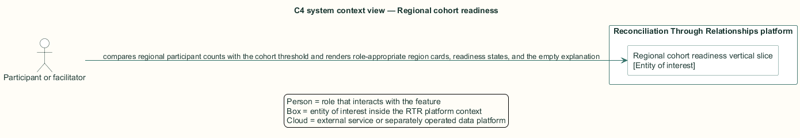
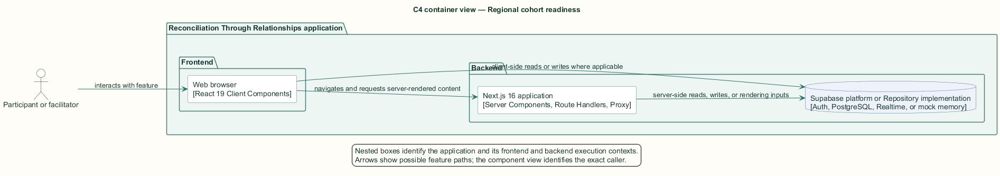
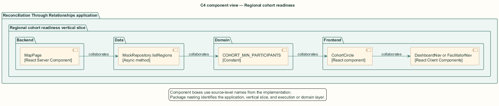
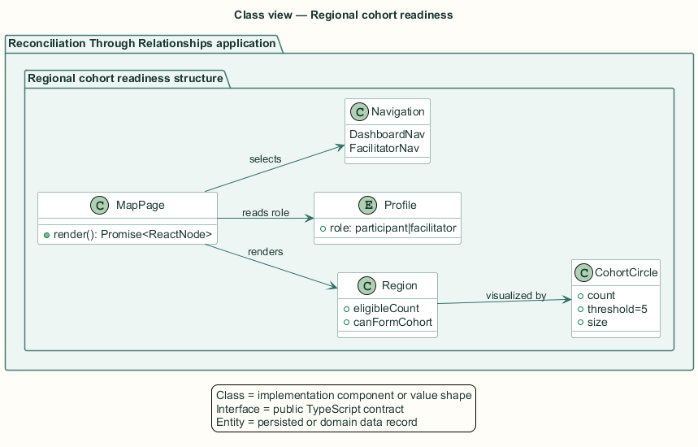
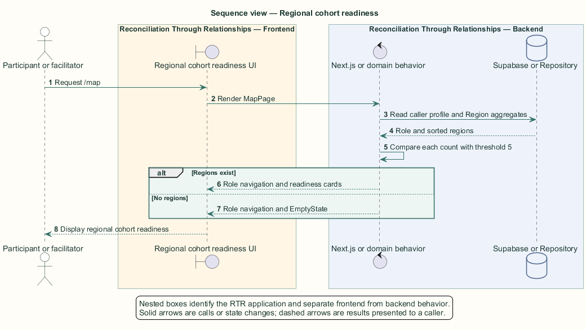

# Regional cohort readiness — Detailed design

## Overview

Regional cohort readiness — vertical slice that compares regional participant counts with the cohort threshold and renders role-appropriate region cards, readiness states, and the empty explanation

A region becomes ready to gather when its eligible consenting count reaches the cohort threshold. The current domain constant and visual component default use five seats.

The same `/map` route serves participants and facilitators. It selects the navigation component from the authenticated profile role and renders one card per qualifying region.

The entity of interest (EoI) is the Regional cohort readiness vertical slice of the Reconciliation Through Relationships platform. This focused architecture description (AD) describes that slice and does not claim full conformance with 42010:2022.

## Description

### Components, types, functions, and classes

| Element | Kind | Source | Responsibility and public interface |
| --- | --- | --- | --- |
| `MapPage` | React Server Component | `src/app/map/page.tsx` | Selects role navigation and renders readiness cards or the empty state. |
| `MockRepository.listRegions` | Async method | `src/data/mock/mock-repository.ts` | Sets `canFormCohort` against `COHORT_MIN_PARTICIPANTS`. |
| `COHORT_MIN_PARTICIPANTS` | Constant | `src/domain/constants.ts` | Defines the current readiness threshold as 5. |
| `CohortCircle` | React component | `src/components/cohort-circle.tsx` | Renders threshold seats and the accessible readiness label. |
| `DashboardNav or FacilitatorNav` | React Client Components | `src/app/*/components/*Nav.tsx` | Provide role-appropriate application navigation. |

### Structure and relationships

- `MockRepository.listRegions` stores the threshold result in each `Region.canFormCohort` value.

- `MapPage` uses the same constant to calculate seats remaining and passes counts to `CohortCircle`.

- The caller profile role selects `DashboardNav` or `FacilitatorNav`; an empty region collection selects `EmptyState`.

### Behaviour

1. The authenticated stakeholder opens the regional map.

2. The repository returns regions sorted by eligible consenting count.

3. Each region count is compared with the five-participant threshold.

4. The page labels ready regions `Ready to gather` and other regions with the exact remaining seat count.

5. The page uses role-appropriate navigation or renders the no-cohort empty explanation when no region qualifies.

### Realization notes

- The facilitator setting `cohort_threshold` is persisted but not read by this slice. Readiness remains hardcoded through `COHORT_MIN_PARTICIPANTS = 5`.

## Requirements

This section contains L2 requirements only. It intentionally includes no L1 requirement text. The L1 specification identifier records the traceability correspondence for each L2 requirement.

| L2 specification ID | L1 specification ID | Requirement text |
| --- | --- | --- |
| `L2-COHRT-052` | `L1-COHRT-012` | Regions shall be flagged as ready when they reach the cohort threshold of 5 eligible participants. |
| `L2-COHRT-053` | `L1-COHRT-012` | `/map` shall render region cards for every qualifying region, with role-appropriate navigation and an explanatory empty state. |

## Diagrams

The five architecture views use one caption pattern and stable EoI-local names. Each view component is available as PlantUML source and as an inline Portable Network Graphics (PNG) rendering.

### C4 system context view

[PlantUML source](diagrams/c4-context.puml)

Figure 1 — C4 system context view: the Regional cohort readiness EoI, its actor, and its external dependencies. The view component uses the C4 system context model kind.

### C4 container view

[PlantUML source](diagrams/c4-container.puml)

Figure 2 — C4 container view: the frontend, backend, data, and integration boundaries. The view component uses the C4 container model kind.

### C4 component view

[PlantUML source](diagrams/c4-component.puml)

Figure 3 — C4 component view: the source-level components and their structural relationships. The view component uses the C4 component model kind.

### Class view

[PlantUML source](diagrams/class-diagram.puml)

Figure 4 — Class view: the feature types, functions, classes, entities, and their relationships. The view component uses the Unified Modeling Language (UML) class model kind.

### Sequence view

[PlantUML source](diagrams/sequence-diagram.puml)

Figure 5 — Sequence view: the principal end-to-end feature behavior. Nested application boxes separate frontend behavior from backend behavior. The view component uses the UML sequence model kind.
