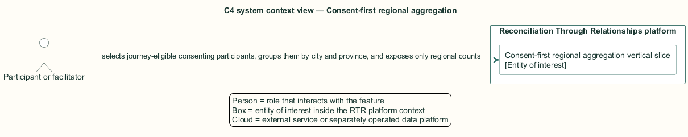
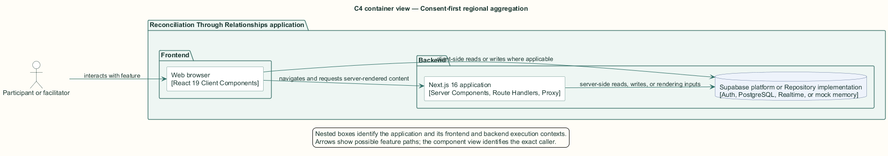
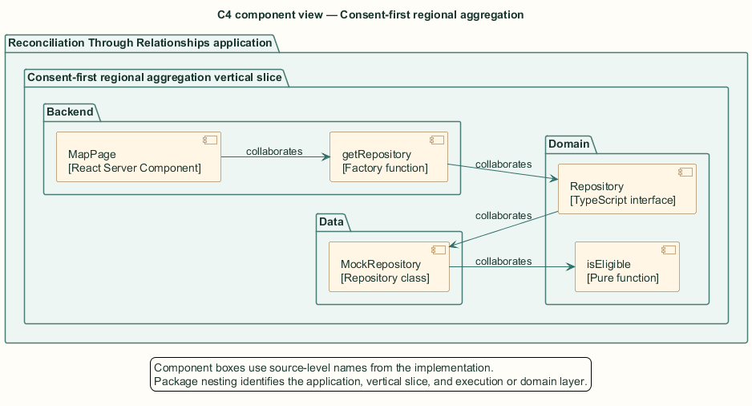
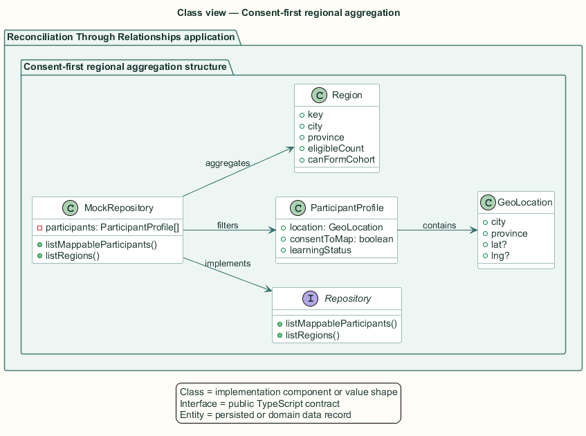
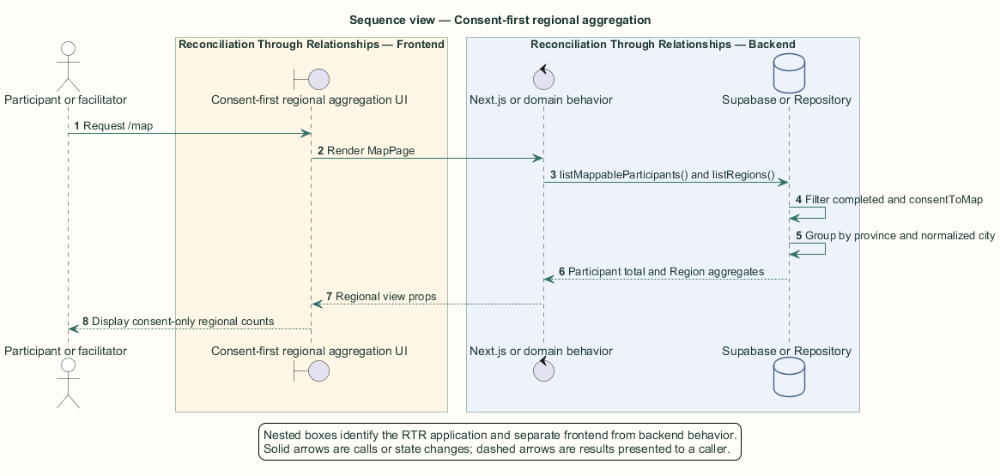

# Consent-first regional aggregation — Detailed design

## Overview

Consent-first regional aggregation — vertical slice that selects journey-eligible consenting participants, groups them by city and province, and exposes only regional counts

The regional map provides community awareness without publishing precise participant locations. Only participants who completed learning and consented to map display contribute to a region.

This slice uses the repository seam and its camel-case `ParticipantProfile`, not the Supabase profile rows used elsewhere. `MockRepository` is the active implementation by default and keeps all records in process memory.

The entity of interest (EoI) is the Consent-first regional aggregation vertical slice of the Reconciliation Through Relationships platform. This focused architecture description (AD) describes that slice and does not claim full conformance with 42010:2022.

## Description

### Components, types, functions, and classes

| Element | Kind | Source | Responsibility and public interface |
| --- | --- | --- | --- |
| `MapPage` | React Server Component | `src/app/map/page.tsx` | Authenticates and requests regions plus mappable participants from the repository. |
| `getRepository` | Factory function | `src/data/index.ts` | Returns the configured singleton repository. |
| `Repository` | TypeScript interface | `src/data/repository.ts` | Defines `listMappableParticipants` and `listRegions`. |
| `MockRepository` | Repository class | `src/data/mock/mock-repository.ts` | Filters eligibility and consent, groups region keys, and sorts counts. |
| `isEligible` | Pure function | `src/domain/types.ts` | Returns true when `learningStatus === completed`. |

### Structure and relationships

- `MapPage` depends on the `Repository` contract through `getRepository`, not on a concrete data class.

- `MockRepository.listMappableParticipants` composes `isEligible` with `consentToMap`.

- `listRegions` groups the filtered collection by normalized city and province, counts members, and sorts descending.

### Behaviour

1. The authenticated stakeholder requests `/map`.

2. `MapPage` requests mappable participants and regions in parallel.

3. The repository removes incomplete or non-consenting participants.

4. The repository groups the remaining records by province and case-normalized city.

5. The page receives regional aggregates and a consenting-participant total without precise locations.

### Realization notes

- `SupabaseRepository` is an unfilled implementation. Production Supabase data does not back this view unless that class is completed.

## Requirements

This section contains L2 requirements only. It intentionally includes no L1 requirement text. The L1 specification identifier records the traceability correspondence for each L2 requirement.

| L2 specification ID | L1 specification ID | Requirement text |
| --- | --- | --- |
| `L2-COHRT-051` | `L1-COHRT-012` | The regional map shall aggregate only participants who completed the journey and consented to map display; no other participant shall influence the display. |

## Diagrams

The five architecture views use one caption pattern and stable EoI-local names. Each view component is available as PlantUML source and as an inline Portable Network Graphics (PNG) rendering.

### C4 system context view

[PlantUML source](diagrams/c4-context.puml)

Figure 1 — C4 system context view: the Consent-first regional aggregation EoI, its actor, and its external dependencies. The view component uses the C4 system context model kind.

### C4 container view

[PlantUML source](diagrams/c4-container.puml)

Figure 2 — C4 container view: the frontend, backend, data, and integration boundaries. The view component uses the C4 container model kind.

### C4 component view

[PlantUML source](diagrams/c4-component.puml)

Figure 3 — C4 component view: the source-level components and their structural relationships. The view component uses the C4 component model kind.

### Class view

[PlantUML source](diagrams/class-diagram.puml)

Figure 4 — Class view: the feature types, functions, classes, entities, and their relationships. The view component uses the Unified Modeling Language (UML) class model kind.

### Sequence view

[PlantUML source](diagrams/sequence-diagram.puml)

Figure 5 — Sequence view: the principal end-to-end feature behavior. Nested application boxes separate frontend behavior from backend behavior. The view component uses the UML sequence model kind.
