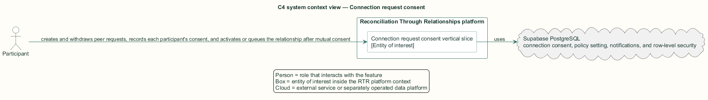
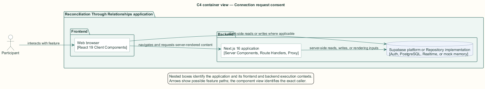
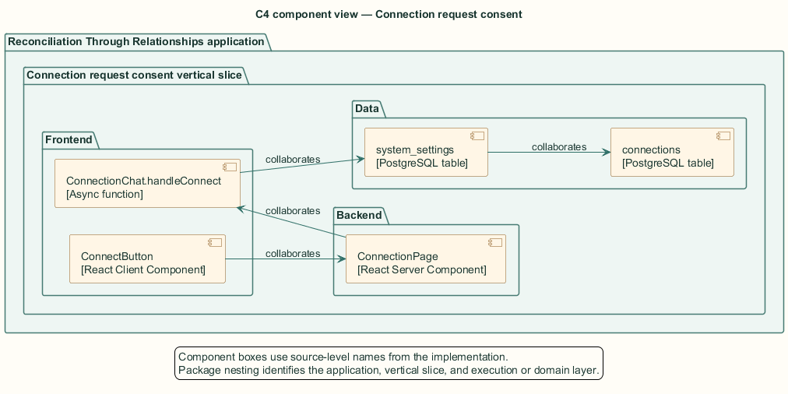
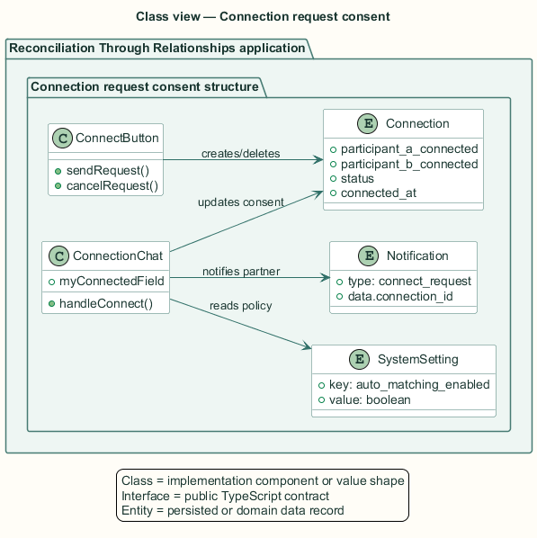
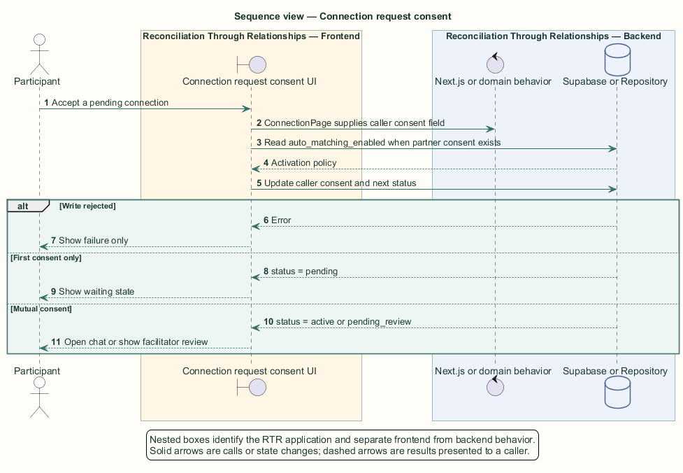

# Connection request consent — Detailed design

## Overview

Connection request consent — vertical slice that creates and withdraws peer requests, records each participant's consent, and activates or queues the relationship after mutual consent

A connection is a relationship record between two participants. Each participant owns one consent flag. Chat remains unavailable until both flags are true and the connection reaches the active state.

Peer request creation starts on a profile. Acceptance occurs inside the connection conversation. When `auto_matching_enabled` is false, mutual consent changes the state to `pending_review` for facilitator action instead of activating chat.

The entity of interest (EoI) is the Connection request consent vertical slice of the Reconciliation Through Relationships platform. This focused architecture description (AD) describes that slice and does not claim full conformance with 42010:2022.

## Description

### Components, types, functions, and classes

| Element | Kind | Source | Responsibility and public interface |
| --- | --- | --- | --- |
| `ConnectButton` | React Client Component | `src/app/profile/[userId]/ConnectButton.tsx` | Creates and cancels peer requests from a profile. |
| `ConnectionPage` | React Server Component | `src/app/connections/[connectionId]/page.tsx` | Authorizes the participant and calculates `myConnectedField`. |
| `ConnectionChat.handleConnect` | Async function | `src/app/connections/components/ConnectionChat.tsx` | Sets caller consent and selects pending, active, or pending-review state. |
| `system_settings` | PostgreSQL table | `public.system_settings` | Supplies `auto_matching_enabled` for the mutual-consent transition. |
| `connections` | PostgreSQL table | `public.connections` | Stores participant pair, consent flags, status, and activation time. |

### Structure and relationships

- `ConnectButton` creates participant A consent or deletes a pending request under the pair's row-level security policies.

- `ConnectionPage` maps the signed-in user to the consent column passed to `ConnectionChat`.

- `handleConnect` reads the other flag and, when both flags are true, reads `auto_matching_enabled` to select `active` or `pending_review`.

### Behaviour

1. The sender creates a pending connection from the recipient's profile.

2. The recipient opens the connection and activates Connect.

3. The client sets the recipient's consent flag and checks whether the sender already consented.

4. Mutual consent activates immediately when auto-matching is true; otherwise it queues facilitator review.

5. A rejected write shows failure without reporting success; the original sender may delete a pending request.

### Realization notes

- The migrated `connections.status` check allows `pending` and `active` but does not include `pending_review`. The generated type and client use `pending_review`, so that transition depends on an out-of-band schema change.

## Requirements

This section contains L2 requirements only. It intentionally includes no L1 requirement text. The L1 specification identifier records the traceability correspondence for each L2 requirement.

| L2 specification ID | L1 specification ID | Requirement text |
| --- | --- | --- |
| `L2-CONN-035` | `L1-CONN-009` | Participants shall send connection requests to any eligible participant without a facilitator-created match. |
| `L2-CONN-036` | `L1-CONN-009` | The sender shall be able to withdraw a pending request. |
| `L2-CONN-037` | `L1-CONN-009` | A connection shall activate only when both parties consent; when auto-matching is disabled, mutual consent shall queue the connection for facilitator review instead. |
| `L2-CONN-038` | `L1-CONN-009` | A rejected or failed connection write shall surface an error and never a false success. |

## Diagrams

The five architecture views use one caption pattern and stable EoI-local names. Each view component is available as PlantUML source and as an inline Portable Network Graphics (PNG) rendering.

### C4 system context view

[PlantUML source](diagrams/c4-context.puml)

Figure 1 — C4 system context view: the Connection request consent EoI, its actor, and its external dependencies. The view component uses the C4 system context model kind.

### C4 container view

[PlantUML source](diagrams/c4-container.puml)

Figure 2 — C4 container view: the frontend, backend, data, and integration boundaries. The view component uses the C4 container model kind.

### C4 component view

[PlantUML source](diagrams/c4-component.puml)

Figure 3 — C4 component view: the source-level components and their structural relationships. The view component uses the C4 component model kind.

### Class view

[PlantUML source](diagrams/class-diagram.puml)

Figure 4 — Class view: the feature types, functions, classes, entities, and their relationships. The view component uses the Unified Modeling Language (UML) class model kind.

### Sequence view

[PlantUML source](diagrams/sequence-diagram.puml)

Figure 5 — Sequence view: the principal end-to-end feature behavior. Nested application boxes separate frontend behavior from backend behavior. The view component uses the UML sequence model kind.
