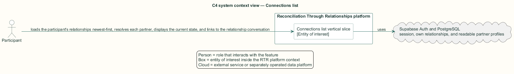
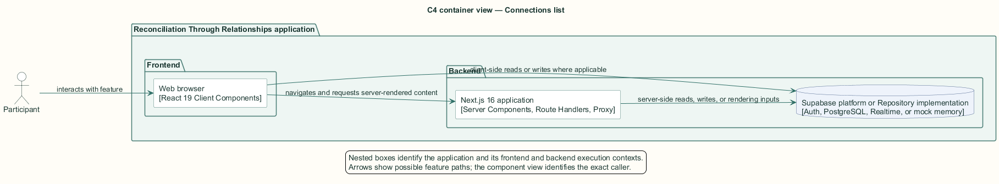
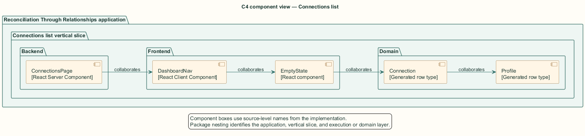
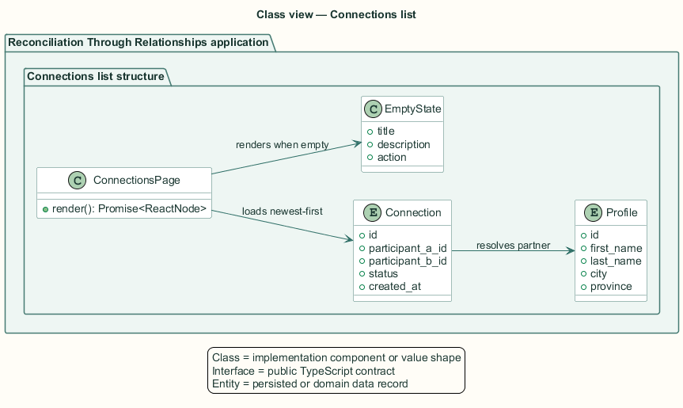
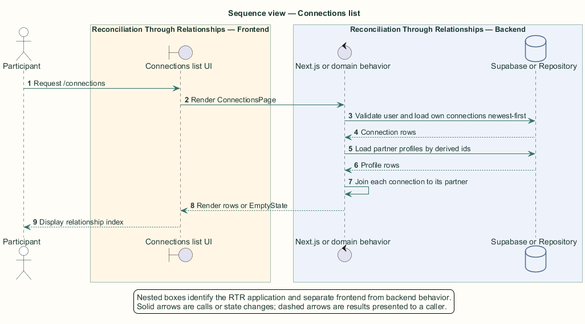

# Connections list — Detailed design

## Overview

Connections list — vertical slice that loads the participant's relationships newest-first, resolves each partner, displays the current state, and links to the relationship conversation

The dedicated connections page is the participant's relationship index. It includes active and pending relationships and explains how to return to discovery when no relationship exists.

The page is a server component. It reads relationship rows first, derives partner identifiers, loads readable partner profiles in one query, and joins them in memory.

The entity of interest (EoI) is the Connections list vertical slice of the Reconciliation Through Relationships platform. This focused architecture description (AD) describes that slice and does not claim full conformance with 42010:2022.

## Description

### Components, types, functions, and classes

| Element | Kind | Source | Responsibility and public interface |
| --- | --- | --- | --- |
| `ConnectionsPage` | React Server Component | `src/app/connections/page.tsx` | Authenticates, loads connection and partner rows, joins them, and renders `/connections`. |
| `DashboardNav` | React Client Component | `src/app/dashboard/components/DashboardNav.tsx` | Provides participant navigation and notification actions. |
| `EmptyState` | React component | `src/components/empty-state.tsx` | Explains an empty relationship collection and links to `/dashboard`. |
| `Connection` | Generated row type | `src/data/supabase/database.types.ts` | Supplies pair, status, and creation time. |
| `Profile` | Generated row type | `src/data/supabase/database.types.ts` | Supplies partner name and location. |

### Structure and relationships

- `ConnectionsPage` queries rows where the caller is participant A or participant B, ordered by `created_at` descending.

- The page derives every opposite participant identifier and creates a profile map after one `in` query.

- Each visible partner row links to `/connections/{connection.id}`; unreadable partner rows are omitted.

### Behaviour

1. The participant requests `/connections`.

2. The server validates the session and loads the caller's profile.

3. The server reads newest-first connections and corresponding partner profiles.

4. The server joins relationships to partners and renders Active or Pending status badges.

5. An empty collection renders an explanation and Explore recommendations action.

## Requirements

This section contains L2 requirements only. It intentionally includes no L1 requirement text. The L1 specification identifier records the traceability correspondence for each L2 requirement.

| L2 specification ID | L1 specification ID | Requirement text |
| --- | --- | --- |
| `L2-CONN-039` | `L1-CONN-009` | `/connections` shall list the participant's connections newest-first with status, and explain the empty state. |

## Diagrams

The five architecture views use one caption pattern and stable EoI-local names. Each view component is available as PlantUML source and as an inline Portable Network Graphics (PNG) rendering.

### C4 system context view

[PlantUML source](diagrams/c4-context.puml)

Figure 1 — C4 system context view: the Connections list EoI, its actor, and its external dependencies. The view component uses the C4 system context model kind.

### C4 container view

[PlantUML source](diagrams/c4-container.puml)

Figure 2 — C4 container view: the frontend, backend, data, and integration boundaries. The view component uses the C4 container model kind.

### C4 component view

[PlantUML source](diagrams/c4-component.puml)

Figure 3 — C4 component view: the source-level components and their structural relationships. The view component uses the C4 component model kind.

### Class view

[PlantUML source](diagrams/class-diagram.puml)

Figure 4 — Class view: the feature types, functions, classes, entities, and their relationships. The view component uses the Unified Modeling Language (UML) class model kind.

### Sequence view

[PlantUML source](diagrams/sequence-diagram.puml)

Figure 5 — Sequence view: the principal end-to-end feature behavior. Nested application boxes separate frontend behavior from backend behavior. The view component uses the UML sequence model kind.
