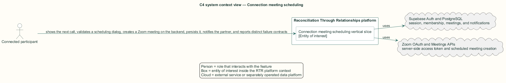
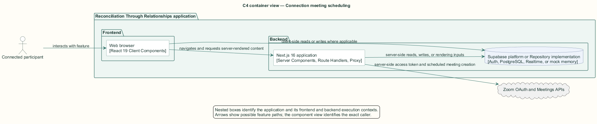
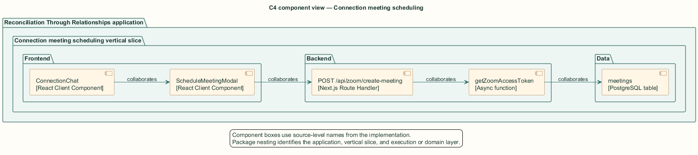
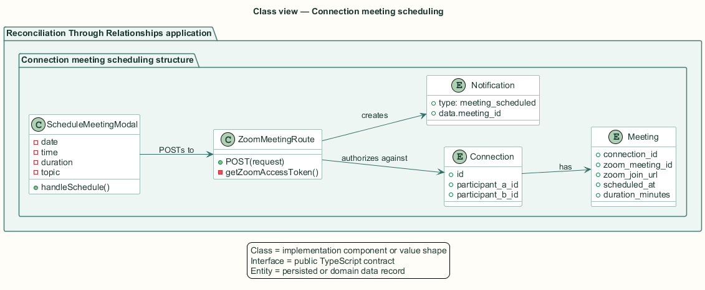
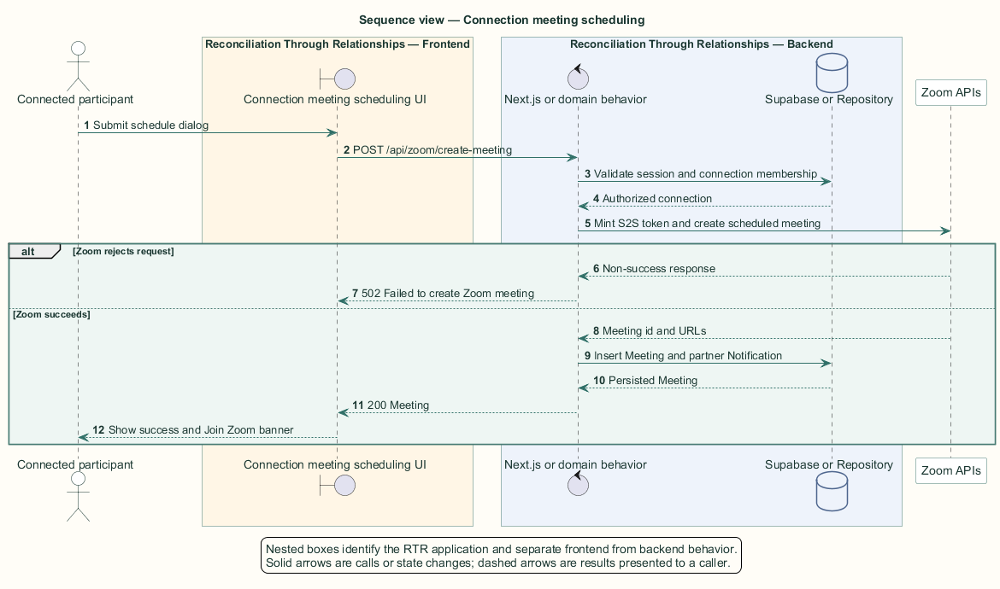

# Connection meeting scheduling — Detailed design

## Overview

Connection meeting scheduling — vertical slice that shows the next call, validates a scheduling dialog, creates a Zoom meeting on the backend, persists it, notifies the partner, and reports distinct failure contracts

A connected pair can schedule a video call from the conversation. The scheduling control remains hidden while a meeting is in progress or upcoming, based on each meeting's start time plus duration.

Zoom credentials remain on the backend. The browser submits the meeting request to a Next.js route handler, which validates the session and connection membership before minting a server-to-server OAuth token.

The entity of interest (EoI) is the Connection meeting scheduling vertical slice of the Reconciliation Through Relationships platform. This focused architecture description (AD) describes that slice and does not claim full conformance with 42010:2022.

## Description

### Components, types, functions, and classes

| Element | Kind | Source | Responsibility and public interface |
| --- | --- | --- | --- |
| `ConnectionChat` | React Client Component | `src/app/connections/components/ConnectionChat.tsx` | Derives the next unended meeting, renders its banner, and owns modal visibility. |
| `ScheduleMeetingModal` | React Client Component | `src/app/connections/components/ScheduleMeetingModal.tsx` | Collects topic, date, time, and duration; posts the request; preserves retry state. |
| `POST /api/zoom/create-meeting` | Next.js Route Handler | `src/app/api/zoom/create-meeting/route.ts` | Authenticates, authorizes, creates Zoom meeting, persists, and notifies. |
| `getZoomAccessToken` | Async function | `src/app/api/zoom/create-meeting/route.ts` | Uses account credentials to mint a short-lived Zoom access token. |
| `meetings` | PostgreSQL table | `public.meetings` | Stores Zoom identifiers, URLs, schedule, duration, topic, and creator. |

### Structure and relationships

- `ConnectionChat` passes the relationship and participant props to `ScheduleMeetingModal` and appends the returned `Meeting` through `onScheduled`.

- The route handler reads the connection for membership, calls Zoom OAuth and Meetings APIs, inserts `meetings`, and inserts a `meeting_scheduled` notification.

- The upcoming banner selects the earliest meeting whose calculated end remains in the future.

### Behaviour

1. The connected participant opens the schedule dialog when no unended meeting exists.

2. The modal validates date and time, converts them to ISO format, and posts the request.

3. The route authenticates the caller, validates required fields, and confirms relationship membership.

4. The route creates the Zoom meeting, persists the database row, and notifies the other participant.

5. The client appends the meeting and shows the Join Zoom banner, or retains the dialog for retry after an error.

## Requirements

This section contains L2 requirements only. It intentionally includes no L1 requirement text. The L1 specification identifier records the traceability correspondence for each L2 requirement.

| L2 specification ID | L1 specification ID | Requirement text |
| --- | --- | --- |
| `L2-CONN-043` | `L1-CONN-009` | An active conversation shall surface the next scheduled call. |
| `L2-MEET-044` | `L1-MEET-010` | Participants in an active connection shall schedule a call through a validated dialog. |
| `L2-MEET-045` | `L1-MEET-010` | `POST /api/zoom/create-meeting` shall create a Zoom meeting server-side, persist it, and notify the partner. |
| `L2-MEET-046` | `L1-MEET-010` | The meeting API shall reject unauthorized, invalid, and failed requests with distinct statuses. |

## Diagrams

The five architecture views use one caption pattern and stable EoI-local names. Each view component is available as PlantUML source and as an inline Portable Network Graphics (PNG) rendering.

### C4 system context view

[PlantUML source](diagrams/c4-context.puml)

Figure 1 — C4 system context view: the Connection meeting scheduling EoI, its actor, and its external dependencies. The view component uses the C4 system context model kind.

### C4 container view

[PlantUML source](diagrams/c4-container.puml)

Figure 2 — C4 container view: the frontend, backend, data, and integration boundaries. The view component uses the C4 container model kind.

### C4 component view

[PlantUML source](diagrams/c4-component.puml)

Figure 3 — C4 component view: the source-level components and their structural relationships. The view component uses the C4 component model kind.

### Class view

[PlantUML source](diagrams/class-diagram.puml)

Figure 4 — Class view: the feature types, functions, classes, entities, and their relationships. The view component uses the Unified Modeling Language (UML) class model kind.

### Sequence view

[PlantUML source](diagrams/sequence-diagram.puml)

Figure 5 — Sequence view: the principal end-to-end feature behavior. Nested application boxes separate frontend behavior from backend behavior. The view component uses the UML sequence model kind.
