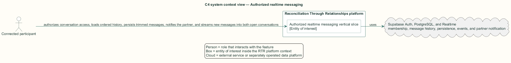
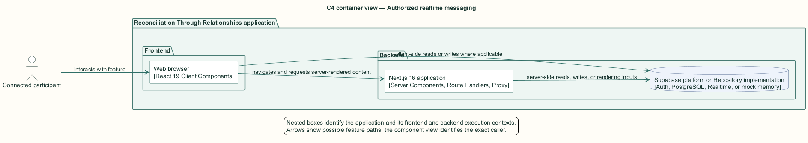
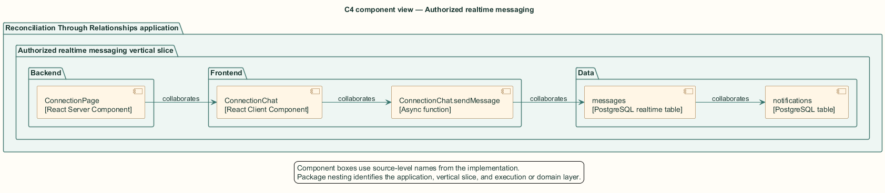
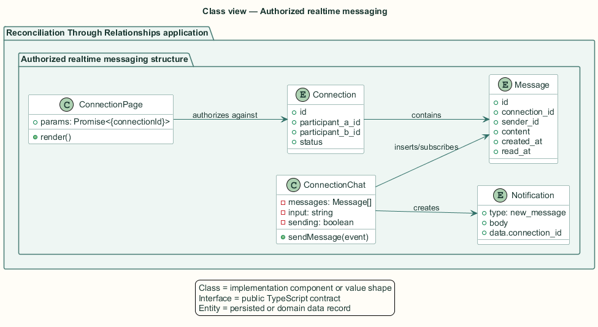
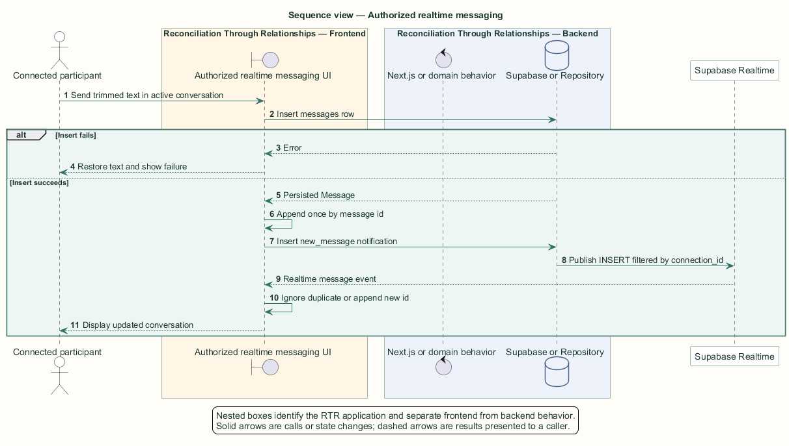

# Authorized realtime messaging — Detailed design

## Overview

Authorized realtime messaging — vertical slice that authorizes conversation access, loads ordered history, persists trimmed messages, notifies the partner, and streams new messages into both open conversations

Messaging begins only after a connection reaches the active state. The dynamic conversation route limits access to the two relationship participants and loads profiles, history, and meetings before rendering the interactive client.

The browser writes messages directly to Supabase. A realtime subscription filtered by `connection_id` delivers inserted rows. The sender also appends the returned row and de-duplicates the realtime echo by message identifier.

The entity of interest (EoI) is the Authorized realtime messaging vertical slice of the Reconciliation Through Relationships platform. This focused architecture description (AD) describes that slice and does not claim full conformance with 42010:2022.

## Description

### Components, types, functions, and classes

| Element | Kind | Source | Responsibility and public interface |
| --- | --- | --- | --- |
| `ConnectionPage` | React Server Component | `src/app/connections/[connectionId]/page.tsx` | Validates membership and loads ordered history plus participant profiles. |
| `ConnectionChat` | React Client Component | `src/app/connections/components/ConnectionChat.tsx` | Owns composer state, message collection, scrolling, and realtime subscriptions. |
| `ConnectionChat.sendMessage` | Async function | `src/app/connections/components/ConnectionChat.tsx` | Trims, inserts, restores on failure, appends, and notifies. |
| `messages` | PostgreSQL realtime table | `public.messages` | Stores ordered message content and emits insert events. |
| `notifications` | PostgreSQL table | `public.notifications` | Receives a truncated `new_message` notification for the partner. |

### Structure and relationships

- `ConnectionPage` authorizes application access and row-level security independently restricts database reads and writes to relationship participants.

- `ConnectionChat` subscribes to message inserts for one connection and removes the channel during cleanup.

- `sendMessage` inserts the trimmed message, appends the returned row with identifier de-duplication, and creates the partner notification.

### Behaviour

1. A participant requests a conversation route and the server verifies relationship membership.

2. The server loads message history in creation order and passes it to `ConnectionChat`.

3. The sender submits non-empty text while the connection is active.

4. The database persists the trimmed message and emits a filtered realtime insert event.

5. Both clients append the message once; a failed insert restores the sender's input and reports failure.

### Realization notes

- The message policy verifies relationship membership but does not constrain `sender_id` to `auth.uid()`. The client supplies the caller identifier, while the database boundary permits participant impersonation inside the same connection.

## Requirements

This section contains L2 requirements only. It intentionally includes no L1 requirement text. The L1 specification identifier records the traceability correspondence for each L2 requirement.

| L2 specification ID | L1 specification ID | Requirement text |
| --- | --- | --- |
| `L2-CONN-040` | `L1-CONN-009` | Only the two participants of a connection shall open its conversation. |
| `L2-CONN-041` | `L1-CONN-009` | Participants in an active connection shall exchange persisted text messages, notifying the partner. |
| `L2-CONN-042` | `L1-CONN-009` | New messages shall appear in an open conversation without a page reload. |

## Diagrams

The five architecture views use one caption pattern and stable EoI-local names. Each view component is available as PlantUML source and as an inline Portable Network Graphics (PNG) rendering.

### C4 system context view

[PlantUML source](diagrams/c4-context.puml)

Figure 1 — C4 system context view: the Authorized realtime messaging EoI, its actor, and its external dependencies. The view component uses the C4 system context model kind.

### C4 container view

[PlantUML source](diagrams/c4-container.puml)

Figure 2 — C4 container view: the frontend, backend, data, and integration boundaries. The view component uses the C4 container model kind.

### C4 component view

[PlantUML source](diagrams/c4-component.puml)

Figure 3 — C4 component view: the source-level components and their structural relationships. The view component uses the C4 component model kind.

### Class view

[PlantUML source](diagrams/class-diagram.puml)

Figure 4 — Class view: the feature types, functions, classes, entities, and their relationships. The view component uses the Unified Modeling Language (UML) class model kind.

### Sequence view

[PlantUML source](diagrams/sequence-diagram.puml)

Figure 5 — Sequence view: the principal end-to-end feature behavior. Nested application boxes separate frontend behavior from backend behavior. The view component uses the UML sequence model kind.
