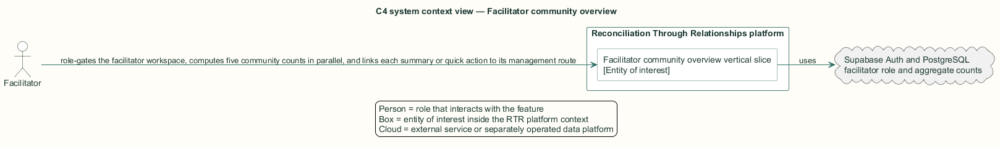
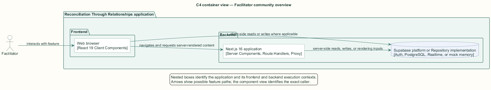
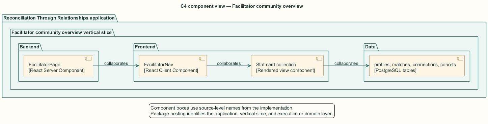
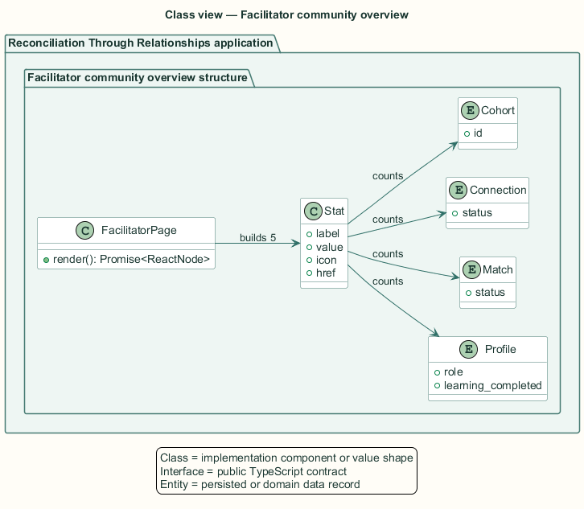
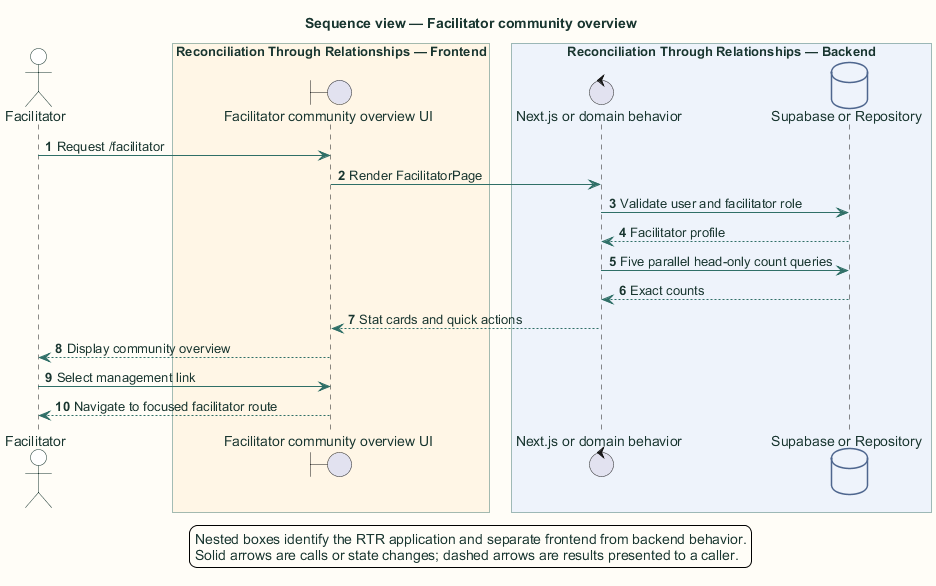

# Facilitator community overview — Detailed design

## Overview

Facilitator community overview — vertical slice that role-gates the facilitator workspace, computes five community counts in parallel, and links each summary or quick action to its management route

Facilitators oversee participant progress, relationship proposals, active connections, and regional cohorts. The overview provides aggregate orientation before a facilitator enters a focused management route.

The page verifies the authenticated profile role on the backend. Five head-only count queries execute in parallel, so no domain rows are transferred for the summary.

The entity of interest (EoI) is the Facilitator community overview vertical slice of the Reconciliation Through Relationships platform. This focused architecture description (AD) describes that slice and does not claim full conformance with 42010:2022.

## Description

### Components, types, functions, and classes

| Element | Kind | Source | Responsibility and public interface |
| --- | --- | --- | --- |
| `FacilitatorPage` | React Server Component | `src/app/facilitator/page.tsx` | Role-gates `/facilitator`, executes counts, and renders stats plus quick actions. |
| `FacilitatorNav` | React Client Component | `src/app/facilitator/components/FacilitatorNav.tsx` | Provides facilitator routes, notification center, account menu, and sign-out. |
| `Stat card collection` | Rendered view component | `src/app/facilitator/page.tsx` | Displays five labeled count links. |
| `profiles, matches, connections, cohorts` | PostgreSQL tables | `public schema` | Supply exact head counts under facilitator row-level security. |

### Structure and relationships

- `FacilitatorPage` rejects an absent session to sign-in and a non-facilitator profile to the participant dashboard.

- The page uses `Promise.all` for total participants, completed learning, suggested matches, active connections, and cohort counts.

- Stat cards and quick-action rows link to participants, matching, regional map, or settings routes.

### Behaviour

1. The facilitator requests `/facilitator`.

2. The server validates the session and facilitator role.

3. The server issues five parallel count-only queries.

4. The server maps the count results to labeled links and renders quick actions.

5. The facilitator selects a card or action to open the corresponding management route.

## Requirements

This section contains L2 requirements only. It intentionally includes no L1 requirement text. The L1 specification identifier records the traceability correspondence for each L2 requirement.

| L2 specification ID | L1 specification ID | Requirement text |
| --- | --- | --- |
| `L2-FACIL-054` | `L1-FACIL-013` | `/facilitator` shall summarize the community with five statistics and quick actions. |

## Diagrams

The five architecture views use one caption pattern and stable EoI-local names. Each view component is available as PlantUML source and as an inline Portable Network Graphics (PNG) rendering.

### C4 system context view

[PlantUML source](diagrams/c4-context.puml)

Figure 1 — C4 system context view: the Facilitator community overview EoI, its actor, and its external dependencies. The view component uses the C4 system context model kind.

### C4 container view

[PlantUML source](diagrams/c4-container.puml)

Figure 2 — C4 container view: the frontend, backend, data, and integration boundaries. The view component uses the C4 container model kind.

### C4 component view

[PlantUML source](diagrams/c4-component.puml)

Figure 3 — C4 component view: the source-level components and their structural relationships. The view component uses the C4 component model kind.

### Class view

[PlantUML source](diagrams/class-diagram.puml)

Figure 4 — Class view: the feature types, functions, classes, entities, and their relationships. The view component uses the Unified Modeling Language (UML) class model kind.

### Sequence view

[PlantUML source](diagrams/sequence-diagram.puml)

Figure 5 — Sequence view: the principal end-to-end feature behavior. Nested application boxes separate frontend behavior from backend behavior. The view component uses the UML sequence model kind.
