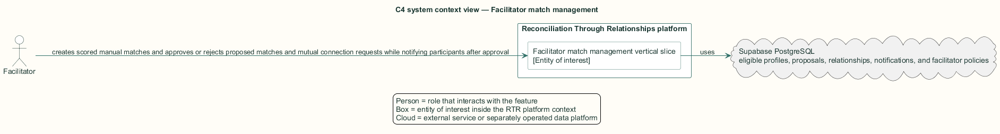
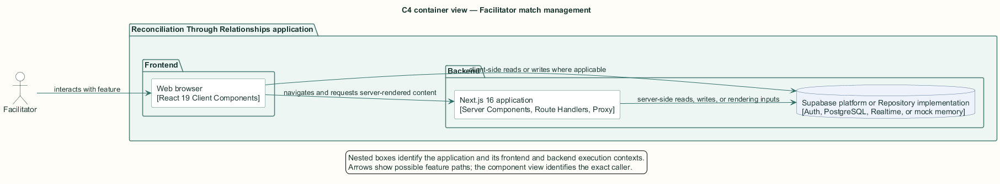
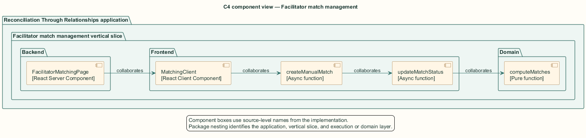
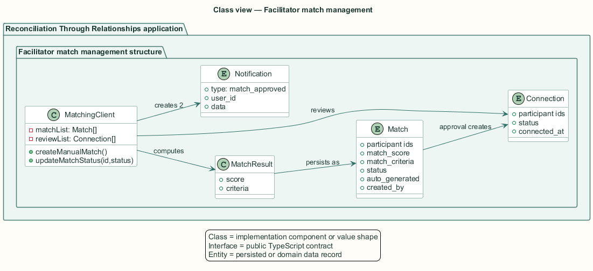
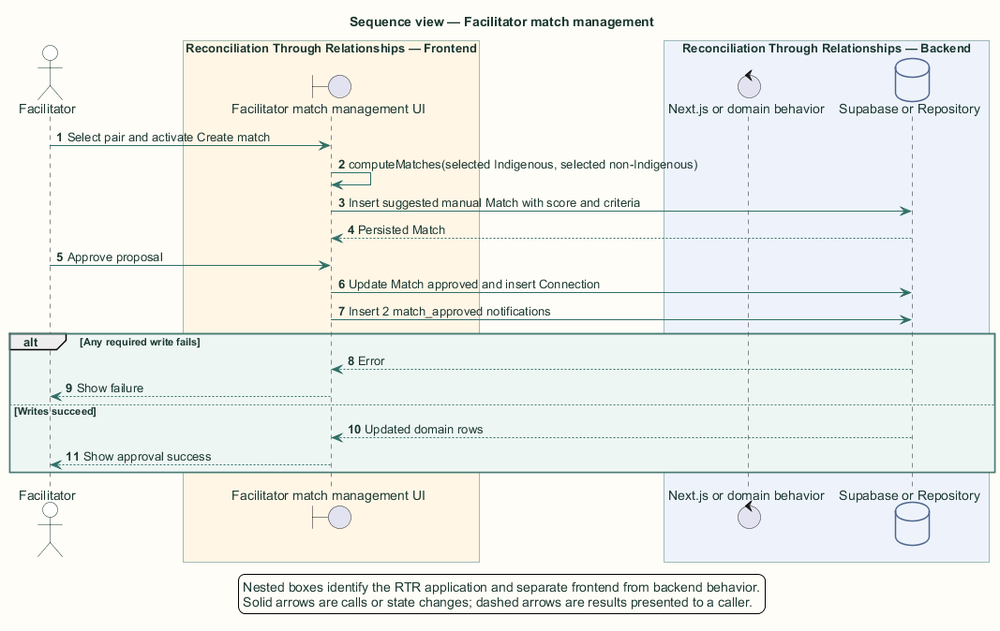

# Facilitator match management — Detailed design

## Overview

Facilitator match management — vertical slice that creates scored manual matches and approves or rejects proposed matches and mutual connection requests while notifying participants after approval

Facilitator match management combines two proposal sources. A `Match` pairs one Indigenous and one non-Indigenous participant with computed criteria. A `pending_review` connection represents mutual participant consent awaiting facilitator action.

The server loads proposals, eligible profiles, and review rows. The client reuses the participant matching function for manual creation and performs direct Supabase mutations under facilitator policies.

The entity of interest (EoI) is the Facilitator match management vertical slice of the Reconciliation Through Relationships platform. This focused architecture description (AD) describes that slice and does not claim full conformance with 42010:2022.

## Description

### Components, types, functions, and classes

| Element | Kind | Source | Responsibility and public interface |
| --- | --- | --- | --- |
| `FacilitatorMatchingPage` | React Server Component | `src/app/facilitator/matching/page.tsx` | Loads matches, pending-review connections, eligible profiles, and settings. |
| `MatchingClient` | React Client Component | `src/app/facilitator/matching/MatchingClient.tsx` | Owns manual selection, match state, review queue, approval, rejection, and profile dialog. |
| `createManualMatch` | Async function | `MatchingClient` | Scores one selected pair and inserts a suggested manual match. |
| `updateMatchStatus` | Async function | `MatchingClient` | Updates match status, creates a connection on approval, and notifies both participants. |
| `computeMatches` | Pure function | `src/domain/profile-matching.ts` | Calculates the shared 100-point compatibility criteria. |

### Structure and relationships

- `FacilitatorMatchingPage` divides eligible profiles into Indigenous and non-Indigenous selection collections and supplies a profile map.

- `createManualMatch` calls `computeMatches` for one pair and persists the score and criteria with `auto_generated=false`.

- Approval creates a relationship and two `match_approved` notifications; mutual review approval activates an existing connection and notifies both participants.

### Behaviour

1. The facilitator selects one eligible participant from each background and creates a manual match.

2. The client computes compatibility and inserts a suggested match with facilitator attribution.

3. For approval, the client updates the proposal or pending-review connection and creates the resulting relationship when applicable.

4. The client inserts approval notifications for both participants and updates local collections.

5. For rejection, the client marks a match rejected or attempts to delete the pending-review connection.

### Realization notes

- The visible tabs omit suggested matches even though `updateMatchStatus` and the suggested collection exist. A new manual match therefore enters a state with no visible management panel.

- The facilitator delete policy does not authorize deletion of a `pending_review` connection. The rejection handler can remove the card locally while the database row persists.

- The migrated status check does not include `pending_review`, so the review queue depends on an out-of-band schema change.

## Requirements

This section contains L2 requirements only. It intentionally includes no L1 requirement text. The L1 specification identifier records the traceability correspondence for each L2 requirement.

| L2 specification ID | L1 specification ID | Requirement text |
| --- | --- | --- |
| `L2-FACIL-056` | `L1-FACIL-013` | Facilitators shall create a match between one Indigenous and one non-Indigenous eligible participant, persisting the computed score. |
| `L2-FACIL-057` | `L1-FACIL-013` | Facilitators shall approve or reject both matches and mutual connection requests, with participants notified on approval. |

## Diagrams

The five architecture views use one caption pattern and stable EoI-local names. Each view component is available as PlantUML source and as an inline Portable Network Graphics (PNG) rendering.

### C4 system context view

[PlantUML source](diagrams/c4-context.puml)

Figure 1 — C4 system context view: the Facilitator match management EoI, its actor, and its external dependencies. The view component uses the C4 system context model kind.

### C4 container view

[PlantUML source](diagrams/c4-container.puml)

Figure 2 — C4 container view: the frontend, backend, data, and integration boundaries. The view component uses the C4 container model kind.

### C4 component view

[PlantUML source](diagrams/c4-component.puml)

Figure 3 — C4 component view: the source-level components and their structural relationships. The view component uses the C4 component model kind.

### Class view

[PlantUML source](diagrams/class-diagram.puml)

Figure 4 — Class view: the feature types, functions, classes, entities, and their relationships. The view component uses the Unified Modeling Language (UML) class model kind.

### Sequence view

[PlantUML source](diagrams/sequence-diagram.puml)

Figure 5 — Sequence view: the principal end-to-end feature behavior. Nested application boxes separate frontend behavior from backend behavior. The view component uses the UML sequence model kind.
