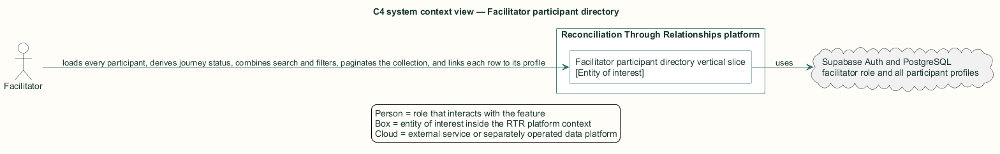
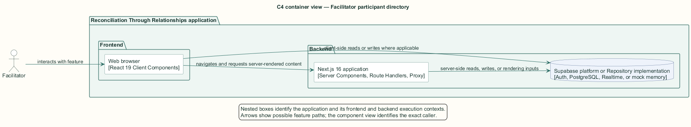
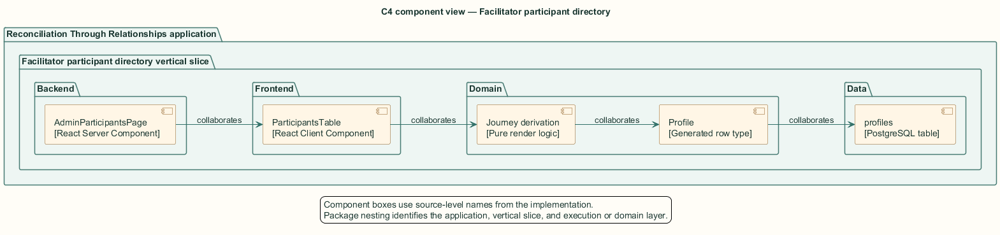
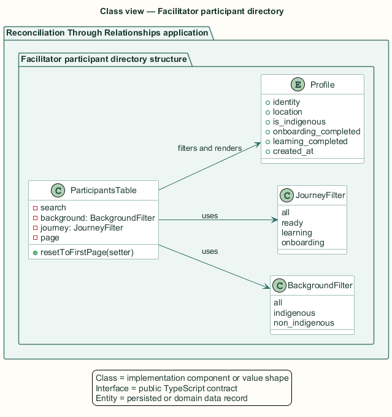
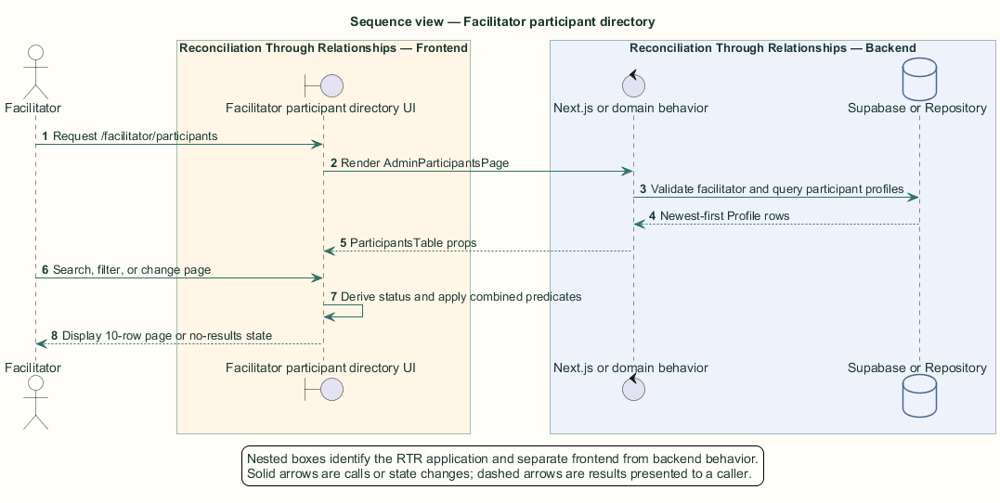

# Facilitator participant directory — Detailed design

## Overview

Facilitator participant directory — vertical slice that loads every participant, derives journey status, combines search and filters, paginates the collection, and links each row to its profile

Facilitators require visibility across all stages of the participant journey, including profiles that participants cannot otherwise discover. Facilitator row-level security grants that read scope without granting profile modification.

The server loads participant rows newest-first. The browser derives Onboarding, Learning, or Ready from the two completion flags and applies all interaction locally.

The entity of interest (EoI) is the Facilitator participant directory vertical slice of the Reconciliation Through Relationships platform. This focused architecture description (AD) describes that slice and does not claim full conformance with 42010:2022.

## Description

### Components, types, functions, and classes

| Element | Kind | Source | Responsibility and public interface |
| --- | --- | --- | --- |
| `AdminParticipantsPage` | React Server Component | `src/app/facilitator/participants/page.tsx` | Role-gates and loads all participant profiles newest-first. |
| `ParticipantsTable` | React Client Component | `src/app/facilitator/participants/ParticipantsTable.tsx` | Owns search, background filter, journey filter, and ten-row pagination. |
| `Journey derivation` | Pure render logic | `ParticipantsTable` | Maps profile completion flags to Onboarding, Learning, or Ready. |
| `Profile` | Generated row type | `src/data/supabase/database.types.ts` | Supplies identity, location, background, completion flags, and join time. |
| `profiles` | PostgreSQL table | `public.profiles` | Facilitator SELECT policy exposes all participant rows. |

### Structure and relationships

- `AdminParticipantsPage` passes the complete server-loaded participant collection to `ParticipantsTable`.

- `ParticipantsTable` combines name, city, or province search with background and journey predicates through `useMemo`.

- The table calculates a three-step progress percentage and links each participant name to `/profile/{id}`.

### Behaviour

1. The facilitator requests the Participants route.

2. The server validates role and loads all participant profiles ordered by join time descending.

3. The client derives journey labels from completion flags.

4. Search and filters narrow the same in-memory collection and reset pagination.

5. The table displays ten rows per page, a clear-filters action, or the no-results explanation.

## Requirements

This section contains L2 requirements only. It intentionally includes no L1 requirement text. The L1 specification identifier records the traceability correspondence for each L2 requirement.

| L2 specification ID | L1 specification ID | Requirement text |
| --- | --- | --- |
| `L2-FACIL-055` | `L1-FACIL-013` | Facilitators shall browse all participants with journey status and filters. |

## Diagrams

The five architecture views use one caption pattern and stable EoI-local names. Each view component is available as PlantUML source and as an inline Portable Network Graphics (PNG) rendering.

### C4 system context view

[PlantUML source](diagrams/c4-context.puml)

Figure 1 — C4 system context view: the Facilitator participant directory EoI, its actor, and its external dependencies. The view component uses the C4 system context model kind.

### C4 container view

[PlantUML source](diagrams/c4-container.puml)

Figure 2 — C4 container view: the frontend, backend, data, and integration boundaries. The view component uses the C4 container model kind.

### C4 component view

[PlantUML source](diagrams/c4-component.puml)

Figure 3 — C4 component view: the source-level components and their structural relationships. The view component uses the C4 component model kind.

### Class view

[PlantUML source](diagrams/class-diagram.puml)

Figure 4 — Class view: the feature types, functions, classes, entities, and their relationships. The view component uses the Unified Modeling Language (UML) class model kind.

### Sequence view

[PlantUML source](diagrams/sequence-diagram.puml)

Figure 5 — Sequence view: the principal end-to-end feature behavior. Nested application boxes separate frontend behavior from backend behavior. The view component uses the UML sequence model kind.
