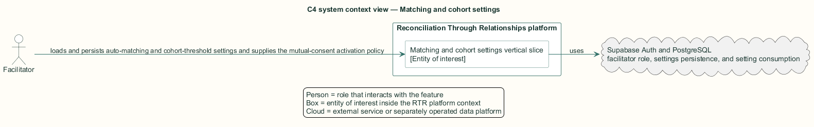
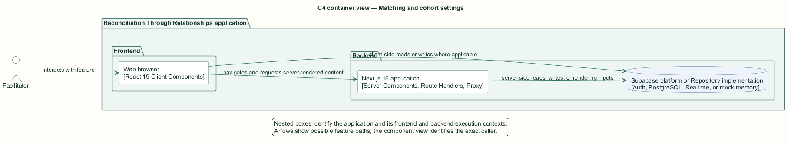
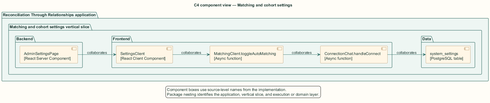
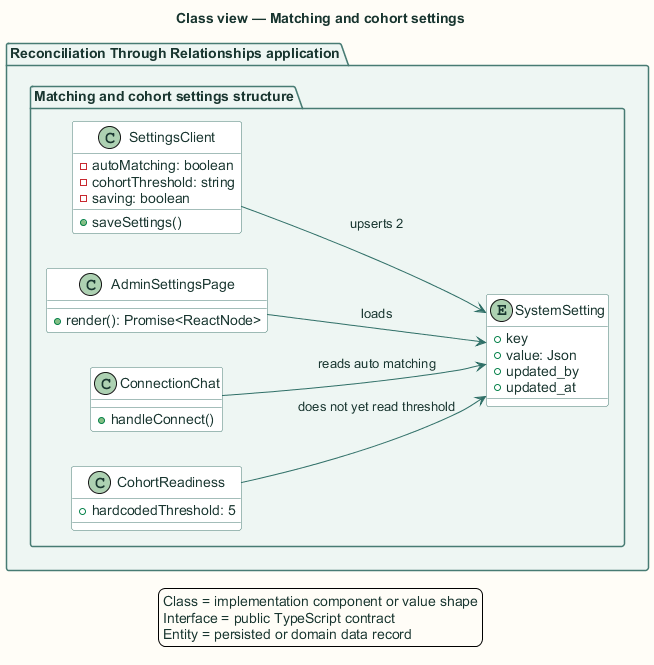
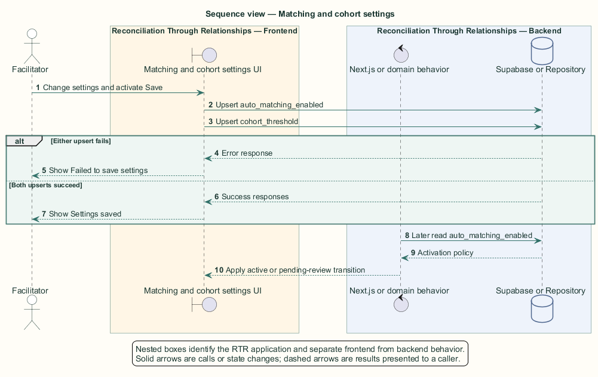

# Matching and cohort settings — Detailed design

## Overview

Matching and cohort settings — vertical slice that loads and persists auto-matching and cohort-threshold settings and supplies the mutual-consent activation policy

Platform settings control whether mutual participant consent activates a connection immediately and the intended participant threshold for regional cohort readiness.

The settings page loads key-value rows on the backend and passes a flattened map to the client. The client submits two upserts in parallel and attributes each change to the facilitator.

The entity of interest (EoI) is the Matching and cohort settings vertical slice of the Reconciliation Through Relationships platform. This focused architecture description (AD) describes that slice and does not claim full conformance with 42010:2022.

## Description

### Components, types, functions, and classes

| Element | Kind | Source | Responsibility and public interface |
| --- | --- | --- | --- |
| `AdminSettingsPage` | React Server Component | `src/app/facilitator/settings/page.tsx` | Role-gates, reads settings, and constructs a key-value map. |
| `SettingsClient` | React Client Component | `src/app/facilitator/settings/SettingsClient.tsx` | Owns setting form state and `saveSettings`. |
| `MatchingClient.toggleAutoMatching` | Async function | `src/app/facilitator/matching/MatchingClient.tsx` | Updates the same auto-matching key from the matching page. |
| `ConnectionChat.handleConnect` | Async function | `src/app/connections/components/ConnectionChat.tsx` | Reads auto-matching to select active or pending-review status. |
| `system_settings` | PostgreSQL table | `public.system_settings` | Stores JSON values, updater, and update timestamp by key. |

### Structure and relationships

- `AdminSettingsPage` converts settings rows into the `Record<string, unknown>` consumed by `SettingsClient`.

- `saveSettings` upserts `auto_matching_enabled` and the parsed `cohort_threshold` concurrently with updater metadata.

- `ConnectionChat` consumes auto-matching. The dashboard cohort banner and regional map currently do not consume the saved threshold.

### Behaviour

1. The facilitator opens settings and receives the stored values or defaults.

2. The facilitator changes the switch or a threshold from 3 through 20 and activates Save settings.

3. The client issues two attributed upserts and waits for both responses.

4. Any error produces the failure toast; two successful responses produce the success toast.

5. A later mutual-consent flow reads auto-matching and selects immediate activation or review.

### Realization notes

- `cohort_threshold` persists but the cohort banner and regional map use hardcoded value 5. L2-FACIL-060 is therefore not satisfied by the current realization.

- The settings description states that facilitator approval is always required, while enabled auto-matching activates mutual connections immediately. The user-facing copy and implemented policy conflict.

## Requirements

This section contains L2 requirements only. It intentionally includes no L1 requirement text. The L1 specification identifier records the traceability correspondence for each L2 requirement.

| L2 specification ID | L1 specification ID | Requirement text |
| --- | --- | --- |
| `L2-FACIL-058` | `L1-FACIL-013` | Facilitators shall control whether mutual connections activate automatically or await review, via the `auto_matching_enabled` setting. (See GAP-008 for the contradiction with the "approval is always required" settings copy.) |
| `L2-FACIL-059` | `L1-FACIL-013` | Facilitator settings shall persist the auto-matching switch and cohort threshold, and report failures. |
| `L2-FACIL-060` | `L1-FACIL-013` | The saved `cohort_threshold` shall drive every cohort-readiness computation (dashboard banner, regional map). Status: Not satisfied — the saved `cohort_threshold` is never read back; cohort logic hardcodes 5 (GAP-006). |

## Diagrams

The five architecture views use one caption pattern and stable EoI-local names. Each view component is available as PlantUML source and as an inline Portable Network Graphics (PNG) rendering.

### C4 system context view

[PlantUML source](diagrams/c4-context.puml)

Figure 1 — C4 system context view: the Matching and cohort settings EoI, its actor, and its external dependencies. The view component uses the C4 system context model kind.

### C4 container view

[PlantUML source](diagrams/c4-container.puml)

Figure 2 — C4 container view: the frontend, backend, data, and integration boundaries. The view component uses the C4 container model kind.

### C4 component view

[PlantUML source](diagrams/c4-component.puml)

Figure 3 — C4 component view: the source-level components and their structural relationships. The view component uses the C4 component model kind.

### Class view

[PlantUML source](diagrams/class-diagram.puml)

Figure 4 — Class view: the feature types, functions, classes, entities, and their relationships. The view component uses the Unified Modeling Language (UML) class model kind.

### Sequence view

[PlantUML source](diagrams/sequence-diagram.puml)

Figure 5 — Sequence view: the principal end-to-end feature behavior. Nested application boxes separate frontend behavior from backend behavior. The view component uses the UML sequence model kind.
