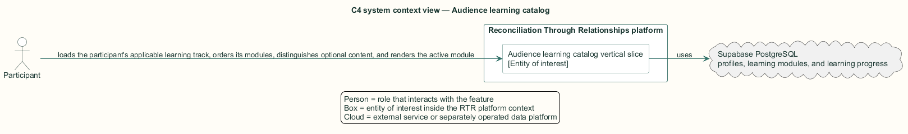
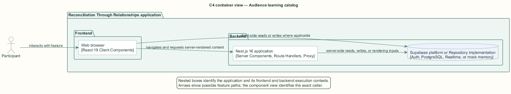
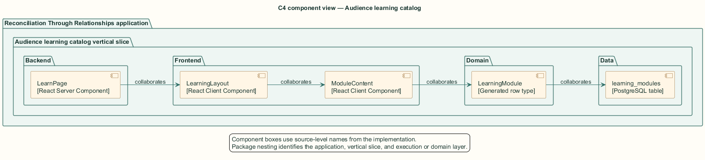
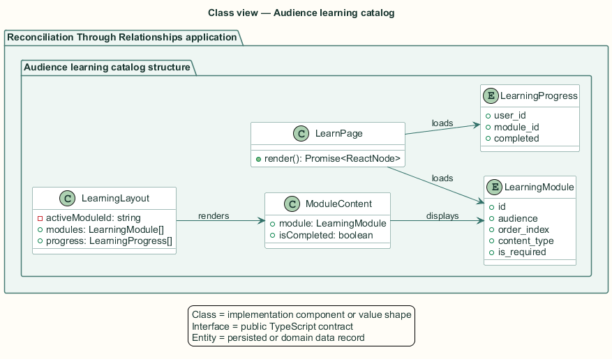
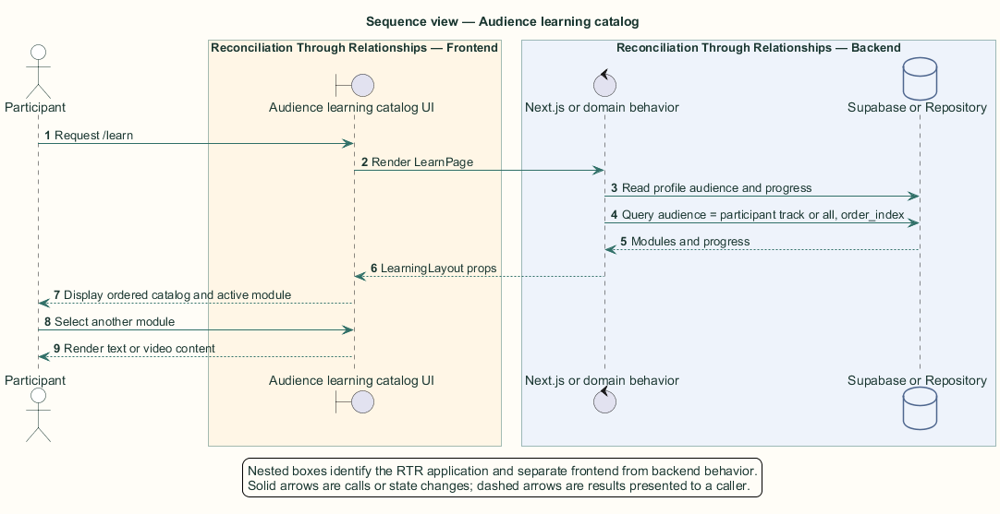

# Audience learning catalog — Detailed design

## Overview

Audience learning catalog — vertical slice that loads the participant's applicable learning track, orders its modules, distinguishes optional content, and renders the active module

The learning journey supplies shared context before a participant enters matching and conversation features. Modules target Indigenous participants, non-Indigenous participants, or all participants.

The server page derives the audience from `profiles.is_indigenous`, reads the applicable catalog and existing progress, and passes serializable rows to the client layout. Text content renders as Markdown; video content renders in an embedded frame.

The entity of interest (EoI) is the Audience learning catalog vertical slice of the Reconciliation Through Relationships platform. This focused architecture description (AD) describes that slice and does not claim full conformance with 42010:2022.

## Description

### Components, types, functions, and classes

| Element | Kind | Source | Responsibility and public interface |
| --- | --- | --- | --- |
| `LearnPage` | React Server Component | `src/app/learn/page.tsx` | Loads the profile, audience-filtered modules, and progress for `/learn`. |
| `LearningLayout` | React Client Component | `src/app/learn/components/LearningLayout.tsx` | Owns active module selection and required-module progress display. |
| `ModuleContent` | React Client Component | `src/app/learn/components/ModuleContent.tsx` | Renders text or video content and completion state. |
| `LearningModule` | Generated row type | `src/data/supabase/database.types.ts` | Carries audience, order, content, duration, and required status. |
| `learning_modules` | PostgreSQL table | `public.learning_modules` | Stores the ordered audience catalog. |

### Structure and relationships

- `LearnPage` selects modules whose `audience` equals the participant track or `all`, ordered by `order_index`.

- `LearningLayout` receives module and progress rows as props and passes the selected `LearningModule` to `ModuleContent`.

- `ModuleContent` uses `ReactMarkdown` for text modules and an `iframe` for video modules.

### Behaviour

1. The participant requests `/learn` with an authenticated session.

2. `LearnPage` reads the participant profile and derives the audience track.

3. The server queries the ordered matching and shared modules plus the participant's progress.

4. `LearningLayout` selects the first incomplete module or the first module.

5. The participant selects modules while optional badges and required progress remain visible.

## Requirements

This section contains L2 requirements only. It intentionally includes no L1 requirement text. The L1 specification identifier records the traceability correspondence for each L2 requirement.

| L2 specification ID | L1 specification ID | Requirement text |
| --- | --- | --- |
| `L2-LEARN-020` | `L1-LEARN-006` | `/learn` shall present only modules whose audience matches the participant (`indigenous` or `non_indigenous` per `is_indigenous`, plus `all`), ordered by `order_index`, with required and optional modules distinguished. |

## Diagrams

The five architecture views use one caption pattern and stable EoI-local names. Each view component is available as PlantUML source and as an inline Portable Network Graphics (PNG) rendering.

### C4 system context view

[PlantUML source](diagrams/c4-context.puml)

Figure 1 — C4 system context view: the Audience learning catalog EoI, its actor, and its external dependencies. The view component uses the C4 system context model kind.

### C4 container view

[PlantUML source](diagrams/c4-container.puml)

Figure 2 — C4 container view: the frontend, backend, data, and integration boundaries. The view component uses the C4 container model kind.

### C4 component view

[PlantUML source](diagrams/c4-component.puml)

Figure 3 — C4 component view: the source-level components and their structural relationships. The view component uses the C4 component model kind.

### Class view

[PlantUML source](diagrams/class-diagram.puml)

Figure 4 — Class view: the feature types, functions, classes, entities, and their relationships. The view component uses the Unified Modeling Language (UML) class model kind.

### Sequence view

[PlantUML source](diagrams/sequence-diagram.puml)

Figure 5 — Sequence view: the principal end-to-end feature behavior. Nested application boxes separate frontend behavior from backend behavior. The view component uses the UML sequence model kind.
