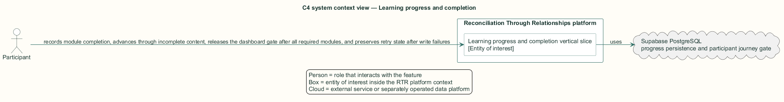
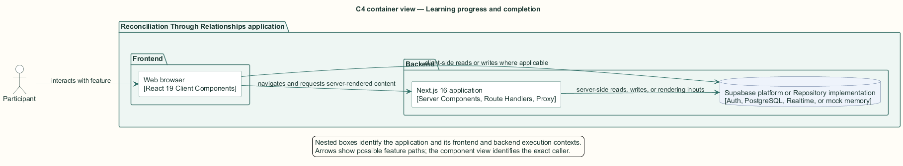
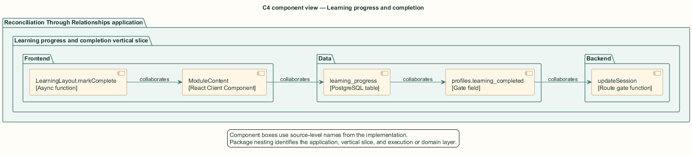
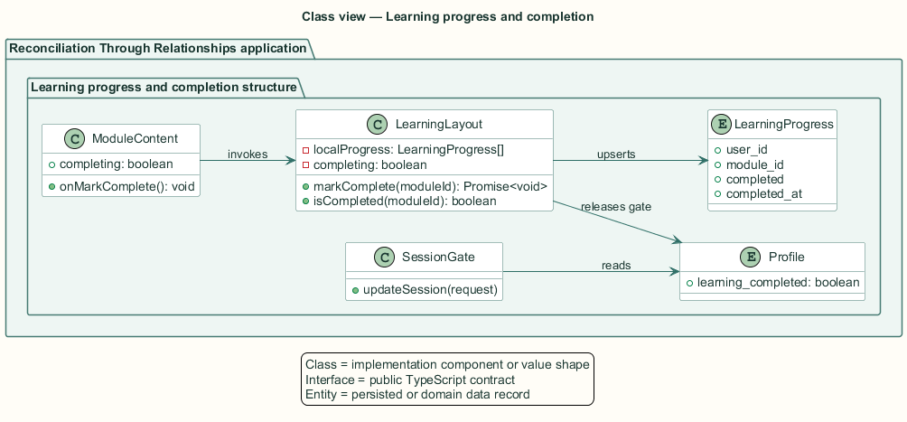
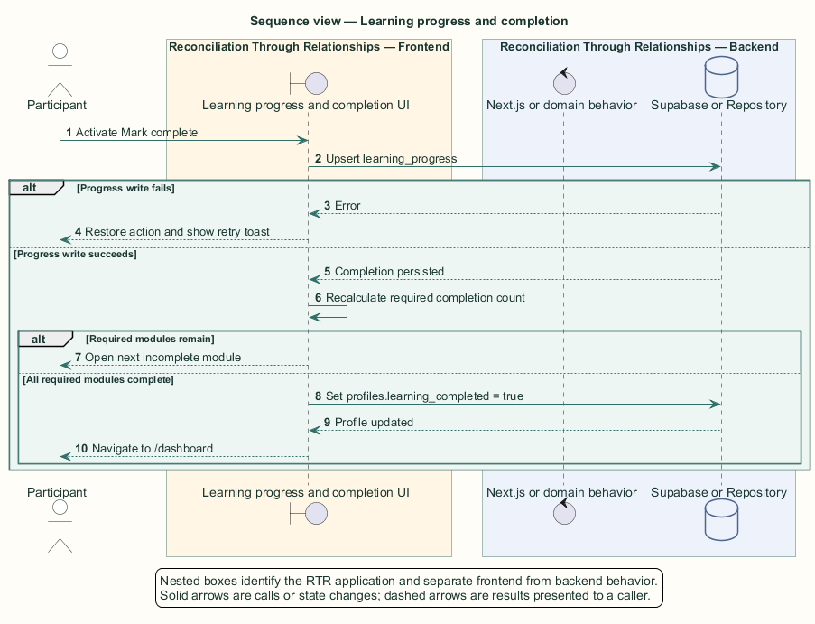

# Learning progress and completion — Detailed design

## Overview

Learning progress and completion — vertical slice that records module completion, advances through incomplete content, releases the dashboard gate after all required modules, and preserves retry state after write failures

Learning progress is participant-specific. A unique database key on `(user_id, module_id)` allows an idempotent upsert for each module.

Only required modules contribute to the journey gate. Optional modules remain available without delaying dashboard access. Completed participants may revisit `/learn` because the page does not redirect them away from the catalog.

The entity of interest (EoI) is the Learning progress and completion vertical slice of the Reconciliation Through Relationships platform. This focused architecture description (AD) describes that slice and does not claim full conformance with 42010:2022.

## Description

### Components, types, functions, and classes

| Element | Kind | Source | Responsibility and public interface |
| --- | --- | --- | --- |
| `LearningLayout.markComplete` | Async function | `src/app/learn/components/LearningLayout.tsx` | Upserts progress, updates local state, advances, and releases the gate. |
| `ModuleContent` | React Client Component | `src/app/learn/components/ModuleContent.tsx` | Invokes `onMarkComplete` and reflects saving or completed state. |
| `learning_progress` | PostgreSQL table | `public.learning_progress` | Stores one completion record per user and module. |
| `profiles.learning_completed` | Gate field | `public.profiles` | Marks the participant's learning journey complete. |
| `updateSession` | Route gate function | `src/data/supabase/session-proxy.ts` | Allows dashboard access after the profile flag changes. |

### Structure and relationships

- `ModuleContent` delegates completion to `LearningLayout.markComplete` through a callback prop.

- `markComplete` upserts `learning_progress`, mirrors the result in local state, and selects the next incomplete module.

- After the required count reaches the catalog total, `markComplete` updates `profiles.learning_completed`; the route gate reads that flag on later requests.

### Behaviour

1. The participant activates Mark complete for an incomplete module.

2. The client upserts a completed progress row and waits for the write result.

3. A failed write restores the actionable state and shows a retryable error.

4. A successful intermediate write updates progress, shows success, and opens the next incomplete module.

5. A successful final required write sets the profile completion flag and navigates to `/dashboard`.

## Requirements

This section contains L2 requirements only. It intentionally includes no L1 requirement text. The L1 specification identifier records the traceability correspondence for each L2 requirement.

| L2 specification ID | L1 specification ID | Requirement text |
| --- | --- | --- |
| `L2-LEARN-021` | `L1-LEARN-006` | Participants shall open any listed module and mark it complete, recording progress and advancing to the next incomplete module. |
| `L2-LEARN-022` | `L1-LEARN-006` | Completing all required modules shall mark learning complete and move the participant to the dashboard. |
| `L2-LEARN-023` | `L1-LEARN-006` | A failed progress write shall leave the module incomplete and retryable. |

## Diagrams

The five architecture views use one caption pattern and stable EoI-local names. Each view component is available as PlantUML source and as an inline Portable Network Graphics (PNG) rendering.

### C4 system context view

[PlantUML source](diagrams/c4-context.puml)

Figure 1 — C4 system context view: the Learning progress and completion EoI, its actor, and its external dependencies. The view component uses the C4 system context model kind.

### C4 container view

[PlantUML source](diagrams/c4-container.puml)

Figure 2 — C4 container view: the frontend, backend, data, and integration boundaries. The view component uses the C4 container model kind.

### C4 component view

[PlantUML source](diagrams/c4-component.puml)

Figure 3 — C4 component view: the source-level components and their structural relationships. The view component uses the C4 component model kind.

### Class view

[PlantUML source](diagrams/class-diagram.puml)

Figure 4 — Class view: the feature types, functions, classes, entities, and their relationships. The view component uses the Unified Modeling Language (UML) class model kind.

### Sequence view

[PlantUML source](diagrams/sequence-diagram.puml)

Figure 5 — Sequence view: the principal end-to-end feature behavior. Nested application boxes separate frontend behavior from backend behavior. The view component uses the UML sequence model kind.
