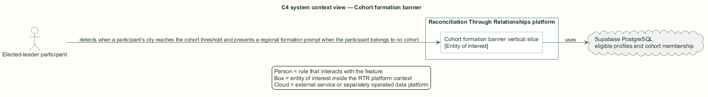
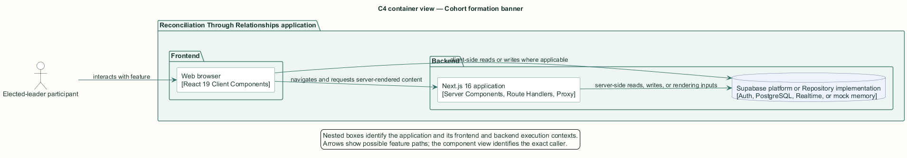
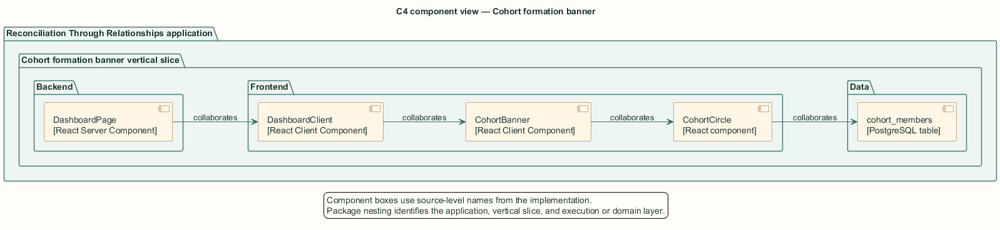
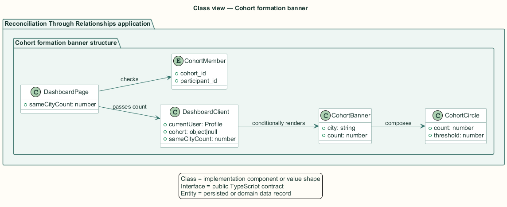
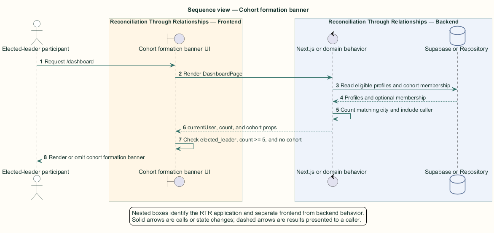

# Cohort formation banner — Detailed design

## Overview

Cohort formation banner — vertical slice that detects when a participant's city reaches the cohort threshold and presents a regional formation prompt when the participant belongs to no cohort

Regional cohorts complement one-to-one relationships. The dashboard prompt targets participants whose participation categories include `elected_leader` because that role can help convene a local group.

The server counts completed participants in the same city and includes the current participant. The client applies the elected-leader, count, and existing-membership conditions before rendering the prompt.

The entity of interest (EoI) is the Cohort formation banner vertical slice of the Reconciliation Through Relationships platform. This focused architecture description (AD) describes that slice and does not claim full conformance with 42010:2022.

## Description

### Components, types, functions, and classes

| Element | Kind | Source | Responsibility and public interface |
| --- | --- | --- | --- |
| `DashboardPage` | React Server Component | `src/app/dashboard/page.tsx` | Loads cohort membership and computes `sameCityCount`. |
| `DashboardClient` | React Client Component | `src/app/dashboard/components/DashboardClient.tsx` | Applies role, threshold, and membership display conditions. |
| `CohortBanner` | React Client Component | `src/app/dashboard/components/CohortBanner.tsx` | Renders city, eligible count, cohort circle, and Create cohort action. |
| `CohortCircle` | React component | `src/components/cohort-circle.tsx` | Visualizes filled seats against a threshold. |
| `cohort_members` | PostgreSQL table | `public.cohort_members` | Indicates whether the current participant already belongs to a cohort. |

### Structure and relationships

- `DashboardPage` compares candidate city values case-insensitively and adds the current participant to the resulting count.

- `DashboardClient` renders `CohortBanner` only for an elected leader with at least five same-city participants and no `cohort_members` row.

- `CohortBanner` composes `CohortCircle`; the Create cohort button currently has no event handler.

### Behaviour

1. The elected-leader participant opens the dashboard.

2. The server loads eligible participants and the caller's cohort membership.

3. The server counts same-city eligible participants and includes the caller.

4. The browser checks the elected-leader category, threshold, and absence of cohort membership.

5. The browser renders the cohort formation banner when every condition holds.

### Realization notes

- The displayed Create cohort control has no active event handler. The slice implements threshold detection and display only.

## Requirements

This section contains L2 requirements only. It intentionally includes no L1 requirement text. The L1 specification identifier records the traceability correspondence for each L2 requirement.

| L2 specification ID | L1 specification ID | Requirement text |
| --- | --- | --- |
| `L2-MATENG-027` | `L1-MATENG-007` | Elected leaders shall be told when enough same-city participants exist to form a cohort. (Display only — see GAP-009 for the inactive "Create cohort" action.) |

## Diagrams

The five architecture views use one caption pattern and stable EoI-local names. Each view component is available as PlantUML source and as an inline Portable Network Graphics (PNG) rendering.

### C4 system context view

[PlantUML source](diagrams/c4-context.puml)

Figure 1 — C4 system context view: the Cohort formation banner EoI, its actor, and its external dependencies. The view component uses the C4 system context model kind.

### C4 container view

[PlantUML source](diagrams/c4-container.puml)

Figure 2 — C4 container view: the frontend, backend, data, and integration boundaries. The view component uses the C4 container model kind.

### C4 component view

[PlantUML source](diagrams/c4-component.puml)

Figure 3 — C4 component view: the source-level components and their structural relationships. The view component uses the C4 component model kind.

### Class view

[PlantUML source](diagrams/class-diagram.puml)

Figure 4 — Class view: the feature types, functions, classes, entities, and their relationships. The view component uses the Unified Modeling Language (UML) class model kind.

### Sequence view

[PlantUML source](diagrams/sequence-diagram.puml)

Figure 5 — Sequence view: the principal end-to-end feature behavior. Nested application boxes separate frontend behavior from backend behavior. The view component uses the UML sequence model kind.
