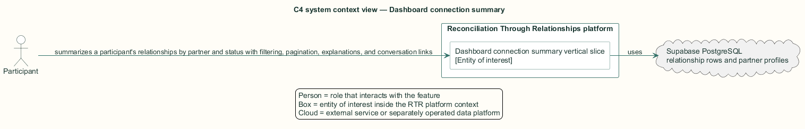
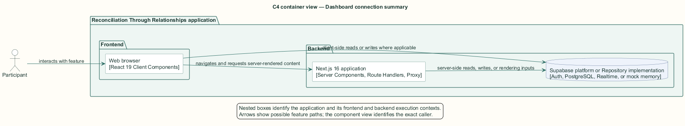
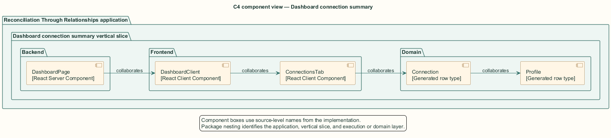
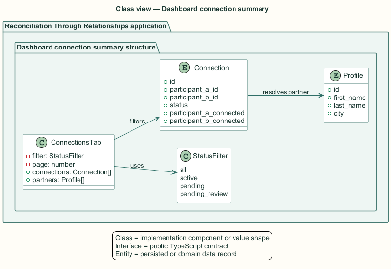
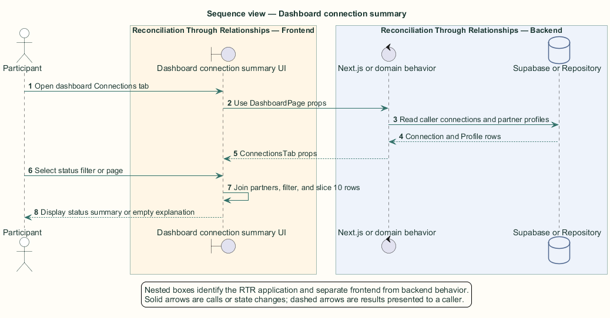

# Dashboard connection summary — Detailed design

## Overview

Dashboard connection summary — vertical slice that summarizes a participant's relationships by partner and status with filtering, pagination, explanations, and conversation links

The dashboard connection summary offers a compact relationship status view without replacing the dedicated connections page. A connection can be active, waiting for one participant, or awaiting facilitator review.

The server loads connection rows and partner profiles. The client joins them in memory, applies the selected status filter, and paginates at ten rows.

The entity of interest (EoI) is the Dashboard connection summary vertical slice of the Reconciliation Through Relationships platform. This focused architecture description (AD) describes that slice and does not claim full conformance with 42010:2022.

## Description

### Components, types, functions, and classes

| Element | Kind | Source | Responsibility and public interface |
| --- | --- | --- | --- |
| `DashboardPage` | React Server Component | `src/app/dashboard/page.tsx` | Loads the caller's connections and partner profile rows. |
| `DashboardClient` | React Client Component | `src/app/dashboard/components/DashboardClient.tsx` | Provides the Connections tab and count badge. |
| `ConnectionsTab` | React Client Component | `src/app/dashboard/components/ConnectionsTab.tsx` | Filters statuses, resolves partners, paginates, and renders rows. |
| `Connection` | Generated row type | `src/data/supabase/database.types.ts` | Carries status and each participant's consent flag. |
| `Profile` | Generated row type | `src/data/supabase/database.types.ts` | Supplies partner identity and city. |

### Structure and relationships

- `DashboardPage` derives each partner identifier from the connection pair and loads all corresponding profiles in one query.

- `ConnectionsTab` creates a partner map, filters by `active`, `pending`, or `pending_review`, and slices pages at ten rows.

- Each rendered row links to `/connections/{id}` and derives pending copy from the caller's participant position and consent flag.

### Behaviour

1. The participant opens the dashboard Connections tab.

2. The client joins each connection to its partner profile.

3. The selected status predicate filters the relationship collection.

4. The current page displays partner, city, status, and state-specific explanatory text.

5. Selecting a row opens the dedicated conversation; an empty collection links back to recommendations.

## Requirements

This section contains L2 requirements only. It intentionally includes no L1 requirement text. The L1 specification identifier records the traceability correspondence for each L2 requirement.

| L2 specification ID | L1 specification ID | Requirement text |
| --- | --- | --- |
| `L2-MATENG-030` | `L1-MATENG-007` | The Connections tab shall summarize the participant's connections with status badges and filtering. |

## Diagrams

The five architecture views use one caption pattern and stable EoI-local names. Each view component is available as PlantUML source and as an inline Portable Network Graphics (PNG) rendering.

### C4 system context view

[PlantUML source](diagrams/c4-context.puml)

Figure 1 — C4 system context view: the Dashboard connection summary EoI, its actor, and its external dependencies. The view component uses the C4 system context model kind.

### C4 container view

[PlantUML source](diagrams/c4-container.puml)

Figure 2 — C4 container view: the frontend, backend, data, and integration boundaries. The view component uses the C4 container model kind.

### C4 component view

[PlantUML source](diagrams/c4-component.puml)

Figure 3 — C4 component view: the source-level components and their structural relationships. The view component uses the C4 component model kind.

### Class view

[PlantUML source](diagrams/class-diagram.puml)

Figure 4 — Class view: the feature types, functions, classes, entities, and their relationships. The view component uses the Unified Modeling Language (UML) class model kind.

### Sequence view

[PlantUML source](diagrams/sequence-diagram.puml)

Figure 5 — Sequence view: the principal end-to-end feature behavior. Nested application boxes separate frontend behavior from backend behavior. The view component uses the UML sequence model kind.
