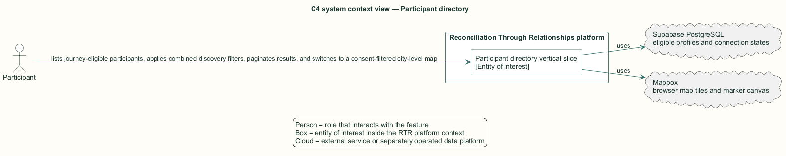
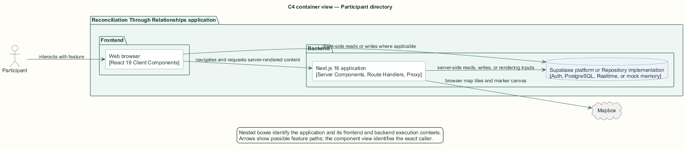
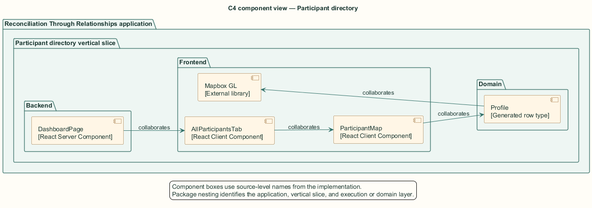
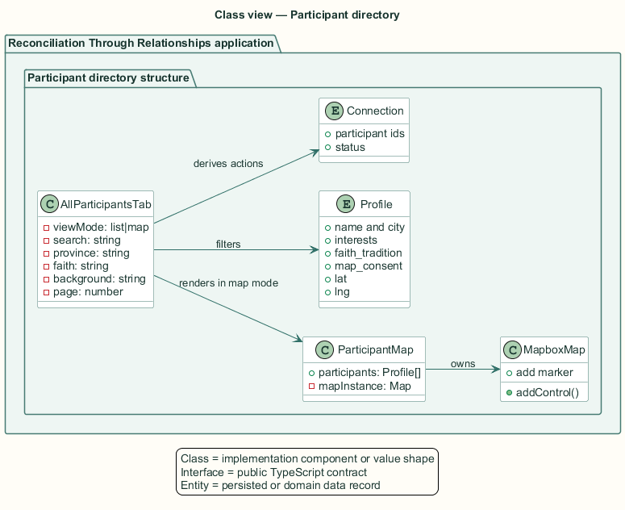
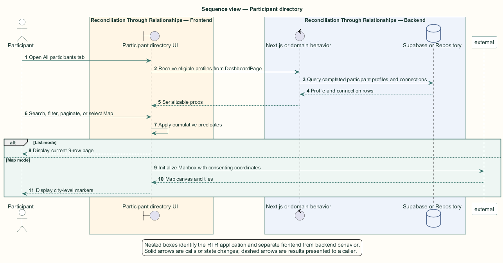

# Participant directory — Detailed design

## Overview

Participant directory — vertical slice that lists journey-eligible participants, applies combined discovery filters, paginates results, and switches to a consent-filtered city-level map

The participant directory allows discovery beyond the recommendation list. The backend supplies only completed participant profiles other than the viewer. Browser state applies search and filter criteria without additional network requests.

The list and map are two presentations of the same filtered collection. `ParticipantMap` applies an additional consent-and-coordinate filter before creating Mapbox markers.

The entity of interest (EoI) is the Participant directory vertical slice of the Reconciliation Through Relationships platform. This focused architecture description (AD) describes that slice and does not claim full conformance with 42010:2022.

## Description

### Components, types, functions, and classes

| Element | Kind | Source | Responsibility and public interface |
| --- | --- | --- | --- |
| `DashboardPage` | React Server Component | `src/app/dashboard/page.tsx` | Loads eligible participant and connection rows. |
| `AllParticipantsTab` | React Client Component | `src/app/dashboard/components/AllParticipantsTab.tsx` | Owns query, filters, list/map mode, and nine-row pagination. |
| `ParticipantMap` | React Client Component | `src/app/dashboard/components/ParticipantMap.tsx` | Filters by consent and coordinates and owns the Mapbox instance. |
| `Profile` | Generated row type | `src/data/supabase/database.types.ts` | Supplies identity, location, interests, faith, eligibility, and consent fields. |
| `Mapbox GL` | External library | `mapbox-gl` | Creates city-level markers and popups in the browser. |

### Structure and relationships

- `DashboardPage` supplies journey-eligible profiles and existing connections to `AllParticipantsTab`.

- `AllParticipantsTab` applies name, city, interest, province, background, and faith predicates cumulatively, then paginates list results at nine rows.

- Map mode passes the filtered profiles to `ParticipantMap`, which retains only `map_consent` rows with latitude and longitude.

### Behaviour

1. The participant opens the All participants dashboard tab.

2. The browser filters the server-provided eligible collection as search and filter values change.

3. List mode displays the current nine-row page and state-aware connection actions.

4. Map mode filters the same result set by consent and available city-level coordinates.

5. Mapbox GL displays markers or the consent-aware empty explanation.

## Requirements

This section contains L2 requirements only. It intentionally includes no L1 requirement text. The L1 specification identifier records the traceability correspondence for each L2 requirement.

| L2 specification ID | L1 specification ID | Requirement text |
| --- | --- | --- |
| `L2-MATENG-028` | `L1-MATENG-007` | The "All participants" tab shall list eligible participants with search, filters, and pagination. |
| `L2-MATENG-029` | `L1-MATENG-007` | The directory's map view shall plot only consenting participants at city level. |

## Diagrams

The five architecture views use one caption pattern and stable EoI-local names. Each view component is available as PlantUML source and as an inline Portable Network Graphics (PNG) rendering.

### C4 system context view

[PlantUML source](diagrams/c4-context.puml)

Figure 1 — C4 system context view: the Participant directory EoI, its actor, and its external dependencies. The view component uses the C4 system context model kind.

### C4 container view

[PlantUML source](diagrams/c4-container.puml)

Figure 2 — C4 container view: the frontend, backend, data, and integration boundaries. The view component uses the C4 container model kind.

### C4 component view

[PlantUML source](diagrams/c4-component.puml)

Figure 3 — C4 component view: the source-level components and their structural relationships. The view component uses the C4 component model kind.

### Class view

[PlantUML source](diagrams/class-diagram.puml)

Figure 4 — Class view: the feature types, functions, classes, entities, and their relationships. The view component uses the Unified Modeling Language (UML) class model kind.

### Sequence view

[PlantUML source](diagrams/sequence-diagram.puml)

Figure 5 — Sequence view: the principal end-to-end feature behavior. Nested application boxes separate frontend behavior from backend behavior. The view component uses the UML sequence model kind.
