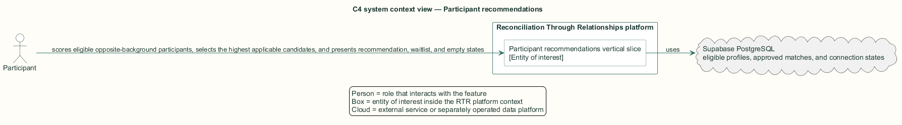
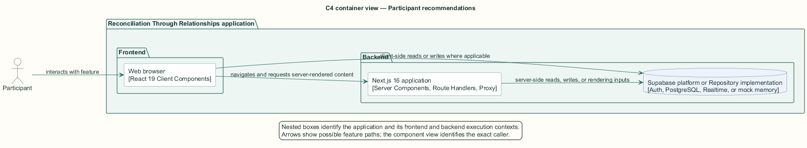
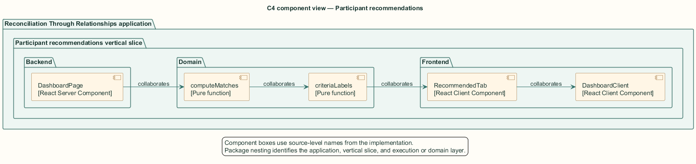
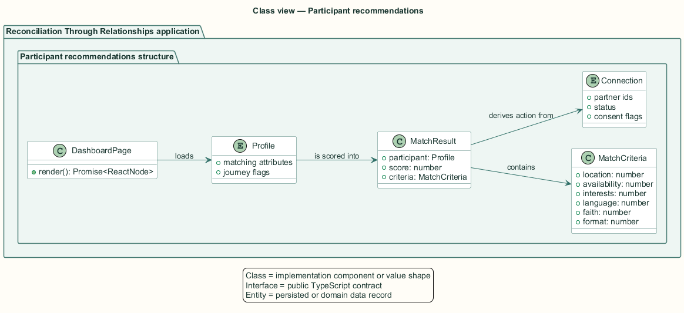
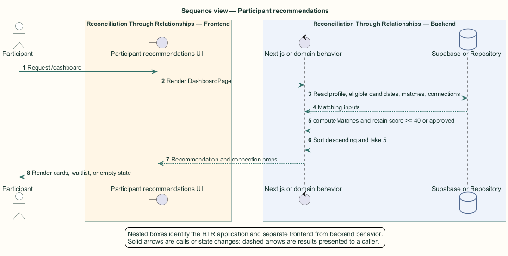

# Participant recommendations — Detailed design

## Overview

Participant recommendations — vertical slice that scores eligible opposite-background participants, selects the highest applicable candidates, and presents recommendation, waitlist, and empty states

The participant dashboard introduces potential one-to-one relationships after onboarding and learning are complete. Recommendations combine facilitator-approved matches with candidates whose deterministic compatibility score reaches 40.

The pure matching module assigns at most 100 points across location, availability, interests, language, faith tradition, and participation format. The server selects at most five results and the browser renders action states from existing connections.

The entity of interest (EoI) is the Participant recommendations vertical slice of the Reconciliation Through Relationships platform. This focused architecture description (AD) describes that slice and does not claim full conformance with 42010:2022.

## Description

### Components, types, functions, and classes

| Element | Kind | Source | Responsibility and public interface |
| --- | --- | --- | --- |
| `DashboardPage` | React Server Component | `src/app/dashboard/page.tsx` | Loads eligible profiles, matches, and connections; selects five recommendations. |
| `computeMatches` | Pure function | `src/domain/profile-matching.ts` | Filters by opposite `is_indigenous`, scores criteria, and sorts descending. |
| `criteriaLabels` | Pure function | `src/domain/profile-matching.ts` | Converts score criteria into display labels and maxima. |
| `RecommendedTab` | React Client Component | `src/app/dashboard/components/RecommendedTab.tsx` | Renders cards, score chips, connection actions, and the empty state. |
| `DashboardClient` | React Client Component | `src/app/dashboard/components/DashboardClient.tsx` | Computes and renders the non-Indigenous waitlist alert. |

### Structure and relationships

- `DashboardPage` passes eligible profiles to `computeMatches` and retains candidates in an approved match or at least 40 points.

- `RecommendedTab` uses `criteriaLabels` and indexes connection rows by partner identifier to derive Connect, Pending, or Open chat actions.

- `DashboardClient` shows the waitlist alert only for a non-Indigenous participant with no recommendation.

### Behaviour

1. The participant requests the completed-journey dashboard.

2. The server loads the participant, eligible candidates, approved matches, and existing connections.

3. `computeMatches` excludes same-background candidates, calculates six criteria, and sorts the results.

4. The server keeps approved or qualifying scores and limits the result to five.

5. The browser renders recommendation cards or the applicable waitlist and empty explanations.

## Requirements

This section contains L2 requirements only. It intentionally includes no L1 requirement text. The L1 specification identifier records the traceability correspondence for each L2 requirement.

| L2 specification ID | L1 specification ID | Requirement text |
| --- | --- | --- |
| `L2-MATENG-024` | `L1-MATENG-007` | Match recommendations shall pair only Indigenous with non-Indigenous participants and score each pair out of 100 using fixed weights. |
| `L2-MATENG-025` | `L1-MATENG-007` | Each recommendation shall show the candidate, the rounded percentage score, the positive criteria, and a state-appropriate action. |
| `L2-MATENG-026` | `L1-MATENG-007` | Non-Indigenous participants with no available match shall see a waitlist explanation; an empty recommendation list shall be explained. |

## Diagrams

The five architecture views use one caption pattern and stable EoI-local names. Each view component is available as PlantUML source and as an inline Portable Network Graphics (PNG) rendering.

### C4 system context view

[PlantUML source](diagrams/c4-context.puml)

Figure 1 — C4 system context view: the Participant recommendations EoI, its actor, and its external dependencies. The view component uses the C4 system context model kind.

### C4 container view

[PlantUML source](diagrams/c4-container.puml)

Figure 2 — C4 container view: the frontend, backend, data, and integration boundaries. The view component uses the C4 container model kind.

### C4 component view

[PlantUML source](diagrams/c4-component.puml)

Figure 3 — C4 component view: the source-level components and their structural relationships. The view component uses the C4 component model kind.

### Class view

[PlantUML source](diagrams/class-diagram.puml)

Figure 4 — Class view: the feature types, functions, classes, entities, and their relationships. The view component uses the Unified Modeling Language (UML) class model kind.

### Sequence view

[PlantUML source](diagrams/sequence-diagram.puml)

Figure 5 — Sequence view: the principal end-to-end feature behavior. Nested application boxes separate frontend behavior from backend behavior. The view component uses the UML sequence model kind.
