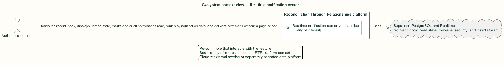
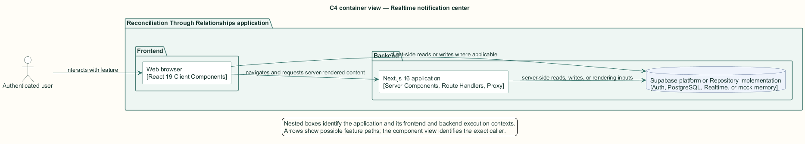
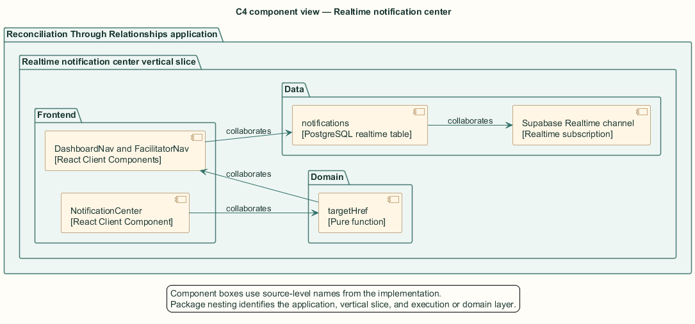
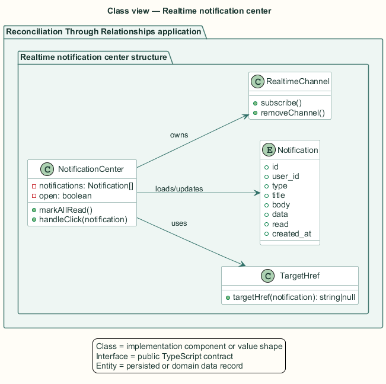
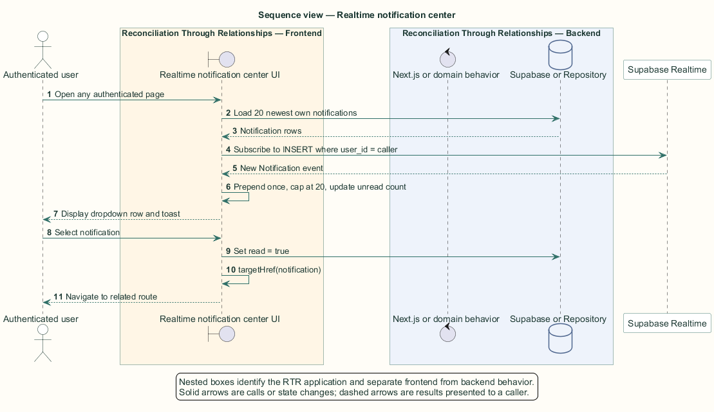

# Realtime notification center — Detailed design

## Overview

Realtime notification center — vertical slice that loads the recent inbox, displays unread state, marks one or all notifications read, routes by notification data, and delivers new alerts without a page reload

Notifications provide cross-feature awareness while an authenticated user remains anywhere in the application. The center appears in participant and facilitator navigation through the shared `AppHeader` action slot.

The client initially loads the 20 newest rows and then subscribes to inserts filtered by the authenticated user identifier. A realtime arrival updates the dropdown and creates a toast with a View action.

The entity of interest (EoI) is the Realtime notification center vertical slice of the Reconciliation Through Relationships platform. This focused architecture description (AD) describes that slice and does not claim full conformance with 42010:2022.

## Description

### Components, types, functions, and classes

| Element | Kind | Source | Responsibility and public interface |
| --- | --- | --- | --- |
| `NotificationCenter` | React Client Component | `src/components/notification-center.tsx` | Owns inbox, dropdown, unread count, read mutations, subscription, and toasts. |
| `targetHref` | Pure function | `src/components/notification-center.tsx` | Maps notification type and `data.connection_id` to an application route. |
| `DashboardNav and FacilitatorNav` | React Client Components | `src/app/*/components/*Nav.tsx` | Pass the authenticated user identifier into the center. |
| `notifications` | PostgreSQL realtime table | `public.notifications` | Stores recipient, type, title, body, data, read state, and timestamp. |
| `Supabase Realtime channel` | Realtime subscription | `notifications:{userId}` | Publishes notification inserts filtered by `user_id`. |

### Structure and relationships

- Navigation components compose `NotificationCenter` into `AppHeader` and provide the authenticated identifier.

- `NotificationCenter` reads at most 20 rows, computes unread state locally, and writes read flags for one row or the caller's unread collection.

- `targetHref` relates notification types to connection or dashboard routes for both dropdown selection and toast actions.

### Behaviour

1. The navigation mounts the center for an authenticated user.

2. The client loads 20 newest notifications and starts the recipient-filtered realtime channel.

3. The dropdown displays newest-first rows and an unread badge capped at `9+`.

4. Selecting one row marks it read and navigates; Mark all read updates every unread caller row.

5. A new insert prepends once, trims the collection to 20, and displays a toast with a route action.

## Requirements

This section contains L2 requirements only. It intentionally includes no L1 requirement text. The L1 specification identifier records the traceability correspondence for each L2 requirement.

| L2 specification ID | L1 specification ID | Requirement text |
| --- | --- | --- |
| `L2-NOTIF-047` | `L1-NOTIF-011` | Authenticated users shall see a notification bell with an unread badge. |
| `L2-NOTIF-049` | `L1-NOTIF-011` | Users shall mark notifications read individually or all at once. |
| `L2-NOTIF-050` | `L1-NOTIF-011` | Clicking a notification shall navigate to the relevant page, and new notifications shall arrive without a reload. |

## Diagrams

The five architecture views use one caption pattern and stable EoI-local names. Each view component is available as PlantUML source and as an inline Portable Network Graphics (PNG) rendering.

### C4 system context view

[PlantUML source](diagrams/c4-context.puml)

Figure 1 — C4 system context view: the Realtime notification center EoI, its actor, and its external dependencies. The view component uses the C4 system context model kind.

### C4 container view

[PlantUML source](diagrams/c4-container.puml)

Figure 2 — C4 container view: the frontend, backend, data, and integration boundaries. The view component uses the C4 container model kind.

### C4 component view

[PlantUML source](diagrams/c4-component.puml)

Figure 3 — C4 component view: the source-level components and their structural relationships. The view component uses the C4 component model kind.

### Class view

[PlantUML source](diagrams/class-diagram.puml)

Figure 4 — Class view: the feature types, functions, classes, entities, and their relationships. The view component uses the Unified Modeling Language (UML) class model kind.

### Sequence view

[PlantUML source](diagrams/sequence-diagram.puml)

Figure 5 — Sequence view: the principal end-to-end feature behavior. Nested application boxes separate frontend behavior from backend behavior. The view component uses the UML sequence model kind.
