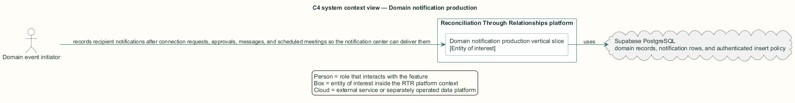
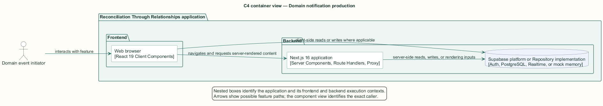
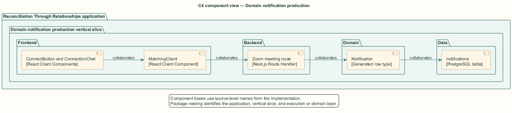
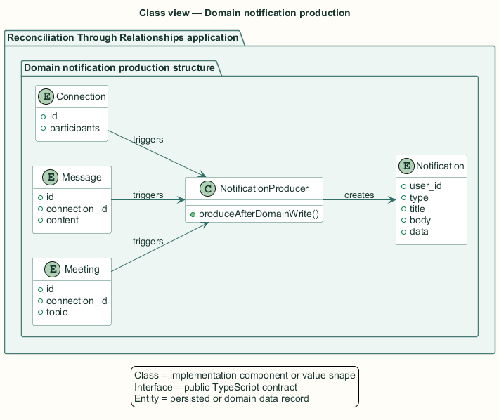
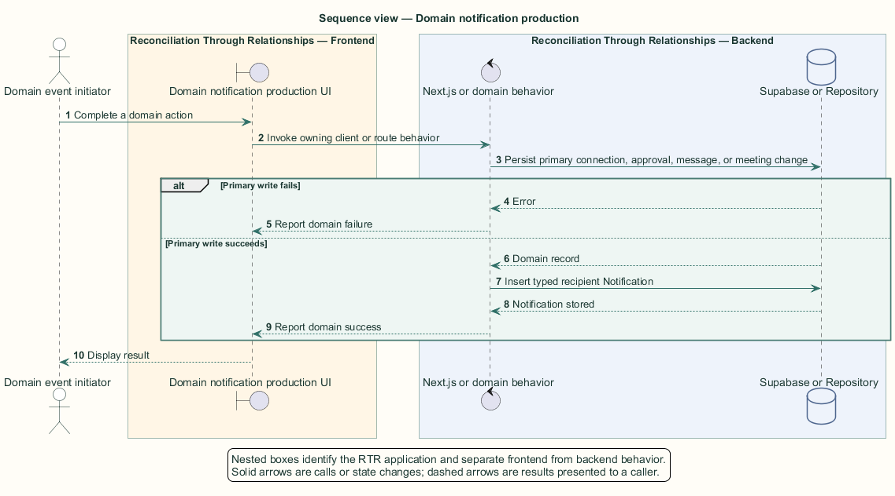

# Domain notification production — Detailed design

## Overview

Domain notification production — vertical slice that records recipient notifications after connection requests, approvals, messages, and scheduled meetings so the notification center can deliver them

Notification production is distributed across the domain feature that owns each event. The notification subsystem defines the shared row vocabulary and delivery behavior but does not centralize producer functions.

Four notification types exist: `connect_request`, `match_approved`, `new_message`, and `meeting_scheduled`. Each producer inserts directly into `public.notifications` after its primary domain write succeeds.

The entity of interest (EoI) is the Domain notification production vertical slice of the Reconciliation Through Relationships platform. This focused architecture description (AD) describes that slice and does not claim full conformance with 42010:2022.

## Description

### Components, types, functions, and classes

| Element | Kind | Source | Responsibility and public interface |
| --- | --- | --- | --- |
| `ConnectButton and ConnectionChat` | React Client Components | `src/app/profile and src/app/connections` | Produce request and message notifications after relationship writes. |
| `MatchingClient` | React Client Component | `src/app/facilitator/matching/MatchingClient.tsx` | Produces approval notifications for both participants. |
| `Zoom meeting route` | Next.js Route Handler | `src/app/api/zoom/create-meeting/route.ts` | Produces the scheduled-call notification after persistence. |
| `Notification` | Generated row type | `src/data/supabase/database.types.ts` | Defines the four type values and JSON data payload. |
| `notifications` | PostgreSQL table | `public.notifications` | Stores producer output for recipient delivery. |

### Structure and relationships

- Connection request producers address the other participant and include `data.connection_id`.

- Message production truncates the body to 80 characters; meeting production includes connection and meeting identifiers.

- Approval production writes one row per participant. Match approval currently supplies `match_id`, while mutual connection approval supplies `connection_id`.

### Behaviour

1. A domain event initiator completes a connection request, approval, message, or meeting action.

2. The owning component verifies that its primary domain write succeeded.

3. The producer constructs the applicable type, recipient, title, body, and data payload.

4. The producer inserts the notification row under the authenticated-user insert policy.

5. The notification center later reads or receives that row for the addressed recipient.

### Realization notes

- The notification insert policy requires only an authenticated caller. It does not verify a relationship between producer and recipient or constrain the type and payload.

- Match approval notifications that contain only `match_id` route to `/dashboard`; `targetHref` deep-links only when `connection_id` exists.

## Requirements

This section contains L2 requirements only. It intentionally includes no L1 requirement text. The L1 specification identifier records the traceability correspondence for each L2 requirement.

| L2 specification ID | L1 specification ID | Requirement text |
| --- | --- | --- |
| `L2-NOTIF-048` | `L1-NOTIF-011` | The system shall create the four notification types at their triggering events. |

## Diagrams

The five architecture views use one caption pattern and stable EoI-local names. Each view component is available as PlantUML source and as an inline Portable Network Graphics (PNG) rendering.

### C4 system context view

[PlantUML source](diagrams/c4-context.puml)

Figure 1 — C4 system context view: the Domain notification production EoI, its actor, and its external dependencies. The view component uses the C4 system context model kind.

### C4 container view

[PlantUML source](diagrams/c4-container.puml)

Figure 2 — C4 container view: the frontend, backend, data, and integration boundaries. The view component uses the C4 container model kind.

### C4 component view

[PlantUML source](diagrams/c4-component.puml)

Figure 3 — C4 component view: the source-level components and their structural relationships. The view component uses the C4 component model kind.

### Class view

[PlantUML source](diagrams/class-diagram.puml)

Figure 4 — Class view: the feature types, functions, classes, entities, and their relationships. The view component uses the Unified Modeling Language (UML) class model kind.

### Sequence view

[PlantUML source](diagrams/sequence-diagram.puml)

Figure 5 — Sequence view: the principal end-to-end feature behavior. Nested application boxes separate frontend behavior from backend behavior. The view component uses the UML sequence model kind.
